# 机器学习|简介

> 原文：<https://towardsdatascience.com/machine-learning-an-introduction-23b84d51e6d0?source=collection_archive---------0----------------------->


## 内容

*   [简介](#d3ea)
*   [术语](#ca90)
*   [流程](#3add)
*   [背景理论](#9112)
*   [机器学习方法](#e27e)

# 介绍

不可否认，机器学习是当今世界最有影响力和最强大的技术之一。更重要的是，我们远远没有看到它的全部潜力。毫无疑问，在可预见的未来，它将继续成为头条新闻。本文旨在介绍机器学习的概念，涵盖所有的基本概念，但不要太深奥。

机器学习是一种将信息转化为知识的工具。在过去的 50 年里，数据呈爆炸式增长。除非我们对这些数据进行分析并找出其中隐藏的模式，否则这些数据毫无用处。机器学习技术被用来自动发现复杂数据中有价值的潜在模式，否则我们将很难发现。隐藏的模式和关于问题的知识可以用来预测未来的事件和执行各种复杂的决策。

> 我们淹没在信息中，渴望知识——约翰·奈斯比特

我们大多数人都没有意识到，我们每天都在与机器学习互动。每当我们谷歌一些东西，听一首歌，甚至拍一张照片，机器学习都在成为其背后引擎的一部分，不断从每次交互中学习和改进。它也是改变世界的进步的背后，如检测癌症，创造新药和无人驾驶汽车。

机器学习之所以如此令人兴奋，是因为它与我们以前所有基于规则的系统有所不同:

```
if(x = y): do z
```

传统上，软件工程结合人类创造的*规则*与*数据*到**创造出问题的答案**。相反，机器学习使用*数据*和*答案*到**发现问题背后的规则**。(乔莱，2017 年)

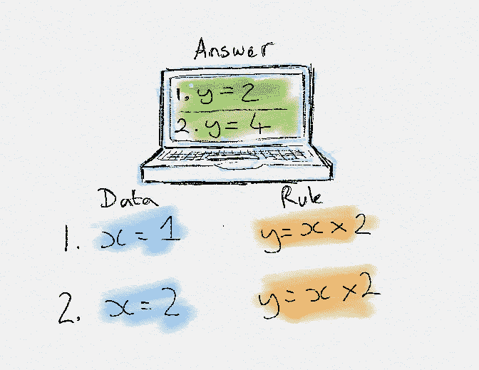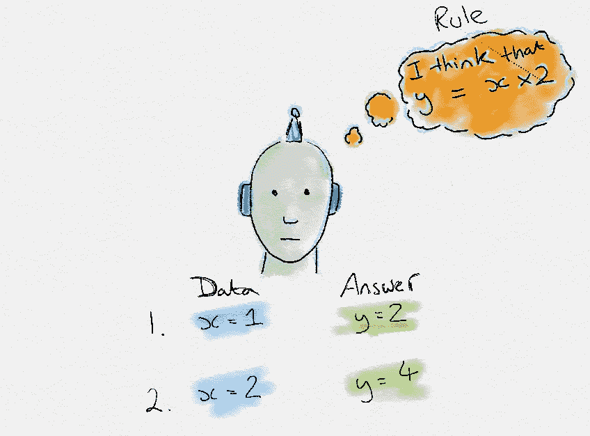

Traditional Programming vs Machine Learning

为了学习支配现象的规则，机器必须经历一个**学习过程，**尝试不同的规则，并从它们的表现中学习。因此，它被称为机器学习。

机器学习有多种形式；有监督、无监督、半监督和强化学习。每种形式的机器学习都有不同的方法，但它们都遵循相同的基本过程和理论。这个解释涵盖了一般的机器学习概念，然后集中在每一种方法。

# 术语

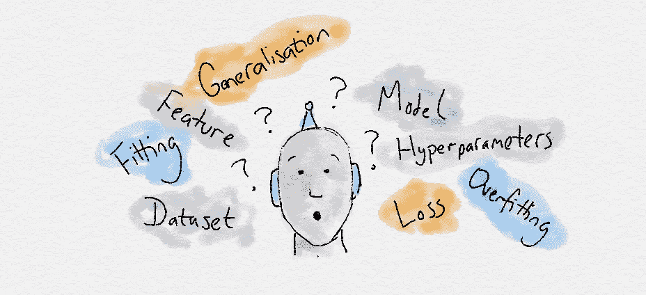

*   数据集:一组数据示例，包含对解决问题很重要的特征。
*   **特征**:帮助我们理解问题的重要数据。这些被输入到机器学习算法中来帮助它学习。
*   **模型**:机器学习算法已经学习到的现象的表示(内部模型)。它从训练期间显示的数据中学习这一点。模型是你训练一个算法后得到的输出。例如，决策树算法将被训练并产生决策树模型。

# 过程

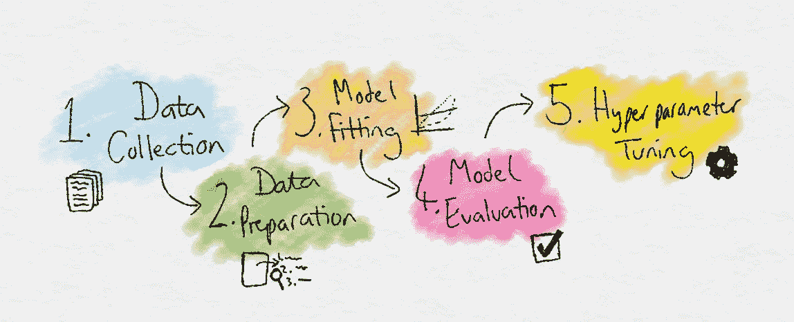

1.  **数据收集:**收集算法将要学习的数据。
2.  **数据准备:**将数据格式化，工程化为最优格式，提取重要特征，进行降维。
3.  **训练:**也称为拟合阶段，这是机器学习算法通过向它显示已经收集和准备的数据来实际学习的阶段。
4.  **评估:**测试模型，看其表现如何。
5.  **调整:**微调模型，使其性能最大化。

# 背景理论

## 起源

> 分析引擎编织代数模式，就像贾夸德编织花朵和树叶一样——阿达·洛芙莱斯


阿达·洛芙莱斯，计算机的创始人之一，也可能是第一个计算机程序员，意识到世界上的任何事情都可以用数学来描述。

更重要的是，这意味着可以创建一个数学公式来推导代表任何现象的关系。阿达·洛芙莱斯意识到机器有潜力在不需要人类帮助的情况下理解世界。

大约 200 年后，这些基本思想在机器学习中至关重要。无论问题是什么，它的信息都可以作为数据点绘制到图表上。机器学习然后试图找到隐藏在原始信息中的数学模式和关系。

## 概率论

> 概率是有序的观点……从数据中推断无非是根据相关的新信息对这种观点的修正——托马斯·贝叶斯

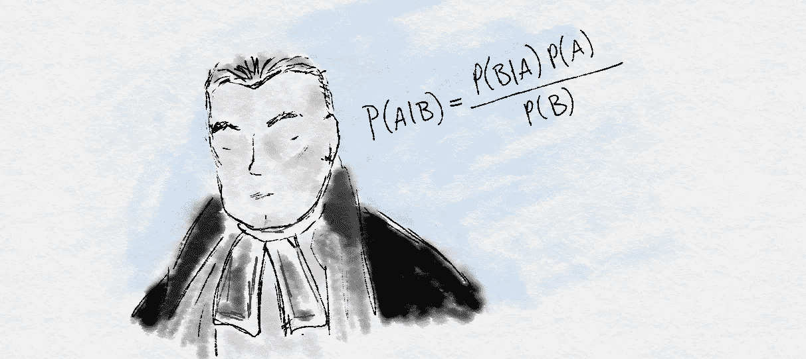

另一位数学家托马斯·贝叶斯创立了概率论中的基本思想，这些思想体现在机器学习中。

我们生活在一个概率世界。所有发生的事情都有不确定性。概率的贝叶斯解释是机器学习的基础。贝叶斯概率意味着我们认为概率是量化事件的不确定性。

正因为如此，我们不得不将概率建立在关于一个事件的可用信息上，而不是计算重复试验的次数。例如，当预测一场足球比赛时，贝叶斯方法将使用**相关信息**，如当前状态、联赛排名和首发球队，而不是计算曼联战胜利物浦的总次数。

采用这种方法的好处是概率仍然可以分配给罕见事件，因为决策过程是基于**相关特征**和**推理**。

# 机器学习方法

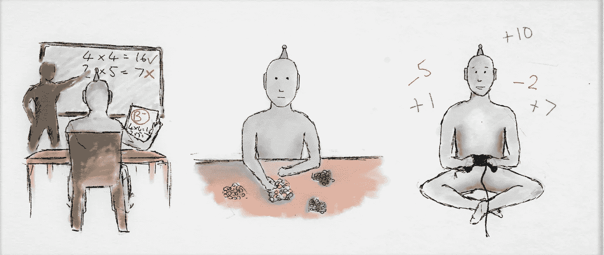

在进行机器学习时，有许多方法可以采用。它们通常分为以下几个方面。监督和非监督是公认的方法，也是最常用的方法。半监督和强化学习是更新和更复杂的，但已经显示出令人印象深刻的结果。

**没有免费的午餐定理**在机器学习中很有名。它指出，没有一种算法可以适用于所有的任务。你试图解决的每一个任务都有它自己的特点。因此，有许多算法和方法来适应每个问题各自的特点。更多类型的机器学习和人工智能将不断推出，以更好地适应不同的问题。

*   [监督学习](#6246)
*   [无监督学习](#0ea7)
*   [半监督学习](#8316)
*   [强化学习](#2745)

# 监督学习


在监督学习中，目标是学习一组**输入**和**输出之间的**映射**(**规则**)。**

例如，输入可以是天气预报，输出可以是海滩的游客。监督学习的目标是**学习描述温度和海滩游客数量之间关系的映射。**

示例**标记为**的数据在学习过程中提供给过去的**输入和输出对**，以教导模型应该如何运行，因此是“受监督的”学习。对于海滩的例子，新的输入**然后可以被输入到预测温度的**和**中，然后机器学习算法将**输出游客数量的未来预测**。**

能够适应新的输入并做出预测是机器学习的关键**概括**部分。在训练中，我们希望最大化一般化，因此监督模型定义了真正的“一般”潜在关系。如果模型被过度训练，我们会导致**过度拟合**所使用的例子，并且模型**将无法适应**新的、之前未见过的输入。

在监督学习中需要注意的一个副作用是，我们提供的监督会给学习带来偏差。该模型只能**完全模仿**它被展示的样子，所以向它展示**可靠的、无偏见的例子**是非常重要的。还有，监督学习在学习之前通常需要大量的数据。获得足够的**可靠标记的数据**通常是使用监督学习最困难和最昂贵的部分。(这就是数据被称为新石油的原因！)

受监督的机器学习模型的输出可以是来自有限集合的**类别**，例如海滩游客数量的【低、中、高】:

```
Input [temperature=**20**] -> *Model* -> Output = [visitors=**high**]
```

在这种情况下，它决定如何对输入进行**分类，因此称为**分类**。**

或者，输出可以是一个**真实世界标量**(输出一个数字):

```
Input [temperature=**20**] -> *Model* -> Output = [visitors=**300**]
```

在这种情况下，它被称为**回归**。

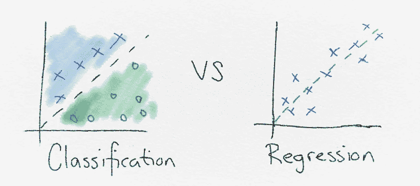

## 分类

分类用于将相似的数据点分组到不同的部分，以便对它们进行分类。机器学习用于**寻找解释如何分离不同数据点的规则**。

但是神奇的规则是怎么创造出来的呢？嗯，有多种方法可以发现规律。他们都专注于**使用*和*的数据和答案来发现**线性分离**数据点的规则**。

线性可分性是机器学习中的一个关键概念。所有的线性可分性意味着‘不同的数据点可以用一条线分开吗？’。简而言之，分类方法试图找到用一条线分隔数据点的最佳方式。

类之间的界限被称为**决策边界**。被选择来定义一个类的整个区域被称为**决策面**。决策面定义了如果一个数据点落在它的边界内，它将被分配一个特定的类。

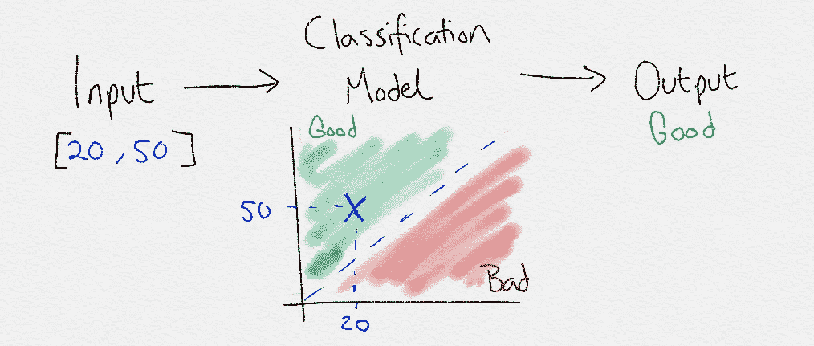

## 回归

回归是监督学习的另一种形式。分类和回归的区别在于回归**输出一个数字**而不是一个类。因此，当预测基于数字的问题时，如股票市场价格、给定日期的温度或事件的概率，回归是有用的。

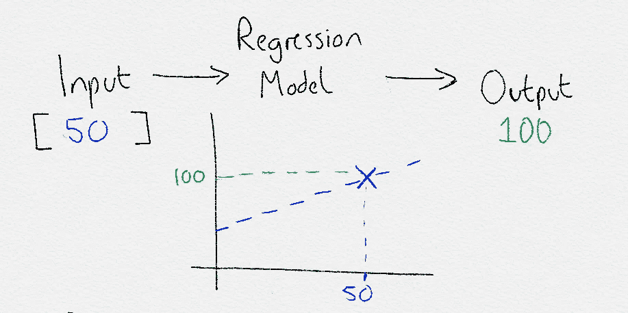

## 例子

回归在金融交易中用于寻找股票和其他资产的模式，以决定何时买入/卖出并获利。对于分类，它已经被用来分类你收到的电子邮件是否是垃圾邮件。

分类和回归监督学习技术都可以扩展到更复杂的任务。例如，涉及语音和音频的任务。图像分类、物体检测和聊天机器人就是一些例子。

下面显示的一个最近的例子使用了一个经过监督学习训练的模型来逼真地伪造人们说话的视频。

您可能想知道这个复杂的基于图像的任务与分类或回归有什么关系？嗯，这又回到了**世界上的一切，甚至是复杂的现象，从根本上用数学和数字来描述**。在这个例子中，神经网络仍然只输出回归中的数字。但是在这个例子中，数字是面部网格的**数字 3d 坐标值。**

# 无监督学习


在无监督学习中，在示例中仅提供了输入数据。没有目标明确的示例输出。但令人惊讶的是，仍然有可能在没有任何标签的数据中发现许多有趣而复杂的模式。

现实生活中无监督学习的一个例子是将不同颜色的硬币分类成不同的堆。没有人教你如何把它们分开，但是通过观察它们的特征，比如颜色，你可以看出哪些颜色的硬币与它们相关联，并把它们归入正确的类别。

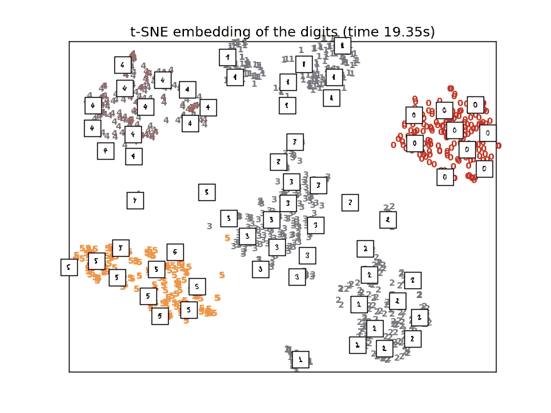

An unsupervised learning algorithm (t-SNE) correctly clusters handwritten digits into groups, based only on their characteristics

无监督学习可能比有监督学习更难，因为监督的去除意味着问题变得不太明确。该算法对于寻找什么样的模式不太关注。

在自己的学习中想一想。如果你在老师的指导下学习弹吉他，通过重复使用音符、和弦和节奏的知识，你会学得很快。但是如果你只是自学，你会发现知道从哪里开始要困难得多。

通过在自由放任的教学风格中不受监督，你可以从一张没有偏见的白纸开始，甚至可能找到一种新的、更好的方法来解决问题。所以，这也是为什么无监督学习又被称为**知识发现**的原因。在进行探索性数据分析时，无监督学习非常有用。

为了在未标记的数据中找到感兴趣的结构，我们使用**密度估计**。其中最常见的形式是**集群**。其中还有**降维**、**潜在变量模型**和**异常检测**。更复杂的无监督技术涉及神经网络，如自动编码器和深度信念网络，但我们不会在这篇介绍博客中深入讨论它们。

## 使聚集

无监督学习多用于**聚类**。聚类是**创建具有不同特征的群体的行为**。聚类试图在一个数据集中找到各种**子组**。由于这是无监督的学习，我们不受任何标签集的限制，可以自由选择创建多少个聚类。这既是福也是祸。必须通过经验模型选择过程来挑选具有正确数量的聚类(复杂性)的模型。

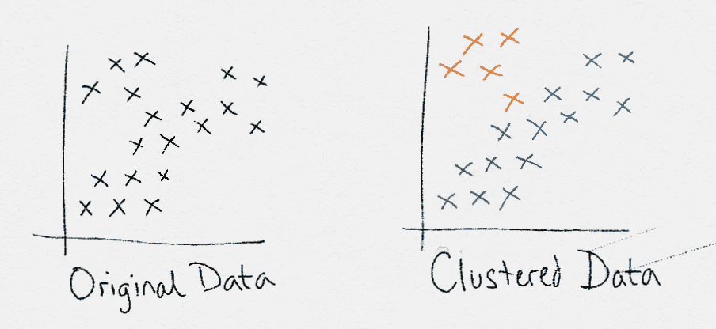

## *关联*

在关联学习中，你希望**发现描述你的数据的规则**。例如，如果一个人观看视频 A，他们可能会观看视频 b。关联规则非常适合于这样的例子，例如您想要查找**相关项目**。

## 异常检测

与大多数数据不同的稀有或不寻常项目的**识别**。例如，您的银行将利用这一点来检测您卡上的欺诈活动。你正常的消费习惯会在正常的行为和价值观范围内。但是当有人试图用你的卡偷你的东西时，这种行为将与你的正常模式不同。异常检测使用无监督学习**来分离和检测这些奇怪的事件**。

## 降维

降维的目的是**找到最重要的特征**将原始特征集减少到一个更小更有效的集合中，而**仍然对重要数据进行编码**。

例如，在预测海滩的游客数量时，我们可以使用温度、星期几、月份和当天安排的活动数量作为输入。但是月份**实际上对于预测游客数量**可能并不重要。

诸如此类的不相关特征可能会混淆机器学习算法，使它们的效率和准确性降低。通过使用维度缩减，**仅识别和使用最重要的特征**。主成分分析(PCA)是一种常用的技术。

## 例子

在现实世界中，聚类已被成功地用于发现一种新类型的恒星，通过研究恒星的子群根据恒星的特征自动形成。在市场营销中，它通常用于根据客户的行为和特征将客户分成相似的组。

关联学习用于推荐或查找相关项目。一个常见的例子是市场篮子分析。在购物篮分析中，发现关联规则可以根据客户在购物篮中放了什么来预测他们可能购买的其他商品。亚马逊用这个。如果你把一台新的笔记本电脑放在你的购物篮里，他们会通过他们的关联规则推荐像笔记本电脑外壳这样的东西。

异常检测非常适合欺诈检测和恶意软件检测等场景。

# 半监督学习


半监督学习是监督和非监督方法的混合。学习过程并没有受到每一个输入的示例输出的密切监督，但是我们也不会让算法自行其是，也不会提供任何形式的反馈。半监督学习走的是中间道路。

通过能够**将少量已标记数据与更大的未标记数据集**混合在一起，减少了拥有足够已标记数据的负担。因此，它开启了更多需要用机器学习来解决的问题。

## *生成对抗网络*

生成对抗网络(GANs)是最近的突破，取得了令人难以置信的结果。GANs 使用两个神经网络，一个**发生器**和**鉴别器**。生成器生成输出，鉴别器对其进行评价。通过互相争斗，他们都变得越来越熟练。

通过使用一个网络产生输入，另一个网络产生输出，我们不需要每次都提供明确的标签，因此它可以被归类为半监督的。

## 例子

一个完美的例子是医学扫描，如乳腺癌扫描。需要训练有素的专家来标记这些标签，这既耗时又非常昂贵。相反，专家可以**标记一小组**乳腺癌扫描，半监督算法将能够利用这个小组集并**将其应用于更大的扫描组**。

对我来说，甘的是半监督学习最令人印象深刻的例子之一。下面是一个视频，其中一个生成式对抗网络使用无监督学习将一个图像的各个方面映射到另一个图像。

A neural network known as a GAN (generative adversarial network) is used to synthesize pictures, without using labelled training data.

# 强化学习


最后一种机器学习是我最喜欢的。它不太常见，也复杂得多，但它产生了令人难以置信的结果。它不使用标签，而是使用奖励来学习。

如果你熟悉心理学，你应该听说过强化学习。如果没有，你已经从我们在日常生活中的学习中了解了这个概念。在这种方法中，**偶然的正反馈**被用来**强化行为**。把它想象成训练一只狗，好的行为会得到奖励，变得更加普遍。不良行为受到惩罚，变得不那么普遍。这种**奖励激励的行为**是强化学习的关键。

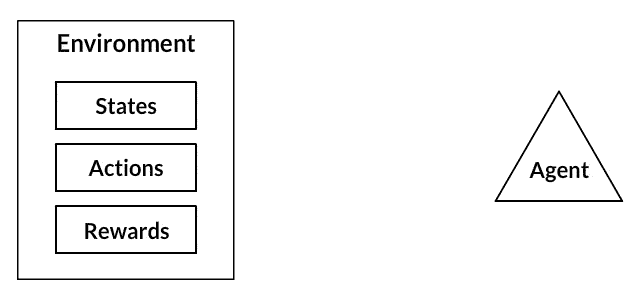

这与我们人类学习的方式非常相似。在我们的一生中，我们会收到积极和消极的信号，并不断从中学习。我们大脑中的化学物质是我们获得这些信号的许多方式之一。当好事发生时，我们大脑中的神经元会提供一系列积极的神经递质，如多巴胺，这让我们感觉良好，我们更有可能重复那个特定的动作。我们不需要像在监督学习中那样不断的监督来学习。通过偶尔给出强化信号，我们仍然可以非常有效地学习。

强化学习最令人兴奋的部分之一是，这是远离静态数据集训练的第一步，而不是能够使用动态、嘈杂的数据丰富的环境。这使得机器学习更接近人类使用的学习方式。这个世界就是我们嘈杂、复杂、数据丰富的环境。

游戏在强化学习研究中非常流行。它们提供了理想的数据丰富的环境。游戏中的分数是训练奖励激励行为的理想奖励信号。此外，时间可以在模拟游戏环境中加速，以减少总的训练时间。

一种强化学习算法的目的是通过一遍又一遍地玩游戏来最大化它的回报。如果你能用一个频繁的“得分”作为奖励来框定一个问题，它很可能适合强化学习。

## 例子

强化学习在现实世界中还没有被广泛使用，因为它太新太复杂了。但现实世界的一个例子是使用强化学习，通过以更有效的方式控制冷却系统来降低数据中心的运行成本。该算法学习如何行动的最优策略，以便获得最低的能量成本。成本越低，获得的回报越多。

在研究中，它经常在游戏中使用。完全信息游戏(你可以看到环境的整体状态)和不完全信息游戏(部分状态是隐藏的，例如真实世界)都取得了超越人类的惊人成功。

谷歌 DeepMind 已经在研究中使用强化学习来玩超人级别的围棋和雅达利游戏。

A neural network known as Deep Q learns to play Breakout by itself using the score as rewards.

机器学习入门到此为止！请留意即将出现的更多博客，它们将对特定主题进行更深入的探讨。

如果你喜欢我的作品，想了解最新的出版物，或者想与我取得联系，可以在 twitter 上找到我，地址是 [@GavinEdwards_AI](https://twitter.com/@GavinEdwards_AI) ，或者在 Medium 上找到我，地址是[Gavin Edwards](https://medium.com/u/469ca9cab76e?source=post_page-----23b84d51e6d0--------------------------------)——谢谢！🤖🧠

## 参考

Chollet，F. *用 Python 进行深度学习*。庇护岛曼宁。