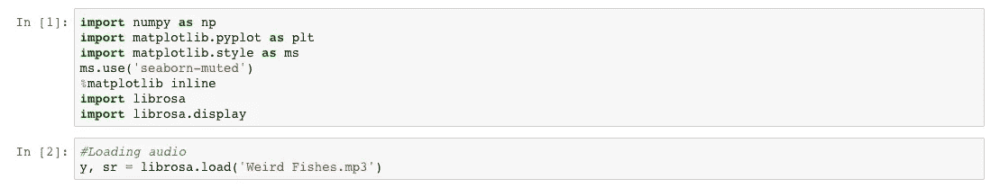
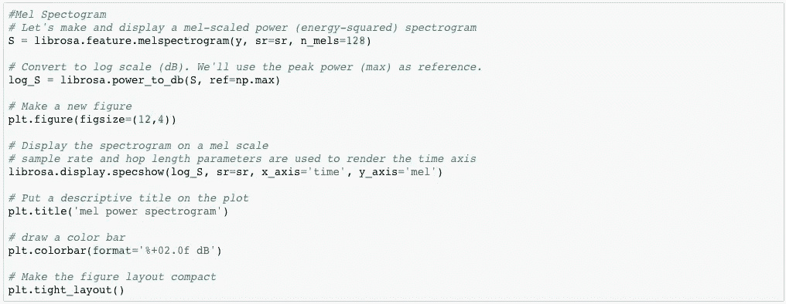
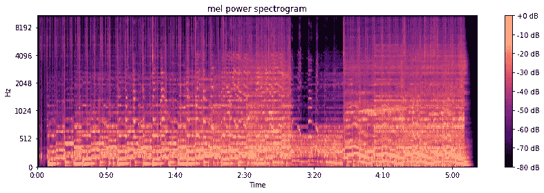
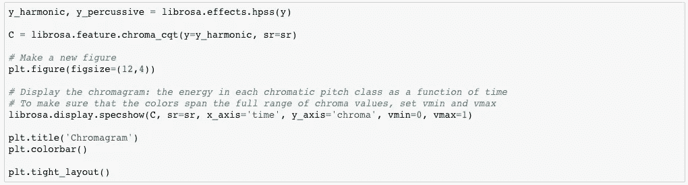
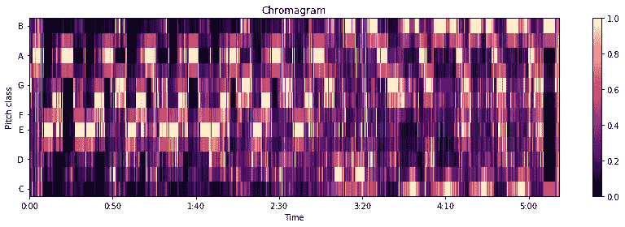
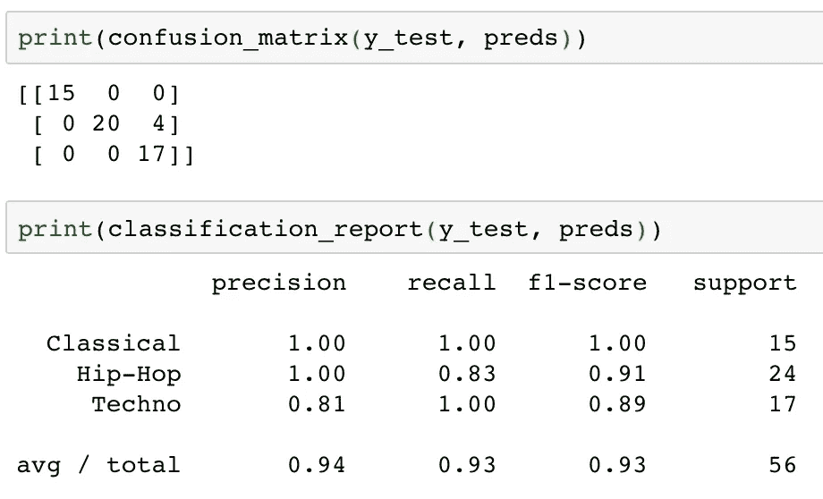
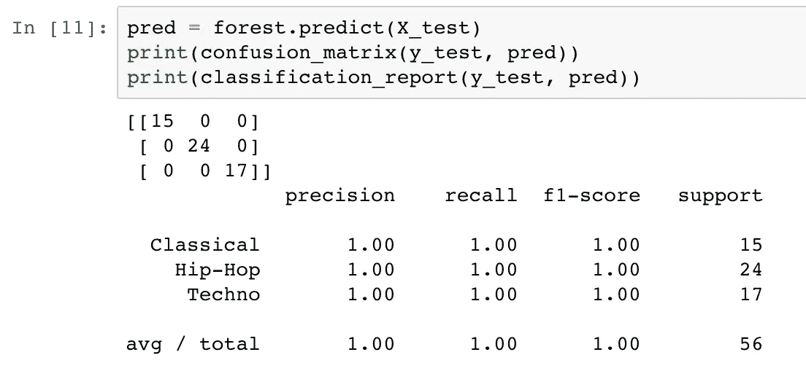

# 机器学习和音乐分类:一种基于内容的过滤方法

> 原文：<https://towardsdatascience.com/machine-learning-and-music-classification-a-content-based-filtering-approach-f2c4eb13bade?source=collection_archive---------11----------------------->

## 使用 Librosa Python 库、KNN 和 Random Forest 对音乐进行分类

在我之前的博客文章[音乐推荐和机器学习简介](https://medium.com/@briansrebrenik/introduction-to-music-recommendation-and-machine-learning-310c4841b01d)中，我讨论了音乐推荐系统的两种方法，基于内容的过滤和协同过滤。协作过滤方法涉及基于用户收听历史推荐音乐，而基于内容的方法使用对一首音乐的实际特征的分析。在这篇博客文章中，我将更深入地研究基于内容的方法，使用 [Librosa Python 库](https://github.com/librosa/librosa)进行“音乐信息检索”，并尝试一些机器学习分类算法，根据歌曲的特征将歌曲分类。

# 基于 Librosa 的特征提取

当我第一次开始研究音乐信息检索这一主题时，即基于音频信号处理提取音乐及其音频内容信息的过程，这似乎是一项非常艰巨的任务，需要足够的技术专业知识。嗯，当然有，甚至有一整个[领域](https://en.wikipedia.org/wiki/Music_information_retrieval)致力于这项任务。幸运的是， [Librosa Python 库](https://github.com/librosa/librosa)的创建者使得这个过程变得更加容易。Python 用户可以使用这个库轻松提取任何 mp3 上的信息。请观看下面的视频，该视频由该库的创建者之一提供了一个简短的教程:

Librosa 可以轻松提取许多特征，包括节拍跟踪、 [mel 音阶](https://en.wikipedia.org/wiki/Mel_scale)、与音高类别信息相关的色图，以及分离音频的谐波和打击成分的能力。下面我提供了我用来为电台司令的歌曲[古怪的鱼](https://soundcloud.com/radiohead/weird-fishes-arpeggi)检索这些信息的代码。同样，所有这些步骤的一个很好的教程和更多内容可以在[这里](https://librosa.github.io/librosa/index.html)找到。

## 第一步:加载所需的模块

## 梅尔功率光谱图

## 色谱图

相当简单！Librosa 真的是一个很棒的音乐信息检索工具。对于我探索基于内容的过滤的下一步，我想建立一个完整的模型，能够根据各种特征将音乐分类到正确的流派。对于数据，我决定使用 Spotify 的 Web API 提供的信息，而不是使用 Librosa 提供的信息，如果你试图分析大量的歌曲，这可能需要相当多的时间和计算能力。Spotify 提供了一些歌曲特征，我可以将它们用于一个分类模型，这些特征在本质上不像 Librosa 提供的那么技术性。例如，一些特征包括“可跳舞性”，其“描述了基于包括速度、节奏稳定性、节拍强度和整体规律性在内的音乐元素的组合，一首曲目有多适合跳舞。”以及“能量”,其“代表强度和活动的感知量度”。通常，充满活力的曲目让人感觉速度快、声音大、嘈杂。”在这篇文章的下一部分，你可以在我的数据中找到这些特性的完整列表及其描述。这个 API 很酷的一点是，它提供了描述一首歌曲的非技术方法，这些方法来自于对音乐进行的更加技术化和科学化的基于内容的分析。

# 基于 K 近邻的音乐分类

下面我提供了我的[K-最近邻](https://en.wikipedia.org/wiki/K-nearest_neighbors_algorithm)分类模型的代码，在这里我试图将歌曲分类到正确的流派。我的数据包括大约 300 首歌曲，其中大约 1/3 是嘻哈音乐，1/3 是电子音乐，1/3 是古典音乐。我还包含了使用 Spotify Web API 的代码，这一开始可能有点棘手。不过，在你查看之前，我先简单介绍一下我从 Spotify API 获得的功能:

声音度——0.0 到 1.0 之间的置信度，表示音轨是否是声音的。1.0 表示音轨是声学的高置信度。

可舞性——可舞性描述了基于音乐元素的组合，包括速度、节奏稳定性、节拍强度和整体规律性，一个曲目适合跳舞的程度。值 0.0 最不适合跳舞，1.0 最适合跳舞。

能量——能量是一个从 0.0 到 1.0 的量度，代表强度和活动的感知量度。通常，高能轨道感觉起来很快，很响，很嘈杂。例如，死亡金属具有高能量，而巴赫前奏曲在音阶上得分较低。对该属性有贡献的感知特征包括动态范围、感知响度、音色、开始速率和一般熵。

乐器性—预测轨道是否不包含人声。“Ooh”和“aah”在这种情况下被视为乐器。Rap 或口语词轨道明显是“有声的”。乐器度值越接近 1.0，轨道不包含人声内容的可能性就越大。高于 0.5 的值旨在表示乐器轨道，但随着该值接近 1.0，置信度会更高。

调—轨道所在的调。整数使用标准音高分类符号映射到音高。例如，0 = C，1 = C♯/D♭，2 = D，等等。

活跃度—检测录音中是否有观众。较高的活跃度值表示音轨被现场执行的概率增加。高于 0.8 的值表示该轨迹很有可能是实时的。

响度—轨道的整体响度，以分贝(dB)为单位。响度值是整个轨道的平均值，可用于比较轨道的相对响度。响度是声音的质量，是与体力(振幅)相关的主要心理因素。值的典型范围在-60 和 0 db 之间。

语速—语速检测音轨中是否存在口语单词。越是类似语音的录音(例如脱口秀、有声读物、诗歌)，属性值就越接近 1.0。高于 0.66 的值描述可能完全由口语单词组成的轨道。介于 0.33 和 0.66 之间的值描述可能包含音乐和语音的轨道，可以是分段的，也可以是分层的，包括说唱音乐。低于 0.33 的值很可能代表音乐和其他非语音类轨道。

速度—轨道的总体估计速度，单位为每分钟节拍数(BPM)。在音乐术语中，速度是给定作品的速度或节奏，直接来源于平均节拍持续时间。

拍号—轨道的估计整体拍号。拍号(拍子)是一种符号约定，用于指定每个小节(或小节)中有多少拍。

化合价——一个从 0.0 到 1.0 的量度，描述轨道传达的音乐积极性。高价曲目听起来更积极(例如，快乐、愉快、欣快)，而低价曲目听起来更消极(例如，悲伤、沮丧、愤怒)。

简单描述一下这个过程:我首先从三个 Spotify 播放列表中请求曲目 id，每个流派一个播放列表。然后，我要求每首歌曲的功能，并将所有的歌曲组合成一个熊猫数据帧。然后，我使用 Scikit Learn K-Nearest-Neighbors 模型，遍历多个 K 值，为我的模型找到最佳的一个。最终导致 K 值为 9，这是我在将模型拟合到训练数据时使用的值。以下是分类模型在测试数据上的得分:

Test Scores for KNN Model

我的测试集的 F1 分数大约为 0.93。查看混淆矩阵，似乎模型在处理嘻哈歌曲时遇到了一些问题，有时会将它们归类为电子音乐。不错的分数，但是让我们看看我们是否可以使用另一个模型做得更好。

# 使用随机森林的音乐分类

接下来，我尝试使用[随机森林](https://en.wikipedia.org/wiki/Random_forest)模型进行分类，这是一种集成方法，我希望它能让我获得更准确的结果，使用我在 K-最近邻模型中使用的相同特征。请参见下面的代码和结果:

Test Scores for Random Forest Model

使用随机森林让我得到了完美的分类分数！您还可以看到一个条形图，显示模型中各个特征的重要性。显然，随机森林模型比 K-最近邻模型更准确，考虑到 K-最近邻的简单性，这并不奇怪。

我对音乐推荐系统中基于内容的过滤的简要介绍到此结束。流派分类只是这个难题的一小部分，我期待着探索这些系统的其他部分和音乐数据。