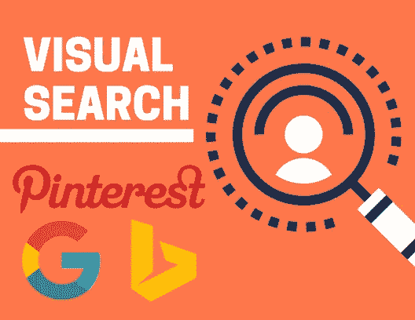
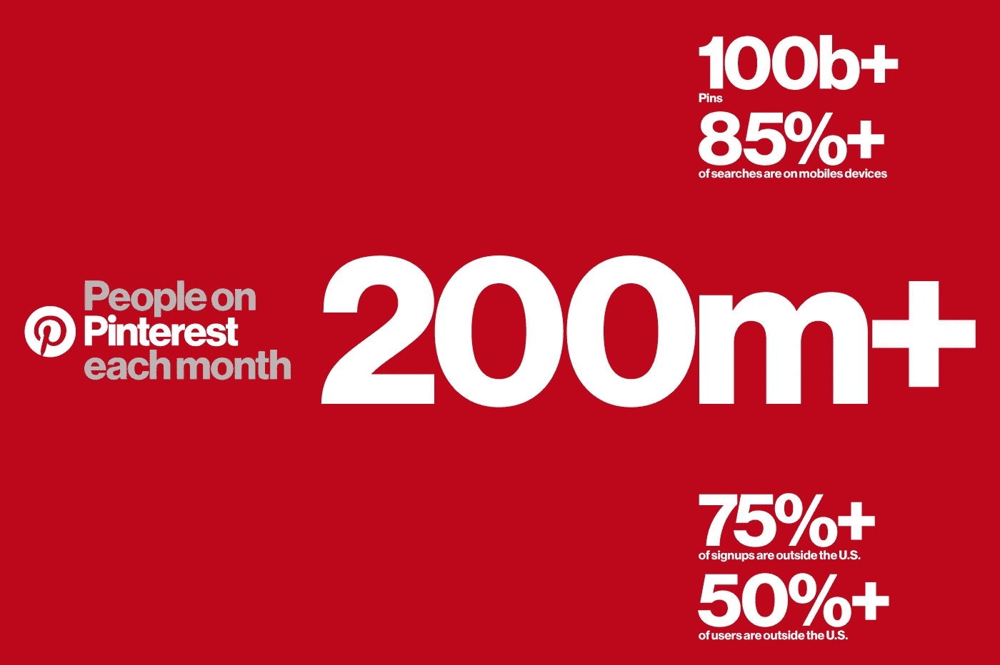
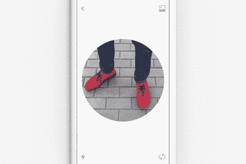
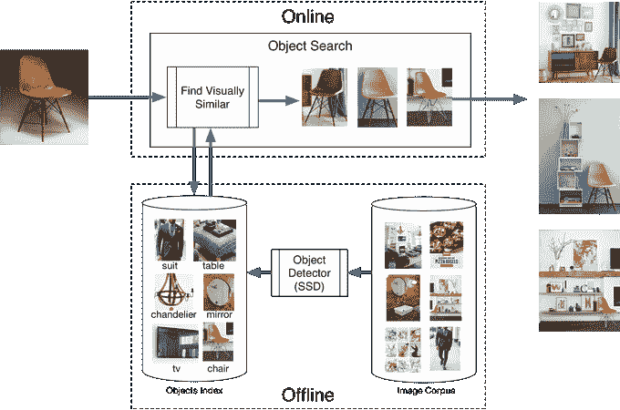
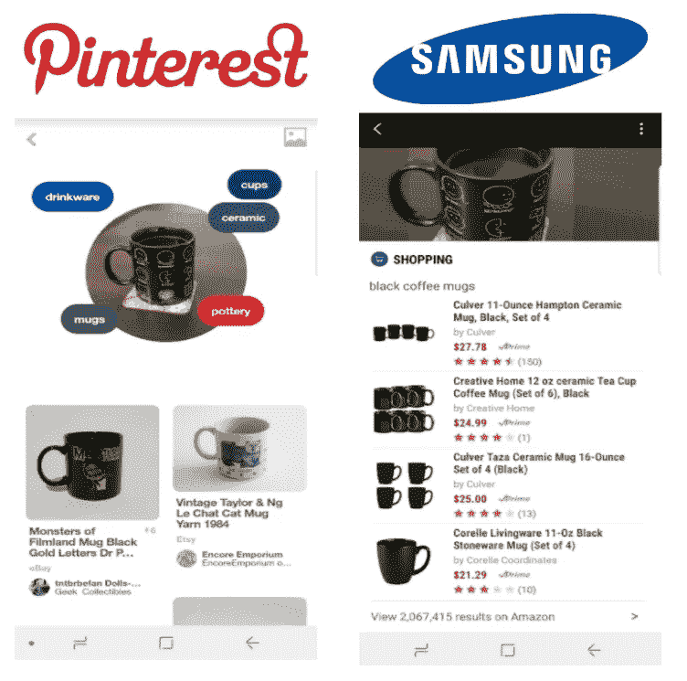
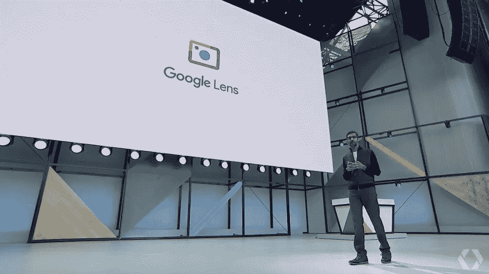
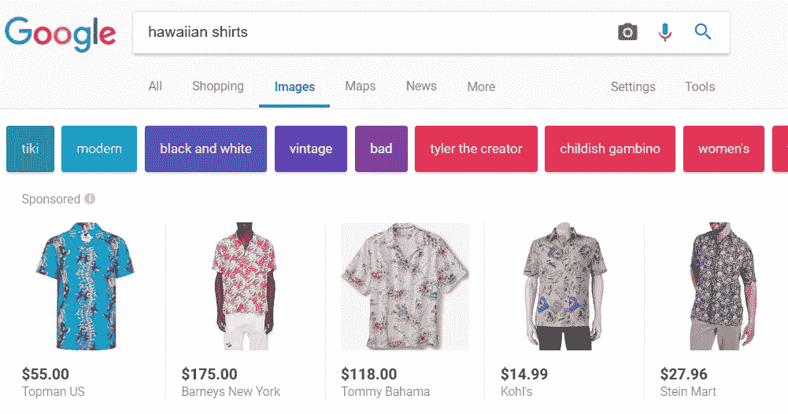
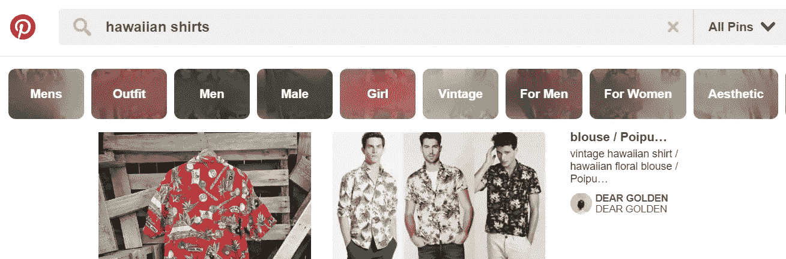
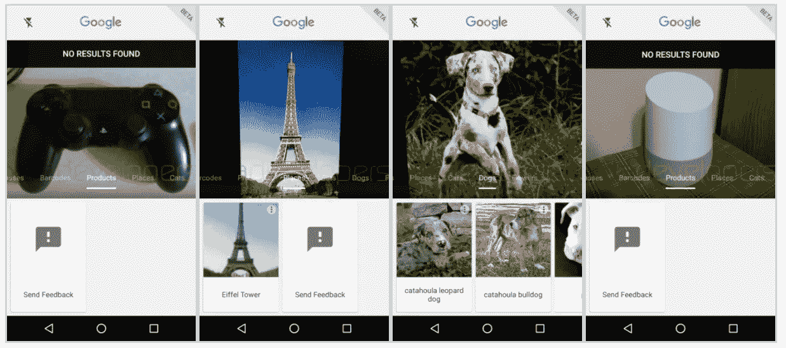
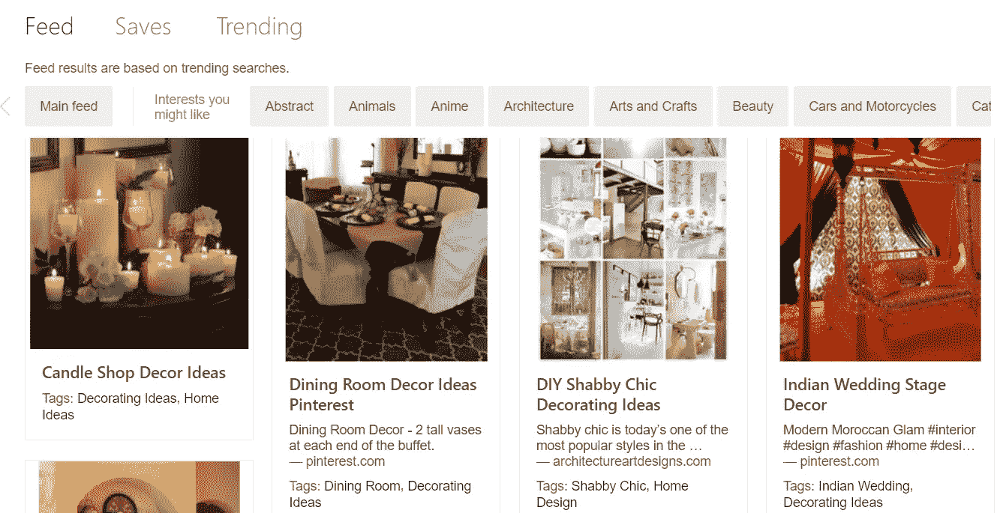

# 机器学习和视觉搜索:谁是正确的？

> 原文：<https://towardsdatascience.com/machine-learning-and-visual-search-who-is-getting-it-right-e889d0a9a25f?source=collection_archive---------9----------------------->

> “我语言的极限意味着我世界的极限”——路德维希·维特斯坦根

从历史上看，搜索中的输入输出关系一直由文本主导。即使输出变得更加多样化(例如视频和图像结果)，输入也是基于文本的。这限制和塑造了搜索引擎的潜力，因为它们试图从相对静态的关键字数据集中提取更多的上下文含义。

视觉搜索引擎正在重新定义我们语言的界限，开辟了人与计算机之间交流的新途径。如果我们将语言视为一个流动的符号和标志系统，而不是一套固定的口语或书面语，我们会对搜索的未来有一个更加引人注目和深刻的了解。

我们的文化是视觉的，这是视觉搜索引擎急于利用的事实。

具体的电子商务视觉搜索技术已经比比皆是:亚马逊、沃尔玛和 ASOS 都在行动。这些公司的应用程序将用户的智能手机摄像头变成了一个视觉发现工具，可以根据帧中的任何内容搜索类似的项目。然而，这只是一个用例，视觉搜索的潜力远远大于直接的电子商务交易。

经过大量的试验和错误，这项技术正在走向成熟。处于视觉搜索核心的无监督机器学习系统只是这个过程的结果。

我们现在正处于精确、实时视觉搜索的风口浪尖，由机器学习和人工智能驱动。

下面，本文将回顾这个行业的三个主要参与者:Pinterest、Google 和 Bing 取得的进展。

# 拼趣

Pinterest 的视觉搜索技术旨在为探索搜索开辟一个必去之地。他们宣称的目标呼应了这篇文章的开篇引言:“当你找不到描述它们的词语时，帮助你找到它们。”

Pinterest 没有直接与谷歌对抗，而是决定向用户和广告商提供一些微妙不同的东西。人们去 Pinterest 发现新想法，创建情绪板，获得灵感。因此，Pinterest 敦促其 2 亿用户“跳出框框搜索”，这可以被解读为对谷歌无处不在的搜索栏的温和嘲讽。

所有这些都是由 [Pinterest Lens](https://searchenginewatch.com/2017/03/16/test-driving-pinterest-lens-how-does-pinterests-new-visual-search-tool-stack-up/) 驱动的，这是一个复杂的视觉搜索工具，它使用智能手机摄像头扫描物理世界，识别物体，并返回相关结果。它可以通过智能手机应用程序使用，但 Pinterest 的视觉搜索功能也可以通过谷歌 Chrome 扩展在桌面上使用。

Pinterest 超过 1000 亿个 pin 的庞大数据集为机器学习应用提供了完美的训练材料。因此，物理世界和数字世界之间形成了新的联系，使用图形处理单元(GPU)来加速这一过程。

在实践中，Pinterest Lens 运行得非常好，并且随着时间的推移变得越来越好。图像检测令人印象深刻的准确和相关引脚的建议是相关的。

以下是使用 Pinterest 和 Samsung visual search 搜索时选择的相同对象:

Image created by author

结果的差异很能说明问题。

在左边，Pinterest 识别物体的形状、材料、用途以及设计的定义特征。这允许比直接搜索另一个黑色马克杯更深入的结果。Pinterest 知道，不太明显的风格细节才是真正吸引用户的。因此，我们看到不同颜色的杯子的结果，但风格相似。

在右边，三星的 Bixby 助手可以识别物体、颜色和用途。三星的搜索结果由亚马逊提供支持，与 Pinterest 提供的选项相比，它们没有那么鼓舞人心。图像变成了对[黑咖啡杯]的关键字搜索，这使得视觉搜索元素有点多余。

当视觉搜索引擎为我们表达一些我们难以用语言表达的东西时，它们工作得最好。Pinterest 比大多数人更了解并兑现这一承诺。

# Pinterest 视觉搜索:关键事实

*   每月用户超过 2 亿
*   侧重于搜索的“发现”阶段
*   Pinterest Lens 是中央视觉搜索技术
*   零售商的绝佳平台，具有明显的盈利可能性
*   付费搜索广告是该公司的核心增长领域
*   越来越有效的视觉搜索结果，尤其是更深层次的审美

# 谷歌

随着谷歌眼镜的推出，谷歌在视觉搜索领域掀起了早期浪潮。这款安卓应用于 2010 年推出，允许用户使用智能手机摄像头进行搜索。例如，它在著名的地标上工作得很好，但是它在相当长的时间内没有显著更新。

谷歌似乎不太可能在视觉搜索上保持长时间的沉默，今年的 I/O 开发揭示了这个搜索巨头一直在后台进行的工作。

谷歌镜头将通过照片应用和谷歌助手提供，这将是对早期谷歌护目镜计划的重大改革。

任何与 Pinterest 产品在命名上的相似之处都可能不仅仅是巧合。谷歌最近悄悄升级了它的图像和视觉搜索引擎，推出了类似 Pinterest 格式的搜索结果:

谷歌的“类似商品”产品是利用搜索发现阶段的又一举措，展示相关结果可能会进一步激起消费者的好奇心。

Google Lens 将提供对象检测技术，在一个强大的视觉搜索引擎中将所有这些链接在一起。在测试版中，Lens 提供了以下视觉搜索类别:

*   全部
*   衣服
*   鞋子
*   手提包
*   太阳镜
*   条形码
*   制品
*   地方
*   猫
*   狗
*   花

一些开发人员有机会尝试 Lens 的早期版本，许多人报告了不同的结果:

*貌似谷歌不认自己家的智能中枢……(来源:* [*XDA 开发者*](https://www.xda-developers.com/exclusive-hands-on-with-googles-visual-search-for-android/) *)*

对于 Google Lens 来说，现在还是非常早期的阶段，因此我们可以期待这项技术在从错误和成功中学习的过程中会有显著的进步。

当它这样做时，谷歌处于独特的位置，使视觉搜索成为用户和广告商的强大工具。在线零售商通过付费搜索获得的机会是不言而喻的，但实体零售商也有巨大的潜力利用超本地搜索。

尽管 Pinterest 取得了令人印象深刻的进步，但它不具备像谷歌那样渗透到用户生活方方面面的生态系统。随着一款新的 Pixel 智能手机的研发，谷歌可以在语音搜索的同时使用视觉搜索来整合其软件和硬件。对于使用 DoubleClick 管理搜索和显示广告的广告商来说，这是一个非常诱人的前景。

我们还应该预计，谷歌将在不久的将来进一步发展这种视觉搜索技术。

谷歌将向所有开发者开放其 ARCore 产品，这将为增强现实带来无限可能。ARCore 是苹果 ARKit 的直接竞争对手，它可以提供释放视觉搜索全部潜力的钥匙。我们也不应该排除进军可穿戴设备市场的可能性，可能会推出新版谷歌眼镜。

# 谷歌视觉搜索:关键事实

*   谷歌眼镜于 2010 年推出，是视觉搜索市场的早期进入者
*   护目镜在一些地标上仍能很好地工作，但很难在拥挤的画面中分离出物体
*   谷歌眼镜计划于今年晚些时候(日期待定)推出，作为对护目镜的全面改造
*   Lens 将把视觉搜索与谷歌搜索和谷歌地图联系起来
*   物体检测还不完善，但是产品还在测试阶段
*   一旦技术的准确性提高，谷歌最适合围绕其视觉搜索引擎开发广告产品

# 堆

自 2012 年推出必应视觉搜索产品以来，微软在这方面一直非常低调。它从未真正起飞，也许大众对视觉搜索引擎的胃口还不太大。

最近，Bing 有趣地重新加入了这场争论，宣布了一个完全改进的视觉搜索引擎:

这种策略的改变是由人工智能的进步导致的，人工智能可以自动扫描图像并隔离项目。

这种搜索功能的早期版本需要用户输入，在图像的特定区域周围画出方框，以便进一步检查。Bing [最近](https://blogs.bing.com/search-quality-insights/2017-09/Object-Detection-in-Visual-Search)宣布，这将不再需要，因为技术已经发展到自动化这一过程。

Bing 上视觉搜索结果的布局与 Pinterest 惊人地相似。如果模仿是最真诚的奉承形式，Pinterest 现在应该已经被奉承淹没了。

视觉搜索技术可以锁定大多数图像中的对象，然后进一步建议用户可能感兴趣的项目。目前这仅在桌面上可用，但很快将添加移动支持。

结果在某些地方是不完整的，但是当探测到一个物体时，就会给出相关的建议。在下面的例子中，使用西装图片进行搜索会导致热门的可购物链接:

然而，它没有考虑衬衫或领带——唯一可搜索的方面是西装。

使用拥挤的图片进行搜索，事情变得更加不完整。使用图片搜索客厅装饰创意会带来一些相关的结果，但不会总是专注于特定的项目。

就像所有的机器学习技术一样，这个产品将继续改进，目前来看，Bing 在这方面领先谷歌一步。尽管如此，从长远来看，微软缺乏用户基础和移动硬件来对视觉搜索市场发起真正的攻击。

视觉搜索因数据而繁荣；在这方面，谷歌和 Pinterest 都抢在了必应的前面。

# 必应视觉搜索:关键事实

*   最初于 2009 年推出，但由于缺乏接受度，于 2012 年取消
*   于 2017 年 7 月重新推出，由人工智能支持，以识别和分析物体
*   广告商可以使用 Bing 视觉搜索来放置可购买的图片
*   这项技术还处于起步阶段，但物体识别相当准确
*   目前仅限于桌面，但手机很快就会跟上

# 那么，谁拥有最好的可视化搜索引擎呢？

目前来看，Pinterest。数十亿个数据点和一些经验丰富的图像搜索专业人士推动着这项技术，它提供了最流畅和最准确的体验。它还通过抓住物体的风格特征，而不仅仅是它们的形状或颜色，做出了一些独特的事情。因此，它改变了我们可以使用的语言，扩展了搜索的范围。

Bing 最近在这一领域取得了巨大的进步，但是它缺少一个足以吸引谷歌搜索者的杀手级应用。Bing 视觉搜索准确且功能强大，但不能像 Pinterest 那样创建与相关项目的联系。

谷歌眼镜的推出肯定也会彻底撼动这个市场。如果谷歌能够确定自动物体识别(它无疑会做到)，谷歌眼镜可能会成为将传统搜索与增强现实联系起来的产品。从长远来看，谷歌拥有的资源和产品套件使其成为可能的赢家。

*最初发表于*[*【searchenginewatch.com】*](https://searchenginewatch.com/2017/09/28/pinterest-google-or-bing-who-has-the-best-visual-search-engine/)*。*