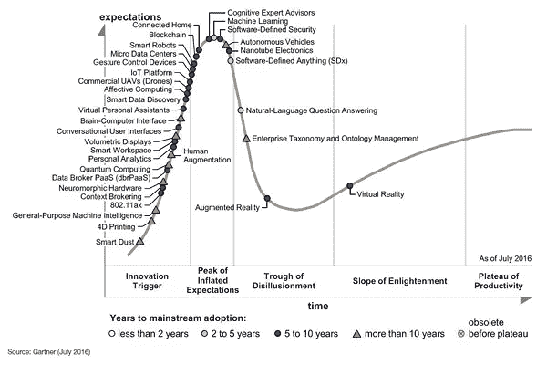
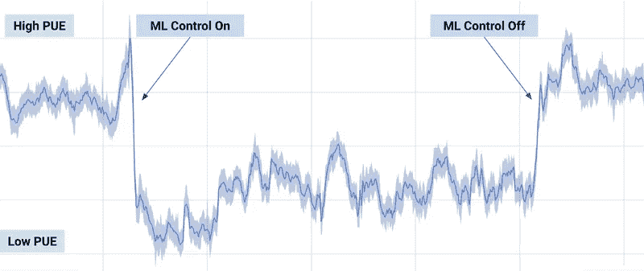

# 机器学习在物联网中的应用

> 原文：<https://towardsdatascience.com/machine-learning-application-in-iot-ff859f9ab4fe?source=collection_archive---------5----------------------->

机器学习(ML)和物联网(IoT)是目前非常流行的表达方式，它们都接近炒作周期的顶峰。

[***Gartner 2016 年新兴技术炒作周期***](http://www.gartner.com/newsroom/id/3412017)***——*机器学习正处于炒作周期的顶峰，物联网平台和其他相关物联网技术处于上升阶段。****

*鉴于围绕机器学习和物联网的所有建设和讨论，很难透过喧嚣理解真正的尊重所在。*

# *数据分析与机器学习*

*随着所有前面提到的围绕机器学习的建立，许多协会正在询问是否应该以某种方式在他们的业务中应用机器学习。*

*在大多数情况下，适当的回应是一个回响**不***

*机器学习获取大量信息，并创造有价值的知识来帮助组织。这可能意味着改进形式、削减开支、为客户提供更好的服务，或者开发新的商业模式计划。*

*事实是，大多数协会可以从传统的数据分析中获得大量的这些优势，而不需要更复杂的机器学习应用程序。*

*传统的数据分析在澄清信息方面令人难以置信。你可以为过去发生的事情或今天正在发生的事情制作报告或模型，吸引有价值的经验应用到组织中。*

*数据分析可以帮助评估和跟踪目标，实现更明智的决策，然后提供衡量长期成功的方法。*

# *那么机器学习什么时候有价值呢？*

*传统数据分析中运行的数据模型通常是静态的，在处理快速变化的非结构化信息时用途有限。关于物联网，区分许多传感器信息源和外部组件之间的连接通常很重要，这些外部组件会快速创建大量数据点。*

*传统的数据分析需要一个基于过去信息和主评估的模型来建立因素之间的联系，而机器学习从结果因素(例如保留活力)开始，然后自然地搜索指标因素及其关联。*

*总的来说，当你理解你需要什么时，机器学习是很重要的，但是你没有关于决定选择的关键信息因素的线索。因此，你给机器学习算法设定目标，然后它从信息中“学习”哪些因素对实现目标至关重要。*

*一个很棒的例子是一年前谷歌在其数据中心 利用机器学习[**。数据中心需要保持冷却，因此它们需要大量的活力来使它们的冷却框架正常工作。这对谷歌来说是一个值得注意的成本，所以我们的目标是通过机器学习来提高效率。**](https://www.theverge.com/2016/7/21/12246258/google-deepmind-ai-data-center-cooling)*

**

****机器学习明显降低了谷歌数据中心的功耗****

*通过机器学习实现的预测分析对于一些物联网应用来说非常有利可图。我们应该调查几个确凿的例证…*

# *机器学习在物联网中的应用*

## *工业应用中的成本节约*

*预测能力在机械环境中非常有用。通过从机器内部或机器上的不同传感器获取信息，机器学习计算可以“意识到”对机器来说司空见惯的事情，然后识别何时开始发生不寻常的事情。*

*预见机器何时需要维护是难以想象的重要，可以转化为大量的节约成本。*

*公司现在使用机器学习来预测机器何时需要维护，准确率超过 90%，这意味着巨大的成本削减。*

## *塑造个人体验*

*事实上，我们在日常生活中都熟悉机器学习应用。亚马逊和网飞都利用机器计算出如何接受我们的倾向，并给客户一个优越的考验。这可能意味着提出你可能喜欢的项目，或者给电影和电视节目相关的建议。*

*同样，在物联网中，机器学习在很大程度上可以按照我们自己的意愿形成我们的条件。*

*Nest 恒温器是一个很棒的例子，它利用机器计算出如何根据你的喜好进行加热和冷却，确保你下班回家或早上起床时房子的温度正确。*

## *更多*

*上面描述的利用案例只是所有意图和目的的大量可想象的结果中的几个，然而它们是至关重要的，因为它们是目前正在物联网中进行的机器学习的有价值的使用。*

*虽然机器学习和物联网都处于建设的高潮，但机器学习在物联网中的应用的命运值得这种建设。我们真的只是开始揭露想象之下的东西。*

## *关于作者*

*Muhammad Anser Naseer 是东方集团公司技术开发部门 BlueEast 的高级软件工程师。BlueEast 是世界上第一台内置电能表的智能 DC 变频空调背后的大脑。 [*阅读更多……*](https://orient.com.pk/ultron-features/features-eComfort.html)*