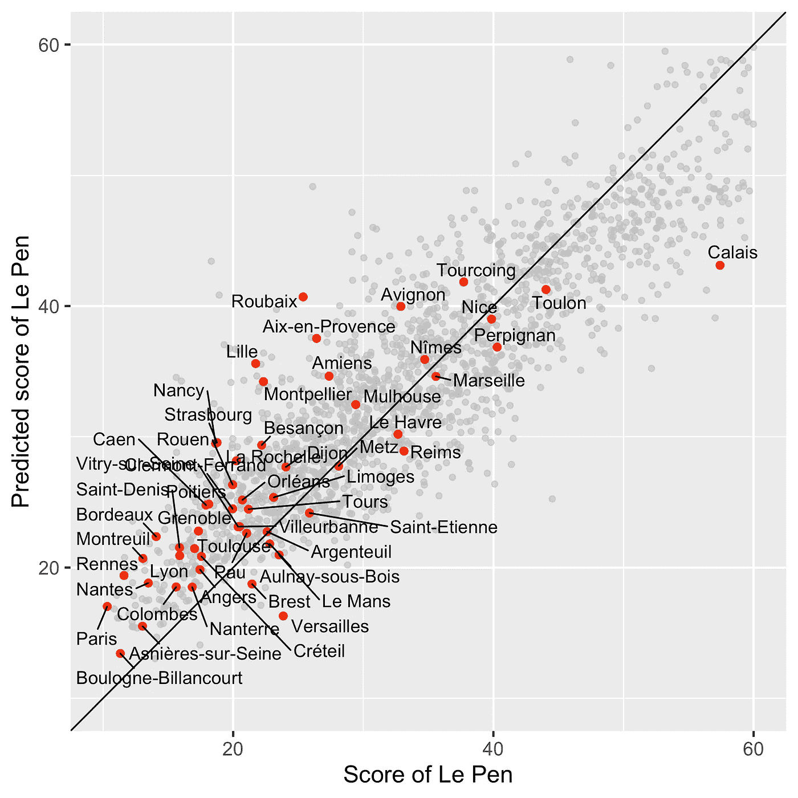

# 使用机器学习方法的异常检测:对法国政治的应用。

> 原文：<https://towardsdatascience.com/machine-learning-approaches-detect-outlier-values-that-do-not-follow-a-common-trend-detecting-cc0252f637bd?source=collection_archive---------23----------------------->

## 检测勒庞在 2017 年总统大选中的得分偏离基于社会经济变量的预测的法国地区。

复制分析所需的代码和数据可在 [github](https://github.com/mblumuga/frenchelection2017) 上获得。

**目标**

通常，机器学习者寻求调整学习机器，以便最大化分类或回归标准。当提供黑盒机器学习(ML)算法时，这是一个期望的目标。然而，当运行最大似然算法时，可以通过查看预测精度最低的点来提取有价值的信息。

为了说明我的观点，我分析了 2017 年法国总统选举第二轮的结果。在法国总统选举的最后一轮，马林·勒·庞面对埃马纽埃尔·马克龙。这可以被视为唐纳德·特朗普和希拉里·克林顿之间决斗的法国版，勒庞扮演特朗普的角色，马克龙扮演克林顿的角色。

在下文中，我研究了法国总统选举的结果在多大程度上是由社会经济变量决定的。如引言中所述，我正在寻找基于社会经济变量的得分预测最差的城市或地区。政治要想在下次选举中提高自己的全球得分，就应该去这些城市或地区开选前会。

所有的统计分析都在 r。

**数据集可用** [**data.gouv.fr**](https://www.data.gouv.fr/fr/)

首先，我下载了[第一个数据集](https://www.data.gouv.fr/fr/datasets/election-presidentielle-des-23-avril-et-7-mai-2017-resultats-du-2eme-tour-2/)，它包含了法国总统选举的结果，可以在 [data.gouv.fr](https://www.data.gouv.fr/fr/) 网站上找到。我在 github 上放了一个 csv 版本的数据文件。

然后，我执行一些技术操作来计算每个城市的城市代码(称为 CODGEO ),这将在合并 2 个不同的数据集时使用。

第二个数据集也可在 data.gouv.fr 网站上获得，包含法国每个城市(市镇)的各种社会经济数据。社会经济变量包括几个与税收、医生密度、商店密度、业主比例、工人比例相关的变量……我再次将 csv 版本的数据文件放在 [github](https://github.com/mblumuga/frenchelection2017/blob/master/data/MDB-INSEE.csv) 上。我删除了地理变量(如部门代码)，只保留社会经济数据。

**城市规模的预测分数和实际分数的比较**

然后，我将这两个数据集合并成一个数据框架，其中包含勒庞的得分和社会经济变量。为了训练回归模型，我使用随机森林来回归勒庞在社会经济变量上的得分。为了避免过度拟合，我使用双重交叉验证，其中我使用一半的数据来训练模型，另一半来进行预测，然后我交换了两个数据子集的角色。

**真实得分和预测得分之间的平方相关性为 53%** ，这是显著的，表明社会经济变量传达了预测总统选举结果的信息。

然后，我将勒庞的预测得分显示为真实得分的函数。

在图中，红点对应于超过 75，000 居民的城市。**一个引人注目的异常值是加莱，得分为 57%，而预测值低得多，为 43%** 。曾是难民营的加莱丛林或许可以解释为什么勒庞的得分比基于社会经济因素的应有得分高出 15%。

南部城市如尼斯、土伦和佩皮尼昂的得分高于基于预测值的预期。

我还发现有趣的是，巴黎和凡尔赛的预测得分相同，约为 16%，表明社会经济背景相似，但勒庞在巴黎的实际得分为 10%，而在凡尔赛为 24%。

在相反的方向上，鲁贝脱颖而出，预计勒庞的得分在 40%左右，但实际得分为 23%。令人惊讶的是，这种差异在紧邻鲁贝的图尔昆并没有出现

**部门级预测分数与实际分数的比较**

我最终对勒庞的实际得分和预测得分之间的城市差异进行了平均。在一个法国部门的范围内，这导致了一个值，我称之为“勒庞的超额票数”。我提供了一个阴谋来将勒庞 w.r.t .的超额选票的社会经济背景合法化。

为了制作一张法国地图，我使用了法国 R 大师科林·费伊提供的代码。

勒庞的超额选票最多的部门的实际和预测得分之间的差异在 2%和 2.5%之间。它们包括

*   科尔塞省和东南部的一些省份(**滨海阿尔卑斯省** 06， **Var** 83，**科尔塞省** 2A)，
*   来自加龙河谷的一个部门( **Tarn-et-Garonne** 82)和来自该河谷的邻近部门也有多余的选票，但重要性较小(Tarn 81，Lot et Garonne 47)，
*   **贝尔福地区** (90)。

相比之下，勒庞的得分比基于社会经济价值的预测低得多的部门是

*   **巴黎** (75)勒庞的得票率在 7%(！)小于它基于社会经济价值应该达到的水平，
*   **差异大于 2%的上塞纳省** (92)和邻近的塞纳-圣但尼省(93)也遵循这一趋势，但差异小于 2%。
*   **Indre-et-Loire** (37)差异大于 2%。

**结论**

机器学习方法可以检测出不遵循共同趋势的异常值。在这里，我提供了一个政治方面的例子，以找到勒庞在 2017 年法国第二轮总统选举中的得分偏离他们根据社会经济变量预测应该达到的城市或部门。

两个地区显示勒庞的票数过多，包括东南部和加龙河谷的省份。与预期相比，巴黎和一些邻近省份(92，93)显示勒庞的选票较少。很明显，在巴黎及其周边地区，勒庞的得分并没有达到应有的水平，经济并不是唯一的解释。还有神秘的 Indre-et-Loire，那里有城堡，勒庞的得票率大大低于预期。