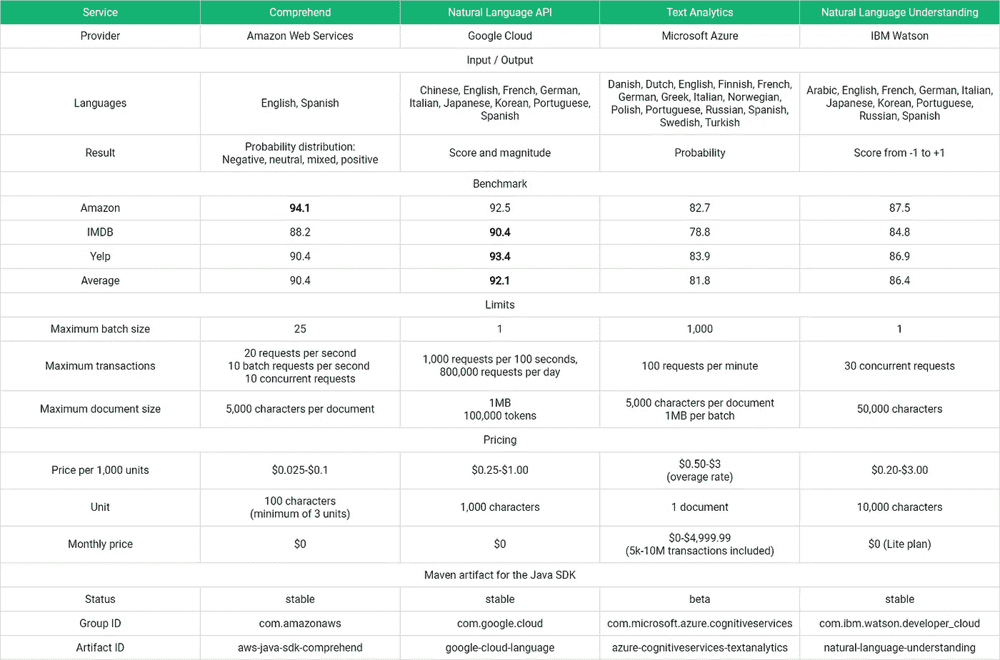

# 机器学习即服务:第 1 部分

> 原文：<https://towardsdatascience.com/machine-learning-as-a-service-487e930265b2?source=collection_archive---------5----------------------->

## 情感分析:10 个应用和 4 个服务

She loves me, she loves me not …

# 目录

*   第 1 部分:情感分析
*   [第二部分:语音合成](/speech-synthesis-as-a-service-5c65d17e62f4)

# 什么是情感分析？

用户生成内容的爆炸式增长和归档材料的数字化产生了大量数据集，其中包含大量人就几乎每一个主题发表的意见。

在某些情况下，这些数据的生成是通过用户界面**结构化的**。例如，在电子商务网站上处理客户评论相对容易，因为用户需要在产品评论的文本旁边张贴一个评级。

然而，大多数数据都是以**非结构化**形式提供的。它不包含一个标准化的总结说“这个内容表达了一个积极的，消极的，混合的或中立的观点。”

例如，WordPress.com 报告称，仅在 2018 年 5 月，使用他们平台的博客就发布了超过 8700 万条帖子。[1]据 YouTube 首席执行官苏珊·沃西基称，每分钟有超过 400 个小时的内容被上传到这个视频分享网站。[2]与此同时，谷歌图书项目已经将 400 种语言的至少 2500 万册图书数字化。[3]

每当用户在自由文本字段中键入内容或对着麦克风说话时，都需要进行推理来对情感进行分类。

情感分析正是专注于这项任务的领域。它是自然语言处理的一个分支，研究旨在将文本文档映射到情感表达的函数。

随着精确语音和文本识别的出现，情感分析的范围已经超出了易于访问的数字文本数据，并且覆盖了越来越多的媒体。

# 情感分析可以做什么？

情感分析有助于我们了解过去，预测未来，并在当下采取适当的措施。

假设你有机会分析你的客户、竞争对手、学生或其他感兴趣的人所表达的观点。你会用这些知识做什么？

以下是十个想法:

*   票房收入:Asur &胡伯尔曼(2010)在一个模型中包含了积极情绪与消极情绪的比率，该模型被训练来预测电影上映前的票房收入。[4]
*   品牌监控:Ghiassi 等人(2013 年)描述了一个旨在监控表达品牌和名人情感的推文的系统。[5]
*   计算历史:Acerbi (2013)使用 20 世纪出版的书籍档案生成了一个积极和消极情绪的时间序列。[6]
*   客户反馈:Gamon (2005)在客户调查和知识库中提供的反馈的背景下探索了情感分析。[7]
*   辍学率:Wen 等人(2014)使用大规模开放在线课程(MOOC)论坛中表达的观点来预测学生流失。[8]
*   政治情绪的监测:Abbasi 等人(2008)分析了极端主义团体论坛中的政治情绪。[9]
*   产品评论:在他的经典论文中，Turney (2002)将情感分析应用于不同类型产品和服务的在线评论。[10]
*   股票市场预测:Bollen 等人(2011 年)在一个预测道琼斯工业平均指数变化的模型中纳入了对公众情绪的估计。[11]
*   故事弧线:Reagan 等人(2016)使用情感挖掘来确定古腾堡计划小说集中情感轨迹的基本形状。[12]
*   作为子任务的情感分析:Pang & Lee (2008)提到情感分析作为高阶系统中的一个组件的使用。例如，摘要可能受益于包含对特定主题表达不同意见的来源。[13]

# 我必须提供什么？我得到了什么回报？

我们已经说过，情感分析将一个文本文档作为输入，并将一个情感的表示作为输出返回。

关于投入没什么好说的。这只是你想要分析的书籍/评论/客户调查/电子邮件/新闻文章/产品评论/推文或其他类型文档的文本内容。

现在，让我们转向输出。

## 二元情感分析

二元情感分析，最简单的情况，提出如下问题:“文本文档中表达的观点是正面的还是负面的？”

这里，输出要么是概率，要么是分数。

我们先来考虑**概率**。

高概率表示给定文本可能表达正面观点。例如，0.9 的输出表示所表达的意见有 90%的可能性是正面的。

相反，低概率表示给定文本可能是负面观点的表达。例如，0.1 的输出表示 10%的可能性意见是正面的，或者换句话说，90%的可能性意见是负面的。

可选地，情感的预测可以被表达为**分数**。这里也没有惊喜。积极的分数表明积极的情绪。负分表示负面情绪。绝对值越大表明情感越强烈。

## 多类情感分析

在多类别情感分析中，输出是在 *n* 个可能类别上的概率分布，或者换句话说，是一列加起来等于 1 的 *n* 个非负数。要对意见进行分类，您可以选择与最高概率相关的类别。

二元情感分析是多类情感分析的特例，其中 *n=2* 。

二元情感分析的一个简单扩展是引入中性意见类。在这种情况下，输出是三类( *n = 3)* 的概率分布。这三种概率可以按如下顺序排列:*负概率*、*中性概率*和*正概率*。

例如，对于侧重于技术细节的综述的预测可以具有与此类似的分布:*【0.1，0.85，0.05】*。

现在，假设一个客户发布了一个混合评论，列出了产品的正面和负面。三级情感分析器的输出可以类似于下面的分布:*【0.4，0.1，0.5】*。

处理这个问题的一个方法是包含一个混合的*类别。假设我们把四类排序如下:*阴性、中性、混合型、阳性*。混合产品评审示例中的输出可能类似于这样:*【0.15，0.05，0.7，0.1】。**

# 有哪些好的情感分析服务？

为了完成这一概述，我们将看看领先云计算平台的四种情感分析服务。

An overview of four leading sentiment analysis services

为了提供这些服务性能的第一印象，我使用 Kotzias 等人(2015 年)整理的数据创建了一个基准。[14]

这个汇编包括了来自著名数据集的三个评论子集，每个子集有 1000 个实例:亚马逊产品评论、来自 IMDB 数据集的电影评论和 Yelp 餐馆评论。

## 亚马逊理解

亚马逊的自然语言处理解决方案[understand](https://aws.amazon.com/comprehend/)于去年推出，目前支持[英语和西班牙语文档](https://docs.aws.amazon.com/comprehend/latest/dg/API_DetectSentiment.html)。

请求以 100 个字符为单位进行衡量，每个请求最小为 3 个单位。

就像这里列出的其他服务一样，Amazon understand 根据每月的请求数量进行分层。最高 1000 万台，每 1000 台的价格为 0.1 美元。对于超过 5000 万的请求，价格设置为 0.025 美元。

给定凭证提供者、文本和语言代码，可以如下请求情绪的预测:

Sentiment analysis with Amazon Comprehend

API 支持多达 25 个文档(最多 5000 个字符)的批处理请求，并生成四类概率分布:*负*、*混合*、*中性*和*正*。

不出所料，understand 在 1000 条亚马逊商品评论上取得了最佳表现。结合其他两个数据集上接近 90%的准确率，这使得亚马逊的 API 在基准测试中获得了**亚军**。

## 谷歌云自然语言 API

Google 的云自然语言 API 支持[九种语言](https://cloud.google.com/natural-language/docs/languages)，生成两个情感分析值: [*分值*和*量级*](https://cloud.google.com/natural-language/docs/sentiment-tutorial#analyzing_document_sentiment) 。

文档情感的*得分*表示文档的整体情感。

*量级*表示文档中存在多少情感内容，并且通常与文档的长度成比例。

表达很少情绪或混合情绪的文档，中性分在 0.0 左右。幅度值可用于消除这两种情况的歧义。低情绪文档具有低量值，而混合情绪与较高的量值相关联。

[定价](https://cloud.google.com/natural-language/pricing)模型基于每个文档 1000 个字符的单位。对于范围在 5，000 个单位和 100 万个单位之间的每月请求，每 1，000 个单位的价格是 1 美元。在 5000 到 100 万件之间，每 1000 件的价格为 1 美元。对于 500 万到 2000 万件范围内的请求，价格降至 0.25 美元。

假设[GOOGLE _ APPLICATION _ CREDENTIALS](https://cloud.google.com/docs/authentication/getting-started)环境变量被设置为包含项目凭证的 JSON 文件的路径，下面的代码对给定的文本执行情感分析:

Sentiment analysis with Googles’ Cloud Natural Language API

谷歌的服务以 92.1 %的出色准确率弥补了批处理的不足，在三个数据集的两个中实现了最佳性能。就性能而言，云自然语言 API 无疑是我们竞争中的赢家。

## Microsoft 文本分析 API

微软的情感分析器执行[二进制分类](https://docs.microsoft.com/sl-si/azure/cognitive-services/text-analytics/how-tos/text-analytics-how-to-sentiment-analysis)，并因此给每个文档分配一个概率。当一个文本不能被分析或者没有情感时，服务总是精确地返回 0.5。

每月有 5，000 笔交易的免费层允许您在没有财务负担的情况下探索 API。入门级*标准 S0* 层的价格为每月 74.71 美元，有 25000 个请求。最昂贵的公开披露层，*标准 S4* ，每月花费 4999.99 美元，包括 1000 万个请求。

高于等级限制的每 1000 笔交易的价格从 0.50 美元到 3 美元不等。

API 支持 [15 种欧洲语言](https://docs.microsoft.com/en-us/azure/cognitive-services/text-analytics/text-analytics-supported-languages)和[多达 1000 个文档](https://docs.microsoft.com/en-us/azure/cognitive-services/text-analytics/overview#data-limits)的批量请求。

不幸的是，在我们的测试中，这些特性与它的性能并不匹配。文本分析 API 的平均准确率为 81.8%，落后谷歌服务超过 10 个百分点。

Java SDK 的测试版已经推出，但是使用 Unirest 和 GSON 更容易:

## 沃森自然语言理解

IBM Watson 的情感分析器支持[十种语言](https://console.bluemix.net/docs/services/natural-language-understanding/language-support.html#language-support)，并返回一个范围从-1 到+1 的分数。

计费单位由 10，000 个字符组成。根据免费 Lite 计划，每月可购买 30，000 台。标准计划的入门级包括每月前 250，000 台，价格为每 1，000 台 3 美元。500 万件之后，价格下降到 0.20 美元。

在我们的测试中，Watson API 的表现明显好于微软的文本分析 API，但不如 Amazon intensive。

Java SDK 似乎不支持批处理请求。

# 结论

情感分析对文本文档中表达的观点进行分类。

用户生成内容的增加以及越来越精确的文本和语音识别推动了它的发展。

我们简要介绍了 10 个不同领域的应用:从票房收入预测和品牌监测到股票市场建模和识别故事弧线中情感轨迹的基本形状。

二元分类返回表示正面或负面观点的概率(或分数)。一些情感分析器扩展了这种二分法，并且包括混合和/或中性情感的类别。

然后，我们比较了领先云计算平台的四种情感分析服务。

如果你对情感分析 a 服务感兴趣，我建议你从亚马逊领悟或者谷歌自然语言理解 API 开始。

# 感谢您的阅读！如果您喜欢这篇文章，请关注我，了解更多关于云中机器学习服务的信息。

# 参考

[1][https://wordpress.com/activity/posting/](https://wordpress.com/activity/posting/)

[https://youtu.be/O6JPxCBlBh8?t=10m45s](https://youtu.be/O6JPxCBlBh8?t=10m45s)

[3]海曼，S. 2015。Google Books:一个复杂而有争议的实验。nytimes.com*。可在:[https://www . nytimes . com/2015/10/29/arts/international/Google-books-a-complex-and-contractive-experiment . html](https://www.nytimes.com/2015/10/29/arts/international/google-books-a-complex-and-controversial-experiment.html)【2018 年 6 月 10 日访问】。*

[4]阿苏尔和胡伯尔曼，文学学士，2010 年 8 月。用社交媒体预测未来。2010 年 IEEE/WIC/ACM 网络智能和智能代理技术国际会议论文集-第 01 卷(第 492–499 页)。IEEE 计算机学会。

[5]m . GHI assi，j . Skinner 和 and Zimbra，2013 年。Twitter 品牌情感分析:使用 n-gram 分析和动态人工神经网络的混合系统。*专家系统与应用*， *40* (16)，第 6266–6282 页。

[6]阿塞尔比，兰波斯，v .，加内特，p .和本特利，R.A .，2013。20 世纪书籍中的情感表达。 *PloS one* ， *8* (3)，p.e59030。

[7]m .加蒙，2004 年 8 月。顾客反馈数据的情感分类:噪声数据、大特征向量和语言分析的作用。第 20 届国际计算语言学会议论文集(第 841 页)。计算语言学协会。

[8]文，男，杨，d 和罗斯，c，2014 年 7 月。MOOC 论坛中的情感分析:它告诉了我们什么？。在*教育数据挖掘 2014* 。

[9]a .阿巴西、h .陈和 a .塞勒姆，2008 年。多语言中的情感分析:网络论坛中观点分类的特征选择。*《美国计算机学会信息系统汇刊》(TOIS)* ， *26* (3)，第 12 页

10 特尼博士，2002 年 7 月。竖起大拇指还是竖起大拇指？:语义导向应用于评论的无监督分类。在*计算语言学协会第 40 届年会论文集*(第 417-424 页)。计算语言学协会。

[11] Bollen，j .，Mao，h .和曾，x .，2011 年。推特情绪预测股市。*计算科学杂志*， *2* (1)，第 1–8 页。

[12]里根，A.J .，米切尔，l .，凯利，d .，丹福斯，C.M .和多兹，P.S .，2016 年。故事的情感弧线由六种基本形状决定。 *EPJ 数据科学*， *5* (1)，第 31 页

[13]庞和李，2008 年。观点挖掘和情感分析。*信息检索基础与趋势*，*2*(1-2)，第 1-135 页。

[14]d . Kotzias，m . Denil，n . De Freitas 和 Smyth，p .，2015 年 8 月。使用深层特征从组标签到单个标签。第 21 届 ACM SIGKDD 知识发现和数据挖掘国际会议论文集(第 597–606 页)。ACM。