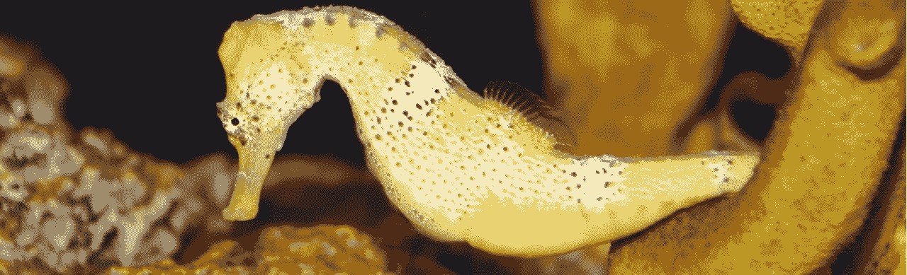

# 黑客攻击海马体:机器学习的下一个前沿和超越…

> 原文：<https://towardsdatascience.com/machine-learning-as-hacking-of-the-brain-6aab8c4a9e7d?source=collection_archive---------7----------------------->

在我们每个人的头骨深处，都有一个像鳄鱼的大脑一样的东西。围绕 R-复合体的是边缘系统或哺乳动物的大脑，它在几千万年前从哺乳动物但还不是灵长类动物的祖先进化而来。它是我们情绪和情感的主要来源，是我们关心和爱护年轻人的主要来源。最后，在外部，与更原始的大脑处于不稳定的休战状态的是大脑皮层；文明是大脑皮层的产物。”

*——卡尔·萨根，宇宙 276–277 页*

关于人类大脑的神经科学知识仍然是如此不完整，以至于我们只能从神经科学家的想法中获得灵感，而不是基于坚如磐石的科学证据。然而最近深度学习的成功表明这种方法是可行的。

监督学习的强大性能匹配甚至超过了上面引用的卡尔·萨根的“鳄鱼的大脑”。“边缘系统或哺乳动物大脑”是下一站。它的核心是海马体，这是大脑皮层根部的一个单一的弯曲的灰质细胞层。**海马体被广泛认为介导了许多认知功能**，因为它密集的相互轴突投射到和来自皮质。

# 认知功能的调节者

想象你的身体是一架无人机，由两个不同的人驾驶。其中一个有驾驶舱视角(或者他们称之为“第一人称视角”)。这位飞行员可以在单独的显示器上看到无人机的垂直和水平位置，但前方的视野是他获取信息的主要渠道。第一个飞行员可以立即将当前的驾驶舱视图与之前任务中拍摄的电影和快照进行比较。更重要的是，这位飞行员可以在每次识别出熟悉的路径时开启巡航控制甚至自动驾驶模式。

另一名飞行员通过在 3D 显示器上操作一个小模型来驾驶同一架无人机。第二名飞行员有时会从远处(他们称之为“在视线范围内”)看一眼无人机，但大多数时候他只能看到无人机模型在环境模型中的位置。(无人驾驶飞机和环境的)两个模型都已创建，并根据以前任务记录的比较和无人驾驶飞机所有传感器的新数据输入进行即时调整。

现在想象一下，两个飞行员不能互相交谈或以任何其他方式交换信息。他们只能通过理想观察者的决定来交换无人机的控制权。理想的观察者看不到任何一个飞行员的显示器。他只能以理想的准确度测量在那些显示器上已经发生、实际发生和预测将发生的所有事件的概率，以及关于那些事件的信息的可信度。理想的观察者就像一个交换台，在两个飞行员之间交换控制。第一个试验在存在关于可能或不可能事件的高可信度信息的情况下是很好的，但是当信息的可信度低时，它会完全丢失。然后第二个飞行员就位。它通过地标导航，并探索环境以获得更可信的信息。

# 探索和观察探索者

在这一点上，海马体第一次成为我们关注的焦点，因为它是负责**做出探索决策**的大脑区域，即关于在被动和主动学习会话之间切换的决策。西北大学[的一组研究人员在 2014 年发表在《细胞》杂志上的一篇文章中指出](http://www.cell.com/neuron/fulltext/S0896-6273(14)00343-2)“海马活动因此直接与眼球运动模式相对应，从而在海马活动和支持探索决策的特定眼球运动行为相关信息之间建立了紧密的联系。”。

来自加州理工学院的研究人员在 2015 年[从一个不同的角度解读了](https://www.ncbi.nlm.nih.gov/pmc/articles/PMC4412411/)海马体在学习过程中的作用，“在神经层面，我们的研究结果表明，根据我们的模型，在支持一次性学习的学习速率范围内，有证据表明涉及一个非常特定的神经系统。**具体来说，相对于较慢的学习速度，高学习速度的海马体活动增加**(90%或以上)，相反，海马体没有活动。因此，海马体似乎是以类似开关的方式被招募的，只有在一次性学习发生时才会出现，否则就会保持沉默。”

# 海马和爬行动物的大脑

**海马**形似海马，故名。它是哺乳动物大脑边缘系统的一部分。**尾状核**位于人脑最古老也是最小的区域。它在数亿年前进化而来，更像是当今爬行动物的整个大脑。由于这个原因，它通常被称为爬行动物的大脑。

加拿大麦吉尔大学的研究人员在 2013 年的实验中重复了[他们之前许多其他研究人员的结果，这些结果显示了“海马依赖的空间导航策略和尾状核依赖的刺激反应导航策略之间的明显差异……**海马对于以别为中心的空间学习和记忆以及认知地图的形成**至关重要，即学习和记忆环境地标之间的关系，而不管观察者的位置如何。 这样就可以从任何起始位置直接到达任何目标位置……相比之下，纹状体(尾状核)对于反应学习和记忆以及通过建立严格的刺激-反应关联形成习惯至关重要。”](https://www.ncbi.nlm.nih.gov/pmc/articles/PMC3935407/)

他们还指出，“海马体和纹状体(尾状核)也参与决策过程。****依赖于海马体的决策过程，包括将自己投射到未来的情境中，以创造对行动结果的期望**。相比之下，依赖于纹状体的决策过程利用过去的经验将行为与价值联系起来。**

**蒙特利尔大学的科学家在为期四年的研究中展示了“纹状体和海马体中的灰质之间的反比关系”正如他们所说，“有大量证据支持这样的假设，即空间策略的**使用与海马灰质和活动的增加**有关，而反应策略的**使用与纹状体灰质和活动的增加** …”**

# **海马启发的神经网络架构**

**最近，来自 DeepMind [的研究人员提出了](https://deepmind.com/blog/hippocampus-predictive-map/)一种预测地图理论，其灵感来自最近对海马体的神经科学研究以及他们对强化学习算法的了解。他们认为"**预测映射理论可以转化为神经网络架构**"**

**甚至比这更早，来自加拿大莱斯布里奇大学的研究人员[在他们的论文](https://www.frontiersin.org/articles/10.3389/fncom.2016.00128/full)(发表于 2016 年 12 月)中提出了这样的想法:“海马体中处理的**关键特征支持一种灵活的基于模型的强化学习(MBRL)机制，用于空间导航**，这种机制在计算上是高效的，可以快速适应变化。”他们写道，“我们通过**实现一个计算 MBRL 框架来研究这一想法，该框架包含了受海马体计算属性启发的功能:空间的分层表示，“向前扫描”未来的空间轨迹，以及环境驱动的位置细胞的重新映射。**我们发现，空间的分层抽象极大地减少了适应不断变化的环境条件所需的计算负载(脑力劳动),并允许高效地扩展到大型问题。它还允许在高水平上获得的抽象知识来指导对新障碍的适应。此外，上下文驱动的重新映射机制允许学习和记忆多个任务。”**

# **世界模型的认知地图**

**现在发现海马体的作用远远超出了空间导航。“鉴于**海马体对于通过认知地图**、**进行空间导航至关重要，它的作用来自认知地图**的关系组织和灵活性，而不是来自空间领域的选择性作用。相应地，海马网络映射出多种导航策略，以及其他强调关系组织的空间和非空间记忆和知识领域。这些观察表明**海马系统并不致力于空间认知和导航，而是组织记忆中的经验**，**，空间映射和导航既是对关系记忆组织的隐喻，也是其突出应用**。来自波士顿大学的 Howard Eichenbaum 于 2017 年 4 月在他的论文中写道。**

**2017 年，巴黎大学认知神经成像部门的研究人员就该主题提供了一个更广泛的观点[，称](http://www.pnas.org/content/114/19/E3859)我们的大脑实施了“置信度加权学习算法，充当统计学家，使用概率信息来估计**世界的层次模型****

# **逆向破解道德大脑**

**这个故事始于我对童话的兴趣。尤其令我着迷的是一项系统发育研究，该研究追溯了一些最受欢迎的现代童话故事的起源，可以追溯到青铜时代。民间传说和讲故事领域最杰出的研究人员写了许多书和文章，他们是:弗拉迪米尔·普罗普、克洛德·列维·斯特劳斯、杰克·齐普斯、杰罗姆·布鲁纳，这些书和文章让我相信，神奇的民间故事在人类的驯化过程中发挥了至关重要的作用。**

**大多数研究人员都同意童话对我们的大脑有潜移默化的影响这一点，尽管他们的研究同时集中在童话的显性语言上。例如，克洛德·列维·斯特劳斯[建议](https://monoskop.org/images/4/42/Levi-Strauss_Claude_1960_1984_Structure_and_Form_Reflections_on_a_Work_by_Vladimir_Propp.pdf)童话可以在普通语言之上承载一种**元语言**。杰罗姆·布鲁纳(Jerome Bruner)在强调一个好故事的影响的隐含本质时[创造了术语](https://books.google.ru/books?id=7p2ApsvrclcC&pg=PA90&lpg=PA90&dq=Story-making+is+our+medium+for+coming+to+terms+with+the+surprises+and+oddities+of+the+human+condition+and+our+imperfect+grasp+of+that+condition&source=bl&ots=rehToa7mW3&sig=k3PPwztuVzDpH2GlzsCOvFOGhDs&hl=en&sa=X&ved=0ahUKEwjyx676tsDVAhWCL8AKHZO9AOMQ6AEILDAB#v=onepage&q=Story-making%20is%20our%20medium%20for%20coming%20to%20terms%20with%20the%20surprises%20and%20oddities%20of%20the%20human%20condition%20and%20our%20imperfect%20grasp%20of%20that%20condition&f=false)、**来驯服不确定性****

**南加州大学神经科学家在 2017 年 9 月发表的[研究](https://www.ncbi.nlm.nih.gov/pubmed/28940969)显示，对英语、波斯语或普通话故事的分布式表示的识别发生在大脑中被称为默认模式网络的相同区域。那个网络包括**海马**。研究结果表明,“叙事的神经语义编码发生在比个体语义单位更高的层次上，这种编码在个体和语言中都是系统的。”**

**我们假设一个童话故事是一串密集的事件，具有随机变化的概率和可信度，它改变了学习的平衡，从依赖先前的知识转向探索新获得的信息。我们把童话故事中包含的隐性大脑编码叫做**大脑刷新按钮**。它对语言或文化不敏感。它增强了人们独立运用理性的能力，而不管文化背景如何。**

**耶鲁大学心理学教授保罗·布鲁姆和他的团队在[研究婴儿道德](https://www.scientificamerican.com/article/the-moral-life-of-babies/)时发现，人类大脑很可能**有一套固定的基本(或幼稚)道德原则和道德情感**。天真的道德原则和情感需要根据现实生活和现代世界进行调整。正如布鲁姆教授所说，“在这个领域，先天能力、文化学习和个人理性实践之间存在着令人着迷的相互作用。”。**

**我们相信，好的童话在**校准天真的道德原则和情感**中起着关键作用。除此之外，他们利用大脑刷新按钮来做到这一点。现在，我们正在制造工具，使好的童话故事的隐含代码恢复活力，因为我们周围的绝大多数故事都是坏的。它们已经被修改，只针对人类大脑中最大化自动反应短期回报的爬行动物部分。**

# **意识可以被黑吗？**

**来自伯尔尼大学的研究人员在 2015 年[提出了一个概念](http://journals.plos.org/plosone/article?id=10.1371/journal.pone.0122459)，即“**海马是无意识和有意识记忆**相互作用的地方。”**

**来自石勒苏益格-荷尔斯泰因大学医院和德国基尔大学的一组研究人员在 2011 年发表的一篇论文[中宣布了他们的研究结果，这些研究结果提供了证据表明**人类海马 CA1 神经元对于自传体** **情景记忆的提取至关重要，并且它们对于自主意识**也很重要。](http://www.pnas.org/content/108/42/17562.full)**

# **未完待续…**