# 机器学习—基础知识

> 原文：<https://towardsdatascience.com/machine-learning-basics-part-1-a36d38c7916?source=collection_archive---------0----------------------->

## 机器学习领域的基础理论

本文介绍了机器学习理论的基础，奠定了所涉及的常见概念和技术。这篇文章是为刚开始学习机器的人准备的，让他们很容易理解核心概念，并熟悉机器学习的基础知识。


[Source](https://www.expertsystem.com/machine-learning-definition/)

# 什么是机器学习？

1959 年，人工智能研究的先驱、计算机科学家亚瑟·塞缪尔(Arthur Samuel)将机器学习描述为“在没有明确编程的情况下赋予计算机学习能力的研究。”

艾伦·图灵的开创性论文(**图灵，** 1950 年)介绍了一个展示机器智能的基准标准，即机器必须具有智能和响应能力，其方式不能与人类有所不同。

> 机器学习是人工智能的一种应用，其中计算机/机器从过去的经验(输入数据)中学习，并做出未来的预测。这样一个系统的性能至少应该是人的水平。

**Tom m . Mitchell**(1997)给出了一个更具技术性的定义:“如果一个计算机程序在 T 类任务中的性能(如 P 所测量的)随着经验 E 而提高，那么就可以说它从经验 E 中学习了一些任务 T 和性能测量 P。”例如:

```
**A handwriting recognition learning problem:****Task T**: recognizing and classifying handwritten words within images
**Performance measure P**: percent of words correctly classified, accuracy
**Training experience E**: a data-set of handwritten words with given classifications
```

为了执行任务 T，系统从所提供的数据集进行学习。数据集是许多例子的集合。一个例子是特征的集合。

# 机器学习类别

机器学习通常分为三种类型:监督学习、非监督学习、强化学习

## **监督学习:**

在监督学习中，机器会经历这些例子以及每个例子的标签或目标。数据中的标签有助于算法关联特征。

两个最常见的监督机器学习任务是**分类**和**回归**。

```
In **classification** problems the machine must learn to predict discrete values. That is, the machine must predict the most probable category, class, or label for new examples. Applications of classification include predicting whether a stock's price will rise or fall, or deciding if a news article belongs to the politics or leisure section. In **regression** problems the machine must predict the value of a continuous response variable. Examples of regression problems include predicting the sales for a new product, or the salary for a job based on its description.
```

## **无监督学习:**

当我们有未分类和未标记的数据时，系统试图从数据中发现模式。这些示例没有给出标签或目标。一个常见的任务是将相似的例子组合在一起，称为聚类。

## **强化学习:**

强化学习是指面向目标的算法，它学习如何在许多步骤中实现复杂的目标或沿着特定的维度最大化。这种方法允许机器和软件代理自动确定特定上下文中的理想行为，以便最大化其性能。代理人需要简单的奖励反馈来学习哪一个动作是最好的；这就是所谓的强化信号。例如，在一场游戏中，通过多次移动来最大化赢得的点数。

# 监督机器学习技术

回归是一种技术，用于从一个或多个预测变量(自变量)预测响应变量(因变量)的值。

最常用的回归技术有:**线性回归**和**逻辑回归**。我们将讨论这两种突出技术背后的理论，同时解释机器学习中涉及的许多其他关键概念，如`Gradient-descent`算法、`Over-fit/Under-fit`、`Error analysis`、`Regularization`、`Hyper-parameters`、`Cross-validation`技术。

# 线性回归

在线性回归问题中，目标是从给定的模式`*X*`中预测实值变量`*y*` 。在线性回归的情况下，输出是输入的线性函数。假设`*ŷ*`是我们的模型预测的输出:`*ŷ* = *WX*+*b*`

这里`*X*`是向量(示例的特征)，`*W*`是确定每个特征如何影响预测的权重(参数的向量)，`*b*`是偏差项。因此，我们的任务`*T*`是从`*X*`预测`*y*`，现在我们需要测量性能`*P*`以了解模型的表现如何。

现在来计算模型的性能，我们首先计算每个例子`*i*`的误差为:

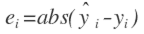

我们采用误差的绝对值来考虑误差的正值和负值。

最后，我们计算所有记录的绝对误差的平均值(所有绝对误差的平均和)。

**平均绝对误差(MAE)** =所有绝对误差的平均值

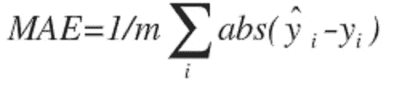

更流行的测量模型性能的方法是使用

**均方误差(MSE)** :预测值与实际观测值的平方差的平均值。

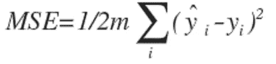

平均值被减半(1/2 ),以便于计算梯度下降(稍后讨论),因为平方函数的导数项将抵消 1/2 项。有关 MAE 与 MSE 的更多讨论，请参考[1]和[2]。

> 训练 ML 算法的主要目的是调整权重`*W*`以减少 MAE 或 MSE。

为了最小化*误差*，模型在经历训练集的例子时，更新模型参数`*W*`。这些根据`*W*`绘制的误差计算也被称为**成本函数** `*J(w)*`，因为它决定了模型的成本/惩罚。因此最小化误差也被称为最小化成本函数 j。

# **梯度下降算法:**

当我们绘制成本函数`*J(w) vs w*`时。它表示如下:

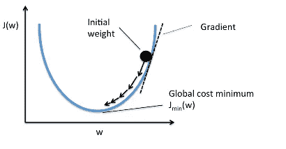

从曲线中我们可以看出，存在一个参数值`*W*`，它具有最小的成本`*Jmin*`。现在我们需要找到一种方法来达到这个最低成本。

在梯度下降算法中，我们从随机模型参数开始，计算每次学习迭代的误差，不断更新模型参数，以更接近产生最小成本的值。

重复直到最小成本:{

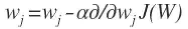

}

在上面的等式中，我们在每次迭代后更新模型参数。方程的第二项计算每次迭代时曲线的斜率或梯度。

成本函数的梯度被计算为成本函数`*J*` 相对于每个模型参数`*wj*` *，* `*j*`取特征数量`[1 to n]`的值。`*α*`， *alpha* ，是学习率，或者说我们想要多快地向最小值移动。如果`*α*`太大，我们可以超调。如果`*α*`太小，意味着学习的步骤很小，因此模型观察所有示例所花费的总时间会更多。

梯度下降有三种方式:

**批量梯度下降:**使用所有的训练实例来更新每次迭代中的模型参数。

**小批量梯度下降:**小批量梯度下降不是使用所有的例子，而是将训练集分成更小的称为“b”的批量。因此，小批量“b”用于在每次迭代中更新模型参数。

**随机梯度下降(SGD):** 在每次迭代中仅使用单个训练实例更新参数。训练实例通常是随机选择的。当有成千上万或更多的训练实例时，随机梯度下降通常是优化成本函数的首选，因为它比批量梯度下降收敛得更快[3]。

# 逻辑回归

在某些问题中，响应变量不是正态分布的。例如，抛硬币会有两种结果:正面或反面。伯努利分布描述了随机变量的概率分布，该随机变量可以采用概率为`*P*`的正情况或概率为`*1-P*`的负情况。如果响应变量代表一个概率，它必须被限制在`{0,1}`的范围内。

在逻辑回归中，响应变量描述了结果是正面情况的概率。如果响应变量等于或超过判别阈值，则预测阳性类别；否则，预测负类。

使用逻辑函数将响应变量建模为输入变量的线性组合的函数。

由于我们的假设`*ŷ*`必须满足`0 ≤ *ŷ* ≤ 1`，这可以通过插入逻辑函数或“Sigmoid 函数”来实现

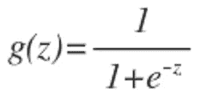

函数`*g(z)*`将任何实数映射到`(0, 1)`区间，这对于将任意值函数转换为更适合分类的函数非常有用。以下是范围`{-6,6}`内 sigmoid 函数值的曲线图:

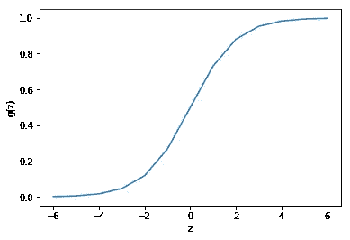

现在回到我们的逻辑回归问题，让我们假设`*z*`是单个解释变量`*x*`的线性函数。我们可以将`*z*`表达如下:

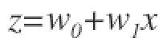

逻辑函数现在可以写成:

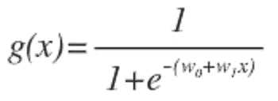

注意`*g(x)*`解释为因变量的概率。
`*g(x) = 0.7*`，给我们 70%的概率，我们的输出是 1。我们预测为 0 的概率正好是我们预测为 1 的概率的补充(例如，如果预测为 1 的概率是 70%，那么预测为 0 的概率是 30%)。

sigmoid 函数`‘g’`的输入不需要是线性函数。它可以是圆形或任何形状。

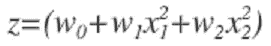

## 价值函数

我们不能使用用于线性回归的相同成本函数，因为 Sigmoid 函数将导致输出波动，从而导致许多局部最优。换句话说，它不会是凸函数。

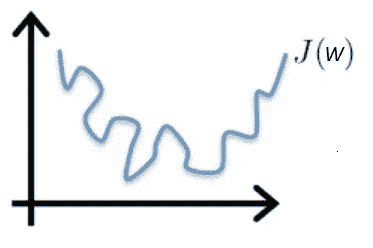

Non-convex cost function

为了确保成本函数是凸的(并因此确保收敛到全局最小值)，使用 sigmoid 函数的对数来变换成本函数。逻辑回归的成本函数如下所示:

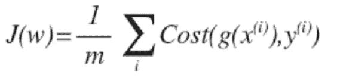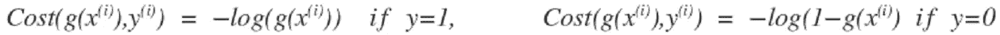

可以写成:

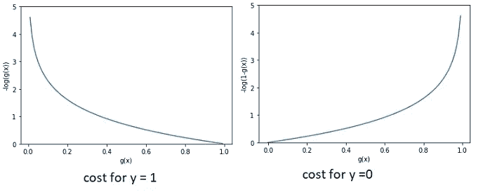

所以逻辑回归的成本函数是:

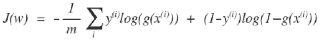

由于成本函数是凸函数，我们可以运行梯度下降算法来找到最小成本。

# 装配不足和过度装配

我们试图通过增加或减少模型容量来使机器学习算法适应输入数据。在线性回归问题中，我们增加或减少多项式的次数。

考虑从`*x ∈ R*`预测`*y*`的问题。下面最左边的图显示了将一条线拟合到一个数据集的结果。由于数据不在一条直线上，所以拟合不是很好(左图)。

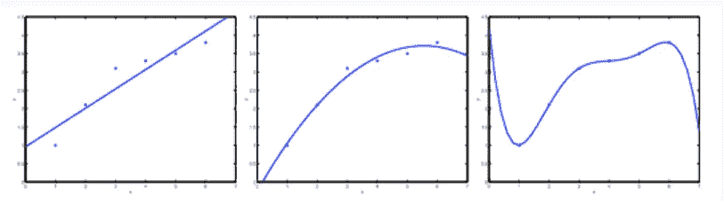

为了增加模型容量，我们通过添加术语`*x²*`来添加另一个特性。这产生了更好的拟合(中间的数字)。但是如果我们继续这样做(`*x⁵*`，5 阶多项式，图在右边)，我们可能能够更好地拟合数据，但是对于新数据将不能很好地概括。第一个数字表示欠拟合，最后一个数字表示过拟合。

## **欠拟合:**

当模型具有较少的特征，因此不能很好地从数据中学习时。这个模型有很高的偏差。

## 过度装配:

当模型具有复杂的函数，因此能够很好地拟合数据，但不能进行归纳以预测新数据时。这个模型有很高的方差。

有三个主要选项来解决过度拟合问题:

1.  **减少特征数量:**手动选择保留哪些特征。这样做，我们可能会错过一些重要的信息，如果我们扔掉一些功能。
2.  **正则化:**保留所有特征，但减少权重 w 的大小。当我们有许多稍微有用的特征时，正则化工作得很好。
3.  **提前停止:**当我们迭代地训练一个学习算法时，比如使用梯度下降，我们可以测量模型的每次迭代执行得有多好。达到一定的迭代次数后，每次迭代都会改进模型。然而，在这一点之后，模型的概括能力会减弱，因为它开始过度拟合训练数据。

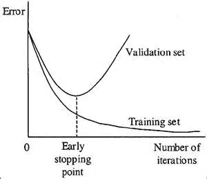

# **正规化**

通过向误差函数添加惩罚项，正则化可以应用于线性和逻辑回归，以阻止系数或权重达到大值。

## **正则化线性回归**

最简单的这种罚项采取所有系数的平方和的形式，导致修正的线性回归误差函数:

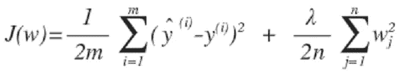

其中λ是我们的正则化参数。

现在为了使误差最小化，我们使用梯度下降算法。我们不断更新模型参数，以更接近产生最小成本的值。

重复直到收敛(使用正则化):{

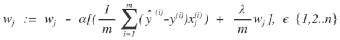

}

通过一些操作，上述等式也可以表示为:

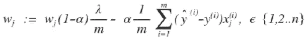

上述等式中的第一项，

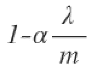

将始终小于 1。直观上，你可以看到每次更新时，系数的值都会减少一些。

## **正则化逻辑回归**

正则化逻辑回归的成本函数为:

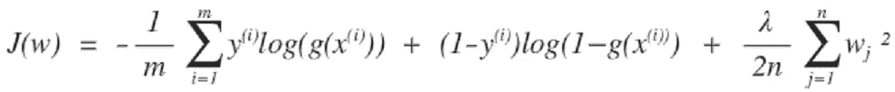

重复直到收敛(使用正则化):{

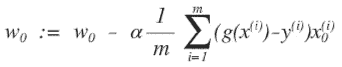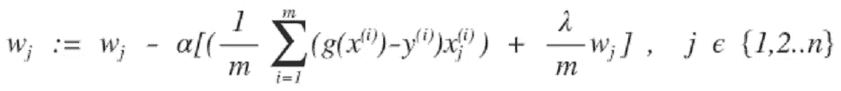

}

## **L1 和 L2 正规化**

前面方程中使用的正则项称为 L2 正则化或岭正则化。

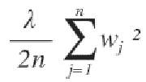

L2 罚旨在最小化权重的平方。

还有一种称为 L1 或拉索的正则化:

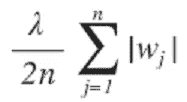

L1 罚旨在最小化权重的绝对值

**L1 和 L2 的区别**
L2 以相同的比例缩小所有系数，但不消除任何系数，而 L1 可以将一些系数缩小到零，从而执行特征选择。欲了解更多详情，请阅读[本](https://blog.datadive.net/selecting-good-features-part-ii-linear-models-and-regularization/)。

## **超参数**

超参数是描述关于模型的结构信息的“高级”参数，该结构信息必须在拟合模型参数之前决定，到目前为止我们讨论的超参数的例子有:
学习率*α*，正则化*λ。*

## **交叉验证**

选择超参数最优值的过程称为模型选择。如果我们在模型选择过程中反复使用相同的测试数据集，它将成为我们训练数据的一部分，因此模型更有可能过度拟合。

整个数据集分为:

1.  训练数据集
2.  验证数据集
3.  测试数据集。

训练集用于拟合不同的模型，然后验证集的性能用于模型选择。在训练和模型选择步骤中保留模型之前未见过的测试集的优点是，我们避免了过度拟合模型，并且模型能够更好地推广到未见过的数据。

然而，在许多应用中，用于训练和测试的数据供应将是有限的，并且为了建立良好的模型，我们希望使用尽可能多的可用数据来进行训练。然而，如果验证集很小，它将给出预测性能的相对嘈杂的估计。解决这个难题的一个方法是使用交叉验证，如下图所示。

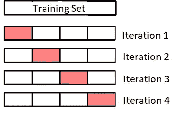

下面的交叉验证步骤是从[到这里的](https://elitedatascience.com/machine-learning-iteration#micro)进行的，在这里添加是为了完整。

## **逐步交叉验证:**

使用 K-fold 交叉验证选择超参数的步骤如下:

1.  将你的训练数据分成 K = 4 等份，或者“折叠”
2.  选择一组您希望优化的超参数。
3.  使用前 3 个折叠的超参数集训练您的模型。
4.  在第四次折叠时评估它，或“保持”折叠。
5.  用相同的超参数集重复步骤(3)和(4) K (4)次，每次保持不同的折叠。
6.  汇总所有 4 次折叠的性能。这是一组超参数的性能指标。
7.  对您希望考虑的所有超参数集重复步骤(2)至(6)。

交叉验证允许我们仅用我们的训练集来调整超参数。这使得我们可以将测试集作为真正不可见的数据集来选择最终模型。

## 结论

我们已经涵盖了机器学习领域的一些关键概念，从机器学习的定义开始，然后涵盖了不同类型的机器学习技术。我们讨论了最常见的回归技术(线性和逻辑)背后的理论，并讨论了机器学习的其他关键概念。

*感谢阅读。*

## 参考

[1][https://medium . com/human-in-a-machine-world/Mae-and-RMSE-metric-is-better-e 60 AC 3 bde 13d](https://medium.com/human-in-a-machine-world/mae-and-rmse-which-metric-is-better-e60ac3bde13d)

[2][https://towardsdatascience . com/ml-notes-why-the-least-square-error-BF 27 FDD 9 a 721](/ml-notes-why-the-least-square-error-bf27fdd9a721)

[3][https://towards data science . com/gradient-descent-algorithm-and-its-variants-10f 652806 a3](/gradient-descent-algorithm-and-its-variants-10f652806a3)

[4][https://elitedata science . com/machine-learning-iteration # micro](https://elitedatascience.com/machine-learning-iteration#micro)