# 机器学习基础—第 1 部分—回归的概念

> 原文：<https://towardsdatascience.com/machine-learning-basics-part-1-concept-of-regression-31982e8d8ced?source=collection_archive---------3----------------------->

Photo by Andre Benz on Unsplash — [https://unsplash.com/photos/cXU6tNxhub0](https://unsplash.com/photos/cXU6tNxhub0)

在这篇文章中，我重温了 Andre Ng 在 coursera 上的《神奇的[机器学习课程》中的学习材料，并对这些概念做了一个概述。除非另有明确说明，否则所有引用都是指本课程的材料。](https://www.coursera.org/learn/machine-learning)

# 目录

*   [定义](https://github.com/DDCreationStudios/Writing/blob/master/2018/articles/MLIntroP1.md#definition)
*   [一元线性回归](https://github.com/DDCreationStudios/Writing/blob/master/2018/articles/MLIntroP1.md#linear-regression-with-one-variable)
*   [模型表示](https://github.com/DDCreationStudios/Writing/blob/master/2018/articles/MLIntroP1.md#model-representation)
*   [成本函数](https://github.com/DDCreationStudios/Writing/blob/master/2018/articles/MLIntroP1.md#cost-function)
*   [梯度下降](https://github.com/DDCreationStudios/Writing/blob/master/2018/articles/MLIntroP1.md#gradient-descent)
*   [多元线性回归](https://github.com/DDCreationStudios/Writing/blob/master/2018/articles/MLIntroP1.md#linear-regression-with-multiple-variables)
*   [特征缩放和均值归一化](https://github.com/DDCreationStudios/Writing/blob/master/2018/articles/MLIntroP1.md#feature-scaling-and-mean-normalization)
*   [学习率](https://github.com/DDCreationStudios/Writing/blob/master/2018/articles/MLIntroP1.md#learning-rate)
*   [多项式回归](https://github.com/DDCreationStudios/Writing/blob/master/2018/articles/MLIntroP1.md#polynomial-regression)
*   [正规方程(用于分析计算)](https://github.com/DDCreationStudios/Writing/blob/master/2018/articles/MLIntroP1.md#normal-equation-for-analytical-computing)
*   [逻辑回归](https://github.com/DDCreationStudios/Writing/blob/master/2018/articles/MLIntroP1.md#logistic-regression)
*   [分类](https://github.com/DDCreationStudios/Writing/blob/master/2018/articles/MLIntroP1.md#classification)
*   [适应的成本函数和梯度下降](https://github.com/DDCreationStudios/Writing/blob/master/2018/articles/MLIntroP1.md#adapted-cost-function-and-gradient-descent)
*   [梯度下降的替代方案](https://github.com/DDCreationStudios/Writing/blob/master/2018/articles/MLIntroP1.md#alternatives-to-gradient-descent)
*   [多类分类](https://github.com/DDCreationStudios/Writing/blob/master/2018/articles/MLIntroP1.md#multiclass-classification)
*   [过拟合问题和正则化的使用](https://github.com/DDCreationStudios/Writing/blob/master/2018/articles/MLIntroP1.md#problem-of-overfitting-and-the-use-of-regularization)
*   [正规化](https://github.com/DDCreationStudios/Writing/blob/master/2018/articles/MLIntroP1.md#regularization)

# 定义

> *如果计算机程序在 T 中的任务上的性能(如 P 所测量的)随着经验 E 而提高，则称该程序从关于某类任务 T 和性能测量 P 的经验 E 中学习。—汤姆·米切尔*

# 一元线性回归

# 模型表示

线性回归试图将点拟合到由算法生成的直线上。该优化线(模型)能够预测某些输入值的值，并且可以绘制出来。

# 价值函数

我们希望设置参数，以实现预测值和实际值之间的最小差异。

> *我们可以通过使用成本函数来衡量假设函数的准确性。这是假设的所有结果与 x 的输入和 y 的实际输出的平均差(实际上是一个更好的平均版本)。*

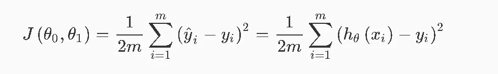

# 梯度下降

梯度下降不断改变参数以逐渐降低成本函数。随着每一次迭代，我们将更接近最小值。每次迭代时，参数必须同时调整！“步长”/迭代的大小由参数α(学习速率)决定。

> *我们这样做的方法是对成本函数求导(函数的切线)。切线的斜率是该点的导数，它会给我们一个前进的方向。我们沿着下降速度最快的方向逐步降低成本函数。*

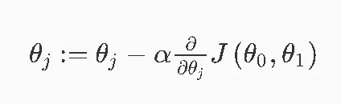

选择α的值至关重要。如果它太小，算法将很慢，如果它太大，它将无法收敛。

当具体应用于线性回归的情况时，可以导出新形式的梯度下降方程，其中 m 是训练集的大小。同样，两个参数必须同时更新。

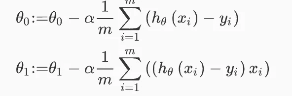

> *注意，虽然梯度下降通常易受局部极小值的影响，但我们在此提出的线性回归优化问题只有一个全局最优值，没有其他局部最优值；因此梯度下降总是收敛(假设学习率α不太大)到全局最小值。*

# 多元线性回归

现在，我们有多个特征/变量，而不是一个特征/变量负责某个结果。

因此，假设相应地改变，并考虑多个参数。这同样适用于梯度下降。它只是附加参数的扩展，这些参数必须更新。

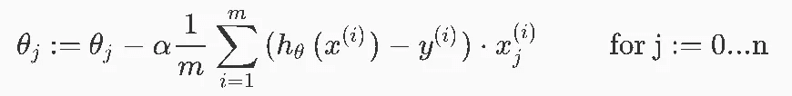

# 特征缩放和均值归一化

要确保所有的要素值都在相同的范围内并具有相同的平均值，有必要使用要素缩放和平均值归一化。

> *特征缩放包括将输入值除以输入变量的范围(即最大值减去最小值)，从而得到一个仅为 1 的新范围。均值归一化包括从某个输入变量的值中减去该输入变量的平均值，从而得出该输入变量的新平均值正好为零。*

# 学习率

为了选择一个合适的学习率，必须绘制梯度下降图并进行“调试”。

> *在 x 轴上绘制迭代次数的曲线图。现在绘制梯度下降迭代次数的成本函数 J(θ)。如果 J(θ)增加，那么你可能需要减少α。*

如果 J(0)在迭代步骤中停止显著下降，则可以宣布收敛。

# 多项式回归

可以通过将假设函数重新定义为二次、三次或平方根函数来改善特征。

在这种情况下，必须特别强调特征缩放！

# 正规方程(用于分析计算)

法线方程将导数设置为零，而不是使用梯度下降来逐渐最小化成本函数。

正规方程不需要学习率α，根本不需要迭代，但需要设计矩阵的转置。当您有大量的要素(例如 10000)时，计算将比梯度下降的迭代过程花费更长的时间。为了提高法方程算法的质量，应该正则化特征并删除冗余特征。

# 逻辑回归

# 分类

为了对数据进行分类，结果应该是 0 或 1(二进制分类)。从回归的角度来看，这可能意味着将大于等于 0.5 的输出分类为 1，将小于 0.5 的输出分类为 0(而 0.5 是决策界限)。

使用 logistic/sigmoid 函数，修改后的假设现在是:

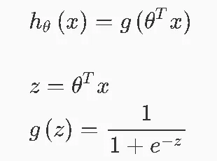

它返回输出为 1 的概率！

# 适应的成本函数和梯度下降

由于使用了 sigmoid 函数，因此必须通过使用对数来相应地调整成本函数。因为现在的目标不是最小化与预测值的距离，而是最小化假设的输出与 y (0 或 1)之间的距离。

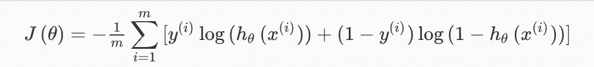

或者对于矢量化实现:

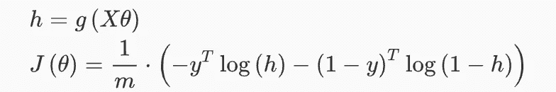

然而，梯度下降保持不变，因为公式使用了假设的导数部分！

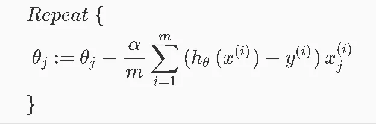

或者对于矢量化实现:

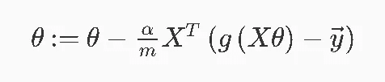

# 梯度下降的替代方案

更复杂的优化算法，如

*   共轭梯度，
*   BFGS 或
*   左旋 BFGS

通常允许更快的计算，而不需要选择学习速率α。

# 多类分类

先前描述的分类问题解决仅适用于二元分类。具有多于 n=2 的可能结果称为多类分类。为了在多个类别上应用该概念，使用了“一个对所有”方法，其本质上是在每个类别上应用二元分类(一个类别是正面的，所有其余的是负面的)。不是将 y 设置为 0 或 1，而是将 y 设置为 I，这本身是针对所有其他类进行测试的。基本上这个过程是双重的:

1.  将逻辑分类器设置为 y。(如果 y 是 3，我们创建 3 个分类器)
2.  针对所有分类器测试新输入，并选择概率最高的分类器。

# 过拟合问题和正则化的使用

在过度拟合的情况下，模型完美地捕获了数据结构，而在欠拟合的情况下，模型没有捕获足够的数据结构(即模型的图形几乎不接触所有的数据点)。

为了解决过度拟合的问题，可以减少特征或者调整它们的值的大小。

# 正规化

为了正则化模型，必须将参数(λ)添加到成本函数中。它减小或增大了参数θ。

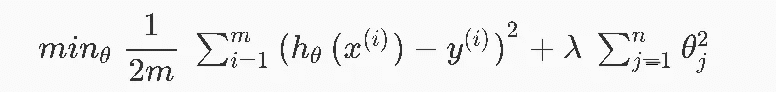

因此，将其应用于逻辑回归看起来像这样:

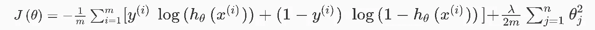

请注意正则化参数如何从 1 开始，而不是正则化[偏置项θ0](https://stackoverflow.com/questions/2480650/role-of-bias-in-neural-networks)。

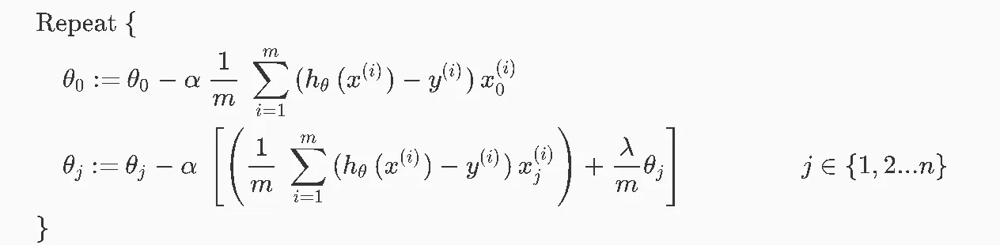

这就结束了第一部分。在下一篇中，将描述神经网络。敬请期待！

# 关于

丹尼尔是一名企业家、软件开发人员和商业法毕业生。他曾在各种 IT 公司、税务咨询、管理咨询和奥地利法院工作。

他的知识和兴趣目前围绕着编程机器学习应用程序及其所有相关方面。从本质上说，他认为自己是复杂环境的问题解决者，这在他的各种项目中都有所体现。

如果您有想法、项目或问题，请不要犹豫与我们联系。

你可以在 https://www.buymeacoffee.com/createdd[上支持我](https://www.buymeacoffee.com/createdd)

连接到:

*   [LinkedIn](https://www.linkedin.com/in/createdd)
*   [Github](https://github.com/Createdd)
*   [中等](https://medium.com/@createdd)
*   [推特](https://twitter.com/_createdd)
*   [Instagram](https://www.instagram.com/create.dd/)
*   [createdd.com](https://www.createdd.com/)