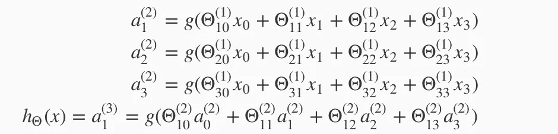
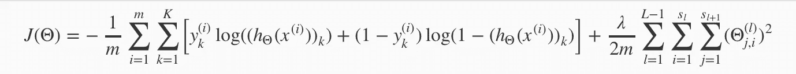
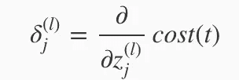
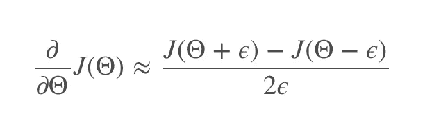
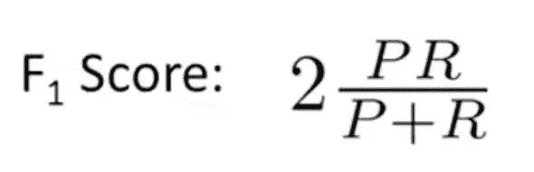

# 机器学习基础—第 2 部分—神经网络的概念以及如何调试学习算法

> 原文：<https://towardsdatascience.com/machine-learning-basics-part-2-concept-of-neural-networks-and-how-to-debug-a-learning-algorithm-8a5af671d535?source=collection_archive---------1----------------------->

Photo by Matteo Catanese on Unsplash — [https://unsplash.com/photos/PI8Hk-3ZcCU](https://unsplash.com/photos/PI8Hk-3ZcCU)

在这篇文章中，我重温了 Andre Ng 在 coursera 上的惊人的[机器学习课程的学习材料，并创建了一个概念概述。除非另有明确说明，否则所有引用都是指本课程的材料。](https://www.coursera.org/learn/machine-learning)

# 目录

*   [-神经网络模型表示](https://github.com/DDCreationStudios/Writing/blob/master/2018/articles/MLIntroP2.md#neural-networks-model-representation)
*   [-神经网络中的成本函数](https://github.com/DDCreationStudios/Writing/blob/master/2018/articles/MLIntroP2.md#cost-function-in-neural-networks)
*   [反向传播](https://github.com/DDCreationStudios/Writing/blob/master/2018/articles/MLIntroP2.md#backpropagation)
*   [展开参数](https://github.com/DDCreationStudios/Writing/blob/master/2018/articles/MLIntroP2.md#unrolling-parameters)
*   [梯度检查](https://github.com/DDCreationStudios/Writing/blob/master/2018/articles/MLIntroP2.md#gradient-checking)
*   [随机初始化](https://github.com/DDCreationStudios/Writing/blob/master/2018/articles/MLIntroP2.md#random-initialization)
*   [-训练神经网络的清单](https://github.com/DDCreationStudios/Writing/blob/master/2018/articles/MLIntroP2.md#checklist-on-training-a-neural-network)
*   [-调试学习算法](https://github.com/DDCreationStudios/Writing/blob/master/2018/articles/MLIntroP2.md#debugging-a-learning-algorithm)
*   [评估假设](https://github.com/DDCreationStudios/Writing/blob/master/2018/articles/MLIntroP2.md#evaluate-the-hypothesis)
*   [型号选择](https://github.com/DDCreationStudios/Writing/blob/master/2018/articles/MLIntroP2.md#model-selection)
*   [偏差和方差](https://github.com/DDCreationStudios/Writing/blob/master/2018/articles/MLIntroP2.md#bias-and-variance)
*   [学习曲线和集合的大小](https://github.com/DDCreationStudios/Writing/blob/master/2018/articles/MLIntroP2.md#learning-curves-and-the-size-of-a-set)
*   [总结](https://github.com/DDCreationStudios/Writing/blob/master/2018/articles/MLIntroP2.md#summary)
*   [——设计机器学习系统](https://github.com/DDCreationStudios/Writing/blob/master/2018/articles/MLIntroP2.md#designing-a-machine-learning-system)
*   [倾斜的阶级和分类](https://github.com/DDCreationStudios/Writing/blob/master/2018/articles/MLIntroP2.md#skewed-classes-and-classification)
*   [高精度](https://github.com/DDCreationStudios/Writing/blob/master/2018/articles/MLIntroP2.md#high-accuracy)

# 神经网络模型表示

对于神经网络，我们从探索统计回归中获得发现，并试图将其放入类脑架构中。

所使用的术语略有变化，因为逻辑函数通常被称为 sigmoid 激活函数，而θ参数被称为权重。基本概念保持不变。代替[偏置项θ0，现在使用值为 1 的偏置单位。](https://stackoverflow.com/questions/2480650/role-of-bias-in-neural-networks)

神经网络架构由至少 3 层组成。即

*   输入，
*   隐藏的，
*   输出

层。(尽管许多神经网络有不止一个隐藏层)

在激活单元中，重新计算和重新测量前一层中每个单元的加权输入。你可以说，神经网络基本上可以通过越来越多的高级输入多次实现统计回归的概念。

当然，这个概念也可以通过矢量化来应用。因此，我们使用一个新的变量，它包含了 g 函数中的权重参数，作为一个激活单元。这里跟踪和可视化矩阵的维度非常重要，因为它会很快变得非常复杂(取决于你的神经网络结构)。

看看这篇令人难以置信的文章，它用漂亮的图片很好地解释了这个概念。

一个很好的介绍例子是异或问题。[这篇文章](https://medium.com/@jayeshbahire/the-xor-problem-in-neural-networks-50006411840b)解释的很好。

# 神经网络中的成本函数

对于要在神经网络中使用的逻辑回归，成本函数必须被扩展以保持输出单位 K，并且正则化部分需要层数、当前层中的节点数(加上偏置项)和下一层中的节点数，以正确地定位θ值。

逻辑回归的成本函数:

神经网络中逻辑回归的成本函数；

# 反向传播

> “反向传播”是神经网络术语，用于最小化我们的成本函数，就像我们在逻辑和线性回归中使用梯度下降一样。

前向传播(节点的激活)接收前一层中每个节点的θ参数，而反向传播基本上相反。通过将激活节点的输出与该节点的计算输出进行比较来计算每个节点的误差。之后，通过调整所使用的参数θ，该误差逐渐最小化。

计算误差的公式为:

# 展开参数

因为一些更高级的算法需要计算的矢量化版本。将矩阵展开成向量是计算成本函数、获取计算参数的向量并将结果重新成形为矩阵的一种很好的方式。

# 梯度检查

为了确保你的反向传播按预期工作，你应该检查你的梯度。这是通过用下面的公式计算θ的近似值来完成的:

如果结果类似于梯度向量，则实现工作正常。

# 随机初始化

为了在神经网络中使用梯度下降，θ的初始值不能是对称的，必须随机初始化。使用对称初始化总是导致相同的学习结果，因为没有提供多样性。

# 训练神经网络的清单

1.  随机初始化权重
2.  实现前向传播以获得假设
3.  计算成本函数以获得误差
4.  实施反向传播以计算偏导数(通过误差优化参数)
5.  应用梯度检查(将反向传播与数值估计进行比较)
6.  禁用渐变检查
7.  使用优化方法最小化具有相应参数的成本函数

# 调试学习算法

有时候学习的算法会产生很大的误差。以下策略有助于您进行调试。

# 评估假设

你总是可以采取的第一步是获得更多的测试数据，增加或减少特性或你的正则化λ。

之后，将数据分成一个训练集(~70%)和一个测试集(~30%)。这种技术给你即时反馈，告诉你你的假设执行的有多好。

# 型号选择

> *仅仅因为一个学习算法非常适合一个训练集，并不意味着它是一个好的假设。它可能会过度拟合，结果你对测试集的预测会很差。在用于训练参数的数据集上测量的假设误差将低于任何其他数据集上的误差。*
> 
> *给定许多具有不同多项式次数的模型，我们可以使用系统的方法来确定“最佳”函数。为了选择你的假设的模型，你可以测试多项式的每一次，看看误差结果。*

因此，数据可以分为 3 组:

1.  训练集
2.  交叉验证集
3.  测试装置

这允许我们 1。计算最佳参数，2。应用于不同的多项式模型，找出误差最小的一个，3。估计最佳模型的一般误差。

# 偏差和方差

偏差与方差问题描述了假设对数据集拟合不足或拟合过度的问题。高偏差会使数据欠拟合，而高方差会使数据过拟合。

对于诊断，可以比较各组的误差。如果交叉验证和测试集的误差很大，则假设存在很大的偏差。如果交叉验证集显示比训练集高得多的误差，则问题很可能是方差问题。

这些问题可以使用不同的正则化λ参数来解决。

请记住，值为 1 的λ等于完全有偏的假设(欠拟合)，而值为 0 的λ本质上是高方差假设(过拟合)。

为了在实践中应用这一点，创建一个 lambdas 列表(例如，0，0.01，0.02，0.04，0.08，0.16，0.32，0.64，1.28，2.56，5.12，10.24)是有用的，并且当在训练集中的不同多项式模型上工作时提供它们，并且挑选具有最小误差的一个。需要注意的是，在计算交叉验证的误差时，不要再次使用正则化，因为它会扭曲结果。

# 学习曲线和集合的大小

随着集合大小的增加，误差将增加，直到某一点达到稳定。

如果算法受到高偏差的困扰，那么获得更多的数据将不会有所帮助，因为它已经不足。然而，如果问题是一个具有高方差的过拟合问题，获得更多的数据可能会改进算法。

# 摘要

高偏差可以通过以下方式解决

*   添加功能
*   添加多项式要素
*   减小正则化参数λ

高差异可以通过以下方式解决

*   获取更多培训数据
*   减少特征
*   增加正则化参数λ

> 实际上，我们希望选择一个介于两者之间的模型，既能很好地概括，又能合理地拟合数据。

# 设计机器学习系统

人们必须问自己的重要问题:

*   马赫数据应该如何收集？
*   如何开发复杂的功能？什么特征实际上对目标起作用？
*   如何开发有助于减少误解的算法？

设计机器学习系统的推荐方法是

1.  从一个简单的算法开始，在交叉验证数据上进行测试
2.  绘制学习曲线，对下一步要改进的地方做出正确的决定
3.  手动检查错误，看看是什么类型的错误，以及如何改进以避免这些错误

# 倾斜类和分类

当一个类在数据集中出现过多时，就会出现偏斜类。

要测试您的数据是否存在此问题，请实施精度和召回测试。您实际上是在测试所有预测阳性(精度)的真阳性，并将其与所有实际阳性的真阳性进行比较。

根据分类问题的目标，衡量精度和召回率的方式会有所不同。当假设返回 0 或 1 之间的概率时，设定的边界阈值决定是否将结果分类为正面或负面。

往往起点是 0.5，即。低于 0.5 的一切都被归类为负面。根据您是希望非常自信地预测，还是希望避免错过许多情况，测试 0 和 1 的不同值(例如 0.3、0.5、0.7、0.9)并比较结果算法是有意义的。因为您将有 2 个值(一个用于精度，一个用于召回)，所以可以随后使用 F-Score 公式计算所需的阈值:

# 高准确度

为了获得尽可能高的精度，最好使用尽可能多的有用(！)数据(低方差)，但也要有一个具有许多特征或参数的算法(低偏差)。

这就结束了第二部分。下一篇将介绍支持向量机和无监督学习。敬请期待！

# 关于

丹尼尔是一名企业家、软件开发人员和商业法毕业生。他曾在各种 IT 公司、税务咨询、管理咨询和奥地利法院工作。

他的知识和兴趣目前围绕着编程机器学习应用程序及其所有相关方面。从本质上说，他认为自己是复杂环境的问题解决者，这在他的各种项目中都有所体现。

如果您有想法、项目或问题，请不要犹豫与我们联系。

你可以在 https://www.buymeacoffee.com/createdd 支持我

连接到:

*   [领英](https://www.linkedin.com/in/createdd)
*   [Github](https://github.com/Createdd)
*   [中等](https://medium.com/@createdd)
*   [推特](https://twitter.com/_createdd)
*   [Instagram](https://www.instagram.com/create.dd/)
*   [createdd.com](https://www.createdd.com/)