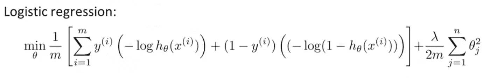
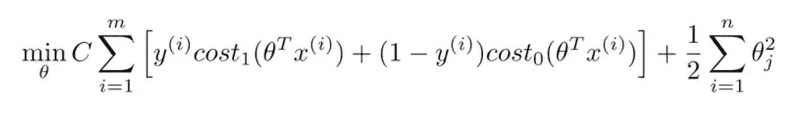
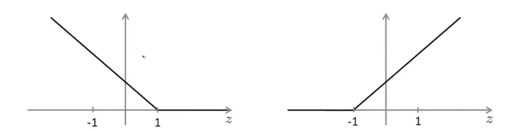
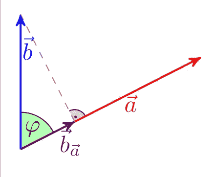
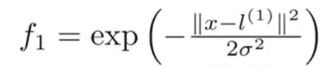
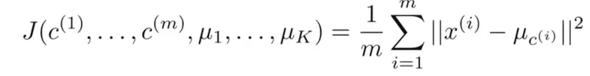
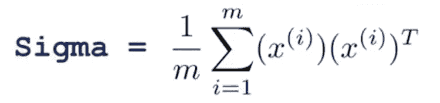
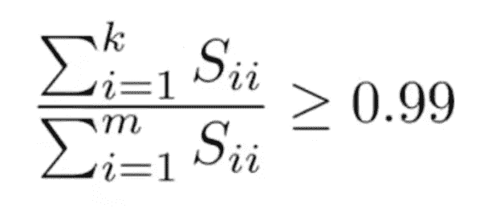

# 机器学习基础—第 3 部分—向量机、无监督学习和主成分分析

> 原文：<https://towardsdatascience.com/machine-learning-basics-part-3-vector-machines-unsupervised-learning-and-principal-component-5b51aac6dd0c?source=collection_archive---------6----------------------->

Photo by Anders Jildén on Unsplash — [https://unsplash.com/photos/cYrMQA7a3Wc](https://unsplash.com/photos/cYrMQA7a3Wc)

在这篇文章中，我重温了 Andre Ng 在 Coursera 上的《神奇的[机器学习课程》中的学习材料，并对这些概念做了一个概述。这篇文章的目的不是作为一个教程，而是更新基本思想。](https://www.coursera.org/learn/machine-learning)

除非另有明确说明，否则所有引用都是指本课程的材料。

# 目录

*   [支持向量机](https://github.com/DDCreationStudios/Writing/blob/master/2018/articles/MLIntroP3.md#support-vector-machines)
*   [-数学定义](https://github.com/DDCreationStudios/Writing/blob/master/2018/articles/MLIntroP3.md#mathematical-definition)
*   [-大幅度分级机](https://github.com/DDCreationStudios/Writing/blob/master/2018/articles/MLIntroP3.md#large-margin-classifier)
*   [-内核](https://github.com/DDCreationStudios/Writing/blob/master/2018/articles/MLIntroP3.md#kernels)
*   [-如何选择地标](https://github.com/DDCreationStudios/Writing/blob/master/2018/articles/MLIntroP3.md#how-to-choose-the-landmarks)
*   [-SVM 参数](https://github.com/DDCreationStudios/Writing/blob/master/2018/articles/MLIntroP3.md#svm-parameters)
*   [-实践技巧以及如何选择正确的系统](https://github.com/DDCreationStudios/Writing/blob/master/2018/articles/MLIntroP3.md#tips-for-practice-and-how-to-choose-the-right-system)
*   [聚类和无监督学习](https://github.com/DDCreationStudios/Writing/blob/master/2018/articles/MLIntroP3.md#clustering-and-unsupervised-learning)
*   [-K-means 算法](https://github.com/DDCreationStudios/Writing/blob/master/2018/articles/MLIntroP3.md#k-means-algorithm)
*   [-优化目标](https://github.com/DDCreationStudios/Writing/blob/master/2018/articles/MLIntroP3.md#optimization-objective)
*   [降维和主成分分析](https://github.com/DDCreationStudios/Writing/blob/master/2018/articles/MLIntroP3.md#dimensionality-reduction-and-principal-component-analysis-pca)
*   [-PCA](https://github.com/DDCreationStudios/Writing/blob/master/2018/articles/MLIntroP3.md#pca)
*   [-实用小贴士](https://github.com/DDCreationStudios/Writing/blob/master/2018/articles/MLIntroP3.md#practical-tips)

# 支持向量机

# 数学定义

不是像我们在原始成本函数中那样用λ正则化第二项:

现在，我们希望用参数 C 正则化第一项，并为转置θ添加新的成本函数(成本 1 和成本 0 ):

绘制成本 1 和成本 0 函数看起来像这样:

因此，如果我们想要一个结果 y = 1，转置 X 必须大于 1，如果 y = 0，转置 X 必须小于-1。

本质上，我们只是简化了成本函数，以便在后续步骤中使用几何图形。

# 大间距分类器

对于可线性分离的数据，SVM 算法会选择具有最大间隔的线来分离这些类。

使用微积分，参数的长度可以很容易地从初始公式中检索出来。

By Martin Thoma — Own work, CC BY 3.0, [https://commons.wikimedia.org/w/index.php?curid=20159892](https://commons.wikimedia.org/w/index.php?curid=20159892)

基本上，向量 X 的投影乘以参数θ的长度，并优化为最大值/最小值。这导致总是返回一条线，看起来将两个类平均分开。

请注意，为了忽略异常值，降低 C 值(正则化)会有所帮助。

# 核

由于多项式特征的计算代价很高，所以通常的做法是引入内核。为此，计算依赖于特征和实例的相似性的新特征。这就像把地标放在地块上，用高斯核公式计算相似度。如果相似度为 1，则训练示例接近所挑选的地标。

对参数σ的值的选择确定了相似性的边界。

引入地标相似性系统允许对非线性数据进行分类。

## 如何选择地标

为了计算界标，我们将成本函数调整为如下:

请记住，对于正则化部分，应该使用 m(训练示例)而不是 n(特征数量)。这是有意义的，因为我们想要计算与示例相关的界标。

还要注意，您也可以在逻辑回归上实现核的概念，但是 SVM 的数学优势不能被正确利用，并且实现可能会更慢。

内核的另一个术语是“相似性函数”。

# SVM 参数

为了解决过拟合和欠拟合问题，可以使用参数λ(单位为 C)和σ。

增加 C(本质上是最小化λ)或减小σ平方可以改善欠拟合(高 C 导致更高的方差)。

# 实践技巧以及如何选择正确的系统

*   使用 SVM 软件包，而不是尝试编写自己的 SVM 计算
*   最常见的核函数是线性核(不使用核)或高斯核
*   还有其他的内核，但是要检查它们是否能够满足“默瑟定理”
*   如果 n 远大于 m，使用逻辑回归或线性核的 SVM
*   如果 n 在 m 的适当范围内，则使用高斯核
*   如果 n 小于 m，则使用具有线性核的逻辑回归或 SVM，或者添加更多特征
*   神经网络对所有这些设置都很有效，但训练起来可能会比较慢

# 聚类和无监督学习

在一个监督学习问题中，给定一组标签来拟合一个假设。相比之下，在无监督学习问题中，我们得到的数据没有任何与之相关的标签。

该算法的目标是在数据集中找到结构(聚类)。

# k-均值算法

简单地说，这个算法是:

*   随机初始化“质心”(数据中间的标记)
*   将最接近数据点的数据点分配给每个质心
*   将质心移动到数据点的中心(平均值)
*   重复前面的 2 个步骤，直到簇中没有变化

## 优化目标

成本函数试图最小化示例点和相应聚类质心位置之间的平方距离的平均值，如下所示:

为了避免局部最优，应多次执行以下步骤:

1.  随机初始化 K-均值
2.  运行 K-means 算法来获得分类的索引和分类质心
3.  计算成本函数

为了选择簇的数量 k，可以使用“肘形方法”，该方法将成本函数绘制成簇的数量，并且在曲线显示“肘形”的地方使用该数量。然而，由于这种方法可能难以在某些图表上使用，另一种方法是根据后续/下游目的(如所需的产品尺寸——小、中、大)简单地选择数字。

# 降维和主成分分析

通过数据压缩将数据从多维减少到二维或三维，可以绘制数据并提供有价值的额外见解。简单地减少数据可以加快学习算法的运行时间，并减少存储所需的空间。

# 主成分分析

最常见的算法是主成分分析。其背后的思想是通过寻找将数据投影到其上的方向(向量)来减少维度，以最小化投影误差。绘制时，该算法可能看起来类似于线性回归模型。然而，重要的是要注意，在线性回归中，变量 y 由变量 x 预测，而在 PCA 中，不同的变量 x 被同等对待。

要实现 PCA 算法，通常需要

1.  执行均值归一化和特征缩放
2.  使用以下公式计算协方差矩阵(sigma)
3.  对 sigma 使用奇异值分解(svd)
4.  将得到的 U 矩阵的前 k 列的转置与应该减少的特征向量 x 相乘，并返回得到的 z 特征向量

为了解压缩数据并利用这一概念的真正力量，可以通过简单地将 U 矩阵再次乘以 z 向量来重构(近似)原始数据。

为了选择变量 k(主成分的数量),可以使用下面的公式:

这个想法是将平均平方投影误差(我们试图将其最小化)除以数据的总变化。

实际的实现是在 k = 1 的情况下尝试 PCA 算法，并测试保留方差的条件是否满足，如果不满足，则应该继续增加 k 的过程。或者取 S 矩阵，它是通过对 sigma 使用奇异值分解并对其进行如下测试而得到的:

(本质上相当于前面的公式)

## 实用技巧

要加速监督学习案例，您应该

1.  仅提取输入(如果为您提供了一个已标记的训练集，则需要一个未标记的训练集)
2.  执行 PCA 算法
3.  通过用新的输入 z 替换先前的 x 来创建新的训练集
4.  用新的数据集训练你的算法

请注意，PCA 应该只用于训练集，而不是交叉验证或测试集。之后，从 x 到 z 的映射结果也可以应用于交叉验证和测试集。

当你的模型有过度拟合的问题时，注意不要使用 PCA。虽然减少特征有助于解决问题，但是 PCA 的概念在不知道 y 值的情况下丢弃了一些信息。这可能导致不好的结果。不如用正则化来代替。

最后，总是尝试用原始数据来训练你的算法。只有在正常的机器学习架构不充分的情况下，才应该应用 PCA！

这就结束了第三部分。在下一篇文章中，*将描述异常检测、推荐系统和扩展问题*。敬请期待！

# 关于

我认为自己是一个解决问题的人。我的强项是在复杂的环境中导航，提供解决方案并分解它们。我的知识和兴趣围绕商业法和编程机器学习应用发展。我在构建数据分析和评估业务相关概念方面提供服务。

连接到:

*   [领英](https://www.linkedin.com/in/createdd)
*   [Github](https://github.com/Createdd)
*   [中等](https://medium.com/@createdd)
*   [推特](https://twitter.com/_createdd)
*   [帕特里翁](https://www.patreon.com/createdd)

# 支持和邮件

