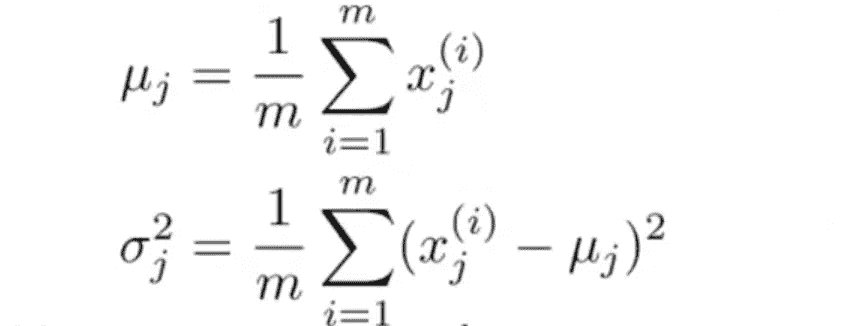
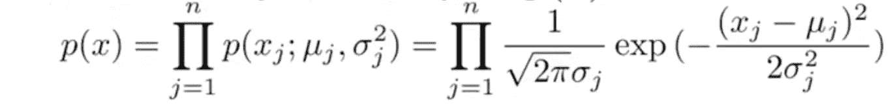
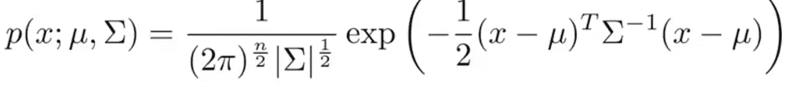
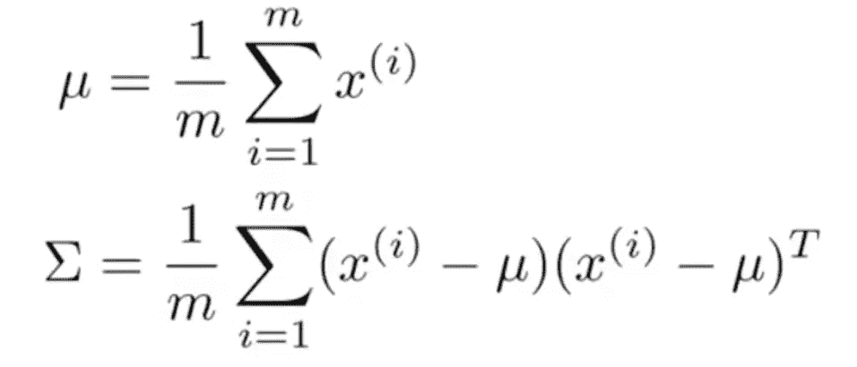
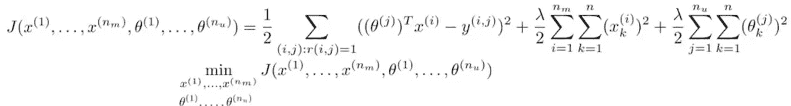
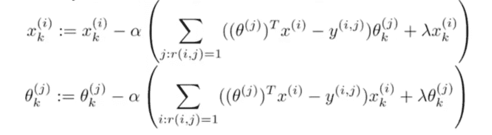
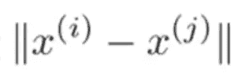
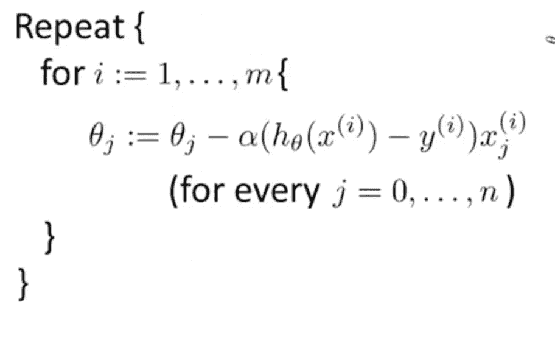
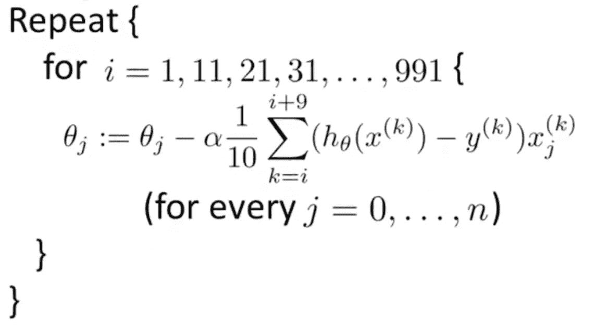

# 机器学习基础—第 4 部分—异常检测、推荐系统和扩展

> 原文：<https://towardsdatascience.com/machine-learning-basics-part-4-anomaly-detection-recommender-systems-and-scaling-b8bbf0413aa9?source=collection_archive---------1----------------------->

Photo by Fahrul Azmi on Unsplash — [https://unsplash.com/photos/vR-Nb0bncOY](https://unsplash.com/photos/vR-Nb0bncOY)

在这篇文章中，我重温了 Andre Ng 在 Coursera 上的《神奇的[机器学习课程》中的学习材料，并对这些概念做了一个概述。这篇文章的目的不是作为一个教程，而是更新基本思想。](https://www.coursera.org/learn/machine-learning)

除非另有明确说明，否则所有引用都是指本课程的材料。

# 目录

*   [异常检测](https://github.com/DDCreationStudios/Writing/blob/master/2018/articles/MLIntroP4.md#anomaly-detection)
*   [-开发异常检测系统](https://github.com/DDCreationStudios/Writing/blob/master/2018/articles/MLIntroP4.md#develop-a-anomaly-detection-system)
*   [-实用技巧和监督学习系统的区别](https://github.com/DDCreationStudios/Writing/blob/master/2018/articles/MLIntroP4.md#practical-tips-and-difference-to-a-supervised-learning-system)
*   [-多元高斯分布](https://github.com/DDCreationStudios/Writing/blob/master/2018/articles/MLIntroP4.md#multivariat-gaussian-distribution)
*   [推荐系统](https://github.com/DDCreationStudios/Writing/blob/master/2018/articles/MLIntroP4.md#recommender-systems)
*   [-使用协同过滤的特征学习](https://github.com/DDCreationStudios/Writing/blob/master/2018/articles/MLIntroP4.md#feature-learning-with-collaborative-filtering)
*   [-进一步用法](https://github.com/DDCreationStudios/Writing/blob/master/2018/articles/MLIntroP4.md#further-usage)
*   [扩展机器学习系统](https://github.com/DDCreationStudios/Writing/blob/master/2018/articles/MLIntroP4.md#scaling-machine-learning-systems)
*   [-随机梯度下降](https://github.com/DDCreationStudios/Writing/blob/master/2018/articles/MLIntroP4.md#stochastic-gradient-descent)
*   [-小批量梯度下降](https://github.com/DDCreationStudios/Writing/blob/master/2018/articles/MLIntroP4.md#mini-batch-gradient-descent)
*   [-收敛测试](https://github.com/DDCreationStudios/Writing/blob/master/2018/articles/MLIntroP4.md#test-for-convergence)
*   [-在线学习](https://github.com/DDCreationStudios/Writing/blob/master/2018/articles/MLIntroP4.md#online-learning)
*   [-Map-reduce 和数据并行](https://github.com/DDCreationStudios/Writing/blob/master/2018/articles/MLIntroP4.md#map-reduce-and-data-parallelism)
*   [在应用程序上使用的技巧](https://github.com/DDCreationStudios/Writing/blob/master/2018/articles/MLIntroP4.md#tricks-for-use-on-applications)
*   [-为你的问题创建一个管道](https://github.com/DDCreationStudios/Writing/blob/master/2018/articles/MLIntroP4.md#create-a-pipeline-for-your-problem)
*   [-获取更多数据](https://github.com/DDCreationStudios/Writing/blob/master/2018/articles/MLIntroP4.md#getting-more-data)
*   [-上限分析](https://github.com/DDCreationStudios/Writing/blob/master/2018/articles/MLIntroP4.md#ceiling-analysis)

# 异常检测

异常检测针对该范围内其他示例的行为测试一个新示例。这种想法通常用于欺诈检测、机器制造或监控。如果目标是检测某些异常值，它总是有用的。

使用高斯分布算法意味着示例 x 分布有均值μ和方差适马平方。

μ和适马平方的公式为:

计算概率的公式是:

构建算法的步骤如下

1.  选择可能代表异常示例的特征 x
2.  计算参数μ和适马
3.  计算 x 的概率 p
4.  根据您设定的概率边界ε进行测试

# 开发一个异常检测系统

当实现该算法时，引入实数评估度量是很重要的。

与往常一样，建议将数据集分为训练集、交叉验证集和测试集(60–20–20)。

建立该系统的步骤如下:

1.  在训练集上拟合模型 p(x)
2.  根据交叉验证和测试集的结果概率预测 y
3.  使用列联表(真阳性、假阳性等)、精确度/召回方法或 F1 分数评估结果
4.  改变ε的值(如有必要)

# 监督学习系统的实用技巧和区别

在以下情况下，应使用异常检测系统

*   有大量的反面例子，但也有少量正面例子
*   异常本身不能被分类，并且在将来的例子中可能变化
*   例如，欺诈检测、监控机器等。

如果分类可以很容易地完成，即有大量的正面和负面的例子，未来的例子将是相似的，建议使用监督学习算法。(例如垃圾邮件、癌症分类)

为了分析误差，有必要绘制特征图，看看它们是否表现为高斯分布。如果没有，可以添加常数(如 log(x))，以尽量使其看起来像高斯分布。

使用异常检测系统的基本假设是异常实例少，正常实例多。如果不满足这一点，则应检查错误分类的示例的行为是否允许提出新的特征。

# 多元高斯分布

在某些情况下，正态高斯分布不足以准确标记异常。多元高斯分布会立即计算 x 的概率模型，而不是单独为每个要素建立概率模型。它使用协方差矩阵，而不是适马平方。

该公式如下所示:

鉴于:

当样本数远大于特征数时，多元高斯模型是值得考虑的。它捕捉特征之间的相关性，但是计算量很大。当很明显什么特征组合可以捕获异常时，建议首先使用原始高斯模型实现这些特征组合。

# 推荐系统

推荐系统是在现实生活中应用机器学习算法的最常见和最成功的实例之一。

假设你有一个基于内容的推荐系统。首先，一个问题必须被公式化。这可能类似于预测某个用户对某个产品的评价。

给定电影的评级，为了学习某个用户的参数θ，优化算法可以看起来像这样:

*   参数θ表示某个用户的向量
*   特征 x 表示电影的向量
*   y 表示某个用户对某部电影的评价
*   n 表示用户的数量

这是为不同用户(θj)总结的具有正则化的平方误差的基本成本函数。

并且使用梯度下降(将学习率α乘以关于优化目标的参数的偏导数)来逐渐最小化结果。注意，k = 0 时的θ0 不应被正则化(如线性回归中所解释的)。

# 基于协同过滤的特征学习

给定特定电影的每个用户的参数θ，电影的特征向量可以用优化算法来估计:

解决首先计算哪个向量(电影的特征向量或用户的参数向量)的问题的一种方法是猜测用户的参数向量，然后使用该估计来定义电影的(更好的)特征向量。

这种实现被称为协同过滤，因为对于用户的每个评级，该算法能够定义更好的电影特征向量，并改善所有用户的输出。

为了同时使用协同过滤(同时更新θ和 x)，可以使用以下公式:

这导致以下梯度下降实现:

要实现这个公式，您必须

1.  用小的随机值初始化所有的θ和 x
2.  使用提供的梯度下降公式最小化成本函数
3.  用参数θ和学习到的特征 x 预测用户的电影评级。

# 进一步使用

在实现协同过滤系统之后，另一个步骤可以是推荐相关的电影/产品。

这很容易做到，因为我们已经计算了特征向量 x。现在要找到相关的电影/产品，我们只需找到距离最小的，比如:

请注意，如果您的用户或电影/产品根本没有评级，您应该在实现学习算法之前执行均值归一化。要实现这一点，首先应该从结果矩阵中减去平均值，然后在预测评级时重新相加。但是你应该经常问自己，向一个完全不确定的单位推荐某样东西是否有意义。

# 扩展机器学习系统

当一个案例有非常多的例子时(大约 1 亿个)，总是问自己是否有可能在保留结果的情况下减少数据集。

一种方法是绘制 m 值范围的学习曲线，并验证当 m 小时算法具有高方差。当 th 算法已经具有高偏差时，增加数据集没有帮助。

# 随机梯度下降

在大的训练集上，梯度下降变得非常计算昂贵。解决这个问题的一个方法是使用随机梯度下降。

不是一次迭代所有训练示例，而是随机打乱数据集，并对单个示例执行梯度下降，如下所示:

这允许改进每个单个示例的参数，因此比一次改进所有示例的参数花费更少的时间。(代价是它可能根本不会收敛，但对于大多数实际用例来说，最终会足够接近)。

# 小批量梯度下降

作为在每次梯度下降迭代中遍历所有示例或仅遍历 1 个示例的中间方式，小批量允许在每次迭代中设置一定数量 b 的示例。调整后的循环可能如下所示:

# 收敛性测试

为了测试小批量或随机梯度下降是否收敛，可以绘制并检查成本函数。

对于小批量梯度下降，迭代次数的成本函数可以直接绘制，而对于随机梯度下降，成本函数(在某个例子上)必须根据多个例子的平均值绘制。

如果算法未能收敛，尝试缓慢降低学习速率α。

# 在线学习

在网上学习的观念中，数据被认为是无穷无尽和免费的。例如在网站上获取用户数据流。在这种情况下，每次可以对一个示例执行梯度下降，次数不限。随着每个输入的例子，算法被改进，并且这样算法也可以根据用户偏好的改变而适应。

# 映射减少和数据并行

另一种处理大型数据集的方法是使用批量梯度下降，但将其分成不同的子集，允许多台机器处理自己的数据集。之后，可以简单地将结果相加，以符合原始公式(基本上使用函数和)。

# 在应用程序上使用的技巧

# 为你的问题创建一个管道

例如

*   检测文本
*   分段字符
*   分类字符

# 获取更多数据

*   尝试通过在你已有的数据集上添加变形来创建额外的数据(人工数据合成)
*   尝试自己收集/标记数据
*   人群来源数据

# 上限分析

通过比较准确度的提高，分析管道中哪些部分值得花费时间进行改进。

第四部分到此结束。多么不可思议的课程！:)

感谢阅读我的文章！欢迎留下任何反馈！

丹尼尔是一名商业法的法学硕士学生，在维也纳担任软件工程师和技术相关活动的组织者。他目前的个人学习努力集中在机器学习上。

连接到:

*   [LinkedIn](https://www.linkedin.com/in/createdd)
*   [Github](https://github.com/Createdd)
*   [中等](https://medium.com/@ddcreationstudi)
*   [推特](https://twitter.com/DDCreationStudi)
*   [钢模](https://steemit.com/@createdd)
*   [哈希节点](https://hashnode.com/@DDCreationStudio)

You can support me on [https://www.buymeacoffee.com/createdd](https://www.buymeacoffee.com/createdd)