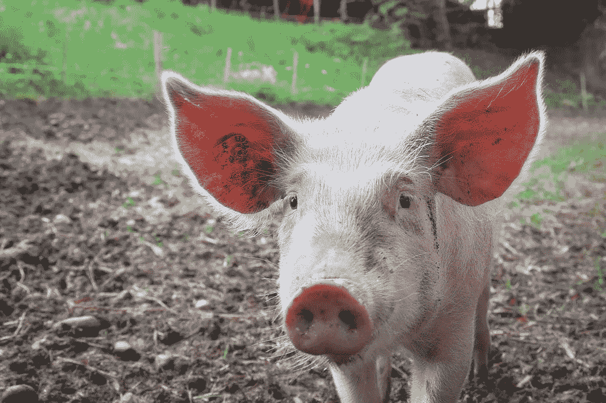
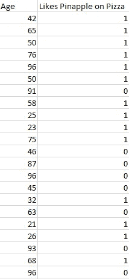
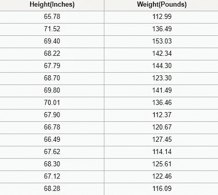
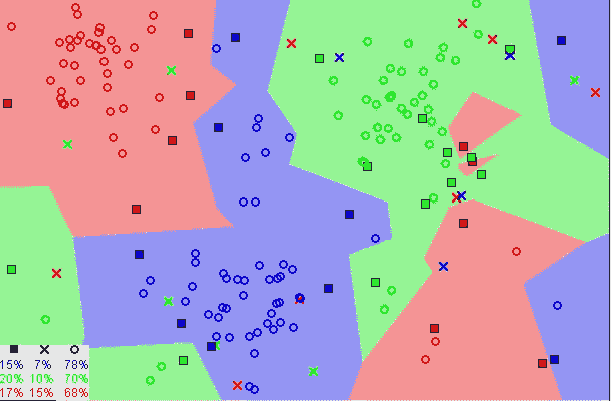
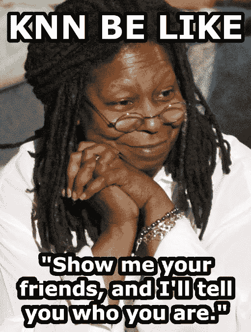

# 基于 K-最近邻算法的机器学习基础

> 原文：<https://towardsdatascience.com/machine-learning-basics-with-the-k-nearest-neighbors-algorithm-6a6e71d01761?source=collection_archive---------0----------------------->

k-最近邻(KNN)算法是一种简单、易于实现的监督机器学习算法，可用于解决分类和回归问题。暂停！让我们打开它。

ABC. We are keeping it super simple!

# 分解它

**有监督的机器学习**算法(与无监督的机器学习算法相反)是一种依靠有标签的输入数据来学习一个函数的算法，当给定新的无标签数据时，该函数产生适当的输出。

想象一台计算机是一个孩子，我们是它的监管人(例如父母、监护人或老师)，我们希望这个孩子(计算机)学习猪的样子。我们将向孩子展示几种不同的图片，其中一些是猪，其余的可以是任何东西的图片(猫、狗等)。

当我们看到猪时，我们会喊“猪！”当它不是猪的时候，我们就喊“不，不是猪！”对孩子这样做几次后，我们给他们看一张图片，问“猪？”而且他们会正确地(大部分时间)说“猪！”或者“不，不是猪！”取决于图片是什么。那就是监督机器学习。

“Pig!”

监督机器学习算法用于解决分类或回归问题。

一个**分类问题**有一个离散值作为它的输出。例如，“喜欢比萨饼上的菠萝”和“不喜欢比萨饼上的菠萝”是不连续的。没有中间地带。上面教孩子识别猪的类比是分类问题的另一个例子。

Image showing randomly generated data

此图显示了分类数据的基本示例。我们有一个预测器(或一组预测器)和一个标签。在图中，我们可能试图根据某人的年龄(预测值)来预测他是否喜欢在披萨上放菠萝(1)或不喜欢(0)。

标准做法是将分类算法的输出(标签)表示为整数，如 1、-1 或 0。在这种情况下，这些数字纯粹是代表性的。不应该对它们进行数学运算，因为这样做没有意义。想一想。什么是“喜欢菠萝”+“不喜欢菠萝”？没错。我们不能将它们相加，所以我们不应该将它们的数值表示相加。

一个**回归问题**的输出是一个实数(一个带小数点的数)。例如，我们可以使用下表中的数据，在给定身高的情况下估计某人的体重。

Image showing a portion of the [SOCR height and weights data set](http://wiki.stat.ucla.edu/socr/index.php/SOCR_Data_Dinov_020108_HeightsWeights)

回归分析中使用的数据看起来与上图中显示的数据相似。我们有一个独立变量(或一组独立变量)和一个因变量(给定我们的独立变量，我们试图猜测的东西)。例如，我们可以说身高是自变量，体重是因变量。

此外，每行通常称为**示例、观察值或数据点**，而每列(不包括标签/因变量)通常称为**预测值、维度、自变量或特征。**

一种**无监督机器学习**算法利用没有任何标签的输入数据——换句话说，没有老师(标签)告诉孩子(计算机)什么时候是正确的，什么时候它犯了错误，以便它可以自我纠正。

监督学习试图学习一个函数，该函数将允许我们在给定一些新的未标记数据的情况下进行预测，而非监督学习则不同，它试图学习数据的基本结构，以便让我们对数据有更多的了解。

# k-最近邻

KNN 算法假设相似的事物存在于附近。换句话说，相似的事物彼此靠近。

> "物以类聚，人以群分."

[Image showing how similar data points typically exist close to each other](https://commons.wikimedia.org/wiki/File:Map1NNReducedDataSet.png)

请注意上图中，大多数时候，相似的数据点彼此接近。KNN 算法取决于这个假设是否足够真实，以使该算法有用。KNN 捕捉到了相似性(有时称为距离、接近度或紧密度)的概念，这与我们童年时可能学过的一些数学有关——计算图表上各点之间的距离。

***注:*** *在继续之前，了解我们如何计算图上点之间的距离是必要的。如果您不熟悉或需要复习如何计算，请通读“* [*两点间距离*](https://www.mathsisfun.com/algebra/distance-2-points.html) *”的全文，然后回来。*

还有其他计算距离的方法，根据我们要解决的问题，有一种方法可能更好。然而，直线距离(也称为欧几里德距离)是一个流行和熟悉的选择。

## KNN 算法

1.  加载数据
2.  将 K 初始化为您选择的邻居数量

3.对于数据中的每个例子

3.1 根据数据计算查询示例和当前示例之间的距离。

3.2 将示例的距离和索引添加到有序集合中

4.按距离从小到大(按升序)对距离和索引的有序集合进行排序

5.从排序的集合中挑选前 K 个条目

6.获取所选 K 个条目的标签

7.如果是回归，返回 K 个标签的平均值

8.如果分类，返回 K 标签的模式

## KNN 实现(从头开始)

## 选择正确的 K 值

为了选择最适合您的数据的 K，我们使用不同的 K 值运行 KNN 算法几次，并选择减少我们遇到的错误数量的 K，同时保持算法在给定以前从未见过的数据时准确做出预测的能力。

以下是一些需要记住的事情:

1.  当我们把 K 值减小到 1 时，我们的预测变得不稳定。只需思考一分钟，想象 K=1，我们有一个由几个红色和一个绿色包围的查询点(我在想上面彩色图的左上角)，但绿色是单个最近邻。合理地说，我们会认为查询点最有可能是红色的，但是因为 K=1，KNN 错误地预测查询点是绿色的。
2.  相反，当我们增加 K 的值时，由于多数投票/平均，我们的预测变得更加稳定，因此，更有可能做出更准确的预测(直到某一点)。最终，我们开始看到越来越多的错误。在这一点上，我们知道我们把 K 值推得太远了。
3.  如果我们在标签中采取多数投票(例如，在分类问题中选择模式)，我们通常将 K 设为奇数，以进行平局决胜。

## 优势

1.  该算法简单，易于实现。
2.  没有必要建立一个模型，调整几个参数，或作出额外的假设。
3.  算法是通用的。它可以用于分类、回归和搜索(我们将在下一节中看到)。

## 不足之处

1.  随着示例和/或预测器/独立变量的数量增加，算法变得明显更慢。

# 实践中的 KNN

随着数据量的增加，KNN 的主要缺点是速度明显变慢，这使得它在需要快速做出预测的环境中是不切实际的选择。此外，还有更快的算法可以产生更准确的分类和回归结果。

然而，如果你有足够的计算资源来快速处理你用来做预测的数据，KNN 仍然可以用来解决那些依赖于识别相似物体的问题。这方面的一个例子是在推荐系统中使用 KNN 算法，这是 KNN 搜索的一个应用。

## **推荐系统**

从规模上看，这就像在亚马逊上推荐产品，在 Medium 上推荐文章，在网飞上推荐电影，或者在 YouTube 上推荐视频。不过，我们可以肯定的是，由于他们处理的数据量巨大，他们都使用了更有效的方式来提出建议。

然而，我们可以使用我们在本文中学到的知识，在较小的规模上复制这些推荐系统中的一个。让我们来构建一个电影推荐系统的核心。

**我们试图回答什么问题？**

给定我们的电影数据集，与电影查询最相似的 5 部电影是什么？

**收集电影数据**

如果我们在网飞、Hulu 或 IMDb 工作，我们可以从他们的数据仓库中获取数据。因为我们不在任何一家公司工作，所以我们必须通过其他途径获取数据。我们可以使用来自 [UCI 机器学习库、](https://archive.ics.uci.edu/ml/datasets/Movie) [IMDb 数据集、](https://www.imdb.com/interfaces/)的一些电影数据，或者煞费苦心地创建我们自己的数据。

**探索、清理和准备数据**

无论我们从哪里获得数据，都可能有一些问题需要我们去纠正，以便为 KNN 算法做准备。例如，数据可能不是算法预期的格式，或者可能有我们应该在将数据传送到算法之前填充或删除的缺失值。

我们上面的 KNN 实现依赖于结构化数据。它需要以表格的形式。此外，该实现假设所有列都包含数字数据，并且数据的最后一列有标签，我们可以对其执行一些功能。因此，无论我们从哪里获得数据，我们都需要使它符合这些约束。

下面的数据是我们清理后的数据的一个例子。该数据包含三十部电影，包括七个流派的每部电影的数据及其 IMDB 评级。labels 列全是零，因为我们没有使用这个数据集进行分类或回归。

Self-made movies recommendation data set

此外，当使用 KNN 算法时，电影之间存在不被考虑的关系(例如，演员、导演和主题)，这仅仅是因为捕获这些关系的数据从数据集中缺失。因此，当我们对我们的数据运行 KNN 算法时，相似性将只基于所包含的电影类型和 IMDB 评级。

**使用算法**

想象一下。我们正在浏览电影 Xb 网站，这是一个虚构的 IMDb 衍生网站，我们遇到了 [*《邮报》*。我们不确定是否想看，但它的类型吸引了我们；我们对其他类似的电影很好奇。我们向下滚动到“更像这样”部分，看看 MoviesXb 会做出什么推荐，算法齿轮开始转动。](https://www.imdb.com/title/tt6294822/?ref_=adv_li_tt)

MoviesXb 网站向其后端发送与帖子最相似的 5 部电影的请求。后端有一个和我们一模一样的推荐数据集。它首先为*帖子*创建行表示(更好地称为**特征向量**),然后运行一个类似于下面的程序来搜索与*帖子*最相似的 5 部电影，最后将结果发送回 MoviesXb 网站。

当我们运行这个程序时，我们看到 MoviesXb 推荐了 *12 年的奴隶*、*钢锯岭*、*卡特威女王*、*风起*、*美丽心灵*。既然我们完全理解了 KNN 算法是如何工作的，我们就能够准确地解释 KNN 算法是如何提出这些建议的。恭喜你！

# 摘要

k-最近邻(KNN)算法是一种简单的监督机器学习算法，可用于解决分类和回归问题。它易于实现和理解，但有一个主要缺点，即随着所用数据的增长，速度会明显变慢。

KNN 的工作方式是找出查询和数据中所有示例之间的距离，选择最接近查询的指定数量的示例(K)，然后投票选择最频繁的标签(在分类的情况下)或平均标签(在回归的情况下)。

在分类和回归的情况下，我们看到为我们的数据选择正确的 K 是通过尝试几个 K 并挑选一个最有效的来完成的。

最后，我们看了一个 KNN 算法如何用于推荐系统的例子，这是 KNN 搜索的一个应用。

KNN Be Like… ”Show me your friends, and I’ll tell you who you are.”

# **补遗**

[1]为了简单起见，本文中实现的 KNN 电影推荐器不处理电影查询可能是推荐数据集的一部分的情况。这在生产系统中可能是不合理的，应该适当地处理。

## 如果你学到了新的东西或者喜欢阅读这篇文章，请鼓掌👏并分享给其他人看。也可以随意发表评论。