# 直觉(还有数学！)在多元梯度下降后面

> 原文：<https://towardsdatascience.com/machine-learning-bit-by-bit-multivariate-gradient-descent-e198fdd0df85?source=collection_archive---------3----------------------->

## 一点一点的机器学习:关于机器学习的小文章

Photo by [Dominik Scythe](https://unsplash.com/photos/Sot0f3hQQ4Y?utm_source=unsplash&utm_medium=referral&utm_content=creditCopyText) on [Unsplash](https://unsplash.com/?utm_source=unsplash&utm_medium=referral&utm_content=creditCopyText)

又见面了！

*机器学习一点一滴*旨在分享我自己在机器学习方面的探索和实验。

在我的[上一篇](https://hackernoon.com/machine-learning-bit-by-bit-univariate-gradient-descent-9155731a9e30)中，我们讨论了:

1.  什么是梯度下降。
2.  它如何在线性回归中有用。
3.  它实际上是如何处理一个简单的一元函数的。

在这篇文章中，我们将扩展我们对梯度下降的理解，并将其应用于一个**多元函数**。

在我看来，这为将梯度下降应用于更复杂的函数提供了一个平滑的过渡，并帮助您巩固梯度下降的知识，这在本系列的下一个主题—线性回归中是必不可少的。

好吧，我们开始吧。

## **多元梯度下降—直觉**

首先，让我们谈谈直觉。对多元函数应用梯度下降实际上意味着什么？

我将试着通过想象来解释这一点:

1.  目标多元函数
2.  梯度下降如何使用它

请记住，梯度下降是一种算法*找到一个函数*的最小值。因此，我们的目标是找到一个函数的最小值，这个函数有多个变量。

在我的上一篇文章中，我们以一元二次函数为例:

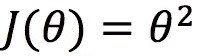

这里是我们今天要看的*二元(两个变量)二次函数*， *J(θ1，θ2)，*:

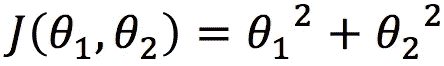

**下面的图 1** 以各种方式显示了 *J(θ1，θ2)*——左边的 **3D 图**(**图 1a** )和中间的**图 1b)** 以及右边的**等高线图(图 1c)** 。等高线图是*在 2D 平面*上表示 3D 函数的一种方式。这就好像你从顶部俯视 3D 图形，并沿着 z 轴挤压它。**图 1b** ，是**图 1a** 的旋转版，应该能给你一些视觉上的直观。

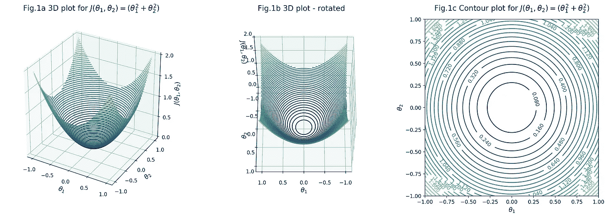

对该函数应用梯度下降时，我们的目标仍然保持不变，只是现在我们有两个参数 *θ1* 和 *θ2* 来优化:

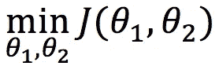

到目前为止一切顺利…

## 更新规则

梯度下降的另一个特点是，它是一个*迭代*算法。因此，它使用更新规则在每次迭代之后系统地和有效地更新参数值。

这是单变量梯度下降的更新规则:

其中 *α* 是**学习率**，而 *dJ(θ)/dθ* 是 J(θ) 的**导数——即在给定 *θ* 处与 *J(θ)* 相切的切线的斜率。**

现在我们有了两个变量，我们需要为每个变量提供一个更新规则:

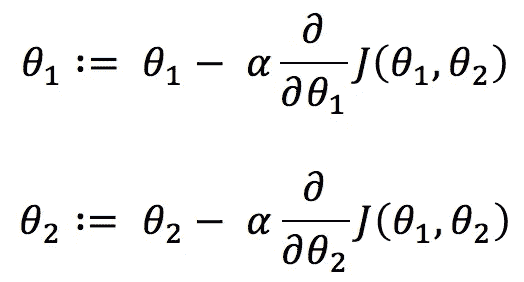

这些方程看起来几乎和一元函数的方程一样。这里唯一的变化是衍生术语，*θ2)/∂θ1 ∂j(θ1*和*θ2)/∂θ2 ∂j(θ1*。但不要被它们吓到。符号 *∂* 而不是 *d* 仅仅意味着它是**偏导数**。

## 偏导数

在偏导数中，就像在正态导数中一样，我们仍然对在给定的 *θ1* 或 *θ2* 处接触 *J(θ1，θ2)* 的切线的*斜率感兴趣……但是这里的*或*是至关重要的。*

本质上，当查看切线时，我们不能同时移动 *θ1* 和 *θ2* 。因此，我们一次只关注一个变量，同时保持其他变量不变。因此，得名*偏*。

我将借助一个图表来更好地解释这一点。让我们把 *θ1* 看成一个变量，保持 *θ2* 不变，换句话说，就是 *θ1* 的一个偏导数。

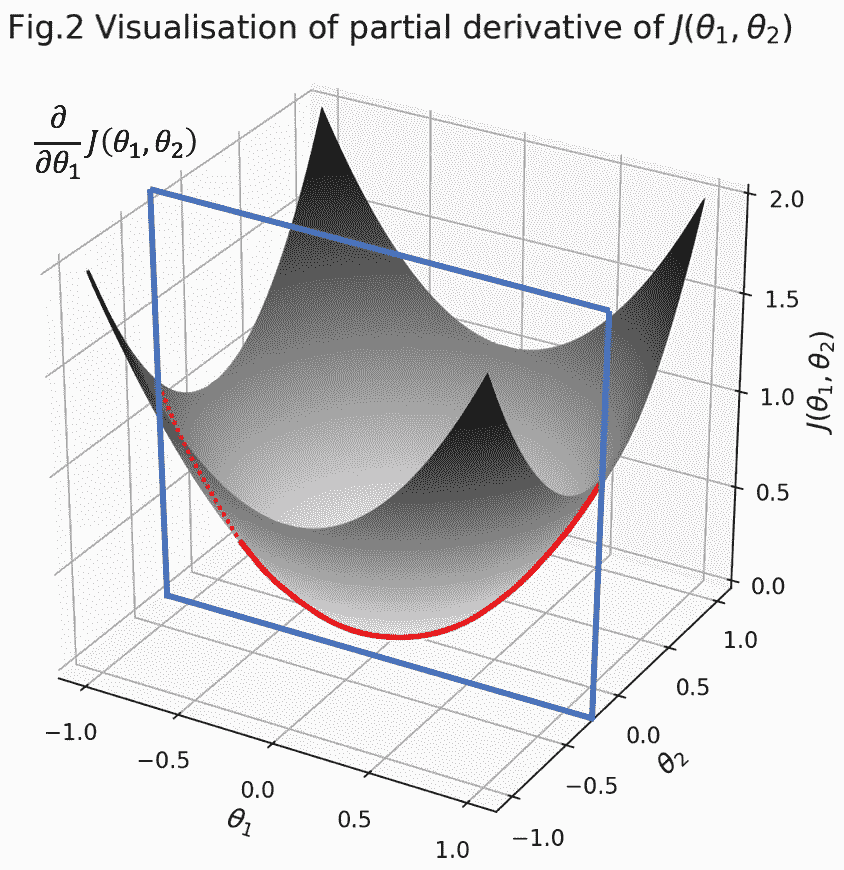

*保持θ2 不变*视觉上翻译过来就是一个 *θ1* - *J(θ1，θ2)* 平面(**图 2 蓝色方块**)以 *θ2 的特定值穿过图形。***图 2 红线**代表 *θ1* - *J(θ1，θ2)* 平面与 *J(θ1，θ2)* 图的交点，成为偏导数中感兴趣的函数。

现在，如果我们沿着红线提取蓝色平面，我们得到的是一个以θ1 为参数的古老的一元函数*，*在 2D 平面*，就像我们在上一篇文章中看到的一样！*

因此，当 *∂θ1* 向零收缩时，我们可以如下计算更新函数中的偏导数项:

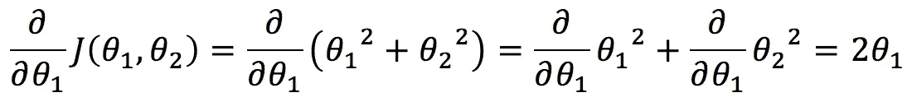

## **偏导数公式的证明(可选)**

上面的等式利用了一个众所周知的偏导数公式，所以它省略了你如何*实际*计算偏导数以达到 *2θ1* 的证明。如果你没有兴趣证明，请跳过这一节。

现在，这是给你的——你有点像我，有一种强迫性的冲动想看看幕后发生了什么…

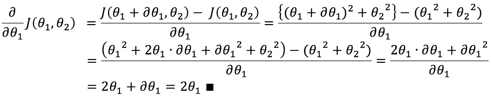

*瞧吧！*

## 同步更新

将相同的逻辑应用于 *θ2* 的部分推导，我们可以将更新规则简化如下:

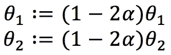

最后但同样重要的是，要提到的是**同时更新**的概念——也就是说，当梯度下降应用于多元函数时，对每个参数的*更新必须同时发生*，而不是顺序发生。

我发现了一个非常直观的描述:

> 一个简单的类比就是走路。你通常不会先走东西向，再走南北向。你走最短的方向，即同时在两个坐标上移动。( [StackExchange](https://math.stackexchange.com/questions/2419301/why-should-we-update-simultaneously-all-the-variables-in-gradient-descent/2419310) )

这实际上意味着，在每次迭代中，我们必须将每个新计算的参数赋给一个临时变量，直到我们计算完所有的参数。使用我们的示例，它看起来像这样:

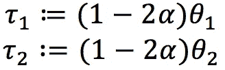

然后，

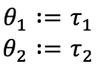

太好了，我们有了拼图的每一部分。

## **动作中的梯度下降**

时候到了！

我们现在可以看到多元梯度下降在起作用，使用 *J(θ1，θ2) = θ1 + θ2* 。我们将使用学习率 *α = 0.2* 和起始值 *θ1 = 0.75* 和 *θ2 = 0.75* 。

**图 3a** 显示了梯度下降如何接近等高线图上 *J(θ1，θ2)* 的最小值。**图 3b** 是 *J(θ1，θ2)* 相对于迭代次数的曲线图，用于监控收敛。

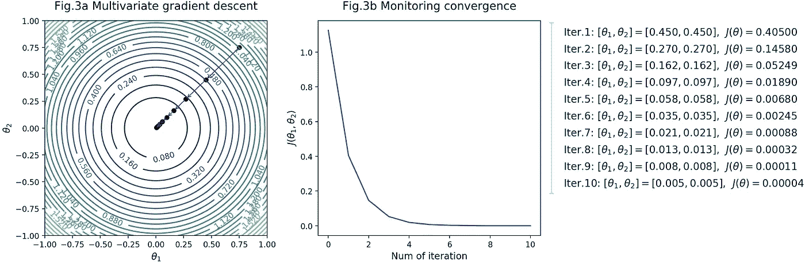

在图图例中可以看到，从第七次迭代到第八次迭代， *J(θ1，θ2)* 减少 *0.00056* ，小于 *10^(-3)* 的阈值，此时我们可以宣告收敛。

因此，我们找到了满足我们目标的参数组合 *θ1 = 0.013* 和 *θ2 = 0.013* 。

## 总结

好的，这次我们看了梯度下降在多元函数中的应用。下一次，我们将最后看看梯度下降在线性回归中的应用。敬请期待！

请发表任何反馈、问题或主题请求。我也希望👏如果你喜欢这篇文章，那么其他人也可以找到这篇文章。

谢谢！

## 机器学习一点一滴系列

1.  [单变量梯度下降](https://hackernoon.com/machine-learning-bit-by-bit-univariate-gradient-descent-9155731a9e30)
2.  [多元梯度下降](https://medium.com/@misaogura/machine-learning-bit-by-bit-multivariate-gradient-descent-e198fdd0df85)

## 资源

 [## 可汗学院

### 免费学习数学、艺术、计算机编程、经济学、物理学、化学、生物学、医学、金融…

www.khanacademy.org](https://www.khanacademy.org/math/multivariable-calculus/multivariable-derivatives/partial-derivative-and-gradient-articles/a/introduction-to-partial-derivatives)  [## Matplotlib 中的三维绘图

### 现在，根据这个参数化，我们必须确定嵌入条带的(x，y，z)位置。想想看，我们…

jakevdp.github.io](https://jakevdp.github.io/PythonDataScienceHandbook/04.12-three-dimensional-plotting.html)  [## NumPy mgrid 与 meshgrid

### meshgrid 函数对于创建坐标数组以在网格上对函数求值进行矢量化非常有用…

louistiao.me](http://louistiao.me/posts/numpy-mgrid-vs-meshgrid/)  [## 如何把传说从剧情中剔除

### 我有一系列的 20 个情节(不是次要情节)要在一个单一的数字。我希望图例在盒子外面…

stackoverflow.com](https://stackoverflow.com/questions/4700614/how-to-put-the-legend-out-of-the-plot/43439132#43439132)  [## 为什么我们要同时更新梯度下降中的所有变量

### 在经典的梯度下降算法中，在每一步迭代中，我们同时更新所有的变量，即

math.stackexchange.com](https://math.stackexchange.com/questions/2419301/why-should-we-update-simultaneously-all-the-variables-in-gradient-descent/2419310)  [## 机器学习-黑客正午

### 在黑客正午阅读关于机器学习的文章。黑客如何开始他们的下午？

hackernoon.com](https://hackernoon.com/tagged/machine-learning)