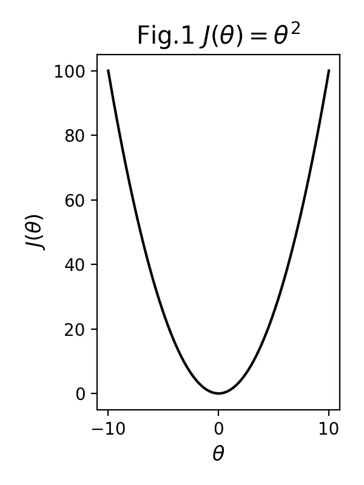
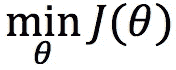
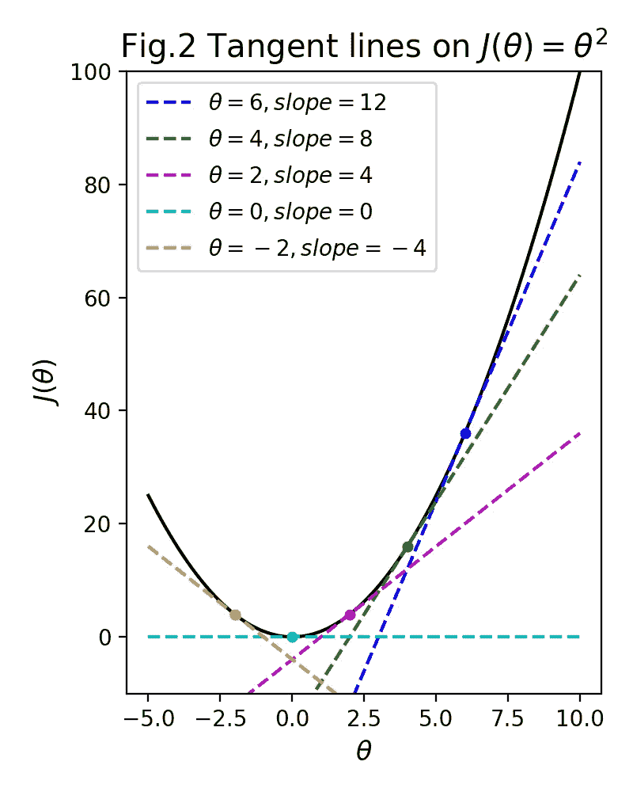
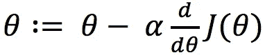
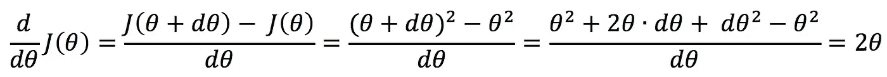
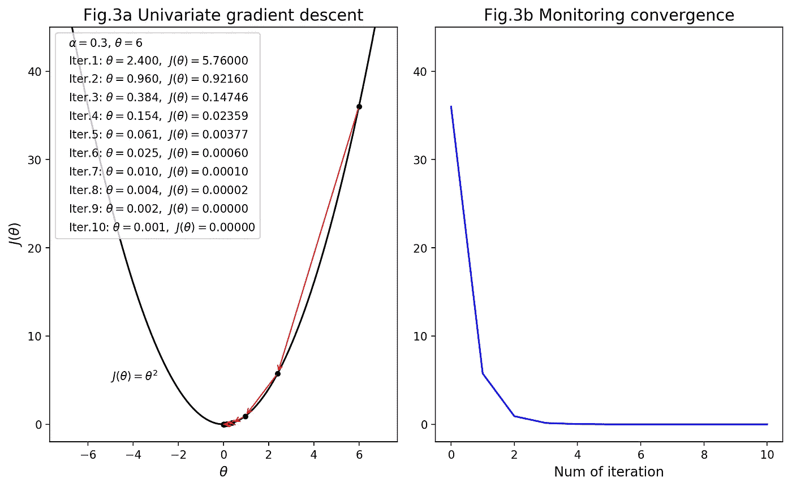
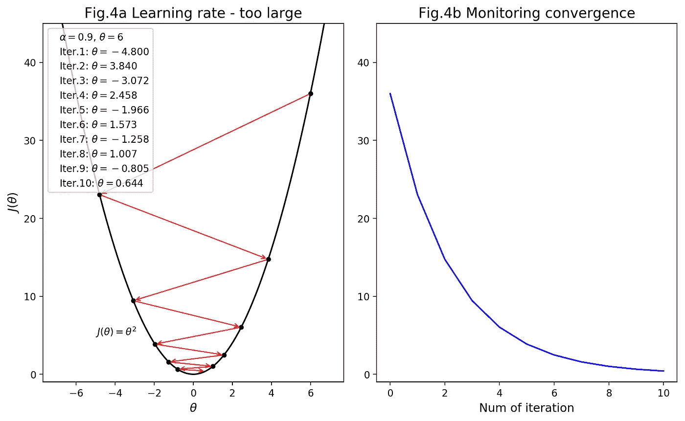
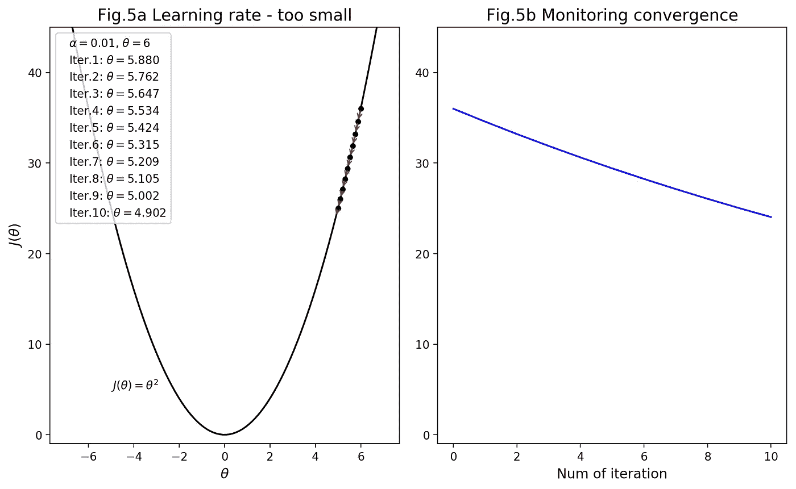

# 直觉(还有数学！)在单变量梯度下降之后

> 原文：<https://towardsdatascience.com/machine-learning-bit-by-bit-univariate-gradient-descent-9155731a9e30?source=collection_archive---------1----------------------->

## 一点一点的机器学习:关于机器学习的小文章

Photo by [Dominik Scythe](https://unsplash.com/photos/Sot0f3hQQ4Y?utm_source=unsplash&utm_medium=referral&utm_content=creditCopyText) on [Unsplash](https://unsplash.com/?utm_source=unsplash&utm_medium=referral&utm_content=creditCopyText)

欢迎光临！

*机器学习一点一滴*旨在分享我自己在机器学习方面的探索和实验。

理解并能够玩转背后的**数学是理解机器学习的关键。它允许我们选择最合适的算法，并根据我们想要解决的问题对其进行量身定制。**

然而，我遇到过许多教程和讲座，其中使用的方程是*根本无法理解的*。所有的符号看起来都很神秘，在被解释的东西和那些方程式之间似乎有一个巨大的鸿沟。我只是不能把所有的点联系起来。不幸的是，当一些知识被假定，重要的步骤被跳过时，数学往往会妨碍理解。

因此，只要有可能，我将展开方程式并避免走捷径，这样每个人都可以跟随我们如何从方程式的左边到达右边。

让我们直接进入有趣的事情吧！

## **什么是梯度下降？**

第一个主题是**梯度下降**——寻找目标函数最小值的迭代算法。

它通常用于**线性回归**中，以找到给定数据的最佳拟合线。通过这样做，我们可以更好地了解数据集的输入和输出之间的关系，更有趣的是，我们能够在给定新输入的情况下以一定的信心预测输出。

在本文中，我们将探索:

1.  什么是线性回归
2.  如何使用成本函数找到最佳拟合线
3.  为什么梯度下降在线性回归中很重要
4.  梯度下降到底是如何工作的

## **线性回归**

监督学习中最常用的模型之一是**线性回归**。

线性回归模型允许你在给定自变量 x(输入)的情况下*预测因变量 y(输出)，假设两个变量之间存在线性关系。*

这里有一些现实生活中的例子，线性回归可以用来找出两个变量之间的关系:

> 身高对体重的影响
> 
> 教育水平对财富的影响
> 
> 降雨量对水果产量的影响
> 
> 血液酒精含量对身体协调性的影响

用更实际的话来说，线性回归的目标是找到一条线(称为**假设**),即*最能代表(符合)数据点*。

但真正的问题是——我们如何知道这种契合有多“好”?

## **成本函数**

事实上，我们用一个**成本函数**来衡量一个假设的适合度。

本质上，成本函数是一个**均方误差(MSE)** —真实值(标签)和从假设中得出的估计值(预测)之间偏差的集合度量。成本函数的*越小，线和数据点之间的偏差越小，因此*的假设*越好。*

因此，我们的目标是*找到一个最小化成本函数*的假设，因为它给了我们一条最佳拟合线。

现在，还记得梯度下降的描述吗？

> 梯度下降是一种寻找函数最小值的迭代算法。

没错，这就是梯度下降在机器学习中发挥作用的地方。我们用它来最小化线性回归中的成本函数，以拟合数据集的直线。

­­­­­­­­

## **梯度下降算法**

话虽如此，梯度下降法并不是专门用来解决线性回归问题的。它是一个通用算法，可以应用于任何一个*可微*函数求其最小值。

为了更好的理解直觉，我们从最简单的例子开始:**单变量梯度下降**。也就是说，梯度下降适用于单变量函数。

## **单变量梯度下降**

让我们定义θ的一元函数 J， *J(θ)* ，如下:

当相对于 *θ* 作图时，函数 *J(θ)* 看起来像**图 1** 。

我们希望找到一个使 *J(θ)* 最小的 *θ* 值:

为了实现这一点，我们需要尝试不同的 *θ* 值，直到 *J(θ)* 达到最小值。通常情况下，我们从 *θ = 0* 开始，但由于在这种情况下，这产生了 *J(θ)* 的最小值，所以假设我们从 *θ = 6* 开始。

在详细研究该算法之前，这里有两个关键问题:

1.  我们如何确定 *J(θ)* 何时达到最小值？
2.  如果 *J(θ)* 不在最小值，我们怎么知道接下来要尝试的 *θ* 的值是多少？

这些问题可以通过对 *J(θ)* 进行**求导来回答——换句话说，计算出在给定 *θ* 处与 *J(θ)* 相交的切线的*斜率*。如果斜率为正，这意味着 *θ* 的值需要在下一次迭代中减小，以接近最小值，而如果斜率为负，则 *θ* 需要增大。**

考虑**图 2** 。由于在 *θ = 6* 处切线的斜率是正的 *(12)* ，我们知道 *θ* 需要减小以接近使 *J(θ) (θ = 0)* 最小的值。另一方面，一条切线在 *θ = -2* 处的斜率为负 *(-4)* ，所以我们知道在下一次迭代中需要增加 *θ* 的值。

同样重要的是，当我们达到最小值 *J(θ)* 时，*斜率变为 0* 。这就是我们如何知道梯度下降何时收敛，即 *J(θ)* 的值接近*足够接近*的最小值。在实践中，如果在一次迭代中 J(θ)的下降小于 10^(-3(= 0.001)，我们宣布收敛*。*

## **更新规则**

现在，我们需要一种系统有效的方法来更新 *θ* ，同时我们寻找一个使 *J(θ)最小的 *θ* 值。*

在梯度下降中，它是通过在每次迭代后自动应用**更新规则**来完成的，因此 *θ* 越来越接近我们的目标值。

单变量函数的更新规则如下:

这里， *α* 称为**学习率**， *dJ(θ)/dθ* 是 *J(θ)* 的**导数——即切线的斜率。**

**学习速率**决定 *θ* 移动的快慢。选择一个好的学习速率是至关重要的，如果它太大，我们可能会跳过它而错过最佳值，甚至可能不会收敛。另一方面，如果它太小，算法收敛将需要太多的迭代。稍后我会用一些视觉辅助来解释这一点。

对于 *J(θ) = θ* ，随着 *dθ* 向零收缩， *J(θ)* 的**导数计算如下:**

由此， *J(θ) = θ* 的更新规则可以简化为*θ:=(1–2α)θ*

## 梯度下降在行动

让我们最后看看梯度下降的作用。

我们将对 *J(θ) = θ* 进行梯度下降，其中 *α = 0.3* ，初始值为 *θ = 6* ( **图 3** )。

第一次迭代后， *θ* 更新为*θ:=(1–2α)θ= 0.4 * 6 = 2.4* 第二次迭代后:*θ:=(1–2α)θ= 0.4 * 2.4 = 0.96*
第三次迭代后:*θ:=(1–2α)θ= 0.4 * 0.96 = 0*

诸如此类…

**Fig.3a** — Steps of gradient descent as it approaches minimum of J(*θ).* ***Fig.3b*** *— A plot of* J(*θ) against the number of iteration, useful to visually monitor convergence.*

最后，从第六次迭代到第七次迭代， *J(θ)* 减少 *0.0005* ，小于 *10^(-3)* 的阈值，此时我们可以宣告收敛。

## 调整学习速度

正如我所承诺的，这里有一些学习率过大或过小的例子，这将帮助你直观地理解为什么选择正确的学习率是至关重要的。

**图 4** 是学习率*过大*时。 *θ* 的值来回振荡跳过最小值，而不是逐渐接近最小值。即使在第十次迭代之后， *θ* 仍然离零很远，并且我们预计 *θ* 会经历更多不必要的曲折，以最终接近 *J(θ)* 的最小值。事实上，在这种情况下，它需要 23 次迭代才能达到收敛。

相反，**图 5** 显示了过小的学习率如何显著减缓收敛。在这个极端的例子中，即使经过 100 次迭代，仍然远离收敛。

希望这证明了监控收敛和相应调整学习速率的重要性。

## 总结

好了，我们讨论了梯度下降的基本应用，使用一元函数作为目标函数。下次讲它在多元函数和线性回归中的应用。

请发表任何反馈、问题或主题请求。我也希望👏如果你喜欢这篇文章，那么其他人也可以找到这篇文章。

谢谢！

## 机器学习一点一滴系列

1.  [单变量梯度下降](https://hackernoon.com/machine-learning-bit-by-bit-univariate-gradient-descent-9155731a9e30)
2.  [多元梯度下降](https://medium.com/@misaogura/machine-learning-bit-by-bit-multivariate-gradient-descent-e198fdd0df85)

## 资源

 [## 梯度下降和线性回归导论

### 梯度下降算法是那些“最成功”的算法之一，可以为解决问题提供一个新的视角…

spin.atomicobject.com](https://spin.atomicobject.com/2014/06/24/gradient-descent-linear-regression/)  [## 梯度下降求导克里斯麦考密克

### 对于线性回归，我们有一个线性假设函数，h(x)= ѳ0+ѳ1*x.我们要找出ѳ0 和ѳ1…的值

mccormickml.com](http://mccormickml.com/2014/03/04/gradient-descent-derivation/)  [## 机器学习的线性回归-机器学习掌握

### 线性回归也许是统计学和机器中最著名和最容易理解的算法之一

machinelearningmastery.com](https://machinelearningmastery.com/linear-regression-for-machine-learning/)  [## 如何在介质上写数学

### 技术作者简明指南

medium.com](https://medium.com/@tylerneylon/how-to-write-mathematics-on-medium-f89aa45c42a0) 

## 修正

【2018 年 12 月 9 日—*“梯度下降在行动”*一节学习率出现错别字。最初写为 *α = 3* ，而正确的值是 *α = 0.3* 。感谢阿尼班·杜塔指出这一点。