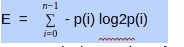
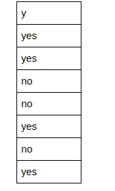
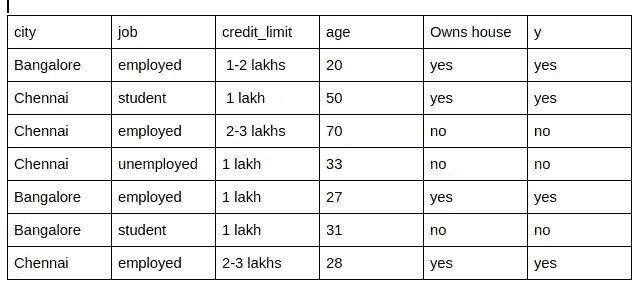
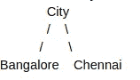
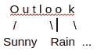

# 机器学习:外行使用 Spark 的决策树

> 原文：<https://towardsdatascience.com/machine-learning-decision-tree-using-spark-for-layman-8eca054c8843?source=collection_archive---------2----------------------->

# 目标

在本文中，我们将回顾决策树的定义、直觉和算法。

然后，我们将编写自己的代码，**而不使用任何 ML 库(如 tensorflow 等)。这将为实施决策树提供很好的理解和实践经验。**

# 什么是决策树

study.com 的定义

决策树是基于特定条件的决策的可能解决方案的图形表示。它被称为决策树，因为它从单个框(或根)开始，然后分支成许多解决方案，就像树一样。

# 直觉

让我们考虑一些访问 ecom 网站的用户的数据。让我们假设我们知道访问网站的用户的概况，如他们的年龄、工作、信用额度等。

该表包含一些销售记录，数据的模式是


*   第一列是购买者来自的城市。
*   第二列“工作”表示采购员正在做的工作。
*   第三列是该人的信用额度
*   第四栏是购买者的年龄

最后一个最重要的列表示用户最终是否购买了任何商品。“是”表示用户购买了商品，“否”表示用户没有购买。

我们想要做的是，基于这些数据，我们想要建立一个决策树来进一步预测任何新用户是否会在网站上购买任何商品。

# 怎么

让我们看看数据，看看四个因素(城市、职业、cc_limit 和年龄)中的哪一个可能会影响用户购买或不购买的决定。

考虑到“年龄”，该属性对于每一行都有不同值。即使对于唯一的输出——“是”和“否”，该属性的值也是随机的。所以我们可以说，年龄肯定不是用户购买产品的决定因素。

但是我们如何从数学上证明年龄不是一个因素，至少不是决定结果的主要因素？让我们看看熵。

# 熵

熵是随机性(或杂质)的量度。在上面的例子中，年龄是最随机的属性。

但是我们如何测量熵呢？测量熵的公式是。这也被称为香农熵



*   n 是值的数量，并且
*   p 是类中的元素数除以总元素数。

让我们深入了解细节。考虑我们上面的样本数据列有结果值



该属性(即 y)的“是”(“是”类)的数量= 4

‘否’的数目(‘否’类)都= 3

元素总数= 7

*   p(0) is =是类中的元素数/元素总数= 4/7
*   p(1)is = no 类中的元素数/元素总数= 3/7

熵=(-4/7 * log2(4/7)-3/7 * log2(3/7))=(-0.57 *-0.81–0.43 *-1.22)=(0.4617+0.5246)= 0.9863

0.9863 是数据的熵。

# 属性的可变性

现在我们知道了基于结果的数据集的熵，我们如何从数学上找出对决策有贡献的最有影响力的顶级属性。这将是我们试图构建的决策树的根。

如上所述,“年龄”不能成为任何顾客做出购买决定的因素，因为我们看到人们的年龄几乎随着每个记录而变化。年龄的太多变化使其成为决策中最不重要的因素，因此反过来，变化最小的属性将是最有影响的属性，或者更确切地说是随着结果而变化的属性？提示，是后者。让我看看。

我们已经有了数据集的熵(杂质),对于上面的例子是 0.9863。所以，我们做下面的工作来获得一个属性的信息增益

*   求每个属性中每个类的熵。在我们的示例中，Eg city 有 2 个班，即班加罗尔和钦奈
*   按比例分配每个类的熵 wrt 数据集类。

对于城市属性

(班加罗尔市的记录总数/记录总数)*班加罗尔熵

(钦奈市的总记录数/总记录数)*钦奈熵

对每个类的上述值求和，并从数据集的熵中减去它

让我们找出班加罗尔城市熵。查一下班加罗尔的记录。其中 2 个有“是”输出，1 个有“否”输出。所以，班加罗尔熵就是

班加罗尔熵=-2/3log2(⅔)—1/3log2(⅓)= 0.39+0.53 = 0.92

同样，Chennai 熵= -2/2log2(2/2) — 2/2log2(2/2) = 0(其完全一致的性质，相等数量的它属于‘是’和‘否’的结果)

因此，城市的信息增益将如上所述= 0.9863 — { (3/7)*0.92 + 0 } = 0.592

# 其他属性

“工作”的信息增益— 0.9863 — { 4/7 *就业熵+ 2/7 *失业熵+ }

类似地，我们也得到“信用额度”的信息增益。

# 特例

让我们添加另一个名为“ownshouse”的属性，它的值随着输出的变化而变化。所以数据集现在看起来像



“拥有房屋”表示客户是否拥有房屋。它与结果属性“y”具有相同的值。让我们调整这个属性的信息增益。

它有两类'是'和'否'。

“是”的熵= — 4/4log2(4/4) — 0(没有属于“否”类的项目)= 0

“否”的熵=—0–3/3 log2(3/3)= 0

“ownshouse”属性的信息增益= 0.9863–0 = 9.9863

刚刚发生了什么？由于该属性的“ownshouse”值的变化与结果完全相同，因此其信息增益与数据集的熵相同。

# 计算了属性的信息增益，接下来呢？

一旦我们有了属性的信息增益

*   我们得到具有最大信息增益的属性
*   将该属性作为树的头
*   获取该属性的值，并创建该标题的这些分支，例如，假设“城市”具有最大信息增益(实际上，在我们的示例中它没有最大增益，但为了讨论起见，假设它)。

总部设在城市，分支机构设在班加罗尔和钦奈



*   在下一次迭代中-从属性列表中移除城市。
*   对于待定属性，获取属于 Bangalore 下分支的每个属性的 city = Bangalore 的记录。
*   计算 Bangalore city 下属性的信息增益，得到增益最大的属性，成为 Bangalore 下的节点。
*   继续这样做，直到我们用尽所有属性或者熵为零。

我还有另一个例子，在最后有代码，它为其他数据集实现了这个逻辑，所以你可以看一下它是如何实现的。

# 我们什么时候停止构建决策树

如上所述，我们在下列情况下停止

*   我们已经经历了所有的属性或
*   找到熵为零的属性。

实际上在我们的特例中，我们在第一次迭代中遇到了熵为零的属性。该属性是“ownshouse”。

# 带代码的完整示例

我们从这里开始动手练习。如果您对编码不感兴趣，那么本文将在这里为您总结。

**使用的工具——pySpark、networkx python lib 来可视化决策树**

代码也在 github 上，网址是[https://github . com/skhurana 333/ml/blob/master/decision _ tree/decision _ tree _ model _ complex . py](https://github.com/skhurana333/ml/blob/master/decision_tree/decision_tree_model_complex.py)

基本上，这个数据集列出了影响网球比赛是否可以在室外进行的条件。描述了前景、温度、湿度和风的值，以及在这些条件下是否玩游戏的结果。我们现在将构建决策树。

```
outlook;temp;humidity;wind;y
Sunny;Hot;High;Weak;no
Sunny;Hot;High;Strong;no
Overcast;Hot;High;Weak;yes
Rain;Mild;High;Weak;yes
Rain;Cool;Normal;Weak;yes
Rain;Cool;Normal;Strong;no
Overcast;Cool;Normal;Strong;yes
Sunny;Mild;High;Weak;no
Sunny;Cool;Normal;Weak;yes
Rain;Mild;Normal;Weak;yes
Sunny;Mild;Normal;Strong;yes
Overcast;Mild;High;Strong;yes
Overcast;Hot;Normal;Weak;yes
Rain;Mild;High;Strong;no
```

假设具有上述数据的文件保存在位置=**/home/me/ml/practice/decision _ tree/datasets/simple _ dataset**

我们将讨论流程和算法

让我们加载数据集。

```
data = sqlContext.read.format('com.databricks.spark.csv').option('header', 'true')\
 .option('delimiter', ';') \ .load("/home/me/ml/practice/decision_tree/datasets/simple_dataset")
```

*   因为它包含 header，所以我们在选项中将 header 设置为 true。
*   分隔符是；
*   它是 csv 格式的。

我们将把它注册为表，因为我们需要用不同的 where 条件查询这个数据集。

```
data.registerTempTable('data')
```

**计算数据集的熵**

获取结果为“是”和“否”的行数。下面是 pyspark 查询

```
played = sqlContext.sql("select * from data WHERE y like '%y%' ").count()notplayed = sqlContext.sql("select * from data WHERE y like '%n%' ").count()
```

因为我们需要获得每个属性的信息增益，并找到具有最大信息增益的属性，所以我们将对所有属性的信息增益计算应用相同的逻辑。创建“流程 _ 数据集”函数。

```
def process_dataset(excludedAttrs, data, played, notplayed, where_condition):
```

*   excludedAtttts 将包含已经处理过的属性列表，因此我们不需要再次处理。
*   数据是该文件的 spark 数据帧
*   比赛时间——计算比赛时间
*   未播放—当比赛未播放时计数
*   Where_condition —用于选择数据的条件，在处理属性时，我们会不断更改此条件

让我们从主函数中调用这个函数，

```
def main(): data = sqlContext.read.format('com.databricks.spark.csv').option('header', 'true')\ .option('delimiter', ';').load("/home/me/ml/practice/decision_tree/datasets/simple_dataset") data.registerTempTable('data') played = sqlContext.sql("select * from data WHERE y like  '%y%' ").count() notplayed = sqlContext.sql("select * from data WHERE y like  '%n%' ").count() process_dataset([], data, played, notplayed, '')
```

**2)加工数据**

Process_dataset 将首先计算数据集的熵，然后获得每个属性的信息增益。

我们将声明全局级变量来存储属性的信息增益。并且还会创建有向图来可视化决策树。

```
attr_name_info_gain = {}G = nx.DiGraph()
```

让我们也声明数据集的模式。我创建了两个变量来存储模式和类型。如果愿意，您可以创建一个并相应地修改后续代码。

```
attrs = ["outlook","temp","humidity","wind"]attrs_type = {"outlook":"string","temp":"string","humidity":"string","wind":"string"}
```

**流程 _ 数据集函数**

```
def process_dataset(excludedAttrs, data, played, notplayed, where_condition): total_elements = played + notplayed subs_info = {"played" : played, "notplayed" : notplayed} entropy = calculate_entropy(total_elements, subs_info) print "entropy is " + str(entropy) global attr_name_info_gain attr_name_info_gain = dict() for attr in attrs: if attr not in excludedAttrs: get_attr_info_gain_data_prep(attr, data, entropy, total_elements, where_condition)
```

它调用 calculate_entropy 函数，然后为每个属性调用 get_attr_info_gain 函数。

**3)计算 _ 熵函数**

```
def calculate_entropy(total_elements, elements_in_each_class): *# for target set S having 2 class 0 and 1, the entropy is -p0logp0 -p1logp1* *# here the log is of base 2* *# elements_in_each_class is a dictionary where the key is class label and the* *# value is number of elements in that class* keysInMap = list(elements_in_each_class.keys()) entropy = 0.0 for aKey in keysInMap: number_of_elements_in_class = elements_in_each_class.get(aKey) if number_of_elements_in_class == 0: continue ratio = number_of_elements_in_class/total_elements entropy = entropy - ratio * np.log2(ratio) return entropy
```

**4)属性信息增益数据准备功能**

```
def get_attr_info_gain_data_prep(attr_name, data, entropy, total_elements, where_condition): if not where_condition:
       attr_grp_y = data.where(col('y') == 'yes').groupBy(attr_name).agg({"y": 'count'})\
           .withColumnRenamed('count(y)','played_count')
   else:
       attr_grp_y = data.where(" y like '%yes%'  " + where_condition).groupBy(attr_name).agg({"y": 'count'})\
           .withColumnRenamed('count(y)','played_count') if not where_condition:
       attr_grp_n = data.where(col('y') == 'no').groupBy(attr_name).agg({"y": 'count'})\
           .withColumnRenamed(attr_name,'n_' + attr_name)\
           .withColumnRenamed('count(y)','not_played_count')
   else:
       attr_grp_n = data.where(" y like '%no%'  " + where_condition).groupBy(attr_name).agg({"y": 'count'})\
           .withColumnRenamed(attr_name,'n_' + attr_name)\
           .withColumnRenamed('count(y)','not_played_count') joined_df = attr_grp_y.join(attr_grp_n, on = [col(attr_grp_y.columns[0]) == col(attr_grp_n.columns[0])], how='outer' )\
       .withColumn("total", col(attr_grp_y.columns[0]) + col(attr_grp_n.columns[0]))\
       .select(attr_grp_y.columns[0], attr_grp_y.columns[1],\
                attr_grp_n.columns[1]) \ gain_for_attribute = calculate_info_gain(entropy, joined_df, total_elements)
   attr_name_info_gain[attr_name] = gain_for_attribute
```

**功能说明**

它从文件中读取数据。当我们构建树时，我们将只需要获得对应于树的那个分支的数据。“where_condition”属性将包含这些谓词。

对于传递的属性名称，我们将文件中结果为“是”的记录分组

*   第一次，where_condition 将为空，
*   第二次迭代之后，在找到树根之后，我们将得到 where_condition

```
if not where_condition:
   attr_grp_y = data.where(col('y') == 'yes').groupBy(attr_name).agg({"y": 'count'})\
       .withColumnRenamed('count(y)','played_count')
else:
   attr_grp_y = data.where(" y like '%yes%'  " + where_condition).groupBy(attr_name).agg({"y": 'count'})\
       .withColumnRenamed('count(y)','played_count')
```

*   类似地，它将文件中结果为“否”的记录分组为传递的属性名。

```
if not where_condition:
   attr_grp_n = data.where(col('y') == 'no').groupBy(attr_name).agg({"y": 'count'})\
       .withColumnRenamed(attr_name,'n_' + attr_name)\
       .withColumnRenamed('count(y)','not_played_count')
else:
   attr_grp_n = data.where(" y like '%no%'  " + where_condition).groupBy(attr_name).agg({"y": 'count'})\
       .withColumnRenamed(attr_name,'n_' + attr_name)\
       .withColumnRenamed('count(y)','not_played_count')
```

*   我们将列 **count(y)** 重命名为 played_count，将 **count(n)** 重命名为 not_played_count
*   将 attr_name 列重命名为 n

```
.withColumnRenamed(attr_name,'n_' + attr_name)\
```

*   现在，我们将这两个数据帧连接起来，一个具有该属性“是”结果的计数，另一个具有同一属性“否”结果的计数

```
joined_df = attr_grp_y.join(attr_grp_n, on = [col(attr_grp_y.columns[0]) == col(attr_grp_n.columns[0])], how='outer' )\
```

我们在属性名上连接。我们需要外部连接，如果一个属性没有“是”或“否”结果的记录，那么我们仍然需要当前的“是”或“否”计数。

此外，由于我们有是和否结果的计数，我们还需要总计数(有是和否的记录总数)来计算熵。因此，我们添加了一个新列，其中包含总数

```
.withColumn("total", col(attr_grp_y.columns[0]) + col(attr_grp_n.columns[0]))\
```

我们不会选择连接列两次

```
.select(attr_grp_y.columns[0], attr_grp_y.columns[1],\
        attr_grp_n.columns[1])
```

我们做了所有这些练习来计算这个特定属性的信息增益，所以让我们来计算一下

```
gain_for_attribute = calculate_info_gain(entropy, joined_df, total_elements)
```

我们将在全局变量 attr_name_info_gain 中保存该属性**的信息增益。**我们稍后将对该字典进行排序，以获得具有最大信息增益的属性。接下来描述调用的 Calculate_info_gain 函数。

```
gain_for_attribute = calculate_info_gain(entropy, joined_df, total_elements)  *#*
 attr_name_info_gain[attr_name] = gain_for_attribute
```

**5)信息增益功能**

```
def calculate_info_gain(entropy, joined_df, total_elements):
   attr_entropy = 0.0
   for anAttributeData in joined_df.rdd.collect():
       yes_class_count = anAttributeData[1]
       no_class_count = anAttributeData[2]
       if yes_class_count is None:
           yes_class_count = 0
       elif no_class_count is None:
           no_class_count = 0 count_of_class = yes_class_count + no_class_count
       *# do the summation part e.g. if age is 56, 60, 45 then its sum of entropy for each of these element*
       classmap = {'y' : yes_class_count, 'n' : no_class_count}
       attr_entropy = attr_entropy + ((count_of_class / total_elements) *\
                                      calculate_entropy(count_of_class, classmap)) gain = entropy - attr_entropy return gain
```

如果您已经阅读了前面的章节，那么这个函数是不言自明的

**6)再次返回主功能**

我们一直处理到这个代码行—->“process _ dataset([]，data，played，notplayed， **''** )”

```
def main():
   data = sqlContext.read.format('com.databricks.spark.csv').option('header', 'true')\
       .option('delimiter', ';').load("/home/me/ml/practice/decision_tree/datasets/simple_dataset") data.registerTempTable('data')
   played = sqlContext.sql("select * from data WHERE y like  '%y%' ").count()
   notplayed = sqlContext.sql("select * from data WHERE y like  '%n%' ").count()
   process_dataset([], data, played, notplayed, '')
   *# sort by info gain*
   sorted_by_info_gain = sorted(attr_name_info_gain.items(), key=operator.itemgetter(1), reverse=True) processed_attrs = []
   max_gain_attr = sorted_by_info_gain[0][0]
   processed_attrs.append(max_gain_attr)
   build_tree(max_gain_attr, processed_attrs, data, '') nx.draw(G, with_labels=True)
   plt.show()
```

对信息增益函数进行排序，得到增益最大的属性，将其作为根节点。现在我们调用构建树函数。这是最后一个也是最重要的功能。

此方法的输入是具有最大信息增益的属性的名称。这将成为树的根节点。我们希望获得该属性的不同值。这些值将成为该节点的分支。

这个函数将递归地构建完整的树。

```
def build_tree(max_gain_attr, processed_attrs, data, where_condition):
   attrValues = sqlContext.sql("select distinct " + max_gain_attr + " from data  where 1==1 " + where_condition)
   orig_where_condition = where_condition for aValueForMaxGainAttr in attrValues.rdd.collect():
       adistinct_value_for_attr = aValueForMaxGainAttr[0]
       G.add_edges_from([(max_gain_attr, adistinct_value_for_attr)]) if attrs_type[max_gain_attr] == "string":
           where_condition = str(orig_where_condition + " and " + max_gain_attr + "=='" + adistinct_value_for_attr + "'")
       else:
           where_condition = str(orig_where_condition + " and " + max_gain_attr + "==" + adistinct_value_for_attr) played_for_attr = sqlContext.sql("select * from data where y like '%yes%' " + where_condition).count()
       notplayed_for_attr = sqlContext.sql("select * from data where y like '%no%' " + where_condition).count()
       *# if either has zero value then entropy for this attr will be zero and its the last attr in the tree*
       leaf_values = []
       if played_for_attr == 0 or notplayed_for_attr == 0:
           leaf_node = sqlContext.sql("select distinct y from data where 1==1 " + where_condition)
           for leaf_node_data in leaf_node.rdd.collect():
               G.add_edges_from([(adistinct_value_for_attr, str(leaf_node_data[0]))])
           continue process_dataset(processed_attrs, data, played_for_attr, notplayed_for_attr, where_condition)
       if not attr_name_info_gain: *# we processed all attributes*
           *# attach leaf node*
           leaf_node = sqlContext.sql("select distinct y from data where 1==1 " + where_condition)
           for leaf_node_data in leaf_node.rdd.collect():
               G.add_edges_from([(adistinct_value_for_attr, str(leaf_node_data[0]))])
           continue *# we are done for this branch of tree* *# get the attr with max info gain under aValueForMaxGainAttr*
       *# sort by info gain*
       sorted_by_info_gain = sorted(attr_name_info_gain.items(), key=operator.itemgetter(1), reverse=True)
       new_max_gain_attr = sorted_by_info_gain[0][0]
       if sorted_by_info_gain[0][1] == 0:
           *# under this where condition, records dont have entropy*
           leaf_node = sqlContext.sql("select distinct y from data where 1==1 " + where_condition)
           *# there might be more than one leaf node*
           for leaf_node_data in leaf_node.rdd.collect():
               G.add_edges_from([(adistinct_value_for_attr, str(leaf_node_data[0]))])
           continue *# we are done for this branch of tree* G.add_edges_from([(adistinct_value_for_attr, new_max_gain_attr)])
       processed_attrs.append(new_max_gain_attr)
       build_tree(new_max_gain_attr, processed_attrs, data, where_condition)
```

**解释**

我们希望节点有不同的值。

```
attrValues = sqlContext.sql("select distinct " + max_gain_attr + " from data  where 1==1 " + where_condition)
```

对于该节点的每个值

```
for aValueForMaxGainAttr in attrValues.rdd.collect():
```

获取该迭代下的属性值

```
adistinct_value_for_attr = aValueForMaxGainAttr[0]
```

将此值添加为节点的分支

```
G.add_edges_from([(max_gain_attr, adistinct_value_for_attr)])
```

我们需要得到这个属性值下的数据。如果树是



我们正在处理父节点的“Sunny”值，然后在同一个分支(outlook -> sunny)下继续，我们需要获得 outlook = sunny 的数据。所以我们把它作为新的 where 条件添加进来。

此外，如果我们需要在引号下添加值时属性类型是 string，而它是 int 类型，那么我们不添加引号。

```
if attrs_type[max_gain_attr] == "string":
           where_condition = str(orig_where_condition + " and " + max_gain_attr + "=='" + adistinct_value_for_attr + "'")
       else:
           where_condition = str(orig_where_condition + " and " + max_gain_attr + "==" + adistinct_value_for_attr)
```

我们将再次从属性列表中找出具有最大信息增益的属性，不包括已经被处理的属性。因此，对于父属性的这个值，我们想知道有多少记录的结果为“是”和“否”

```
played_for_attr = sqlContext.sql("select * from data where y like '%yes%' " + where_condition).count()
notplayed_for_attr = sqlContext.sql("select * from data where y like '%no%' " + where_condition).count()
```

如注释所述，如果我们得到的熵值为零，那么我们就到达了这个分支的叶节点，我们只需将结果添加到这个节点下的树中。

```
*# if either has zero value then entropy for this attr will be zero and its the last attr in the tree*
       leaf_values = []
       if played_for_attr == 0 or notplayed_for_attr == 0:
           leaf_node = sqlContext.sql("select distinct y from data where 1==1 " + where_condition)
           for leaf_node_data in leaf_node.rdd.collect():
               G.add_edges_from([(adistinct_value_for_attr, str(leaf_node_data[0]))])
           continue
```

如果没有，那么我们继续处理。类似下面的代码已经在主函数中处理并解释过了。也许我们应该把这一次迭代也作为这个递归的一部分，让这成为你的练习。

```
process_dataset(processed_attrs, data, subscribed_for_attr, unsubscribed_for_attr, where_condition)
if not attr_name_info_gain: *# we processed all attributes*
   *# attach leaf node*
   leaf_node = sqlContext.sql("select distinct y from data where 1==1 " + where_condition)
   for leaf_node_data in leaf_node.rdd.collect():
       G.add_edges_from([(adistinct_value_for_attr, str(leaf_node_data[0]))])
   continue *# we are done for this branch of tree**# get the attr with max info gain under aValueForMaxGainAttr*
*# sort by info gain*
sorted_by_info_gain = sorted(attr_name_info_gain.items(), key=operator.itemgetter(1), reverse=True)
new_max_gain_attr = sorted_by_info_gain[0][0]
if sorted_by_info_gain[0][1] == 0:
   *# under this where condition, records dont have entropy*
   leaf_node = sqlContext.sql("select distinct y from data where 1==1 " + where_condition)
   *# there might be more than one leaf node*
   for leaf_node_data in leaf_node.rdd.collect():
       G.add_edges_from([(adistinct_value_for_attr, str(leaf_node_data[0]))])
   continue *# we are done for this branch of tree*G.add_edges_from([(adistinct_value_for_attr, new_max_gain_attr)])
processed_attrs.append(new_max_gain_attr)
build_tree(new_max_gain_attr, processed_attrs, data, where_condition)
```

现在，如果我们执行了 main 函数的最后两行，那么您可以直观地看到构建的决策树:-)

```
nx.draw(G, with_labels=True)
plt.show()
```

尽情享受吧！！！如果可能的话，提供关于拼写错误或任何其他此类编辑(没有做任何审查或校对)，关于算法，优化等的反馈。