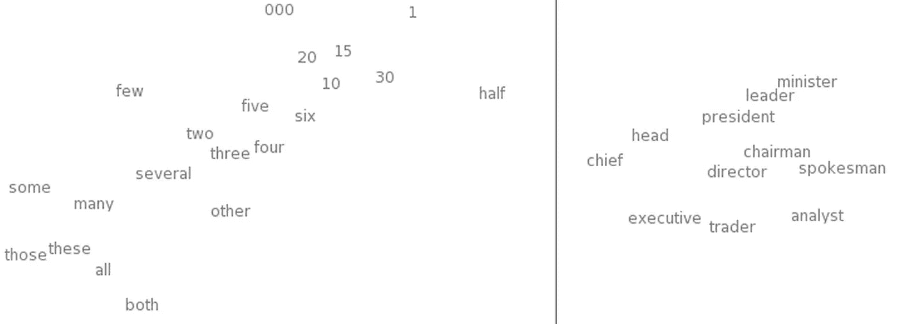
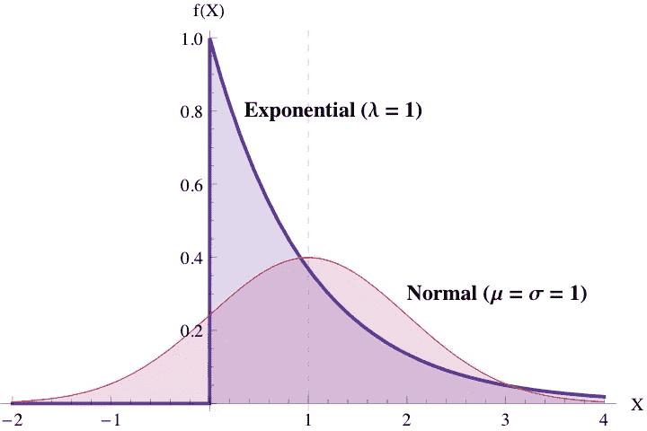

# 机器学习，快与慢

> 原文：<https://towardsdatascience.com/machine-learning-fast-and-slow-eb16b732fb5f?source=collection_archive---------6----------------------->

## 模型的记忆和概括

假设你经营一家名为米其林人的餐厅点评网站。你从用户那里收集了大量评论，并想分析它们是否**连贯**。

一位刚刚在意大利餐厅用餐的用户写道:

> 我喜欢这种调料。

解决这个问题的一个常见方法是在单词级别查看消息。

```
["i", "like", "the", "dressing", "."]
```

## 一般化

你可以从理解每个单词的意思开始，通过在大量文本数据上训练一个模型来生成**单词表示**。[有很多技术可以做到这一点](http://colah.github.io/posts/2014-07-NLP-RNNs-Representations/)，但本质上，一个单词最终将由一个数字向量来表示。

```
like = [.03, -1.45, ..., 0.45, 0.74]
```

因为这些单词表示是在一大组文本(比如整个互联网)中学习的，所以它们是可概括的。换句话说，你可以把单词“like”的意思编码出来，并把它们放在各种其他的上下文中(*例如* SMS 文本、短文写作等)。)而且总体来说，它们会非常合适。

如果您在向量空间中可视化这些表示，您将看到相似的单词将聚集在一起。



Word representations (hence, words) that are similar should be close in vector space. Credit: [Colah](http://colah.github.io/posts/2014-07-NLP-RNNs-Representations/) and [Turian](http://www.iro.umontreal.ca/~lisa/pointeurs/turian-wordrepresentations-acl10.pdf).

假设另一个人写道:

> 我喜欢这种调料。

```
["i", "admire", "the", "dressing", "."]
```

现在，“钦佩”和“喜欢”被认为是同义词。因此，各自的单词表示应该相似。

```
word_similarity("like", "admire") = high
```

太好了！假设单词表示或多或少是自动学习的，这种学习单词之间关系的方法是可扩展的和有用的。

词语表征的概括能力可以扩展到连贯。定义连贯性的一种方法是看一对词在同一语境中是否搭配得很好。一个简单的计算方法是比较一个句子中两个单词的相似度。

因此，从上面的例子中，你可以分离出单词“dressing ”,并检查它是否与单词“like”和“appraise”兼容。

```
word_similarity("like", "dressing") = somewhat highword_similarity("admire", "dressing") = somewhat low
```

这也有道理，“喜欢”比“佩服”更相似。

然而，从上面看不出“钦佩”和“穿着”是否一致。尽管人们赞美一件“衣服”并不是完全不可思议的，但更有可能的是，用户要么是有创意，要么是弄错了。

一般化的弱点是，它经常在一般情况之外失败，*即平均而言*。尽管“表示”这个词有很多含义，但它认为将“钦佩”和“穿着”放在句子中是合理的，因为“喜欢”与“钦佩”和“穿着”都很接近。在当前的设置下，即使是从未出现过的单词也只会显示出些许相似。

## 记住

显示连贯性的一个简单方法是计数。通过统计上面的词对，可以清楚地看出它们以前是否存在过。

在谷歌 Ngram 语料库上快速扫描显示[“赞美着装”在](https://books.google.com/ngrams/graph?content=admire+the+dressing%2C+like+the+dressing&year_start=1800&year_end=2000&corpus=15&smoothing=3&share=&direct_url=t1%3B%2Clike%20the%20dressing%3B%2Cc0)之前从未发生过。

```
counts_in_the_same_sentence("like", "dressing") = somecounts_in_the_same_sentence("admire", "dressing") = none
```

计数基本上没有普遍性，因为你必须记住每一个可能的组合，这需要大量的记忆。但是这一信息是对从单词表示中得出的概括的补充。

从视觉上看，这两种方法的分布非常明显。使用计数方法，绝大多数单词对将为零，而少数单词对将具有指数级的更高计数。相似性一词更为正态分布，尽管通常是右偏的，所以高相似性聚集在一起。



Counts will approximately be an exponential distribution and word similarities will approximately be a normal distribution. Credit: [Gunther](http://perfdynamics.blogspot.com/2012/02/on-accuracy-of-exponentials-and.html).

直观地说，这两种方法在其分布斜率最大的地方具有最强的区分能力。计数在低计数时表现良好，而单词表示在高相似度时表现良好。

将不同的模型混合在一起并不是什么新鲜事。[如果你想赢得单人游戏比赛，组装几乎是必不可少的。](http://mlwave.com/kaggle-ensembling-guide/)

[谷歌最近建立了一个“广度”和“深度”模型](https://research.googleblog.com/2016/06/wide-deep-learning-better-together-with.html)，将记忆和归纳模型动态地结合起来。这只是将模型混合在一起的一种方式，但这是向用户展示他们喜欢什么(记忆)和他们可能喜欢什么(概括)的好方法。