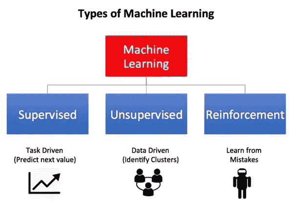
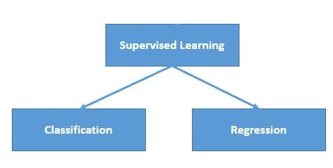
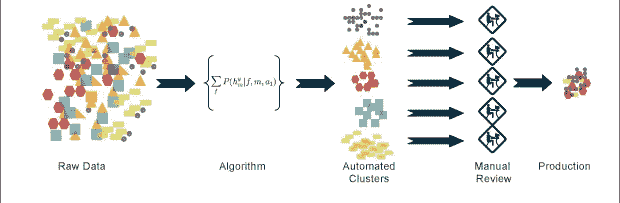
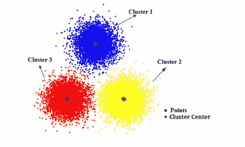
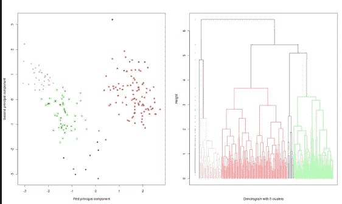
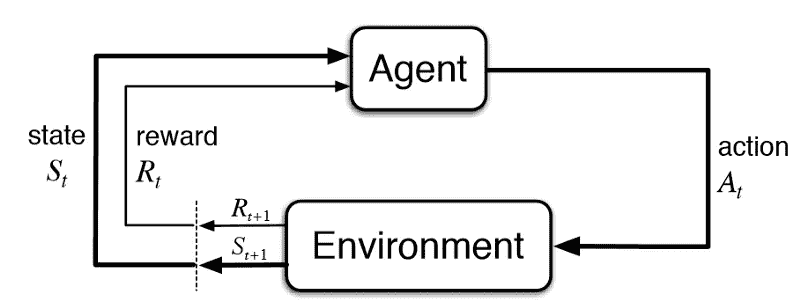
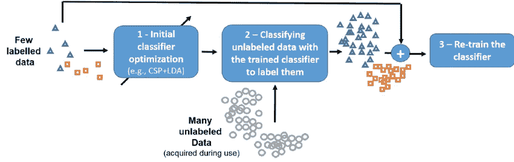
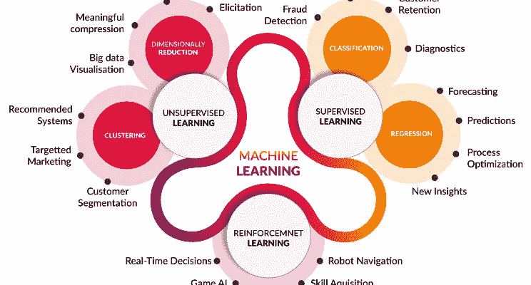

# 面向初学者的机器学习

> 原文：<https://towardsdatascience.com/machine-learning-for-beginners-d247a9420dab?source=collection_archive---------1----------------------->

M 机器学习在 90 年代由 ***亚瑟·塞缪尔*** 定义为，“ ***这是一个研究领域，它赋予计算机自我学习的能力，而无需显式编程*** ”，这意味着将知识灌输给机器，而无需硬编码。

**机器学习主要专注于开发计算机程序，这些程序可以在接触到新数据时教会自己成长和变化。机器学习研究自我学习做事情的算法。通过学习算法，可以更快地处理海量数据。例如，它会对学习完成一项任务、做出准确的预测或表现得聪明感兴趣。**

# **为什么我们需要机器学习**

**数据每天都在增长，不可能以更高的速度和更高的准确性理解所有的数据。超过 80%的数据是非结构化的，即音频、视频、照片、文档、图表等。对于人类大脑来说，在地球上的数据中寻找模式是不可能的。数据非常庞大，计算所需的时间会增加，这就是机器学习发挥作用的地方，以帮助人们在最短的时间内处理大量数据。**

**机器学习是人工智能的一个子领域。通过应用人工智能，我们想要建造更好更智能的机器。这听起来就像一个新生的孩子在自我学习。所以在机器学习中，计算机的一种新能力被开发出来。现在，机器学习出现在如此多的技术领域，以至于我们在使用它时甚至没有意识到它。**

# **机器学习的类型**

**机器学习主要分为三类，如下所示**

****

**Types of Machine Learning**

# **1.监督学习:-**

*****监督学习*** 是第一种机器学习，其中 ***标注为*** 的数据用来训练算法。在监督学习中，使用标记的数据训练算法，其中输入和输出是已知的。我们将数据作为一组输入输入到学习算法中，这些输入被称为特征，由 X 表示，相应的输出由 Y 表示，该算法通过将其实际结果与正确的输出进行比较来发现错误。然后它相应地修改模型。原始数据分为两部分。第一部分用于训练算法，另一部分用于测试训练好的算法。**

****

**Supervised Machine Learning**

**监督学习使用数据模式来预测标签的附加数据的值。这种方法通常用于历史数据预测可能即将发生的事件的应用中。例如:它可以预测何时交易可能是欺诈性的，或者哪个保险客户会提出索赔。**

# **监督学习的类型:-**

**监督学习主要分为以下两个部分**

****

**Types of Supervised Learning**

# **1.1 .回归:-**

*****回归*** 是监督学习的类型，其中使用标记数据，并且该数据用于以连续的形式进行预测。输入的输出总是持续的，图形是线性的。回归是预测建模技术的一种形式，它调查因变量[ ***输出*** ]和自变量[ ***输入*** ]之间的关系。这种技术用于天气预报、时间序列建模、过程优化。例如:回归技术的一个例子是房价预测，房价将根据输入值进行预测，如房间数量、位置、交通便利程度、房龄、住宅面积。**

## **回归算法类型:-**

**机器学习中有许多回归算法，它们将用于不同的回归应用。一些主要的回归算法如下-**

## **1.1.1 .简单线性回归**

**在简单的线性回归中，我们根据第二个变量的评分来预测一个变量的得分。我们预测的变量称为标准变量，记为 y。我们预测的变量称为预测变量，记为 x。**

## **1.1.2 .多元线性回归**

**多元线性回归是回归技术的算法之一，是线性回归分析最常见的形式。作为一种预测分析，多元线性回归用于解释一个因变量与两个或两个以上自变量之间的关系。自变量可以是连续的，也可以是分类的。**

## **1.1.3 多项式回归**

**多项式回归是另一种形式的回归，其中自变量的最大幂大于 1。在这种回归技术中，最佳拟合线不是直线，而是曲线。**

## **1.1.4 .支持向量回归**

**支持向量回归不仅可以应用于回归问题，还可以用于分类的情况。它包含了最大间隔算法的所有特征。线性学习机映射将非线性函数倾斜到高维核诱导特征空间中。系统容量由不依赖于特征空间维数的参数控制。**

## **1.1.5 .岭回归:-**

**岭回归是回归技术中的一种算法。这是一种用于分析多重共线性数据的技术。通过在回归计算中增加一定程度的偏差，可以减少标准误差。净效应将是给出更可靠的计算。**

## **1.1.6 .拉索回归:-**

**套索回归是一种使用收缩的线性回归。收缩是指数据值向中心点收缩，如平均值。lasso 程序鼓励简单、稀疏的模型(即参数较少的模型)。这种特殊类型的回归非常适合于显示高度多重共线性的模型，或者当您想要自动执行模型选择的某些部分时，如变量选择/参数消除。**

## **1.1.7 .弹性网回归:-**

**弹性网回归将 L1 范数(LASSO)和 L2 范数(ridge regression)结合到广义线性回归的惩罚模型中，并赋予其稀疏性(L1)和稳健性(L2)特性。**

## **贝叶斯回归:-**

**贝叶斯回归允许一种合理的自然机制在数据不足或分布不良的情况下生存。它将使您能够将系数放在先验和噪声上，以便先验可以在缺少数据的情况下接管。更重要的是，你可以问贝叶斯回归，它对数据拟合的哪些部分(如果有的话)是有信心的，哪些部分是非常不确定的。**

## **1.1.9 .决策树回归**

**决策树从回归模型中构建一个类似树结构的表单。它将数据分解成更小的子集，同时相关的决策树也在逐步发展。结果是一个有决策节点和叶节点的树。**

## **1.1.10 .随机森林回归**

**随机森林也是回归技术中使用的算法之一，它非常灵活，易于使用机器学习算法，即使没有超参数调整。此外，该算法由于其简单性以及可用于回归和分类任务的事实而被广泛使用。它构建的森林是决策树的集合，大部分时间是用“打包”方法训练的。**

# **1.2 .分类:-**

**分类是一种监督学习类型，其中标记的数据可以使用，并且该数据用于以非连续的形式进行预测。信息的输出并不总是连续的，图形也是非线性的。在分类技术中，算法从提供给它的数据输入中学习，然后使用这种学习来分类新的观察。这个数据集可能仅仅是两类，也可能是多类。分类问题的一个例子是通过训练不同的垃圾邮件单词或电子邮件的算法来检查电子邮件是否是垃圾邮件。**

## **分类算法类型:-**

**机器学习中有许多分类算法，用于不同的分类应用。一些主要的分类算法如下-**

## **1.2.1 .逻辑回归/分类:-**

**逻辑回归属于监督学习的范畴；它通过使用逻辑/sigmoid 函数估计概率来测量与一个或多个自变量分类的因变量之间的关系。逻辑回归一般可以用在因变量是二元或二元的地方。这意味着因变量只能取两个可能的值，如“是或否”、“活的或死的”。**

## **1 . 2 . 2 . k-最近的邻居:-**

**KNN 算法是分类中最简单的算法之一，也是最常用的学习算法之一。一个对象的多数表决通过它的邻居来分类，目的是分配给它的 k 个最近邻居中最常见的类。它还可以用于回归-输出是对象的值(预测连续值)。该值是其 k 个最近邻居的收益的平均值(或中值)。**

## **1.2.3 .支持向量机**

**支持向量机是一种分类器，其中的判别分类器由分离超平面形式定义。该算法输出对新例子进行分类的最佳超平面。在二维空间中，该超平面是将平面分成两部分的线，其中每一类位于两侧。**

## **1.2.4 .核心支持向量机:-**

**核 SVM 算法是用于分类技术的算法之一，它是定义为核的数学函数集。核心的目的是将数据作为输入，并将其转换为所需的形式。不同的 SVM 算法使用不同类型的核函数。这些函数可以是不同的类型。例如线性和非线性函数、多项式函数、径向基函数和 sigmoid 函数。**

## **1.2.5 .朴素贝叶斯**

**朴素贝叶斯是一种分类技术，它基于贝叶斯定理，假设预测器之间是独立的。简而言之，朴素贝叶斯分类器假定一个类中某个特定特征的存在与任何其他函数的存在无关。朴素贝叶斯模型易于构建，对于大规模数据集尤其有用。**

## **1.2.6 .决策树分类**

**决策树以树结构的形式建立分类模型。一个相关的决策树逐渐发展，同时它将一个大的数据集分解成更小的子集。最终结果是一个有决策节点和叶节点的树。决策节点(例如，根)具有两个或更多分支。叶节点代表一个分类或决策。树中对应于最佳预测器的第一个决策节点，称为根节点。决策树可以处理分类数据和数值数据。**

## **1.2.7 .随机森林分类:-**

**随机森林是一种监督学习算法。它创造了一个森林，让它看起来很随意。它构建的木头是一个决策树的集合，它大部分时间用“bagging”方法训练决策树算法，这是一个学习模型的组合，增加了整体结果。**

# **2.无监督学习:-**

**无监督学习是第二种类型的机器学习，其中未标记的数据用于训练算法，这意味着它用于没有历史标签的数据。显示的内容必须由算法计算出来。目的是探索数据并找到其中的一些结构。在无监督学习中，数据是未标记的，原始信息直接输入到算法中，而无需对数据进行预处理，也无需知道数据的输出，并且数据不能分成训练或测试数据。该算法计算出数据，并根据数据段，用新的标签对数据进行聚类。**

****

**Unsupervised Machine Learning**

**这种学习技术对事务性数据非常有效。例如，它可以识别具有相似属性的客户群，然后在营销活动中以相似的方式对待他们。或者它可以找到区分不同客户群的主要品质。这些算法还用于分割文本主题、推荐项目和识别数据异常值。**

# **无监督学习的类型:-**

**无监督学习主要分为以下两个部分**

# **2.1 .聚类:-**

**聚类是一种使用未标记数据的无监督学习，它是将相似的实体分组在一起，然后使用分组的数据进行聚类的过程。这种无监督机器学习技术的目标是找到数据点中的相似性，并将相似的数据点分组在一起，并计算出新数据应该属于哪个聚类。**

## **聚类算法的类型:-**

**机器学习中有许多聚类算法，用于不同的聚类应用。一些主要的聚类算法如下-**

## **2 . 1 . 1 . k-均值聚类:-**

**K-Means 聚类是聚类技术中的一种算法，将相似的数据聚在一个类中。K-means 是一种迭代聚类算法，旨在每次迭代中找到局部最大值。它以 K 作为输入开始，这是您想要看到的组数。在你的空间中的任意位置输入 k 个质心。现在，使用欧几里德距离方法计算数据点和质心之间的距离，并将数据点分配到靠近它的聚类中。重新计算聚类中心，作为附属于它的数据点的平均值。重复，直到没有进一步的变化发生。**

****

**K-Means Clustering showing 3 clusters**

## **2.1.2 .分层聚类:-**

**层次聚类是聚类技术中的一种算法，将相似的数据聚集在一个簇中。这是一种建立聚类层次的算法。这种算法首先将所有数据点分配给它们自己的一组。然后将两个最近的组合并到同一个群中。最后，当只剩下一个簇时，该算法终止。首先将每个数据点分配到其束中。现在，使用欧几里德距离找到该组中最近的一对，并将它们合并到单个聚类中。然后计算两个最近的聚类之间的距离，并进行组合，直到所有项目都聚集成一个聚类。**

****

# **2.2 .降维:-**

**降维是一种无监督学习，通过降低数据的维度来去除输入中不需要的数据。该技术用于移除数据中不需要的特征。它涉及将一组具有大尺寸的数据转换成具有相同数据和小尺寸的数据的过程。这些技术在解决机器学习问题时使用，以获得更好的特征。**

## **降维算法的类型:-**

**机器学习中有许多降维算法，适用于不同的降维应用。一些主要的降维算法如下-**

## **2.2.1 .主成分分析**

**主成分分析是降维算法之一，在这种技术中，它将旧变量转化为一组新变量，这些变量是实变量的线性组合。一组特定的新变量被称为主成分。作为变换的结果，第一个主成分具有最显著的可能方差，并且每个随后的元素在与上述成分正交的约束下具有最高的电势差。仅保留前 m < n 个分量减少了数据维数，同时保留了大部分数据信息，**

## **2.2.2 .线性判别分析**

**线性判别分析是一种降维算法，它也可以创建原始特征的线性组合。然而，与主成分分析不同，LDA 不能最大化解释方差。相反，它优化了类之间的可分性。LDA 可以提高提取特征的预测性能。此外，LDA 还提供了解决特定障碍的变体。**

## **2.2.3 .核心主成分分析:-**

**核主成分分析是降维算法之一，被转换为新集合变量的变量是原始变量的非线性组合，这意味着非线性版本的主成分分析，称为核主成分分析(KPCA)。它能够捕捉部分高阶统计量，从而从原始数据集中提供更多的信息。**

# **3.强化学习:-**

**强化学习是第三种类型的机器学习，其中没有原始数据作为输入，而是强化学习算法必须自己找出情况。强化学习常用于机器人、游戏和导航。通过强化学习，算法通过反复试验发现哪些行为产生了最大的回报。这种类型的培训有三个主要组成部分，即可以描述为学习者或决策者的代理，描述为代理交互的一切的环境，以及代表代理可以做什么的动作。**

****

**Reinforcement Learning**

**目标是让代理采取行动，在给定的时间内最大化预期回报。遵循一个好的策略，代理将更快地达到目标。所以强化学习的目的是学习最佳方案。**

## **强化学习算法的类型:-**

**机器学习中有许多强化学习算法，适用于不同的强化学习应用。一些主要的算法如下-**

## **3.1 . q-学习:-**

**Q-learning 是强化学习的算法之一，其中代理试图从其与环境的通信历史中学习最优策略。一个代理人的记录是一个状态-行动-回报的序列。Q-learning 学习到一个最优策略，不管代理遵循哪个过程，只要它在任何状态下尝试一个动作的次数没有限制。因为无论执行哪种策略，它都会学习到一个最优策略，所以它被称为非策略方法。**

## **3.2 . sarsa[州行动奖励州行动]:-**

**SARSA 是强化学习的算法之一，其中它确定它刷新到动作值。这是 SARSA 和 Q-learning 实现之间的微小差异，但它会产生深远的影响。SARSA 方法采用另一个参数 action2，这是代理从第二个状态执行的操作。它允许代理显式地找到未来的奖励值。接下来，随之而来的，而不是假设最优行动将使用和最显着的奖励。**

## **3.3 .深度 Q-网络:-**

**深度 Q 网络是强化学习的算法之一，虽然 Q 学习是一种非常健壮的算法，但它的主要缺陷是缺乏通用性。如果你把 Q-learning 看作一个二维数组(动作空间*状态空间)中的更新数，实际上，它遵循动态编程。它表明对于 Q 学习代理以前没有见过的状态，它不知道采取哪种动作。换句话说，Q-learning agent 不能估计看不见的状态的值。为了解决这个问题，DQN 通过引入神经网络摆脱了二维数组。**

## **3.4 .马尔可夫决策过程:-**

**马尔可夫决策过程是强化学习的算法之一，其中包含*一组可能的世界状态 S. *一组模型。*一组可能的动作 A. *一个实值奖励函数 R(s，A)。*一个策略马尔可夫决策过程的解。为了实现一个目标，使用了马尔可夫决策过程，这是一个从交互中学习的简单框架。代理人选择动作和对这些动作作出反应的环境，代理人和环境不断地相互作用，并向代理人呈现新的情况。**

## **3.5 . ddpg[深度确定性策略梯度]:-**

**深度确定性策略梯度是强化学习的算法之一，其中它依赖于具有两个同名组件 actor 和 critic 的 actor-critic 设计。参与者用于调整策略功能的参数𝜽，即决定特定状态的最佳操作。还借鉴了 DQN 的分目标网络和经验回放的思想。对于 DDPG 来说，很少进行勘探作业是另一个问题。对此的解决方案是向参数空间或动作空间添加噪声。**

# **4.半监督学习:-**

**半监督学习是第四种类型的机器学习，其中两种类型的原始数据都使用。半监督学习是监督和非监督机器学习的混合。半监督学习用于与监督学习相同的目的，其中它采用标记和未标记数据来训练，通常是少量的标记数据和大量的未标记数据。这种类型的学习可以使用分类、回归和预测等方法。**

****

**Semi-supervised machine learning**

**这种技术很有用，原因有几个。首先，为监督学习标记大量数据的过程通常非常耗时和昂贵。此外，过多的标签会给模型带来人为偏见。这意味着在训练过程中包含大量未标记的数据有助于提高最终模型的准确性，同时减少构建模型所需的时间和成本。**

# **机器学习的应用**

**机器学习在各个领域都有很多用途，其中一些领域包括医疗、国防、技术、金融、安全等。这些领域涉及监督学习、非监督学习和强化学习的不同应用。这些最大似然算法使用的一些领域如下-**

****

> **这个博客是为那些想在机器学习领域起步的初学者而写的，他们需要学习机器学习的所有知识或基础知识，比如什么是机器学习，它的类型，一些重要的算法以及它是如何工作的。**