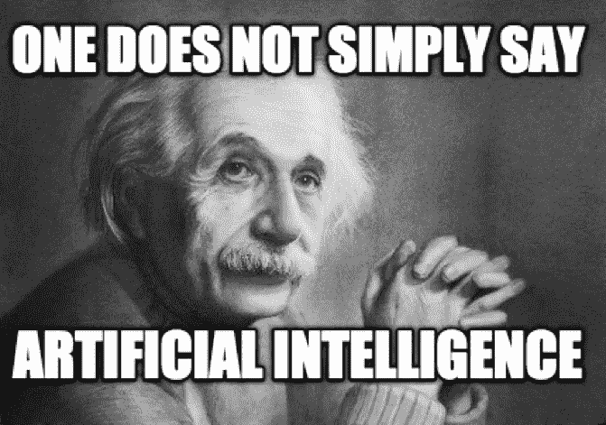
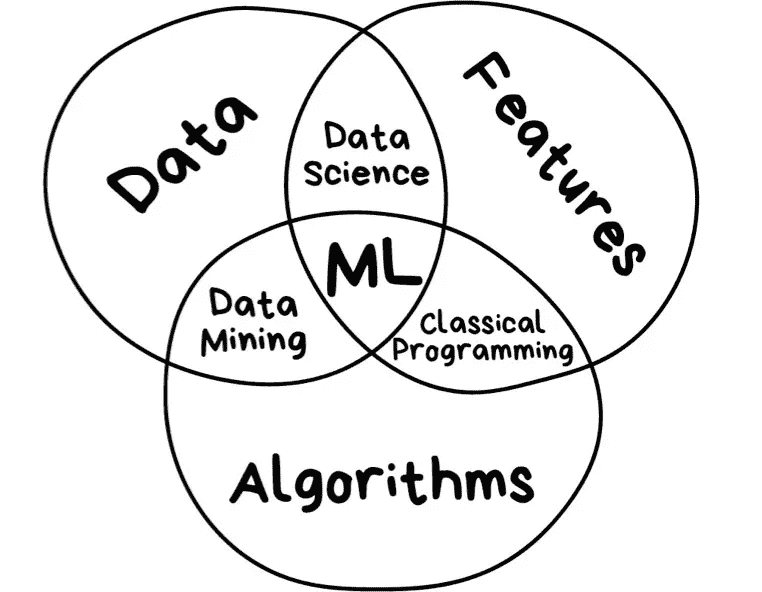
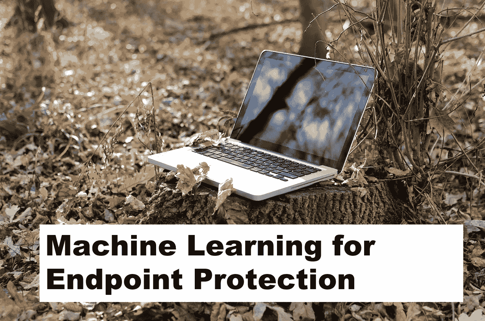
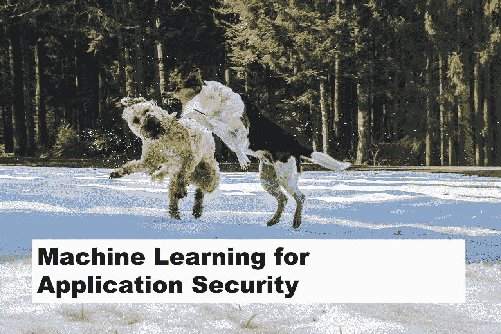
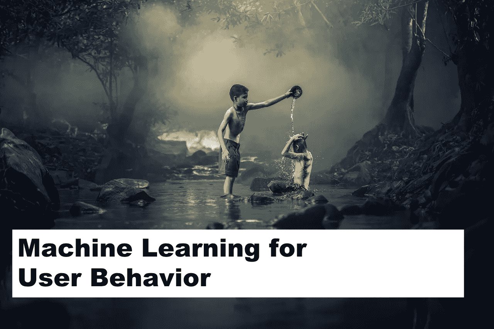
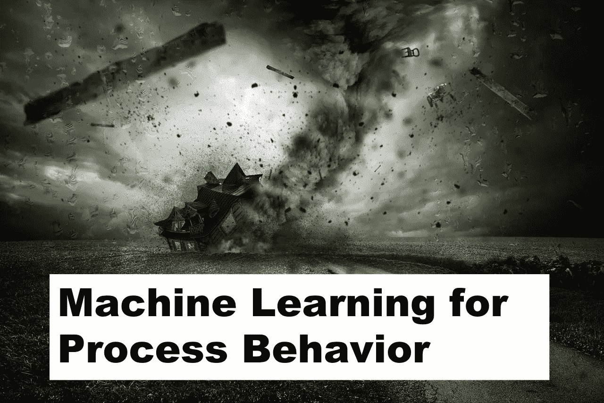
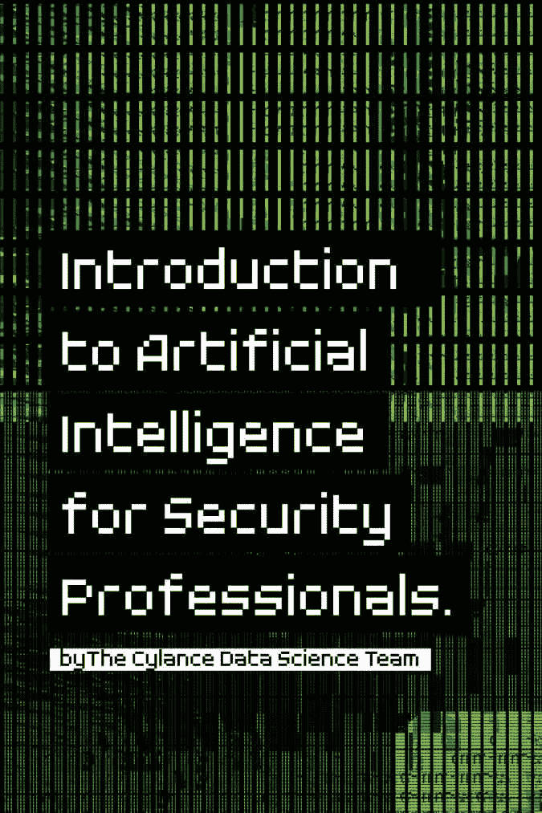
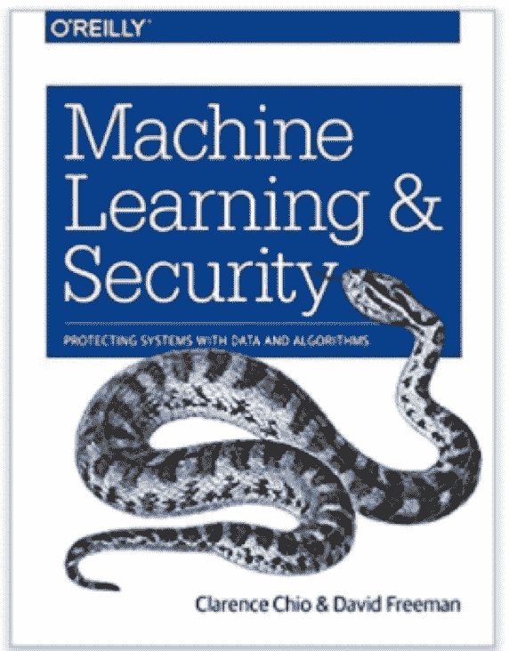
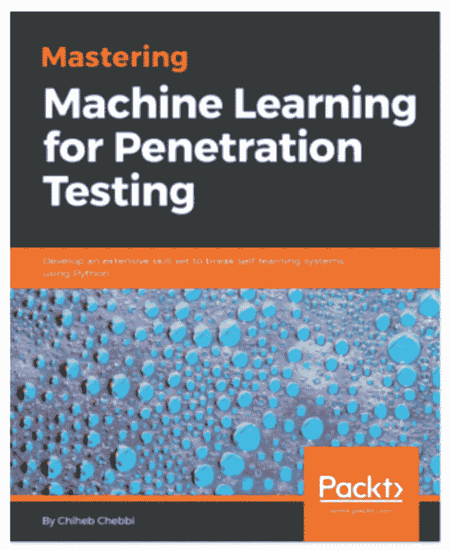
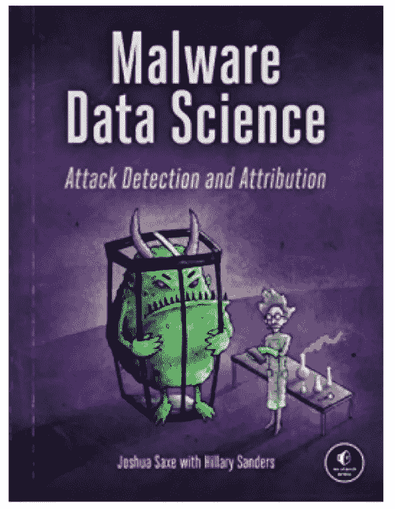

# 网络安全的机器学习 101

> 原文：<https://towardsdatascience.com/machine-learning-for-cybersecurity-101-7822b802790b?source=collection_archive---------1----------------------->

ID 52033957 © Everett Collection Inc. | Dreamstime.com

大量的文章涵盖了用于网络安全的机器学习以及保护我们免受网络攻击的能力。尽管如此，仔细研究人工智能(AI)、机器学习(ML)和深度学习(DL)现在如何帮助网络安全，以及这种炒作到底是怎么回事，仍然很重要。

首先，我要让你失望了。不幸的是，与图像识别或自然语言处理这两个机器学习蓬勃发展的领域相比，机器学习永远不会成为网络安全的银弹。总会有人试图找到系统或 ML 算法的弱点，并绕过安全机制。更糟糕的是，现在黑客能够使用机器学习来实现他们所有的邪恶企图。

***更重要的是，AI 也不能免疫攻击，你可以在这里阅读*******我的新文章。****

*幸运的是，机器学习可以帮助解决最常见的任务，包括回归、预测和分类。在数据量极大，网络安全人才匮乏的时代，ML 似乎是唯一的解决方案。*

*本文是一篇介绍性文章，旨在从技术上理解应用于网络安全的 ML 研究的当前进展和未来方向。*

# *机器学习术语*

*不要把任何东西都叫做“人工智能”——学习术语。*

**

*   *AI(人工智能)——一个宽泛的概念。一门使事物变得智能的科学，或者换句话说，由机器执行的人工任务(例如，视觉识别、NLP 等)。).最主要的一点是，AI 不完全是机器学习或智能的东西。它可以是像边缘检测一样安装在你的机器人吸尘器中的经典程序。粗略地说，人工智能是一种以某种方式执行人类任务的东西。*
*   *ML(机器学习)——人工智能的一种*方法*(只是许多方法中的一种)，它使用一个能够从经验中学习的系统。它不仅旨在实现人工智能目标(例如，复制人类行为)，而且还可以减少简单和困难任务(如股票价格预测)的工作量和/或时间。换句话说，ML 是一个通过使用例子而不是通过编程来识别模式的系统。如果你的系统不断学习，基于数据而不是算法做出决策，并改变其行为，这就是机器学习。*
*   *DL(深度学习)——一套*技术*用于实现机器学习，识别模式的模式——类似图像识别。该系统主要识别物体边缘、结构、物体类型，然后识别物体本身。关键是深度学习并不完全是深度神经网络。还有其他算法，它们被改进以学习模式的模式，例如强化任务中的深度 Q 学习。*

*这些定义表明，网络安全领域主要是指机器学习(而不是人工智能)。很大一部分任务与人类无关。*

*机器学习意味着根据你所拥有的数据，使用一种方法和特定的方法来解决某些任务。*

**

*大多数任务都是最常见任务的子类，如下所述。*

*   *回归(或预测)-根据以前的值预测下一个值的任务。*
*   *分类——将事物分成不同类别的任务。*
*   *聚类-类似于分类，但类别未知，根据相似性对事物进行分组。*
*   *关联规则学习(或推荐)——基于以前的经验推荐某些东西的任务。*
*   *降维——或概括，在多个例子中搜索共同的和最重要的特征的任务。*
*   *生成模型——基于先前的分布知识创建某物的任务。*

*除了这些任务之外，还有不同的方法。某些任务只能使用一种方法，但其他任务可以有多种方法。*

# *解决 ML 任务的方法*

*过去的趋势:*

*   ***监督学习**。任务驱动法。首先，你应该给数据贴上标签，就像给一个模型提供可执行文件的例子，然后说这个文件是不是恶意软件。基于这些标记的数据，模型可以对新数据做出决策。缺点是标记数据的限制。*
*   ***汇编学习。**这是监督学习的扩展，同时混合不同的简单模型来解决任务。组合简单模型有不同的方法。*

*当前趋势*

*   ***无监督学习。**数据驱动方法。当没有带标签的数据时，可以使用该方法，并且模型应该基于属性以某种方式自己标记它。通常，它旨在发现数据中的异常，通常被认为是更强大的，因为几乎不可能标记所有数据。目前，它的工作不如监督方法精确。*
*   ***半监督学习。**顾名思义，当有一些标记数据时，半监督学习试图结合监督和非监督方法的优点。*

*未来趋势(嗯，可能)*

*   ***强化学习**。当行为应该以某种方式对变化的环境做出反应时，可以使用环境驱动的方法。这就像一个孩子在通过试错来学习环境。*
*   ***主动学习**。它更像是强化学习的一个子类，可能会成长为一个独立的类。主动学习就像一个老师，除了环境变化之外，还可以帮助纠正错误和行为。*

# *机器学习任务和网络安全*

*让我们看看可用于解决机器学习任务的不同方法的示例，以及它们如何与网络安全任务相关联。*

# *回归*

*回归(或预测)很简单。利用关于现有数据的知识来了解新数据。以房价预测为例。在网络安全中，它可以应用于欺诈检测。特征(例如，可疑交易的总量、位置等。)确定欺诈行为的可能性。*

*关于回归的技术方面，所有的方法都可以分为两大类:机器学习和深度学习。其他任务也是如此。*

*对于每个任务，都有 ML 和 DL 方法的例子。*

# *回归的机器学习*

*下面是可用于回归任务的机器学习方法的简短列表(各有优缺点)。*

*   *线性回归*
*   *多项式回归*
*   *里脊回归*
*   *决策树*
*   *支持向量回归机*
*   *随机森林*

*你可以在这里找到每种方法[的详细解释。](https://www.superdatascience.com/wp-content/uploads/2017/02/Regression-Pros-Cons.pdf)*

# *用于回归的深度学习*

*对于回归任务，可以使用以下深度学习模型:*

*   *人工神经网络*
*   *递归神经网络(RNN)*
*   *神经图灵机(NTM)*
*   *可微分神经计算机*

# *分类*

*分类也很简单。想象你有两堆按类型分类的图片(例如，狗和猫)。在网络安全方面，一个将垃圾邮件与其他消息分开的垃圾邮件过滤器可以作为一个例子。垃圾邮件过滤器可能是应用于网络安全任务的第一个 ML 方法。*

*监督学习方法通常用于分类，其中某些组的例子是已知的。所有的类都应该在开始时定义。*

*下面是与算法相关的列表。*

# *分类的机器学习*

*   *物流回收*
*   *K-最近邻*
*   *支持向量机(SVM)*
*   *KernelSVM*
*   *朴素贝叶斯*
*   *决策树分类*
*   *随机森林分类*

*人们认为像 SVM 和随机森林这样的方法效果最好。请记住，没有放之四海而皆准的规则，它们可能不适合您的任务。*

# *用于分类的深度学习*

*   *人工神经网络*
*   *卷积神经网络*

*如果你有更多的数据，深度学习方法会更好地工作。但是它们会消耗更多的资源，尤其是当您计划在生产中使用它并定期重新训练系统的时候。*

# *使聚集*

*聚类类似于分类，唯一但主要的区别是。关于数据类别的信息是未知的。不知道这些数据是否可以分类。这就是无监督学习。*

*据称，聚类的最佳任务是[取证分析](https://www.peerlyst.com/tags/forensic-analysis)。事件的原因、过程和后果是模糊的。需要对所有活动进行分类以发现异常。[恶意软件分析](https://www.peerlyst.com/tags/malware-analysis)的解决方案(即[恶意软件防护](https://www.peerlyst.com/tags/malware-protection)或[安全电子邮件](https://www.peerlyst.com/tags/secure-email)网关)可以实现它来将[合法](https://www.peerlyst.com/tags/legal)文件与离群值分开。*

*另一个可以应用聚类的有趣领域是用户行为分析。在这种情况下，应用程序[用户](https://www.peerlyst.com/tags/users)聚集在一起，以便可以查看他们是否应该属于特定的组。*

*通常，聚类并不用于解决网络安全中的特定任务，因为它更像是管道中的子任务之一(例如，将用户分组到不同的组中以调整风险值)。*

# *用于聚类的机器学习*

*   *k-最近邻(KNN)*
*   *k 均值*
*   *混合模型*
*   *DBSCn*
*   *贝叶斯定理的*
*   *高斯混合模型*
*   *结块的*
*   *均值漂移*

# *用于聚类的深度学习*

*   *自组织映射(SOM)或 Kohonen 网络*

# *关联规则学习(推荐系统)*

*网飞和 SoundCloud 根据你的电影或音乐偏好推荐电影或歌曲。在网络安全中，这一原则可主要用于事件响应。如果公司面临一波事故并提供各种类型的响应，则系统会学习特定事故的响应类型(例如，将其标记为误报、更改风险值、运行调查)。[风险管理](https://www.peerlyst.com/tags/risk-management)解决方案也可以带来好处，如果它们自动为新的[漏洞](https://www.peerlyst.com/tags/vulnerabilities)或基于其描述的错误配置分配[风险](https://www.peerlyst.com/tags/risk)值。*

*有用于解决推荐任务的算法。*

# *用于关联规则学习的机器学习*

*   *推测的*
*   *尤克拉特*
*   *FP-增长*

# *用于关联规则学习的深度学习*

*   *深度受限玻尔兹曼机(RBM)*
*   *深度信仰网络(DBN)*
*   *堆叠自动编码器*

*最新的推荐系统基于受限玻尔兹曼机器及其更新版本，如有前途的深度信念网络。*

# *降维*

*降维或概化没有分类流行，但是如果你处理具有未标记数据和许多潜在特征的复杂系统，降维或概化是必要的。您不能应用聚类，因为典型方法会限制要素的数量或者不起作用。降维可以帮助处理它，削减不必要的特征。与聚类一样，降维通常是更复杂模型中的任务之一。至于网络安全任务，降维在人脸检测解决方案中很常见——你在 IPhone 中使用的那种。*

# *机器学习降维*

*   *主成分分析*
*   *奇异值分解*
*   *T 分布随机邻居嵌入(T-SNE)*
*   *线性判别分析(LDA)*
*   *潜在语义分析(LSA)*
*   *因素分析*
*   *独立成分分析*
*   *非负矩阵分解(NMF)*

*你可以在这里找到更多关于降维的信息[(包括对这些方法及其特性的一般描述)。](https://arxiv.org/pdf/1403.2877.pdf)*

# *生成模型*

*生成模型的任务与上述不同。虽然这些任务处理现有的信息和相关的决策，但是生成模型被设计成基于先前的决策来模拟实际数据(而不是决策)。*

*攻击性网络安全的简单任务是生成输入参数列表，以测试特定应用程序的注入漏洞。*

*或者，您可以拥有一个用于 web 应用程序的漏洞扫描工具。它的一个模块是测试文件的未授权访问。这些测试能够改变现有的文件名来识别新的文件名。例如，如果一个爬虫程序检测到一个名为 login.php 的文件，最好通过尝试类似 login_1.php、login_backup.php、login.php.2017 的名称来检查任何备份的存在或测试其副本。生成模型擅长于此。*

# *机器学习生成模型*

*   *马尔可夫链*
*   *遗传算法*

# *深度学习生成模型*

*   *可变自动编码器*
*   *生成对抗网络*
*   *玻尔兹曼机器*

*最近，GANs 展示了令人印象深刻的成果。他们成功模仿了一段视频。想象一下它是如何被用来生成模糊化的例子的。*

# *网络安全任务和机器学习*

*与其看 ML 任务并试图将其应用于网络安全，不如看看常见的网络安全任务和机器学习机会。有三个维度(为什么、做什么、怎么做)。*

*第一个维度是目标或任务(例如，检测威胁、预测攻击等。).根据 [Gartner 的 PPDR 模型](https://www.gartner.com/document/3286317)，所有安全任务可以分为五类:*

*   *预测；*
*   *预防；*
*   *检测；*
*   *回应；*
*   *监控。*

*第二个维度是技术层和“什么”问题的答案(例如，在哪个级别监控问题)。以下是该维度的层列表:*

*   *网络(网络流量分析和入侵检测)；*
*   *端点(反恶意软件)；*
*   *应用程序(WAF 或数据库防火墙)；*
*   *用户(UBA)；*
*   *流程(反欺诈)。*

*每一层都有不同的子类别。例如，网络安全可以是有线的、无线的或云的。假设你不能用相同的超参数在两个领域应用相同的算法，至少在不久的将来。原因是缺乏数据和算法来找到三个领域更好的依赖关系，以便有可能将一种算法改变为不同的色调。*

*第三个维度是“如何”的问题(例如，如何检查特定区域的安全性):*

*   *实时传输中；*
*   *休息时；*
*   *历史上；*
*   *等等。*

*例如，如果您关注端点保护，寻找入侵，您可以监控可执行文件的进程，进行静态二进制分析，分析该端点中的操作历史，等等。*

*有些任务应该在三维空间中解决。有时，某些任务的某些维度没有值。方法在一个维度上可以是相同的。尽管如此，网络安全任务这一三维空间的每一个特定点都有其复杂性。*

*很难一一详述，所以让我们把重点放在最重要的方面——技术层。从这个角度看网络安全解决方案。*

## *用于网络保护的机器学习*

*网络保护不是一个单一的领域，而是一套不同的解决方案，侧重于一种协议，如以太网、无线、SCADA，甚至虚拟网络，如 SDNs。*

**

*网络保护是指众所周知的入侵检测系统(IDS)解决方案。他们中的一些人在几年前使用了一种 ML，主要处理基于签名的方法。*

*网络安全中的 ML 意味着称为网络流量分析(NTA)的新解决方案，旨在深入分析每一层的所有流量，并检测攻击和异常。*

*ML 在这里能帮上什么忙？有一些例子:*

*   *回归预测网络数据包参数，并与正常参数进行比较；*
*   *分类以识别不同类别的网络攻击，例如扫描和欺骗；*
*   *用于法庭分析的聚类。*

*你可以在学术研究论文中找到至少 10 篇描述不同方法的论文。*

*更多资源:*

*   *[用于入侵检测的机器学习技术](https://arxiv.org/abs/1312.2177v2)*
*   *用于时间序列异常检测的长短期记忆网络*
*   *[使用规则提取进行高效入侵检测的异常检测框架](https://arxiv.org/abs/1410.7709v1)*
*   *[网络异常检测技术综述](https://www.gta.ufrj.br/~alvarenga/files/CPE826/Ahmed2016-Survey.pdf)*
*   *[浅层和深层网络入侵检测系统:分类和调查](https://arxiv.org/abs/1701.02145v1)*
*   *[深度包:一种使用深度学习进行加密流量分类的新方法](https://arxiv.org/abs/1709.02656v3)*
*   *[入侵检测系统性能比较及机器学习在 Snort 系统中的应用](https://arxiv.org/pdf/1710.04843v2.pdf)*
*   *[入侵检测系统机器学习算法评估](https://arxiv.org/pdf/1801.02330v1.pdf)*
*   *[基于 LSTM 的一类集体异常检测](https://arxiv.org/pdf/1802.00324.pdf)*
*   *[使用递归神经网络的网络流量异常检测](https://arxiv.org/abs/1803.10769v1)*
*   *[计算机网络流量异常检测的序列聚合规则](https://arxiv.org/pdf/1805.03735v2.pdf)*
*   *[IDS 所有方法的大集合](https://arxiv.org/pdf/1806.03517v1.pdf)*

## *用于端点保护的机器学习*

*新一代反病毒是端点检测和响应。最好了解可执行文件或流程行为中的特性。请记住，如果您在端点层处理机器学习，您的解决方案可能会因端点的类型而异(例如，工作站、服务器、容器、云实例、移动设备、PLC、物联网设备)。每个端点都有自己的特点，但任务是共同的:*

**

*   *回归预测可执行过程的下一次系统调用，并与实际调用进行比较；*
*   *分类将程序分为恶意软件、间谍软件和勒索软件等类别；*
*   *安全电子邮件网关上的恶意软件防护群集(例如，将合法文件附件与异常值分开)。*

*关于终端防护和恶意软件的学术论文越来越受欢迎。这里有几个例子:*

*   *[通过吃掉整个 EXE 文件来检测恶意软件](https://arxiv.org/pdf/1710.09435v1.pdf)*
*   *[浅端深度学习:面向非领域专家的恶意软件分类](https://arxiv.org/abs/1807.08265v1)*
*   *[宇宙魔方:消除恶意软件跨空间和时间分类的实验偏差](https://arxiv.org/abs/1807.07838v1)*

## *面向应用安全的机器学习*

*顺便说一下，应用程序安全性是我最喜欢的领域，尤其是 ERP 安全性。*

*在 app 安全中 ML 用在哪里？— WAFs 或静态和动态代码分析。提醒您，应用程序安全性可能会有所不同。有 web 应用、数据库、ERP 系统、SaaS 应用、微服务等。在不久的将来，几乎不可能建立一个通用的 ML 模型来有效地应对所有威胁。然而，你可以尝试解决一些任务。*

**

*以下是您可以利用机器学习实现应用安全的示例:*

*   *回归以检测 HTTP 请求中的异常(例如，XXE 和 SSRF 攻击以及 auth bypass)；*
*   *分类检测已知类型的攻击，如注射(SQLi、XSS、RCE 等。);*
*   *聚类用户活动以检测 DDOS 攻击和大规模利用。*

***更多资源**提供使用 ML 实现应用安全的想法 **:***

*   *[自适应检测 Web 攻击中的恶意查询](https://arxiv.org/pdf/1701.07774.pdf)*
*   *[恶意脚本的神经分类:使用 JavaScript 和 VBScript 的研究](https://arxiv.org/abs/1805.05603v1)*
*   *[URLNet:通过深度学习学习 URL 表示，用于恶意 URL 检测](https://arxiv.org/abs/1802.03162v2)*

## *针对用户行为的机器学习*

*这一领域始于安全信息和事件管理(SIEM)。*

*如果配置得当，SIEM 能够解决许多任务，包括用户行为搜索和 ML。然后，UEBA 解决方案宣布 SIEM 无法处理新的、更高级的攻击类型和持续的行为变化。*

**

*市场已经接受了这一观点，即如果从用户层面考虑威胁，就需要一个特殊的解决方案。*

*然而，即使是 UEBA 工具也不能涵盖与不同用户行为相关的所有事情。有域用户、应用程序用户、SaaS 用户、社交网络、信使和其他应该被监控的帐户。*

*与侧重于普通攻击和训练分类器的可能性的恶意软件检测不同，用户行为是复杂层和无监督学习问题之一。一般来说，没有带标签的数据集，也不知道要找什么。因此，在用户行为领域，为所有类型的用户创建一个通用算法的任务是棘手的。以下是公司在 ML 的帮助下解决的任务:*

*   *回归以检测用户动作中的异常(例如，在异常时间登录)；*
*   *分类以将不同用户分组用于对等组分析；*
*   *聚类以分离用户组并检测异常值。*

***更多资源:***

*   *[使用扩展隔离森林算法检测异常用户行为:企业案例研究](https://arxiv.org/abs/1609.06676)*
*   *[用于结构化网络安全数据流中无监督内部威胁检测的深度学习](https://arxiv.org/pdf/1710.00811.pdf)*

## *过程行为的机器学习*

*过程区域是最后的，但也是最重要的。在处理它时，有必要了解一个业务流程，以便发现一些异常。业务流程可能会有很大的不同。你可以在银行和零售系统中寻找欺诈，或者在制造业中寻找工厂车间。两者完全不同，需要大量的领域知识。在机器学习中，特征工程(你向你的算法表示数据的方式)对于获得结果是至关重要的。同样，所有过程中的特征也不同。*

**

*一般来说，流程领域中有一些任务示例:*

*   *回归预测下一个用户操作，并检测异常值，如信用卡欺诈；*
*   *检测已知欺诈类型的分类；*
*   *聚类以比较业务流程并检测异常值。*

*您可以找到与银行欺诈相关的研究论文，因为 ICS 和 SCADA 系统安全性很少被提及。*

***更多资源***

*   *[自动编码器欺诈](https://shiring.github.io/machine_learning/2017/05/01/fraud)*
*   *[信用卡欺诈检测技术综述:面向数据和技术的视角](https://arxiv.org/abs/1611.06439v1)*
*   *[异常检测；工业控制系统；卷积神经网络](https://arxiv.org/abs/1806.08110v1)*

# ***机器学习网络安全书籍***

*如果你想了解更多关于网络安全中的机器学习，这里有一些书可以帮助你:*

*   *cy lance(2017)[网络安全的人工智能——简短但很好地介绍了网络安全的 ML 基础知识。很好的实际例子。](https://pages.cylance.com/en-us-introduction-to-ai-book.html?_ga=2.89683291.1595385041.1538052662-139740503.1538052662)*

**

*   *[机器学习和安全](http://shop.oreilly.com/product/0636920065555.do)O ' Reilly 著(2018 年 1 月)——目前为止关于这个主题的最好的书，但深度学习的例子很少，大多是一般的机器学习*

**

*   *[针对渗透测试人员的机器学习](https://www.packtpub.com/networking-and-servers/mastering-machine-learning-penetration-testing)，由 Packt(2018 年 7 月)完成-没有之前的基础，但有更多的深度学习方法*

**

*   *[恶意软件数据科学:攻击检测和归因](https://nostarch.com/malwaredatascience)(2018 年 9 月)——正如标题所示，这本书专注于恶意软件。在我写这篇文章的时候它刚刚发布，所以到目前为止我还不能给出任何反馈。但我敢打赌，这是终端保护团队每个人的必备技能。*

**

# *结论*

*还剩下更多的区域。我已经概述了基本情况。一方面，如果你想保护你的系统，机器学习绝对不是一个万全之策。毫无疑问，可解释性存在许多问题(尤其是深度学习算法)，但人类也无法解释自己的决定，对吗？*

*另一方面，随着数据量的增长和专家数量的减少，ML 是唯一的补救方法。它现在起作用了，很快就会强制执行。最好现在就开始。*

*请记住，黑客也开始在他们的攻击中使用 ML。我的下一篇文章将揭示攻击者究竟如何利用 ML。*