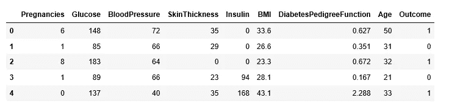
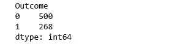
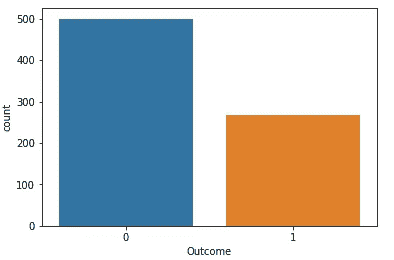
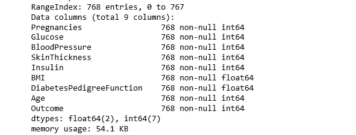
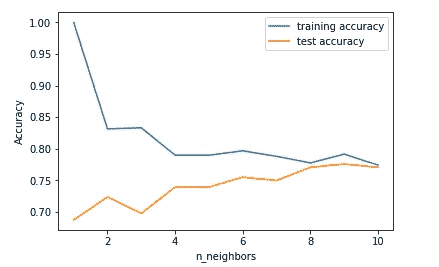
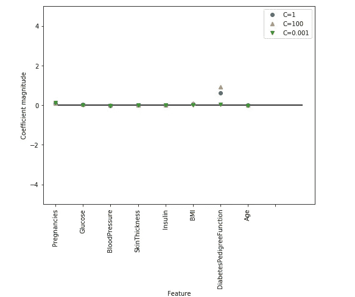
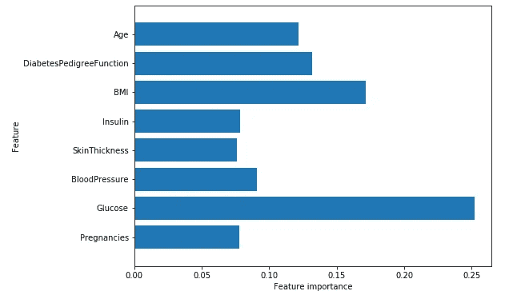
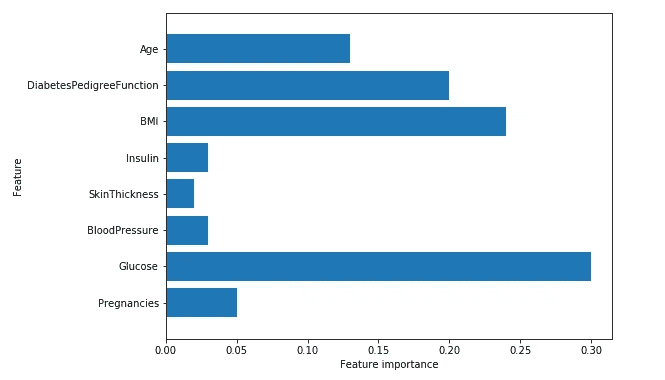
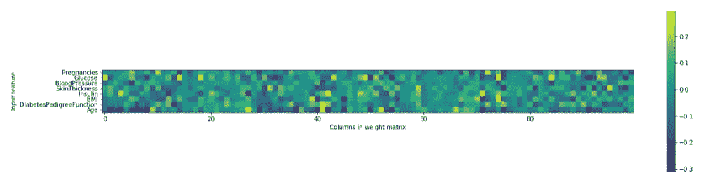

# 糖尿病的机器学习

> 原文：<https://towardsdatascience.com/machine-learning-for-diabetes-562dd7df4d42?source=collection_archive---------1----------------------->


Photo credit: Pixabay

根据疾病控制和预防中心的数据，现在大约七分之一的美国成年人患有糖尿病。但到 2050 年，这一比例可能会飙升至三分之一。考虑到这一点，这就是我们今天要做的事情:学习如何使用机器学习来帮助我们预测糖尿病。我们开始吧！

# 数据

糖尿病数据集源自 [UCI 机器学习库](http://archive.ics.uci.edu/ml/index.php)，可以从[这里](https://github.com/susanli2016/Machine-Learning-with-Python/blob/master/diabetes.csv)下载。

```
import pandas as pd
import numpy as np
import matplotlib.pyplot as plt
%matplotlib inlinediabetes = pd.read_csv('diabetes.csv')
print(diabetes.columns)
```

***指数(['妊娠'，'血糖'，'血压'，'皮肤厚度'，'胰岛素'，'身体质量指数'，'糖尿病血糖'，'年龄'，'结果']，dtype= '对象')***

```
diabetes.head()
```



Figure 1

糖尿病数据集由 768 个数据点组成，每个数据点有 9 个特征:

```
print("dimension of diabetes data: {}".format(diabetes.shape))
```

***糖尿病数据的维度:(768，9)***

“结局”是我们要预测的特征，0 表示没有糖尿病，1 表示有糖尿病。在这 768 个数据点中，500 个被标记为 0，268 个被标记为 1:

```
print(diabetes.groupby('Outcome').size())
```



Figure 2

```
import seaborn as snssns.countplot(diabetes['Outcome'],label="Count")
```



Figure 3

```
diabetes.info()
```



Figure 4

# k-最近邻

k-NN 算法可以说是最简单的机器学习算法。构建模型仅包括存储训练数据集。为了对新的数据点进行预测，该算法会在训练数据集中查找最近的数据点，即它的“最近邻居”

首先，让我们调查一下我们是否能够确认模型复杂性和准确性之间的联系:

```
from sklearn.model_selection import train_test_splitX_train, X_test, y_train, y_test = train_test_split(diabetes.loc[:, diabetes.columns != 'Outcome'], diabetes['Outcome'], stratify=diabetes['Outcome'], random_state=66)from sklearn.neighbors import KNeighborsClassifiertraining_accuracy = []
test_accuracy = []
# try n_neighbors from 1 to 10
neighbors_settings = range(1, 11)for n_neighbors in neighbors_settings:
    # build the model
    knn = KNeighborsClassifier(n_neighbors=n_neighbors)
    knn.fit(X_train, y_train)
    # record training set accuracy
    training_accuracy.append(knn.score(X_train, y_train))
    # record test set accuracy
    test_accuracy.append(knn.score(X_test, y_test))plt.plot(neighbors_settings, training_accuracy, label="training accuracy")
plt.plot(neighbors_settings, test_accuracy, label="test accuracy")
plt.ylabel("Accuracy")
plt.xlabel("n_neighbors")
plt.legend()
plt.savefig('knn_compare_model')
```



Figure 5

上图显示了 y 轴上的训练集和测试集精度与 x 轴上的 n_neighbors 设置的对比。考虑到如果我们选择一个单一的最近邻，对训练集的预测是完美的。但是当考虑更多的邻居时，训练精度下降，这表明使用单个最近邻居会导致模型过于复杂。最好的表现是大约 9 个邻居。

该图建议我们应该选择 n_neighbors=9。我们到了:

```
knn = KNeighborsClassifier(n_neighbors=9)
knn.fit(X_train, y_train)print('Accuracy of K-NN classifier on training set: {:.2f}'.format(knn.score(X_train, y_train)))
print('Accuracy of K-NN classifier on test set: {:.2f}'.format(knn.score(X_test, y_test)))
```

***K-NN 分类器在训练集上的准确率:0.79***

***K-NN 分类器在测试集上的准确率:0.78***

# 逻辑回归

逻辑回归是最常见的分类算法之一。

```
from sklearn.linear_model import LogisticRegressionlogreg = LogisticRegression().fit(X_train, y_train)
print("Training set score: {:.3f}".format(logreg.score(X_train, y_train)))
print("Test set score: {:.3f}".format(logreg.score(X_test, y_test)))
```

***训练集精度:0.781***

***测试设定精度:0.771***

C=1 的默认值提供了 78%的训练准确率和 77%的测试准确率。

```
logreg001 = LogisticRegression(C=0.01).fit(X_train, y_train)
print("Training set accuracy: {:.3f}".format(logreg001.score(X_train, y_train)))
print("Test set accuracy: {:.3f}".format(logreg001.score(X_test, y_test)))
```

***训练设定精度:0.700***

***测试设定精度:0.703***

使用 C=0.01 会导致训练集和测试集的精确度都较低。

```
logreg100 = LogisticRegression(C=100).fit(X_train, y_train)
print("Training set accuracy: {:.3f}".format(logreg100.score(X_train, y_train)))
print("Test set accuracy: {:.3f}".format(logreg100.score(X_test, y_test)))
```

***训练集精度:0.785***

***测试设定精度:0.766***

使用 C=100 会导致训练集的精度稍微高一点，而测试集的精度稍微低一点，这证实了正则化程度较低且更复杂的模型可能不会比默认设置概括得更好。

因此，我们应该选择默认值 C=1。

让我们用正则化参数 c 的三种不同设置来可视化模型学习的系数。

更强的正则化(C=0.001)将系数越来越推向零。更仔细地观察该图，我们还可以看到特征“DiabetesPedigreeFunction”，对于 C=100、C=1 和 C=0.001，系数为正。这表明高“糖尿病”特征与样本是“糖尿病”相关，不管我们看的是哪种模型。

```
diabetes_features = [x for i,x in enumerate(diabetes.columns) if i!=8]plt.figure(figsize=(8,6))
plt.plot(logreg.coef_.T, 'o', label="C=1")
plt.plot(logreg100.coef_.T, '^', label="C=100")
plt.plot(logreg001.coef_.T, 'v', label="C=0.001")
plt.xticks(range(diabetes.shape[1]), diabetes_features, rotation=90)
plt.hlines(0, 0, diabetes.shape[1])
plt.ylim(-5, 5)
plt.xlabel("Feature")
plt.ylabel("Coefficient magnitude")
plt.legend()
plt.savefig('log_coef')
```



Figure 6

# 决策图表

```
from sklearn.tree import DecisionTreeClassifiertree = DecisionTreeClassifier(random_state=0)
tree.fit(X_train, y_train)
print("Accuracy on training set: {:.3f}".format(tree.score(X_train, y_train)))
print("Accuracy on test set: {:.3f}".format(tree.score(X_test, y_test)))
```

***训练集上的精度:1.000***

***测试集上的精度:0.714***

训练集的准确率为 100%，而测试集的准确率要差得多。这表明该树过拟合，不能很好地推广到新数据。因此，我们需要对树进行预修剪。

我们设置 max_depth=3，限制树的深度可以减少过度拟合。这导致训练集的精确度较低，但测试集的精确度有所提高。

```
tree = DecisionTreeClassifier(max_depth=3, random_state=0)
tree.fit(X_train, y_train)print("Accuracy on training set: {:.3f}".format(tree.score(X_train, y_train)))
print("Accuracy on test set: {:.3f}".format(tree.score(X_test, y_test)))
```

***训练集上的准确率:0.773***

***测试集精度:0.740***

# 决策树中的特征重要性

特征重要性评定每个特征对于树所做决策的重要性。对于每个特征，它是一个介于 0 和 1 之间的数字，其中 0 表示“完全没有使用”，1 表示“完美地预测了目标”。特征重要性的总和总是 1:

```
print("Feature importances:\n{}".format(tree.feature_importances_))
```

***特征重要度:[ 0.04554275 0.6830362 0。0.0.0.27142106 0.0.】***

然后，我们可以将特性的重要性可视化:

```
def plot_feature_importances_diabetes(model):
    plt.figure(figsize=(8,6))
    n_features = 8
    plt.barh(range(n_features), model.feature_importances_, align='center')
    plt.yticks(np.arange(n_features), diabetes_features)
    plt.xlabel("Feature importance")
    plt.ylabel("Feature")
    plt.ylim(-1, n_features)plot_feature_importances_diabetes(tree)
plt.savefig('feature_importance')
```


Figure 7

特征“葡萄糖”是迄今为止最重要的特征。

# **随机森林**

让我们对糖尿病数据集应用一个由 100 棵树组成的随机森林:

```
from sklearn.ensemble import RandomForestClassifierrf = RandomForestClassifier(n_estimators=100, random_state=0)
rf.fit(X_train, y_train)
print("Accuracy on training set: {:.3f}".format(rf.score(X_train, y_train)))
print("Accuracy on test set: {:.3f}".format(rf.score(X_test, y_test)))
```

***训练集上的精度:1.000***

***测试集上的精度:0.786***

在不调整任何参数的情况下，随机森林给我们提供了 78.6%的准确性，优于逻辑回归模型或单个决策树。但是，我们可以调整 max_features 设置，看看结果是否可以改进。

```
rf1 = RandomForestClassifier(max_depth=3, n_estimators=100, random_state=0)
rf1.fit(X_train, y_train)
print("Accuracy on training set: {:.3f}".format(rf1.score(X_train, y_train)))
print("Accuracy on test set: {:.3f}".format(rf1.score(X_test, y_test)))
```

***训练集上的精度:0.800***

***测试集精度:0.755***

它没有，这表明随机森林的默认参数工作良好。

# **随机森林中的特征重要性**

```
plot_feature_importances_diabetes(rf)
```



Figure 8

与单一决策树类似，随机森林也非常重视“葡萄糖”特征，但它也选择“身体质量指数”作为第二大信息特征。构建随机森林的随机性迫使算法考虑许多可能的解释，结果是随机森林比单棵树捕捉到更广泛的数据图像。

# **梯度推进**

```
from sklearn.ensemble import GradientBoostingClassifiergb = GradientBoostingClassifier(random_state=0)
gb.fit(X_train, y_train)print("Accuracy on training set: {:.3f}".format(gb.score(X_train, y_train)))
print("Accuracy on test set: {:.3f}".format(gb.score(X_test, y_test)))
```

***在训练集上的精度:0.917***

***测试集上的精度:0.792***

我们可能会过度适应。为了减少过度拟合，我们可以通过限制最大深度来应用更强的预修剪，或者降低学习速率:

```
gb1 = GradientBoostingClassifier(random_state=0, max_depth=1)
gb1.fit(X_train, y_train)print("Accuracy on training set: {:.3f}".format(gb1.score(X_train, y_train)))
print("Accuracy on test set: {:.3f}".format(gb1.score(X_test, y_test)))
```

***训练集上的精度:0.804***

***测试集上的精度:0.781***

```
gb2 = GradientBoostingClassifier(random_state=0, learning_rate=0.01)
gb2.fit(X_train, y_train)print("Accuracy on training set: {:.3f}".format(gb2.score(X_train, y_train)))
print("Accuracy on test set: {:.3f}".format(gb2.score(X_test, y_test)))
```

***训练集上的精度:0.802***

***测试集上的精度:0.776***

正如所料，降低模型复杂性的两种方法都降低了训练集的准确性。然而，在这种情况下，这些方法都没有提高测试集的泛化性能。

即使我们对模型并不满意，我们也可以将特性的重要性可视化，以便更深入地了解我们的模型:

```
plot_feature_importances_diabetes(gb1)
```



Figure 9

我们可以看到，梯度增强树的特征重要性有点类似于随机森林的特征重要性，在这种情况下，它对所有特征进行加权。

# **支持向量机**

```
from sklearn.svm import SVCsvc = SVC()
svc.fit(X_train, y_train)print("Accuracy on training set: {:.2f}".format(svc.score(X_train, y_train)))
print("Accuracy on test set: {:.2f}".format(svc.score(X_test, y_test)))
```

***训练集上的精度:1.00***

***测试集精度:0.65***

该模型在很大程度上过度拟合，在训练集上得到满分，而在测试集上只有 65%的准确率。

SVM 要求所有的特征在相似的尺度上变化。我们需要重新调整我们的数据，使所有要素的比例大致相同:

```
from sklearn.preprocessing import MinMaxScalerscaler = MinMaxScaler()
X_train_scaled = scaler.fit_transform(X_train)
X_test_scaled = scaler.fit_transform(X_test)svc = SVC()
svc.fit(X_train_scaled, y_train)print("Accuracy on training set: {:.2f}".format(svc.score(X_train_scaled, y_train)))
print("Accuracy on test set: {:.2f}".format(svc.score(X_test_scaled, y_test)))
```

***训练集上的精度:0.77***

***测试集上的精度:0.77***

缩放数据产生了巨大的差异！现在，我们实际上是欠拟合的，训练集和测试集的性能非常相似，但不太接近 100%的准确性。从这里开始，我们可以尝试增加 C 或 gamma 来适应更复杂的模型。

```
svc = SVC(C=1000)
svc.fit(X_train_scaled, y_train)print("Accuracy on training set: {:.3f}".format(
    svc.score(X_train_scaled, y_train)))
print("Accuracy on test set: {:.3f}".format(svc.score(X_test_scaled, y_test)))
```

***训练集上的精度:0.790***

***测试集精度:0.797***

这里，增加 C 允许我们改进模型，导致 79.7%的测试集准确性。

# 深度学习

```
from sklearn.neural_network import MLPClassifiermlp = MLPClassifier(random_state=42)
mlp.fit(X_train, y_train)print("Accuracy on training set: {:.2f}".format(mlp.score(X_train, y_train)))
print("Accuracy on test set: {:.2f}".format(mlp.score(X_test, y_test)))
```

***训练集上的精度:0.71***

***测试集精度:0.67***

多层感知器(MLP)的准确性不如其他模型，这可能是由于数据的缩放。深度学习算法还期望所有输入特征以相似的方式变化，并且理想情况下具有 0 的均值和 1 的方差。我们必须重新调整我们的数据，以满足这些要求。

```
from sklearn.preprocessing import StandardScalerscaler = StandardScaler()
X_train_scaled = scaler.fit_transform(X_train)
X_test_scaled = scaler.fit_transform(X_test)mlp = MLPClassifier(random_state=0)
mlp.fit(X_train_scaled, y_train)print("Accuracy on training set: {:.3f}".format(
    mlp.score(X_train_scaled, y_train)))
print("Accuracy on test set: {:.3f}".format(mlp.score(X_test_scaled, y_test)))
```

***训练集上的准确率:0.823***

***测试集精度:0.802***

让我们增加迭代次数:

```
mlp = MLPClassifier(max_iter=1000, random_state=0)
mlp.fit(X_train_scaled, y_train)print("Accuracy on training set: {:.3f}".format(
    mlp.score(X_train_scaled, y_train)))
print("Accuracy on test set: {:.3f}".format(mlp.score(X_test_scaled, y_test)))
```

***训练集上的准确率:0.877***

***测试集上的精度:0.755***

增加迭代次数只会提高训练集的性能，而不会提高测试集的性能。

让我们增加 alpha 参数并增加权重的更强正则化:

```
mlp = MLPClassifier(max_iter=1000, alpha=1, random_state=0)
mlp.fit(X_train_scaled, y_train)print("Accuracy on training set: {:.3f}".format(
    mlp.score(X_train_scaled, y_train)))
print("Accuracy on test set: {:.3f}".format(mlp.score(X_test_scaled, y_test)))
```

***训练集上的准确率:0.795***

***测试集精度:0.792***

结果是好的，但是我们不能进一步提高测试精度。

因此，我们目前为止最好的模型是缩放后的默认深度学习模型。

最后，我们绘制了在糖尿病数据集上学习的神经网络中第一层权重的热图。

```
plt.figure(figsize=(20, 5))
plt.imshow(mlp.coefs_[0], interpolation='none', cmap='viridis')
plt.yticks(range(8), diabetes_features)
plt.xlabel("Columns in weight matrix")
plt.ylabel("Input feature")
plt.colorbar()
```



Figure 10

从热点图中，很难快速指出哪些要素与其他要素相比权重相对较低。

# **总结**

我们练习了一系列用于分类和回归的机器学习模型，它们的优点和缺点是什么，以及如何控制每个模型的复杂性。我们看到，对于许多算法来说，设置正确的参数对于良好的性能非常重要。

我们应该能够知道如何应用、调整和分析我们上面实践的模型。现在轮到你了！尝试将这些算法应用于 scikit-learn 中的内置数据集或您选择的任何数据集。机器学习快乐！

创建这篇文章的源代码可以在[这里](https://github.com/susanli2016/Machine-Learning-with-Python/blob/master/Machine%20Learning%20for%20Diabetes.ipynb)找到。我将很高兴收到关于上述任何反馈或问题。

参考:[用 Python 进行机器学习的介绍](http://shop.oreilly.com/product/0636920030515.do)