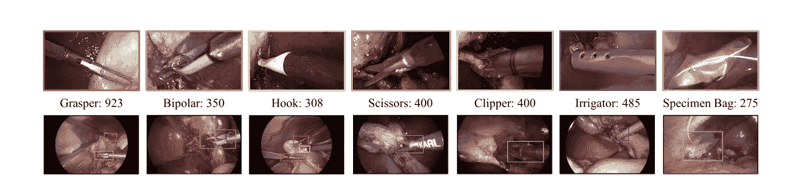
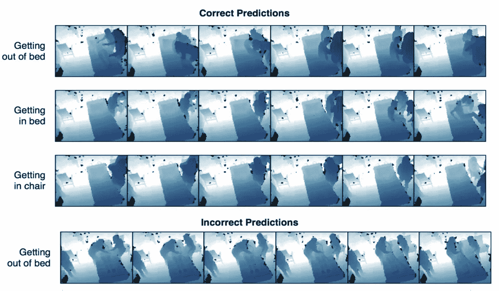
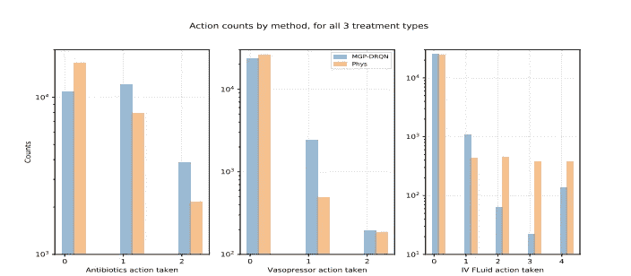
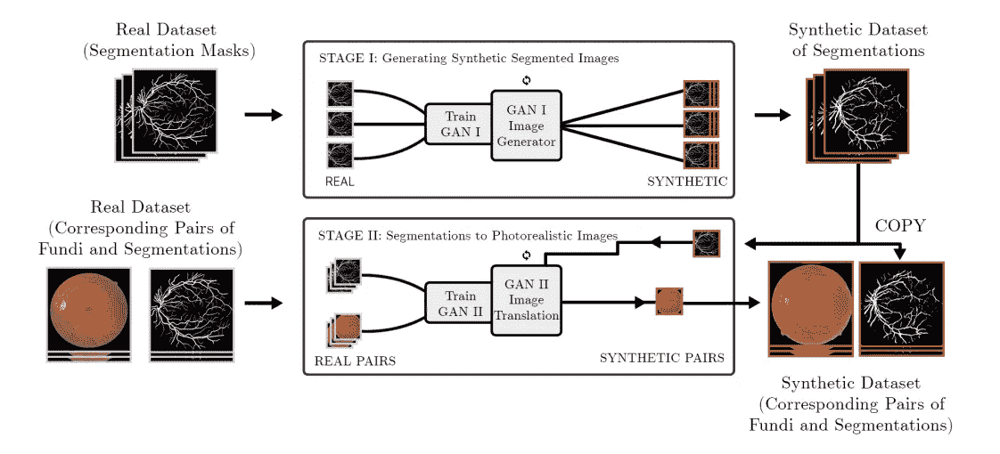

# NIPS 的医疗保健机器学习

> 原文：<https://towardsdatascience.com/machine-learning-for-healthcare-at-nips-c96127bbbae?source=collection_archive---------10----------------------->

今年 NIPS 举办了两次医疗保健/医药相关的研讨会。[医疗保健的机器学习](https://ml4health.github.io) (ML4H)和医学成像符合 NIPS。自然，有些人可能会想知道这两者之间的区别。ML4H 专注于将机器学习应用于医疗保健的许多不同领域，包括药物研发、医院运营、精准医疗等。这涉及多种技术，包括计算机视觉、NLP 和时间序列预测。正如我上个月所描述的，MedNIPs 专注于机器学习在医学成像方面的具体应用。换句话说，ML4H 更通用。有一些重叠，但是因为我在上一篇文章中详细介绍了成像，所以我将把重点放在 ML4H 涉及的所有其他领域。

有趣的是，尽管两个研讨会的演讲者处理了机器学习和医学的不同领域，但似乎有一个普遍的潜在主题:有限和/或混乱数据的问题。同样，研讨会上展示的技术，如多任务学习、用 GANs 生成合成数据以及将人类反馈纳入培训，都旨在解决这一基本问题。

[不幸的是，与 MedNIPs 不同，ML4H 的演讲(据我所知)没有一个是在线的，只有一些摘要是在线的。此外，周五的大部分时间，我都在跑来跑去，试图把自己的海报印出来。因此，我可能遗漏了一些重要的部分。因此，如果其中一位演示者或其他与会者想要添加一些东西，请随时留下评论，我会确保将它包括在内]。

## **医院运营**

机器学习有可能改善医院运营和护理。几位特邀发言人和专题演讲人讨论了这个问题。在许多领域，机器学习都有可能提高医院的护理质量。费·李非在斯坦福大学发表了关于减少医院获得性感染和改善护理的最新研究的主题演讲。费飞讨论了大多数研究如何专注于寻找新药或更好地解释放射学报告。然而，医疗保健的很大一部分不仅仅发生在实验室，而是与医疗保健专业人员和他们的病人之间的互动。她认为，通过研究和增强机器学习的日常互动，我们可能会拯救更多的生命。这些领域包括减少医院获得性感染、监控 ICU 活动和预测人员配备水平。

米歇尔·郭(Michelle Guo)等人去年夏天在波士顿发表了一篇关于识别违反手部卫生协议的文章，在这篇文章的扩展中，他们发表了一篇关于使用“视点不变卷积神经网络”自动检测医院中潜在风险手部卫生场景的海报。他们使用深度图像，并将其输入卷积网络，以对照片中采取的行动类型进行分类。在这里，他们感兴趣的是将照片归类为接触病人或环境中的无菌区。

Classification of surgical instruments from page 2 of Jin et al.

本次研讨会的最佳论文是 Amy Jin 等人(也来自菲菲的研究小组)的论文[使用基于区域的卷积神经网络](http://ai.stanford.edu/~syyeung/jin_nips_ml4h_2017.pdf)在手术视频中进行工具检测和手术技能评估，描述了如何使用基于区域的 CNN，如 F-RCNN，来评估外科医生的技能。他们概述了一种跟踪和分析手术视频中工具使用的方法。这种方法可以为外科医生提供有价值的反馈，告诉他们手术效果如何以及需要改进哪些地方。特别是，他们跟踪工具的切换和手术的长度，以评估外科医生的技能。这种类型的监测可能会减少手术失误的数量。

Classifying patient actions in an ICU Ward. Taken from Bianconi et al. [poster](http://www.gabrielbianconi.com/public/pdf/vision-based-prediction-of-icu-mobility-care-activities-using-recurrent-neural-networks-nips-ml4h-2017.pdf).

加布里埃尔·比安科尼等人(也来自菲菲的研究小组)的另一篇聚焦文章描述了使用 RNNs 对 ICU 移动护理活动的[基于视觉的预测。这项工作试图分类病人的行为在 ICU 病房的医院使用 HIPPA 投诉深度传感器。解释这些活动有多重好处；例如，它可用于衡量医院对协议的遵守情况，以及遵守协议与总体患者结果之间的关系。](http://www.gabrielbianconi.com/public/pdf/vision-based-prediction-of-icu-mobility-care-activities-using-recurrent-neural-networks-nips-ml4h-2017.pdf)

南加州大学的 David Kale 介绍了如何创建 MIMIC-III 数据的公共基准。他的团队训练了一个多任务 LSTM 来预测四个相关指标，包括总死亡率、住院时间、疾病表型和生理衰退。他们在网上发布了他们的模型以及生成他们所使用的特定训练和测试集所必需的代码。总之，这是多任务学习在医疗保健中的一个有趣的应用，它提供了一些有价值的基准来比较未来的结果。

## ML 支持的治疗

几篇论文描述了强化学习在治疗败血症和预测某人是否患有疟疾方面的应用，我认为这很有趣。在此之前，我曾设想 RL 是一个小众主题，只研究像 PacMan 或 Alpha Go 这样有明确规则的问题。

Figure from page 7 Futoma et al.

Futoma 等人的“学习用多输出高斯过程深度递归 Q 网络治疗脓毒症”描述了强化学习和高斯过程的应用。他们的论文采用了两个主要部分协同工作 MGP 或多高斯过程和循环 Q 网络。MGP 过程处理时间序列患者生理数据，这通常是草率的，因为它是在不同的时间间隔记录的，而递归 q 网络学习临床策略。细节有些复杂，但总的来说，这是一个非常有趣的许多不同主题的综合。总的来说，作者估计他们的方法可以减少 8.2%的总患者死亡率(从 13.2%的总基线)。

Rajpurkar 等人的一篇题为“通过使用深度强化学习有效调查家庭进行疟疾可能性预测[”的健康政策导向论文描述了训练一个 RL 代理问一系列问题来预测某人是否患有疟疾。具体来说，作者写道“RL 代理学习确定接下来要问哪个调查问题以及何时停止，以根据他们迄今为止的回答来预测他们患疟疾的可能性”(Rajpurkar 等人的摘要)。](https://arxiv.org/pdf/1711.09223.pdf)

另一篇专注于治疗的论文是“[大型决策空间](https://arxiv.org/pdf/1707.02375.pdf)中相关决斗强盗与临床治疗的应用”在这篇论文中，作者将探索临床决策空间表述为一个有趣的 K 臂土匪问题。然而，这带来了问题，因为决策空间非常大，这意味着在传统方法收敛到最佳 arm 之前可能需要很长时间。为了克服这一点，他们开发了一种名为 CorrDuel 的算法，该算法利用了臂之间的相关性，以便更快地收敛。然后，他们将此应用于帮助找到最佳的电刺激，以帮助截瘫患者重新控制他们的运动(通过这些脊髓刺激)，甚至站立。

最后，陈等人的[混合梯度推进树和神经网络预测手术室数据](https://arxiv.org/abs/1801.07384)也提出了一种预测缺氧的方法。

## 药物发现和个性化医疗

几位演讲者谈到了使用机器学习进行药物发现。例如，Atul Butte 在他的聚光灯下，讨论了从临床试验数据中挖掘数据，并将其输入机器学习算法，以发现新药。此外，他描述了数据可视化技术，用于绘制患者最可能的预后。(Butte 的幻灯片可以在 slideshare 上找到，如果你有时间，非常值得一读)。其他几位演讲者详细介绍了个性化医疗可能影响的具体领域。

Jennifer Chayes 介绍了“癌症免疫治疗中机器学习的挑战和机遇”Chayes 描述了预测新抗原的免疫原性和患者对特定类型免疫疗法的反应的挑战。通过更好地预测新抗原的免疫原性，更容易发现实际上具有抗肿瘤特性的新抗原。第二，通过预测患者对治疗的具体反应，可以在免疫系统没有被化疗拖垮时更早地引入治疗。然而，像医学研究中的许多其他领域一样，这受到小数据集的限制。除了很小之外，数据集还是非常高维的。

另一个亮点是“问医生——通过积极的专家知识启发改善药物敏感性预测”，描述了如何通过询问“专家”来改善衡量癌细胞对药物的特定疗效的模型。这种技术有点类似于主动学习(我在以前的文章中谈到过)。在这种情况下，专家是治疗血癌的专家。通常情况下，专家征集算法会随机向专家发送药物特征，并指出这些特征是否相关。作者的主要贡献是设计了一种算法，该算法通过仅向专家发送他们的反馈提供最大效用的对(而不是随机对)来减少发送给专家的查询的数量，并且除了相关和非相关反馈之外还包括方向性反馈。

## 综合数据

几篇论文讨论了使用 GANs 生成合成数据。这是一项有用的技术，因为 HIPPA 合规性导致获取真实医疗数据的复杂性。论文“[来自双生成对抗网络](https://arxiv.org/pdf/1709.01872.pdf)的合成医学图像”，作者 JT·吉巴斯描述了如何使用一对 GANs 生成逼真的视网膜图像。研究人员为合成生成的医学影像照片引入了一个名为 [SynthMed](https://synthmed.github.io/) 的在线储存库。

Diagram from [Synthetic Medical Images from Dual Generative Adversarial Networks](https://arxiv.org/pdf/1709.01872.pdf)

另一篇论文，[用递归条件 gan](https://arxiv.org/pdf/1706.02633.pdf)生成实值(医学)时间序列(这也是一篇专题演讲)，描述了如何用 R-gan 生成合成 ICU 时间序列数据。然后他们进行了几个有趣的实验来验证他们的结果；例如，他们观察重构误差的分布，定性地比较生成的样本，以及插值。总之，这篇论文展示了一个非常好的 GANs 用例，可以帮助解决困扰研究人员的许多数据访问问题。如果你喜欢 GANs，这绝对是一个值得一看的作品。

## 其他的

我发现其他几篇论文很难归入上述类别，但还是觉得很有趣。简而言之:

由 [Kalyanam](https://arxiv.org/find/cs/1/au:+Kalyanam_J/0/1/0/all/0/1) 等人撰写的“[在 Twitter 上非法营销和推广处方药的检测和特征描述](https://arxiv.org/abs/1712.00507)”。

[用于流式细胞术分析的蒙德里安过程](https://arxiv.org/pdf/1711.07673.pdf)由纪等人完成。

最后，研讨会上总共有 97 篇论文，因此我肯定会错过一些好的。因此，我鼓励你去看看工作坊[网站](https://ml4health.github.io/2017/)。此外，如果任何人对其他主题演讲有任何信息，请告诉我们，我会添加它。

## 公告

我将在 2 月 7 日星期三做一个关于使用小数据集的演讲，重点是医疗保健应用。[演讲将于美国东部时间](http://meetup.com/Northern-New-England-Data-and-Analytics-Meetup/)晚 7 点至 9 点在奥罗诺举行，并将通过 Zoom[http://zoom.us/j/794523352](http://zoom.us/j/794523352)的以下链接进行直播。

CurativeAI Slack 频道现在有 40 多个成员，并且还在继续。所以如果你还没有加入讨论，就来加入吧。