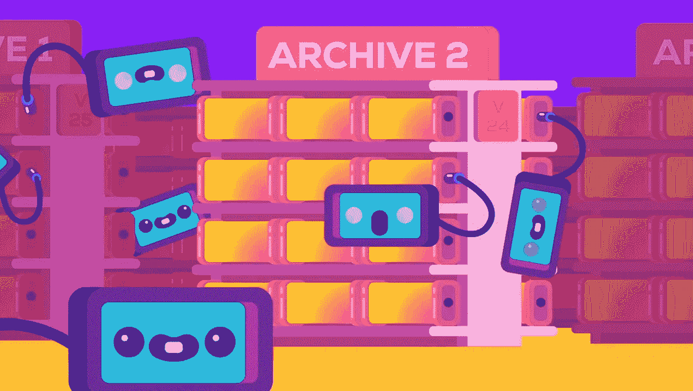
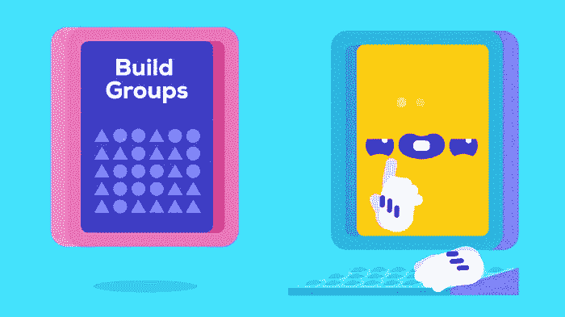

# 面向营销的机器学习

> 原文：<https://towardsdatascience.com/machine-learning-for-marketing-25e26efbcefe?source=collection_archive---------18----------------------->

## 2018 年 AI 在营销方面有哪些最好的应用？

在过去的 10 年里，没有哪个领域比数字营销领域更加持续地应用人工智能。这是因为，与其他行业相比，互联网公司:

*   收集更大、更结构化的数据集
*   雇佣了更多的数据工程师
*   更注重技术的文化。

但是，尽管大型科技巨头(谷歌、脸书、亚马逊……)正在大量使用机器学习来优化营销，*许多组织仍然刚刚起步。*

如果你想知道如何最好地**在营销中使用机器学习/人工智能**，这里有一个当今顶级应用的概述:

# 预测目标

你如何确保营销信息只传递给正确的用户？

预测目标定位是对基于细分甚至基于触发的目标定位的一大改进。这是个性化目标的层次结构:

**0 级** : *无针对性营销。*

*   街上的传单。(但是谁会这么做呢？)

**一级** : **细分目标定位。**

*   确定典型客户的特征，并针对该角色进行营销。

**二级:** **触发瞄准。**

*   使用**关键行为**来确定你的客户什么时候准备购买——就像他们刚买了一辆车。并且只针对那些顾客。

## **三级:** **预测瞄准。**

*   利用你掌握的关于顾客的所有行为和人口统计线索，对他们现在购买的可能性做出个人预测。

在触发瞄准中，您*手动*选择触发器，而在预测瞄准中，您使用机器学习算法*自动学习正确的触发器*。

机器学习模型可以通过这种方式捕捉到更多的复杂性，从而显著提高性能，因为它们在识别理想客户时更加准确。

我见过客户**通过从触发目标转向预测目标，将营销收入提高了 200–300%。**

# 预测销售线索评分

线索不再仅仅是电话号码和名字。现在，您可以轻松捕捉线索中的 50-100 个其他因素:

*   采集渠道；
*   与网站的互动(每次访问、文章阅读、下载或参加网上研讨会)；
*   账户信息(规模、投资轮次、新闻、员工波动)。

每条信息都包含一条线索，表明该销售线索是否准备购买。但是除了设置一些明显的过滤器之外，很难有效地使用这些信息。

“关于下载白皮书后直接观看网上研讨会的潜在客户比中间浏览 10 页的潜在客户更感兴趣？”

**很难说**——这只是你可能会问的数千个问题中的一个。

机器学习是*进行这种分析的理想工具:* **算法从过去的销售中学习创造良好销售线索**的模式，然后用它们来预测你管道中每条线索的准确转化概率。然后你的销售团队就更清楚该关注谁了。

为了让算法能够找到可靠的模式，你的客户关系管理中至少需要 300 名已经购买的客户，以及至少 300 名没有购买的客户。

# 客户终身价值预测

你的客户群价值多少？谁会是你最好的客户？

估计一个多样化的 B2C SaaS 客户群的未来价值有点像一门黑色艺术——很多时候，你只需为每个客户选择一个平均值。

然而，与预测目标和线索评分类似，你可以使用机器学习来学习客户行为之间的联系(他们购买了什么和多少，登录等。)及其总终身价值。

如果你有足够多的客户，足够多的关于他们的数据，并且你的产品已经存在足够长的时间，那么这是一个很好的方式:

*   找出哪种类型的客户更有价值；
*   决定**更关注哪些客户；**
*   估计客户群的**总价值(一次一个用户)。**

# 建议

我们不想再没完没了地浏览类别了。我们期望更相关的电影或书籍首先出现。推荐算法变得越来越好——如此之好，以至于对许多 Spotify 或网飞用户来说，自动推荐已经完全取代了手动发现。

推荐算法确保你的顾客看到更多他们想要的东西，最终这意味着他们会买更多。但是有很多不同的推荐算法——你需要哪一个取决于你的情况。以下是三个最重要的类别:

## 1.基于内容

基于内容的算法向你的用户推荐与他们以前喜欢的东西相似的东西。想想同类型的电影，或者同价位的酒店。

## 2.合作的

协同过滤算法找到有相似品味的用户，然后向对方推荐对方喜欢的东西。这就像让你所有品味相似的朋友给你推荐一样。在某种程度上，这些算法利用了你所有用户的智能，可以在不知道他们推荐什么的情况下做出准确的推荐。

## 3.混合物

混合推荐器**以某种方式结合了前两种方法**。许多正在使用的最强大的算法是混合推荐器(如网飞)。

适合您具体情况的最佳推荐方案还取决于:

*   你对你的用户了解多少；
*   你有多少新用户和回头客；
*   你每个月增加多少新产品(像电影或书籍)；
*   产品与用户的比率。

一旦你建立了你的推荐算法，你可以用很多方法来应用它:

*   对搜索结果进行排序；
*   寻找相似的产品(电影、酒店、书籍)；
*   为每个用户提供个性化推荐(比如 Spotify Weekly)。

# 流失预测

客户流失是一个杀手。了解哪些客户将很快取消他们的会员资格，为什么他们打算离开，然后做出改变以留住他们**可以拯救一家公司**。

但是经常没有一个明确的原因导致客户流失。而是很多不同的原因和组合。

一个简单的分析只会给你一个简单的答案——你最终会怀疑许多快乐的顾客在鼓捣。所以你因为给了错误的用户折扣而损失了收入。

再说一次，机器学习是**微妙区分会流失和不会流失的用户的理想工具**。它发现了隐藏在用户行为中的过多模式。

有了一个良好的模型，你可以将用户从最有可能流失到最不可能流失进行排序，并关注那些最需要关注的用户。

流失模型还可以帮助你了解导致流失的因素，并在必要时调整你的产品。

我是柏林一家精品机器学习咨询公司 Data Revenue 的创始人。[如果你需要机器学习营销方面的帮助，请联系](https://www.datarevenue.com/en/contact-us)。

*原载于*[*www.datarevenue.com*](http://www.datarevenue.com/en/usecases/machine-learning-for-marketing)*。*