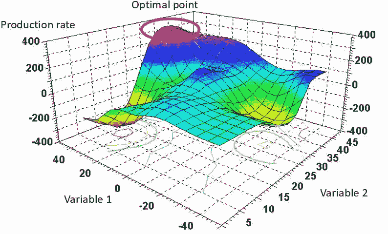
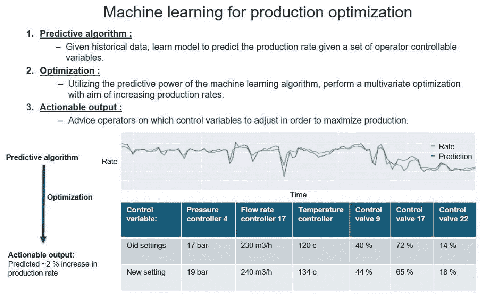

# 如何使用机器学习进行生产优化

> 原文：<https://towardsdatascience.com/machine-learning-for-production-optimization-e460a0b82237?source=collection_archive---------6----------------------->

## 利用数据提高性能

在我的其他帖子中，我已经涉及了一些主题，如:[用于异常检测和状态监控的机器学习](https://www.linkedin.com/pulse/how-use-machine-learning-anomaly-detection-condition-flovik-phd/)，h [如何结合机器学习和基于物理的建模](/how-do-you-combine-machine-learning-and-physics-based-modeling-3a3545d58ab9)，以及[如何避免机器学习用于时间序列预测的常见陷阱](/how-not-to-use-machine-learning-for-time-series-forecasting-avoiding-the-pitfalls-19f9d7adf424)。但在这篇文章中，我将讨论机器学习如何用于生产优化。

在不久的将来，完全自主的生产设备将会出现。但即使在今天，机器学习也可以对生产优化产生巨大影响。在这里，我将仔细看看一个具体的例子，如何利用机器学习和分析来解决现实生活中遇到的复杂问题。

# 什么是生产优化？

产品优化是很多行业普遍存在的问题。在我们的上下文中，优化是指任何使某样东西——如设计、系统或决策——尽可能好、实用或有效的行为、过程或方法。最低成本、最佳质量、性能和能耗的决策过程就是这种优化的例子。

为了进一步具体化这一点，我将重点关注我们一直在与一家全球石油和天然气公司合作的一个案例。目前，该行业主要关注数字化和分析。这种关注是由每天从多达数千个传感器积累的大量数据推动的，即使是在单个生产设施上。直到最近，由于能力的限制以及缺乏必要的技术和数据管道来从传感器和系统收集数据以供进一步分析，这些数据的利用受到限制。

在石油和天然气行业的背景下，生产优化本质上是“生产控制”:您最小化、最大化或以石油、天然气，或许还有水的生产为目标。你的目标可能是最大化产油量，同时最小化产水量。或者可以将石油产量和气油比(GOR)运行到指定的设定点，以维持期望的储层条件。

# 生产优化有多复杂？

石油和天然气的生产是一个复杂的过程，为了满足短期、中期和长期目标，必须做出许多决策，从规划和资产管理到小的纠正措施。短期决策必须在几个小时内做出，通常被描述为日常生产优化。他们通常试图通过优化控制生产过程的各种参数来最大化油气产量。

在今天的大多数情况下，日常生产优化是由控制海上生产设施的操作者执行的。这种优化是一项非常复杂的任务，其中大量的可控参数都会以某种方式影响生产。必须调整大约 100 个不同的控制参数，以找到所有变量的最佳组合。考虑下图所示的非常简单的优化问题。

在这种情况下，只有两个可控参数影响你的生产率:“变量 1”和“变量 2”。优化问题是找到这些参数的最优组合，以最大化生产率。解决这个二维优化问题并不复杂，但想象一下这个问题扩展到 100 维。那是另一个故事了。从本质上来说，这就是操作人员在优化生产时试图做的事情。今天，这一点执行得如何在很大程度上取决于操作人员以前的经验，以及他们对所控制的过程的理解程度。

# 机器学习算法可以积累无限的数据集

这就是基于机器学习的方法变得非常有趣的地方。操作员执行的优化主要基于他们自己的经验，随着时间的推移，随着他们对过程设备的控制越来越熟悉，这些经验也在不断积累。这种从以前的经验中学习的能力正是机器学习中如此吸引人的地方。通过分析来自平台传感器的大量历史数据，算法可以学习理解各种参数之间的复杂关系及其对生产的影响。

算法从经验中学习的事实，原则上类似于操作员学习控制过程的方式。然而，与人类操作员不同，机器学习算法在几年的时间内分析数百个传感器的完整历史数据集没有任何问题。与人脑相比，它们可以积累无限的经验。

# 优化算法如何工作

拥有一个能够根据你调整的控制参数预测生产率的机器学习算法，是一个非常有价值的工具。回头参考上图中的简化图，基于机器学习的预测模型为我们提供了“生产率景观”，其波峰和波谷代表高产量和低产量。多维优化算法随后在该场景中移动，寻找代表最高可能生产率的最高峰。
通过在这个“生产率景观”中移动，该算法可以给出如何最好地达到这个峰值的建议，即调整哪些控制变量以及调整多少。因此，这种基于机器学习的生产优化包括三个主要部分:

# 1.预测算法:

你的第一步，也是最重要的一步，是确保你有一个机器学习算法，能够在给定所有操作员可控变量设置的情况下，成功预测正确的生产率。

# 2.多维优化:

您可以使用预测算法作为优化算法的基础，该算法探索调整哪些控制变量以最大限度地提高产量。

# 3.可操作的输出:

作为优化算法的输出，您可以获得关于调整哪些控制变量以及这些调整可能带来的生产率提高的建议。

基于机器学习的优化算法可以在来自生产设施的实时数据流上运行，当它识别出提高产量的潜力时，向操作者提供建议。算法的典型可操作输出如上图所示:调整某些控制器设定值和阀门开度的建议。它还估计了生产率的潜在增长，在这种情况下大约为 2 %。

这种基于机器学习的优化算法可以作为操作人员控制过程的支持工具，帮助他们做出更明智的决策，以最大限度地提高产量。

生产设备的完全自主运行离未来还有一段距离。在此之前，基于机器学习的支持工具可以对生产优化的执行方式产生重大影响

在未来，我相信机器学习将会被用在比我们今天所能想象的更多的地方。你认为它会对各个行业产生什么影响？我很想在下面的评论中听到你的想法。

如果你有兴趣了解更多与人工智能/机器学习和数据科学相关的主题，你也可以看看我写的其他一些文章。你会发现他们都列在我的中型作者简介，[你可以在这里找到。](https://medium.com/@vflovik)

而且，如果你想成为一个媒体会员，免费访问平台上的所有资料，你也可以使用下面我的推荐链接。(注意:如果您使用此链接注册，我也会收到一部分会员费)

 [## 通过我的推荐链接加入媒体- Vegard Flovik

### 作为一个媒体会员，你的会员费的一部分会给你阅读的作家，你可以完全接触到每一个故事…

medium.com](https://medium.com/@vflovik/membership) 

# 更多来自 Vegard Flovik 媒体:

1.  蒙特卡洛方法简介
2.  [从物理学到数据科学的转变](/q-a-with-a-data-scientist-1f872518315f)
3.  [什么是图论，你为什么要关心它？](https://builtin.com/machine-learning/graph-theory)
4.  [用于图像分类的深度迁移学习](/deep-transfer-learning-for-image-classification-f3c7e0ec1a14)
5.  [‘建造一个能读懂你思想的人工智能](https://www.linkedin.com/pulse/building-ai-can-read-your-mind-vegard-flovik-phd/)
6.  [机器学习:从炒作到现实应用](/machine-learning-from-hype-to-real-world-applications-69de7afb56b6)
7.  [人工智能和大数据隐藏的风险](/the-hidden-risk-of-ai-and-big-data-3332d77dfa6)
8.  [用于供应链管理的人工智能:预测分析和需求预测](/artificial-intelligence-in-supply-chain-management-predictive-analytics-for-demand-forecasting-80d2d512f155)
9.  [如何(不)使用机器学习进行时间序列预测:避免陷阱](/how-not-to-use-machine-learning-for-time-series-forecasting-avoiding-the-pitfalls-19f9d7adf424)
10.  [如何使用机器学习进行异常检测和状态监控](/how-to-use-machine-learning-for-anomaly-detection-and-condition-monitoring-6742f82900d7)
11.  你如何向人工智能系统教授物理学？
12.  我们能使用纳米级磁铁建立人工大脑网络吗？

## 人工智能研讨会——从宣传到现实应用