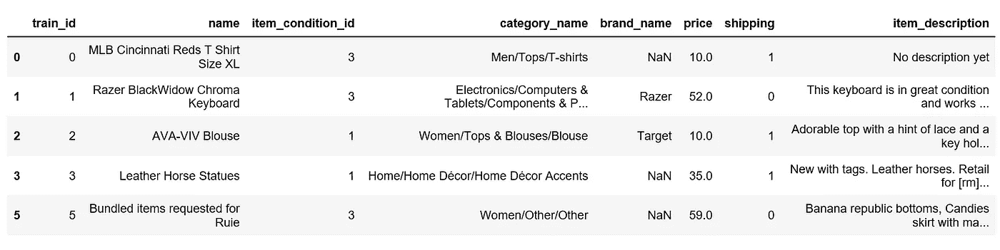
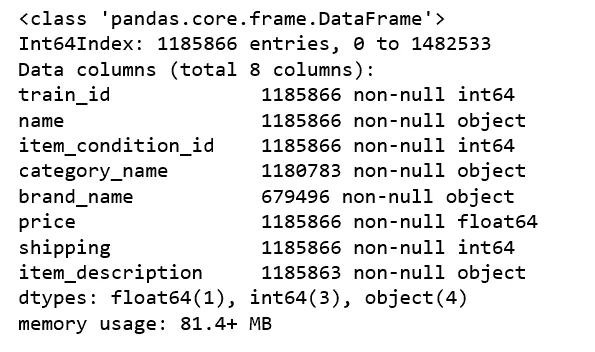
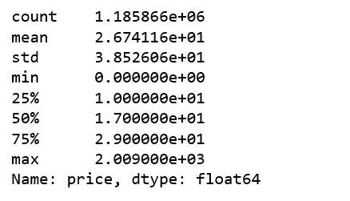
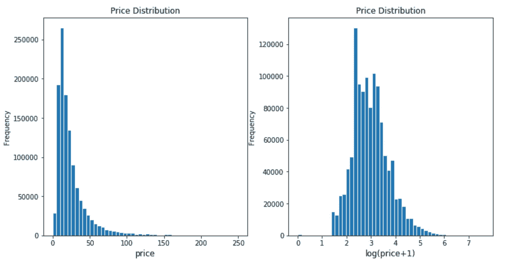
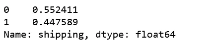
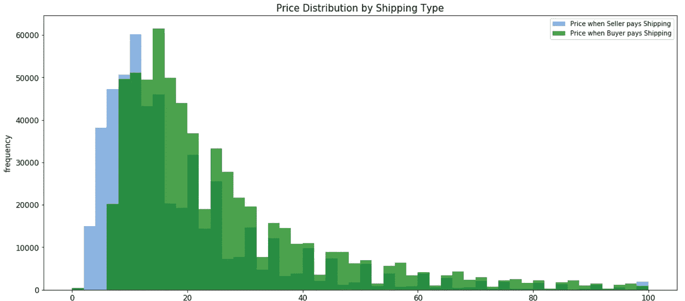
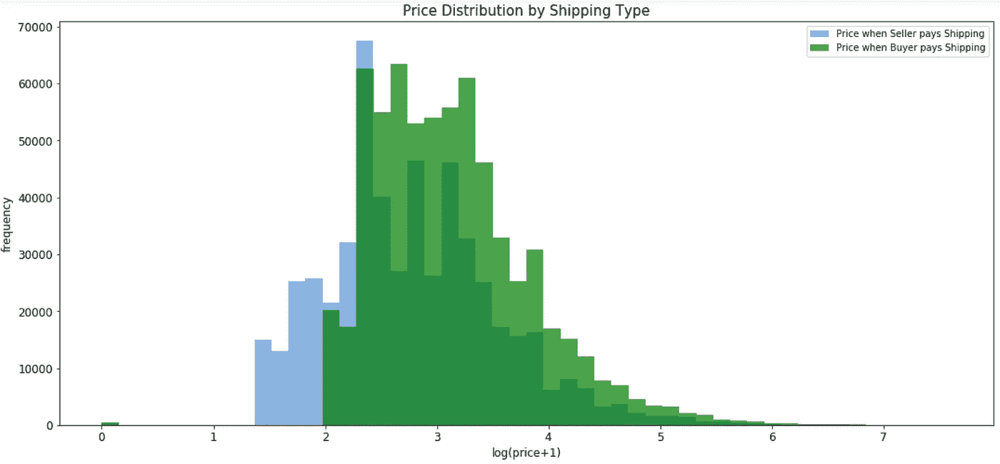
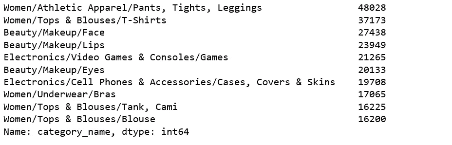
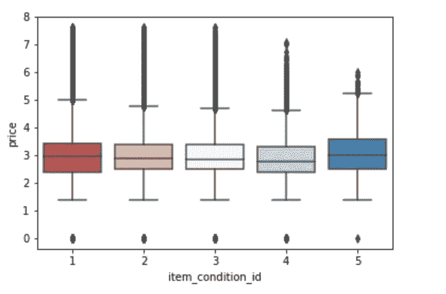

# 用 Python 实现零售价格推荐的机器学习

> 原文：<https://towardsdatascience.com/machine-learning-for-retail-price-suggestion-with-python-64531e64186d?source=collection_archive---------0----------------------->


Photo credit: Pexels

日本最大的社区购物应用 Mercari 深刻地认识到一个问题。他们希望向卖家提供定价建议，但这很难，因为他们的卖家可以在 Mercari 的市场上出售任何东西或任何一捆东西。

在这个机器学习项目中，我们将建立一个自动建议正确产品价格的模型。我们收到以下信息:

train_id —列表的 id

名称—列表的标题

item_condition_id —卖家提供的物品的状况

类别名称—列表的类别

品牌名称—品牌的名称

价格——物件的销售价格。这是我们将要预测的目标变量

运费—如果运费由卖方支付，则为 1，由买方支付，则为 0

item_description —项目的完整描述

# 电子设计自动化(Electronic Design Automation)

数据集可以从 [Kaggle](https://www.kaggle.com/saitosean/mercari) 下载。为了验证结果，我只需要 train.tsv。让我们开始吧！

```
import gc
import time
import numpy as np
import pandas as pd
import matplotlib.pyplot as plt
import seaborn as sns
from scipy.sparse import csr_matrix, hstack
from sklearn.feature_extraction.text import CountVectorizer, TfidfVectorizer
from sklearn.preprocessing import LabelBinarizer
from sklearn.model_selection import train_test_split, cross_val_score
from sklearn.metrics import mean_squared_error
import lightgbm as lgbdf = pd.read_csv('train.tsv', sep = '\t')
```

将数据随机分为训练集和测试集。我们只为 EDA 使用训练集。

```
msk = np.random.rand(len(df)) < 0.8
train = df[msk]
test = df[~msk]train.shape, test.shape
```

***((1185866，8)，(296669，8))***

```
train.head()
```



Figure 1

```
train.info()
```



Figure 2

## **价格**

```
train.price.describe()
```



Figure 3

项目的价格是右偏的，绝大多数项目的价格在 10-20 英镑。然而，2009 年定价最贵的项目。所以我们将对价格进行对数变换。

```
plt.subplot(1, 2, 1)
(train['price']).plot.hist(bins=50, figsize=(12, 6), edgecolor = 'white', range = [0, 250])
plt.xlabel('price', fontsize=12)
plt.title('Price Distribution', fontsize=12)plt.subplot(1, 2, 2)
np.log(train['price']+1).plot.hist(bins=50, figsize=(12,6), edgecolor='white')
plt.xlabel('log(price+1)', fontsize=12)
plt.title('Price Distribution', fontsize=12)
```



Figure 4

## 船舶

超过 55%的项目运费由买家支付。

```
train['shipping'].value_counts() / len(train)
```



Figure 5

运费和价格有什么关系？

```
shipping_fee_by_buyer = train.loc[df['shipping'] == 0, 'price']
shipping_fee_by_seller = train.loc[df['shipping'] == 1, 'price']fig, ax = plt.subplots(figsize=(18,8))
ax.hist(shipping_fee_by_seller, color='#8CB4E1', alpha=1.0, bins=50, range = [0, 100],
       label='Price when Seller pays Shipping')
ax.hist(shipping_fee_by_buyer, color='#007D00', alpha=0.7, bins=50, range = [0, 100],
       label='Price when Buyer pays Shipping')
plt.xlabel('price', fontsize=12)
plt.ylabel('frequency', fontsize=12)
plt.title('Price Distribution by Shipping Type', fontsize=15)
plt.tick_params(labelsize=12)
plt.legend()
plt.show()
```



Figure 6

```
print('The average price is {}'.format(round(shipping_fee_by_seller.mean(), 2)), 'if seller pays shipping');
print('The average price is {}'.format(round(shipping_fee_by_buyer.mean(), 2)), 'if buyer pays shipping')
```

***卖家支付运费的平均价格为 22.58***

***如果买家支付运费平均价格为 30.11***

我们在价格上进行对数变换后再进行比较。

```
fig, ax = plt.subplots(figsize=(18,8))
ax.hist(np.log(shipping_fee_by_seller+1), color='#8CB4E1', alpha=1.0, bins=50,
       label='Price when Seller pays Shipping')
ax.hist(np.log(shipping_fee_by_buyer+1), color='#007D00', alpha=0.7, bins=50,
       label='Price when Buyer pays Shipping')
plt.xlabel('log(price+1)', fontsize=12)
plt.ylabel('frequency', fontsize=12)
plt.title('Price Distribution by Shipping Type', fontsize=15)
plt.tick_params(labelsize=12)
plt.legend()
plt.show()
```



Figure 7

很明显，当买家支付运费时，平均价格会更高。

## 类别名称

```
print('There are', train['category_name'].nunique(), 'unique values in category name column')
```

***类别名称列中有 1265 个唯一值***

十大最常见的类别名称:

```
train['category_name'].value_counts()[:10]
```



Figure 8

## **项目条件与价格**

```
sns.boxplot(x = 'item_condition_id', y = np.log(train['price']+1), data = train, palette = sns.color_palette('RdBu',5))
```



Figure 8

每个项目条件 id 之间的平均价格似乎各不相同。

经过上述探索性的数据分析，我决定使用所有的功能来建立我们的模型。

# LightGBM

在微软**的 [DMTK](https://www.microsoft.com/en-us/research/project/dmtk/) 项目的保护下，** [LightGBM](https://github.com/Microsoft/LightGBM) 是一个使用基于树的学习算法的梯度推进框架。它被设计为分布式和高效的，具有以下优点:

*   训练速度更快，效率更高
*   更低的内存使用率
*   更高的精确度
*   支持并行和 GPU 学习
*   能够处理大规模数据

因此，我们打算试一试。

## 常规设置:

```
NUM_BRANDS = 4000
NUM_CATEGORIES = 1000
NAME_MIN_DF = 10
MAX_FEATURES_ITEM_DESCRIPTION = 50000
```

我们必须修复列中缺少的值:

```
print('There are %d items that do not have a category name.' %train['category_name'].isnull().sum())
```

***有 5083 个项目没有类别名称。***

```
print('There are %d items that do not have a brand name.' %train['brand_name'].isnull().sum())
```

***有 506370 件商品没有品牌名称*** 。

```
print('There are %d items that do not have a description.' %train['item_description'].isnull().sum())
```

***有 3 项没有描述。***

LightGBM 的帮助函数:

```
def handle_missing_inplace(dataset): 
    dataset['category_name'].fillna(value='missing', inplace=True) 
    dataset['brand_name'].fillna(value='missing', inplace=True) 
    dataset['item_description'].replace('No description yet,''missing', inplace=True) 
    dataset['item_description'].fillna(value='missing', inplace=True)def cutting(dataset):
    pop_brand = dataset['brand_name'].value_counts().loc[lambda x: x.index != 'missing'].index[:NUM_BRANDS]
    dataset.loc[~dataset['brand_name'].isin(pop_brand), 'brand_name'] = 'missing'
    pop_category = dataset['category_name'].value_counts().loc[lambda x: x.index != 'missing'].index[:NUM_CATEGORIES]def to_categorical(dataset):
    dataset['category_name'] = dataset['category_name'].astype('category')
    dataset['brand_name'] = dataset['brand_name'].astype('category')
    dataset['item_condition_id'] = dataset['item_condition_id'].astype('category')
```

删除价格= 0 的行

```
df = pd.read_csv('train.tsv', sep = '\t')
msk = np.random.rand(len(df)) < 0.8
train = df[msk]
test = df[~msk]
test_new = test.drop('price', axis=1)
y_test = np.log1p(test["price"])train = train[train.price != 0].reset_index(drop=True)
```

合并训练和新测试数据。

```
nrow_train = train.shape[0]
y = np.log1p(train["price"])
merge: pd.DataFrame = pd.concat([train, test_new])
```

## 培训准备

```
handle_missing_inplace(merge)
cutting(merge)
to_categorical(merge)
```

计数矢量化名称和类别名称列。

```
cv = CountVectorizer(min_df=NAME_MIN_DF)
X_name = cv.fit_transform(merge['name'])cv = CountVectorizer()
X_category = cv.fit_transform(merge['category_name'])
```

TF-IDF 矢量化 item_description 列。

```
tv = TfidfVectorizer(max_features=MAX_FEATURES_ITEM_DESCRIPTION, ngram_range=(1, 3), stop_words='english')
X_description = tv.fit_transform(merge['item_description'])
```

标签二进制 brand_name 列。

```
lb = LabelBinarizer(sparse_output=True)
X_brand = lb.fit_transform(merge['brand_name'])
```

为 item_condition_id 和 shipping 列创建虚拟变量。

```
X_dummies = csr_matrix(pd.get_dummies(merge[['item_condition_id', 'shipping']], sparse=True).values)
```

创建稀疏合并。

```
sparse_merge = hstack((X_dummies, X_description, X_brand, X_category, X_name)).tocsr()
```

去除文档频率为<=1.

```
mask = np.array(np.clip(sparse_merge.getnnz(axis=0) - 1, 0, 1), dtype=bool)
sparse_merge = sparse_merge[:, mask]
```

Separate train and test data from sparse merge.

```
X = sparse_merge[:nrow_train]
X_test = sparse_merge[nrow_train:]
```

Create dataset for lightgbm.

```
train_X = lgb.Dataset(X, label=y)
```

Specify our parameters as a dict.

```
params = {
        'learning_rate': 0.75,
        'application': 'regression',
        'max_depth': 3,
        'num_leaves': 100,
        'verbosity': -1,
        'metric': 'RMSE',
    }
```

*   Use ‘regression’ as application as we are dealing with a regression problem.
*   Use ‘RMSE’ as metric because this is a regression problem.
*   “num_leaves”=100 as our data is relative big.
*   Use “max_depth” to avoid overfitting.
*   Use “verbosity” to control the level of LightGBM’s verbosity (<0: Fatal).
*   “learning_rate” determines the impact of each tree on the final outcome.

## Training Start

Training a model requires a parameter list and data set. And training will take a while.

```
gbm = lgb.train(params, train_set=train_X, num_boost_round=3200, verbose_eval=100)
```

## Predict

```
y_pred = gbm.predict(X_test, num_iteration=gbm.best_iteration)
```

## Evaluation

```
from sklearn.metrics import mean_squared_error
print('The rmse of prediction is:', mean_squared_error(y_test, y_pred) ** 0.5)
```

***的特征，预测的 rmse 为:0.46164222941613137***

源代码可以在 [Github](https://github.com/susanli2016/Machine-Learning-with-Python/blob/master/Mercari%20Price%20Suggestion%20Lightgbm.ipynb) 上找到。祝你一周工作顺利！

参考:[卡格尔](https://www.kaggle.com/tunguz/more-effective-ridge-lgbm-script-lb-0-44823)