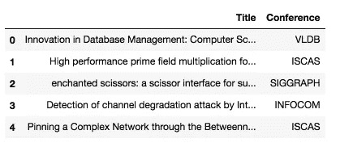
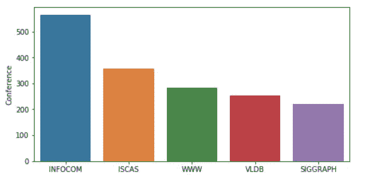
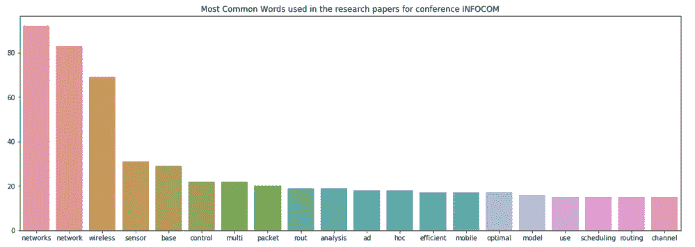
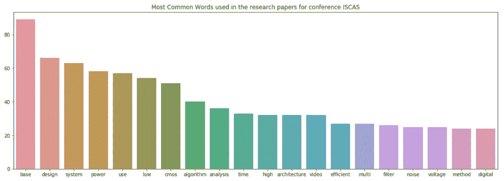

# Python 中基于空间的文本分类机器学习

> 原文：<https://towardsdatascience.com/machine-learning-for-text-classification-using-spacy-in-python-b276b4051a49?source=collection_archive---------1----------------------->


Photo Credit: Pixabay

[**spaCy**](https://spacy.io/) 是 Python 中流行且易于使用的自然语言处理库。它提供当前最先进的精度和速度水平，并有一个活跃的开源社区。然而，由于 SpaCy 是一个相对较新的 NLP 库，它不像 [NLTK](https://www.nltk.org/) 那样被广泛采用。还没有足够的教程可用。

在这篇文章中，我们将演示如何在没有任何深度学习经验的情况下使用 **spaCy** 实现文本分类。

# 数据

对于一个年轻的研究人员来说，寻找和选择一个合适的学术会议来提交他(或她)的学术论文常常是一件既费时又令人沮丧的事情。我们定义“合适的会议”,意思是会议与研究人员的工作一致，并有良好的学术排名。

使用会议进程数据集，我们将按照会议对研究论文进行分类。让我们开始吧。数据集可以在[这里](https://raw.githubusercontent.com/susanli2016/Machine-Learning-with-Python/master/research_paper.csv)找到。

# 探索

快速浏览一下:

```
import pandas as pd
import numpy as np
import seaborn as sns
import matplotlib.pyplot as plt
import base64
import string
import re
from collections import Counter
from nltk.corpus import stopwords
stopwords = stopwords.words('english')df = pd.read_csv('research_paper.csv')
df.head()
```



Figure 1

没有缺失值。

```
df.isnull().sum()
```

**标题 0
会议 0
dtype:int 64**

将数据拆分为定型集和测试集:

```
from sklearn.model_selection import train_test_split
train, test = train_test_split(df, test_size=0.33, random_state=42)print('Research title sample:', train['Title'].iloc[0])
print('Conference of this paper:', train['Conference'].iloc[0])
print('Training Data Shape:', train.shape)
print('Testing Data Shape:', test.shape)
```

***研究题目样本:配合 Smartness:在 Ad-Hoc 网络中使用异构智能天线。
本文发布会:INFOCOM
训练数据形态:(1679，2)
测试数据形态:(828，2)***

该数据集由 2507 篇简短的研究论文标题组成，已被分为 5 类(按会议)。下图总结了不同会议的研究论文分布情况。

```
fig = plt.figure(figsize=(8,4))
sns.barplot(x = train['Conference'].unique(), y=train['Conference'].value_counts())
plt.show()
```



Figure 2

以下是在 SpaCy 中进行文本预处理的一种方法。之后，我们试图找出提交给第一类和第二类(会议)的论文中使用的热门词汇——INFOCOM & ISCAS

```
import spacynlp = spacy.load('en_core_web_sm')
punctuations = string.punctuationdef cleanup_text(docs, logging=False):
    texts = []
    counter = 1
    for doc in docs:
        if counter % 1000 == 0 and logging:
            print("Processed %d out of %d documents." % (counter, len(docs)))
        counter += 1
        doc = nlp(doc, disable=['parser', 'ner'])
        tokens = [tok.lemma_.lower().strip() for tok in doc if tok.lemma_ != '-PRON-']
        tokens = [tok for tok in tokens if tok not in stopwords and tok not in punctuations]
        tokens = ' '.join(tokens)
        texts.append(tokens)
    return pd.Series(texts)INFO_text = [text for text in train[train['Conference'] == 'INFOCOM']['Title']]IS_text = [text for text in train[train['Conference'] == 'ISCAS']['Title']]INFO_clean = cleanup_text(INFO_text)
INFO_clean = ' '.join(INFO_clean).split()IS_clean = cleanup_text(IS_text)
IS_clean = ' '.join(IS_clean).split()INFO_counts = Counter(INFO_clean)
IS_counts = Counter(IS_clean)INFO_common_words = [word[0] for word in INFO_counts.most_common(20)]
INFO_common_counts = [word[1] for word in INFO_counts.most_common(20)]fig = plt.figure(figsize=(18,6))
sns.barplot(x=INFO_common_words, y=INFO_common_counts)
plt.title('Most Common Words used in the research papers for conference INFOCOM')
plt.show()
```



Figure 3

```
IS_common_words = [word[0] for word in IS_counts.most_common(20)]
IS_common_counts = [word[1] for word in IS_counts.most_common(20)]fig = plt.figure(figsize=(18,6))
sns.barplot(x=IS_common_words, y=IS_common_counts)
plt.title('Most Common Words used in the research papers for conference ISCAS')
plt.show()
```



Figure 4

INFOCOM 的热门词汇是“网络”和“网络”。显而易见，INFOCOM 是网络领域和密切相关领域的会议。

ISCAS 排名靠前的词是“基础”和“设计”。它表明 ISCAS 是一个关于数据库、系统设计和相关主题的会议。

# 带空间的机器学习

```
from sklearn.feature_extraction.text import CountVectorizer
from sklearn.base import TransformerMixin
from sklearn.pipeline import Pipeline
from sklearn.svm import LinearSVC
from sklearn.feature_extraction.stop_words import ENGLISH_STOP_WORDS
from sklearn.metrics import accuracy_score
from nltk.corpus import stopwords
import string
import re
import spacy
spacy.load('en')
from spacy.lang.en import English
parser = English()
```

下面是使用空间清理文本的另一种方法:

```
STOPLIST = set(stopwords.words('english') + list(ENGLISH_STOP_WORDS))
SYMBOLS = " ".join(string.punctuation).split(" ") + ["-", "...", "”", "”"]class CleanTextTransformer(TransformerMixin): def transform(self, X, **transform_params):
        return [cleanText(text) for text in X] def fit(self, X, y=None, **fit_params):
        return selfdef get_params(self, deep=True):
        return {}

def cleanText(text):
    text = text.strip().replace("\n", " ").replace("\r", " ")
    text = text.lower()
    return textdef tokenizeText(sample):
    tokens = parser(sample)
    lemmas = []
    for tok in tokens:
        lemmas.append(tok.lemma_.lower().strip() if tok.lemma_ != "-PRON-" else tok.lower_)
    tokens = lemmas
    tokens = [tok for tok in tokens if tok not in STOPLIST]
    tokens = [tok for tok in tokens if tok not in SYMBOLS]
    return tokens
```

定义一个函数来打印出最重要的特征，即具有最高系数的特征:

```
def printNMostInformative(vectorizer, clf, N):
    feature_names = vectorizer.get_feature_names()
    coefs_with_fns = sorted(zip(clf.coef_[0], feature_names))
    topClass1 = coefs_with_fns[:N]
    topClass2 = coefs_with_fns[:-(N + 1):-1]
    print("Class 1 best: ")
    for feat in topClass1:
        print(feat)
    print("Class 2 best: ")
    for feat in topClass2:
        print(feat)vectorizer = CountVectorizer(tokenizer=tokenizeText, ngram_range=(1,1))
clf = LinearSVC()

pipe = Pipeline([('cleanText', CleanTextTransformer()), ('vectorizer', vectorizer), ('clf', clf)])# data
train1 = train['Title'].tolist()
labelsTrain1 = train['Conference'].tolist()test1 = test['Title'].tolist()
labelsTest1 = test['Conference'].tolist()
# train
pipe.fit(train1, labelsTrain1)# test
preds = pipe.predict(test1)
print("accuracy:", accuracy_score(labelsTest1, preds))
print("Top 10 features used to predict: ")

printNMostInformative(vectorizer, clf, 10)
pipe = Pipeline([('cleanText', CleanTextTransformer()), ('vectorizer', vectorizer)])
transform = pipe.fit_transform(train1, labelsTrain1)vocab = vectorizer.get_feature_names()
for i in range(len(train1)):
    s = ""
    indexIntoVocab = transform.indices[transform.indptr[i]:transform.indptr[i+1]]
    numOccurences = transform.data[transform.indptr[i]:transform.indptr[i+1]]
    for idx, num in zip(indexIntoVocab, numOccurences):
        s += str((vocab[idx], num))
```

***精度:0.7463768115942029
用于预测的前 10 个特征:
第 1 类最佳:
(-0.9286024231429632，'数据库')
(-0.8479561292796286，'芯片')
(-0.7675978546440636，' wimax')
(。***

```
from sklearn import metrics
print(metrics.classification_report(labelsTest1, preds, 
                                    target_names=df['Conference'].unique()))precision    recall  f1-score   support

       VLDB       0.75      0.77      0.76       159
      ISCAS       0.90      0.84      0.87       299
   SIGGRAPH       0.67      0.66      0.66       106
    INFOCOM       0.62      0.69      0.65       139
        WWW       0.62      0.62      0.62       125

avg / total       0.75      0.75      0.75       828
```

给你。我们现在已经在 SpaCy 的帮助下完成了文本分类的机器学习。

源代码可以在 [Github](https://github.com/susanli2016/Machine-Learning-with-Python/blob/master/machine%20learning%20spaCy.ipynb) 上找到。过一个学习周末！

参考:[卡格尔](https://www.kaggle.com/)