# 面向编程障碍者的机器学习

> 原文：<https://towardsdatascience.com/machine-learning-for-the-programmatically-handicapped-4a786fe43f47?source=collection_archive---------8----------------------->

## 机器学习是什么，如何和为什么:解释…

所以你已经听过几次 20 世纪最常用的术语“机器学习”，你真的很想尝试一下。能有多糟呢？有时候，当你上网在 **Github、**上搜索一些知识库时，你会看到长长的先决条件列表:高级数值计算学位、机器学习博士学位、工程学位、独角兽的血和龙的角。

**轰**！你成为深度学习专家的梦想和愿望比 Chicxulub 下降得还快。

## 使用机器学习算法不一定要成为工程师

了解一些基本的 **Python** 语法？完美！这就是你所需要的。嗯，网上看起来没那么简单吧？**编码基础知识**和和**钢铁意志**是你需要的唯一先决条件，这将使你成为你一直梦想的机器学习摇滚明星！

## 学习数学

为了完全成为一名 ML 专家，你需要精通 ML 的概念。在不知道基本背景过程的情况下编写 ML 算法就像把一只海龟放在障碍赛中并期望它跳跃。所以不可能！

Coursera、Udemy 和 Udacity 教授初学者著名的 ML 算法背后的概念和数学。关于他们的**应用**和**实现**的内容和资源也可以在网上找到。研究它们，了解是什么让它们如此通用、实用和用户友好。

## 神经网络是如何工作的？

你可能会想，看似如此复杂的事情，怎么会如此顺利地给出对你的公司最重要的预测。

简单来说，神经网络是一个受人类大脑启发的 ML 模型。你大脑中的神经元或脑细胞从一端向另一端反复发射小电脉冲，使信息从一个区域发送到另一个区域。这让你在被要求时想到大猩猩，或者在数学考试时进行逻辑思考和处理信息。

整个神经网络结构是一个连续的**管道**，其中一个计算隐藏层的输出是下一个的输入，直到它到达最终输出层来传递预测。这个新生成的预测数据通过称为**反向传播、**的过程通过隐藏层返回到输入节点，同时更新其权重。

数据陷入这种恶性循环，直到偶然发现最准确的答案。每层都有几个**输入节点**，对数据进行多重计算。它操纵数据，到处扔和拉伸数据，以得到可能的最佳答案。在直觉上，这就像用一堆不同的方法拧湿毛巾，看看哪一种方法能让最多的水滴掉出来。

这些数据被发送到它前面的隐藏层，对前一层生成的数据执行更复杂的**计算。**

这个循环一直持续到最后一层，即**输出层**。这一层中的节点包含整个神经结构的最终预测。最精彩的部分？所有这些都可以在 **100 行**代码内实现！

这可能看起来令人生畏。然而，我向你保证，我会尽可能简单。有了一步一步的指导，你注定会成为机器学习**大师**！

我看得出你脸上已经有了笑容。“没我想象的那么差！”，你可能会惊呼！

## 使用 Python 制作人工神经网络(ANN)

我通常使用 Octave GUI 来实现 ML 算法，因为它的语法易于阅读，而且学习起来耗时最短。然而，Python 是一种新兴的 ML 语言，我们现在将使用它。

我们将构建一个具有两个隐藏层的人工神经网络，它将对我们给它的数字执行功能，以最少的时间和最少的错误预测 **XOR 值**。

## 我们的 Python 模块和框架

我们将使用的包和模块将会非常少。我们需要的是接受一组值并将其压缩成一个向量(n*1 维矩阵)的东西。为什么 **NumPy** ？它很轻，用途广泛，足以用作我们的基础包，帮助我们塑造矢量，并对其中的元素进行数学和科学计算。

接下来，我们导入**时间**。时间是一个完美的模块，可以让我们知道自从上次**体重更新**以来已经过去了多长时间。

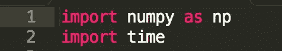

## 我们的超参数

超参数是**调谐旋钮**，它控制着我们的神经网络的行为和表现。这些超参数可以根据您的数据集包含的**训练示例**的数量或者您的 ML 算法的**复杂性**而改变。

所以，如果你输入了错误的数字，把你的屏幕炸了，也不用担心。它们可以**随时**重新调整！

我们现在选择隐藏层中节点数的值 ***n_hidden*** ，输入节点数 ***n_in*** ，输出节点数 ***n_outputs*** ，批量大小 ***n_sample*** ，我们的学习速率***learning _ rate***，以及

设置 ***n_hidden*** 到 **10** ， ***n_in*** 到 **10** ， ***n_outputs*** 到 **10** ， ***n_sample*** 到 **300** ，***learning _ learn***

(这些数字已经过测试，到目前为止，它们给出了最好的结果。)

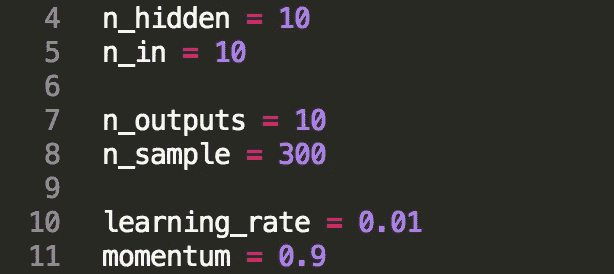

请记住，迭代次数越高，人工神经网络就越精确。然而，计算最佳统计输出所需的总时间**会增加**。

*(你可以随便摆弄这些值。然而，有些可能会损害程序的结果；所以要警惕。)*

## 播种我们的进步

我们希望我们所有的结果都是从同一基线计算出来的。当该算法在一次迭代中计算完几个值后，它会返回到最初的起始点 **0** ，用存储器中的新值重新进行整个计算。这个过程叫做**播种**。

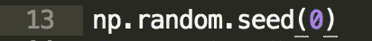

## 激活函数 Sigmoid

激活功能是激活并调用下一层以开始对前一层中的节点的输出执行大量操作和计算的功能。在这种情况下，我们的输入节点是第一层的一部分。因此，自然地，我们从第一层的输出是在训练例子中使用的数字。

**Sigmoid 函数**是我们的主要激活函数**g(*z*)**were***z***是接受我们第一个向量中的特征值的参数，即我们的 X 值(我们的特征向量)。我们来写这个函数吧！

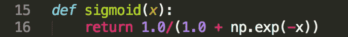

## 激活函数 tanh_prime

我们的第二个激活函数帮助激活我们的第二个隐藏层，并使它能够对**s 形层**的输出执行计算。让我们继续以同样的方式写作。py 文档。

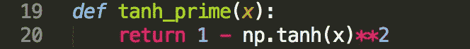

## 我们的培训职能

函数 **train()** 将获取第二个隐藏层产生的值，并将训练我们的 ML 算法来正确地识别我们的**测试数据**，这将在本文稍后介绍。下面的代码帮助我们的算法从错误中学习，以最少的时间和错误完全预测事件的可能性或**概率**。

通过**交叉熵**，我们检查并验证一个事件发生的概率，在这种情况下，一个数字的概率要么是 1，要么是 0。这消除了所有关于事件在我们的输入数据集中发生的非自然概率或可能性(异常)的疑问。

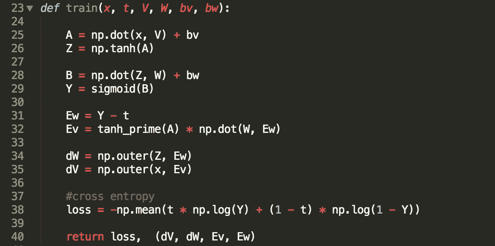

## 圣杯:预测()函数

这是神经网络的缩影。我们期待已久的时刻。到目前为止，我们编写的所有函数都是这个最终函数。 **predict()** 函数返回由人工神经网络计算的最终预测值，以及花费的时间和误差。花费的时间和损失(误差)应该是减少的。与实际预期输出相比，这些值确实非常**准确**。我们开始吧，好吗！

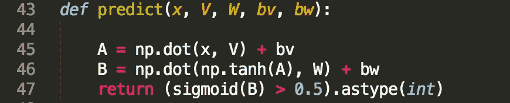

这段代码看起来很小，也不吓人。但是不要被它的外表所迷惑。这几行代码会影响算法如何预测整个问题的结果。

## 创建图层并生成输入数据

我们离想要实现的目标只有几步之遥！现在，我们创建我们的隐藏层。这些层接收输入数据，并将它们输入到我们的节点，节点对它们进行计算，并调整和更新它们的权重。

为了生成新的数据，我们简单地调用一个 **NumPy** 函数，使用我们的样本/批量大小和输入节点维度随机得出几个值(1 或 0)。这些数字成为我们输入向量的元素。

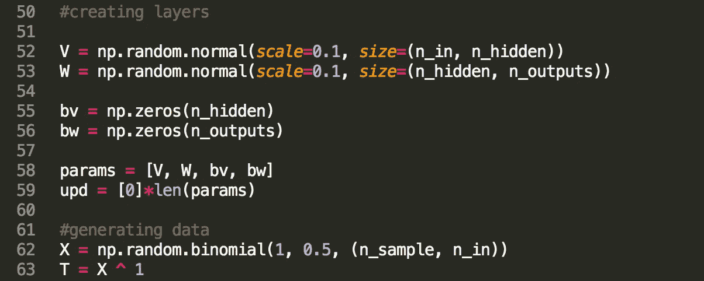

## 训练我们的算法

我们现在运行一个 for 循环来更新训练过程中的权重。准确度应该随着我们的历元计数而增加。我们还启动计时器来计算自更新过程开始以来经过的毫秒数。同时，我们运行另一个嵌套循环来预测每次迭代后最佳拟合预测线的损失和梯度。

程序运行 100 次迭代。

我们将在终端打印历元计数、损失和时间，以观察和检查我们的进展和准确性。当历元计数增加时，损失和花费的时间应该有下降的趋势(花费的时间可能在增加和减少之间波动。就可以了)。

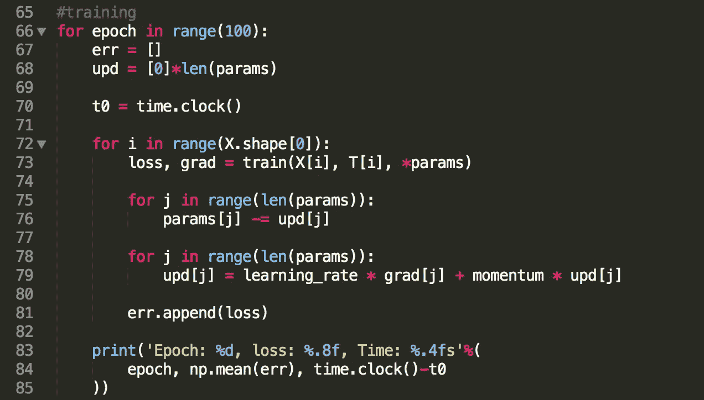

## 预测输出概率

我们现在已经完成了我们的人工神经网络算法的编写！现在，剩下要做的就是调用我们之前写的预测函数。

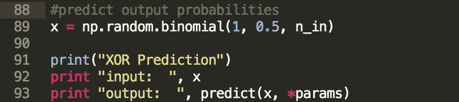

我们终于完成了！恭喜你！让我们在终端中运行程序，看看我们珍贵的创造的结果。

## 运行程序

我们已经写完了我们的 ANN！此外，这一切都在 100 行简单的“可解读的”Python 代码之内！除了经营我们的劳动果实还剩下什么！终端运行我们在 testin 训练函数中编写的循环的**。控制台上打印出**损耗**、**耗时**和**历元计数**。精确度应该随着我们拥有的历元/迭代的数量而增加。**

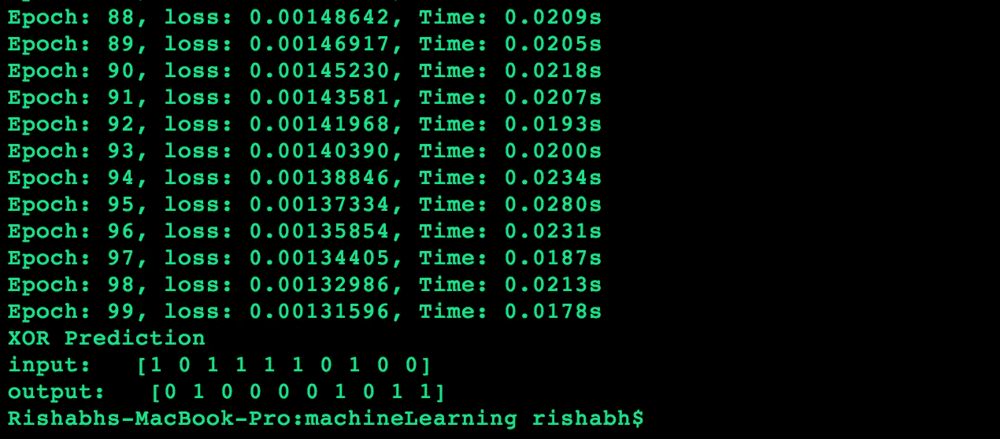

## 简单地

你不需要有任何机器学习的相关经验来构建算法。通过构建人工神经网络，了解计算机科学基础知识足以让你在这个神奇、复杂的机器学习世界中成为一名雄心勃勃的人。

人工神经网络被广泛应用于整个企业领域，因为它们是最可靠和准确的。无论是苹果的 **Siri** ，谷歌的**搜索**还是脸书的**新闻推送**，机器学习都被广泛使用。洗钱正在以难以想象的速度增长和扩散，我们如何利用它，取决于我们自己。在那之前，下一集再见！

原创文章作者，[里沙卜·阿南德](https://medium.com/u/50c04ecf0ec5?source=post_page-----4a786fe43f47--------------------------------)