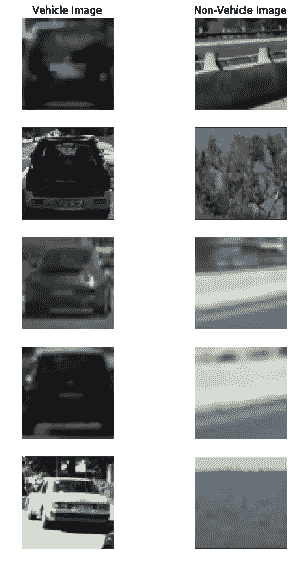
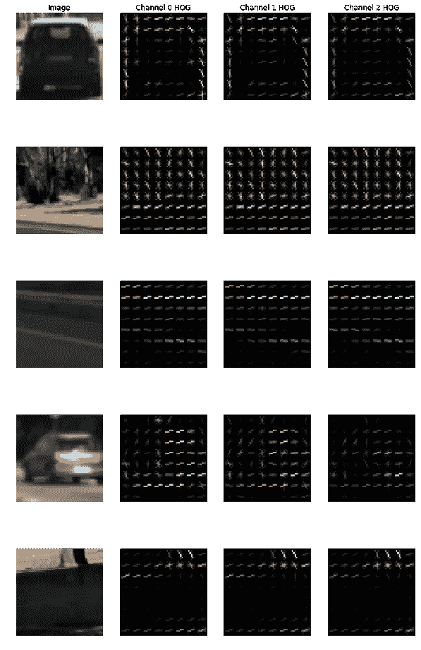
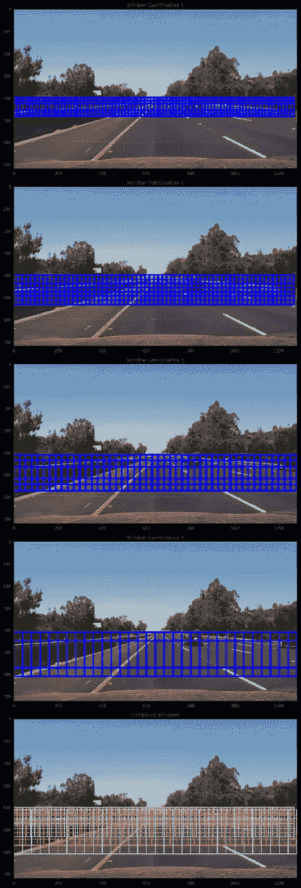
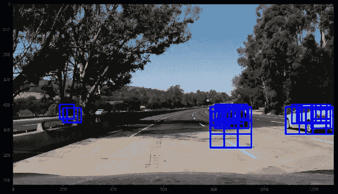
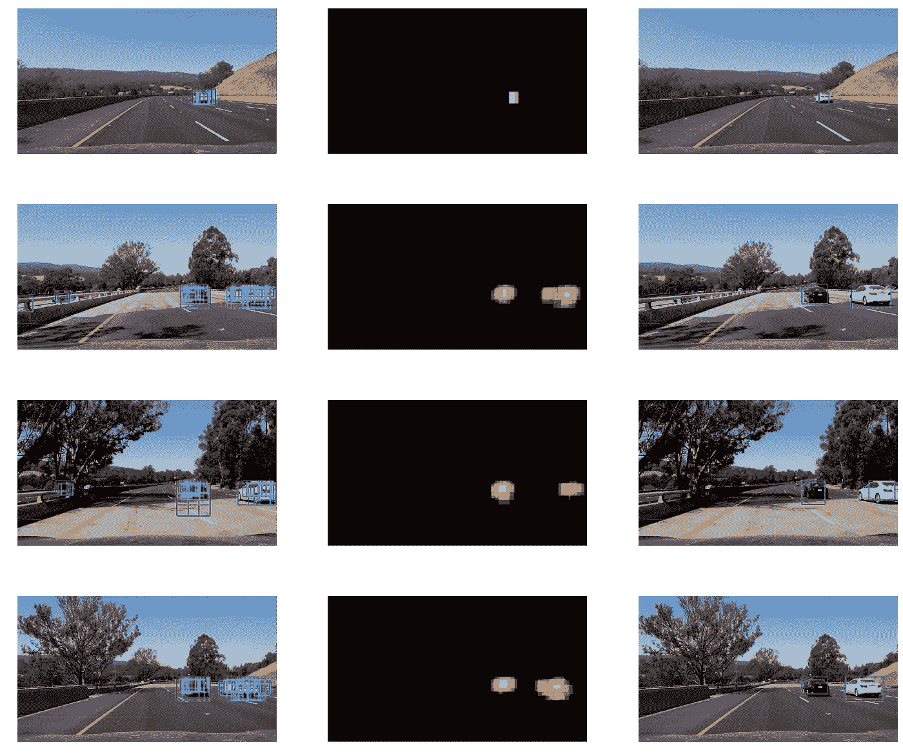
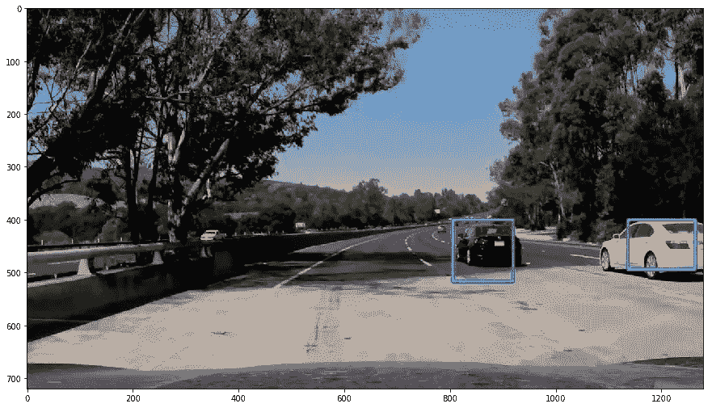

# 用于车辆检测的机器学习

> 原文：<https://towardsdatascience.com/machine-learning-for-vehicle-detection-fd0f968995cf?source=collection_archive---------4----------------------->

我训练了一个支持向量机(SVM)模型来检测道路上的移动车辆。这是 [udacity 自动驾驶汽车工程师课程](https://eu.udacity.com/course/self-driving-car-engineer-nanodegree--nd013)的第五个项目。

这个项目的代码可以在: [Github](https://github.com/Moataz-E/machine-learning-vehicle-detection) 上找到。
这篇文章也可以在我的网站[这里](http://www.moatazelmasry.com/projects/machine-learning-vehicle-detection/)找到。

该项目包括以下几个阶段:

1.  对数据集执行要素工程。
2.  在提取的特征上训练 SVM 分类器。
3.  实现滑动窗口技术来检测图像中车辆。
4.  使用热图过滤非车辆窗口，并在车辆周围绘制边界框。
5.  产生一个管道，并生成结果的视频。

本项目的训练数据集由以下样本中的车辆和非车辆图像组成:

Figure 1\. Sample vehicle and non-vehicle images from training dataset

**总的来说，训练集包含 8，793 幅车辆图像和 8，968 幅非车辆图像。**

# 特征工程

项目的第一步是对训练数据集执行[特征工程](https://en.wikipedia.org/wiki/Feature_engineering)，以确定要使用的理想特征描述符。考虑了三个特征描述符:[方向梯度直方图(HOG)](https://en.wikipedia.org/wiki/Histogram_of_oriented_gradients) 特征、[空间宁滨](https://en.wikipedia.org/wiki/Data_binning)特征和[颜色直方图](https://en.wikipedia.org/wiki/Color_histogram)特征。

研究人员 Navneet Dalal 和 Bill Triggs 在他们的论文《人类检测的梯度方向直方图》中普及了 HOG 特征描述符。HOG 计算图像局部的梯度方向分布。以下是图像三个颜色通道中每一个的图像样本上的 HOG 特征的可视化:

Figure 2\. Visualization of HOG features for different colour channels.

如何计算 HOG 的详细描述可以在这篇文章中找到。

使用的第二个特征描述符是空间宁滨；为了计算这个特征描述符，使用了 OpenCV 的 [resize](https://docs.opencv.org/2.4/modules/imgproc/doc/geometric_transformations.html#resize) 函数。缩小图像时，resize 函数执行线性插值空间宁滨运算。

使用的第三个特征描述符是颜色分布(直方图)。计算图像中每个颜色通道的直方图，然后将三个直方图组合起来产生一个特征向量。

实验表明，图像最初被转换到 [YCbCr](https://en.wikipedia.org/wiki/YCbCr) 色彩空间，这是在预测过程中获得最高准确度的理想色彩空间。然后，从三个特征描述符中的每一个构建每幅图像的组合特征向量。该组合的特征向量是用于训练预测模型的特征向量。

# SVM 培训

随着我们的特征工程的完成，下一步是实现一个预测模型，该模型能够计算出特征向量是属于车辆还是非车辆。

选择线性[支持向量机(SVM)](http://scikit-learn.org/stable/modules/generated/sklearn.svm.SVC.html) 模型作为预测算法。我摆弄了一下模型的超参数；C 值为 0.001，最大迭代次数为 10，000，可获得约 98%的高精度。以下是用于实现该模型的代码:

该模型需要大约 12 分钟来训练，这对于机器学习模型来说是相对较短的时间。

# 滑动窗口搜索

为了在视频源上使用我们的预测模型，我们需要提出一种合适且一致的分割算法，让我们能够搜索我们的视频源图像。搜索算法应该从图像中返回子图像，然后将这些子图像输入到我们的模型中进行预测。一种这样的搜索算法是滑动窗口搜索技术。

滑动窗口搜索根据预先选择的比例将搜索区域分割成较小的相同大小的重叠区域。在我们的例子中，我们需要不同比例的滑动窗口区域来说明这样一个事实，即远处的汽车看起来较小，而近处的汽车看起来较大。以下是滑动窗口搜索的四种不同组合，最后一幅图像中的最终组合窗口:

Figure 3\. Sliding-window search technique with different scale combinations. Final image is of all sliding-window search areas combined.

上述滑动窗口搜索被应用于视频帧中的每个图像。**总共有 697 个窗口被输入到每个图像的模型中。**

# 热图阈值

当我们将提取的窗口输入预测模型时，结果是检测到车辆的窗口列表(各种比例)，如下图所示:

Figure 4\. Sample image with positive windows identified as containing a vehicle.

现在考虑到 SVM 模型的简单性，我们预计有些检测是假阳性的。为了过滤掉这些不正确的检测，一种方法是对我们的正窗口进行阈值处理，使得我们只挑选多于一个窗口重叠的区域。本质上，我们正在生成正窗口的热图。

下图显示了应用于搜索图像的热图阈值:

Figure 5\. Heatmap thresholding applied to images with positive detections.

此外，使用生成的热图，我们可以使用距离热图中心最远的像素位置来计算检测到的对象上的边界框。这些边界框用于根据上图最后一列中的一组图像直观地识别我们检测到的汽车。

下图显示了显示在检测到的车辆顶部的边界框:

Figure 6\. Display of bounding boxes around positively detected vehicles.

# 最终管道

最终结果是，对于提要中的每个图像，管道如下所示:

1.  从图像中提取所有搜索窗口。
2.  将每个窗口图像转换到 YCbCr 颜色空间并提取特征。
3.  将每个特征输入 SVM 模型，过滤掉非正匹配(非车辆)。
4.  将热图阈值应用于正匹配并绘制边界框。

管道是在汽车行驶的录像上运行的。下面是一段演示管道运行的视频: