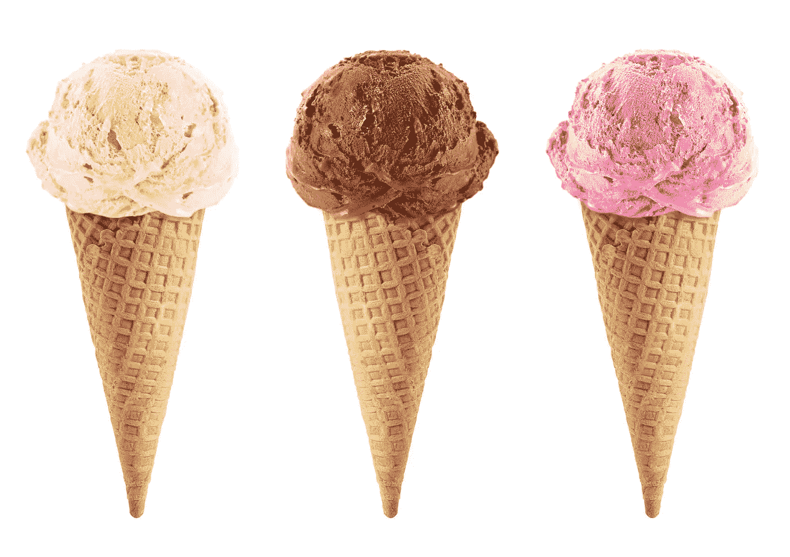
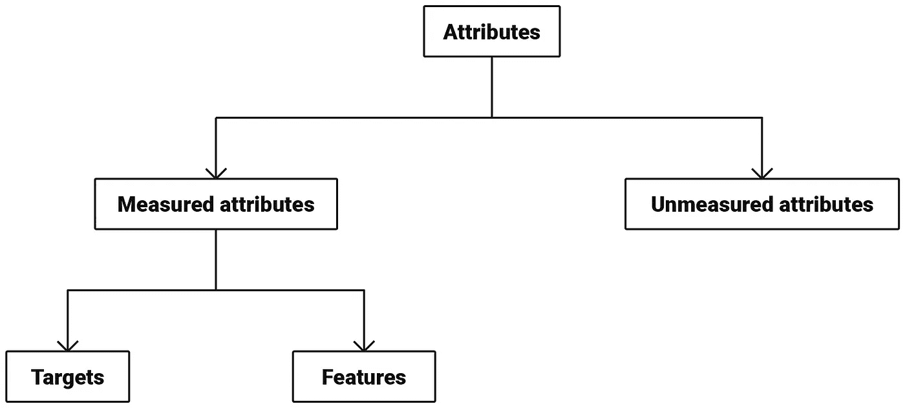

# 从零开始的机器学习:第 1 部分

> 原文：<https://towardsdatascience.com/machine-learning-from-scratch-part-1-76603dececa6?source=collection_archive---------5----------------------->

## 属性和模式

# 目录

*   第 1 部分:属性和模式
*   [第二部分:收集和数据](/machine-learning-from-scratch-part-2-99ce4c78a3cc)
*   [第三部分:数组和表示](/machine-learning-from-scratch-part-3-ed572330367d)
*   [第四部分:功能和分类器](/machine-learning-from-scratch-part-4-10117c005a28)

这是关于机器学习的全新系列的第一篇文章。每篇文章都将基于五个核心原则:

1.  我的主要目标是让读者对应用机器学习的基础有一个深入的了解。如果你想建立一个坚实的基础来分析人工智能对你的行业和个人生活的影响，那么这个系列就是为你准备的。
2.  该计划将涵盖最成功的机器学习模型以及一些最新验证的研究趋势。我不会讨论任何失败的方法，也不会讨论任何尚未得到实证支持的推测性想法。
3.  该材料是独立的，一步一步地发展了应用机器学习的基础。说高中数学是先决条件是言过其实了。有些文章将涵盖集合、导数和线性模型等基本主题。
4.  每一个概念都会用至少一个例子来解释。我认为处理一个抽象话题的最有效的策略之一是将其提炼为一个简单的案例，用生动的例子使其具体化，并最终重建整体图景。当它看起来有用的时候，文本会用视觉来完成。
5.  其他一切都取决于反馈、实验和学习。欢迎随时提问和建设性反馈！

让我们开始吧。

# 什么是机器学习？

机器学习使用计算机通过识别数据中的模式来预测未知的对象属性。

机器学习兴起的最重要原因是它在广泛的不同领域取得了成功，包括图像、声音、视频、文本、软件代码、粒子碰撞、化学描述符、DNA、社交网络和金融数据。

有趣的是，构成大多数机器学习系统的积木数量比人们想象的要少。对于许多深度神经网络来说尤其如此，这些将在后面的章节中详细介绍。

换句话说，我们可以将少量的基本元素组合成系统，这些系统对于图像分类、问题回答和自然语音合成等各种应用都有巨大的价值。

虽然机器学习可以应用于许多不同的领域，但生产中的大多数系统都是针对单一目的和特定类型的过程对象进行优化的。

例如，计算机视觉系统专门从事与图像或视频相关的任务，如交通标志识别[1]和医学图像分类[2]。

# 目标

既然机器学习处理的是未知的对象属性，那么一个自然的起点就是谈论对象。

出于本教程的目的，**对象**是任何具有属性的东西。

我承诺过我会将抽象的概念具体化，并在适当的地方使用视觉效果。这张照片展示了三个典型的(欲望)对象:

Fig. 1: Image by [Rawan Hussein](https://www.123rf.com/photo_29581169_chocolate-vanilla-and-strawberry-ice-cream-in-the-cone-on-white-background-with-clipping-path-.html)

在其他属性中，每一勺冰淇淋都有独特的味道、呈现的颜色范围、受欢迎程度、售价等等。

(三三勺冰淇淋共有的一个属性是，它们比华夫饼干筒有更多有趣的属性。)

# 属性

一个**属性**是表征一个对象的东西。

让我提前警告你。我喜欢概念树。因此，在本系列的课程中，您将会看到其中的许多内容。这是第一个:

Fig. 2

在高层次上，我们可以区分可度量的属性和不可度量的属性。

许多属性是可测量的。简单的例子包括一勺冰淇淋的重量和在特定地点和时间单位的销售价格。在可测量的属性中，只有一小部分会在项目期间作为数据收集活动的一部分被实际测量。

其他属性将不会被衡量，因为它们要么是不相关的，超出了我们目前的理解或超出了我们的预算。据推测，大脑具有我们可以测量的属性，从而创造出完美的新冰淇淋口味。然而，在实践中，这种努力受到我们对大脑如何产生品尝美味冰淇淋的主观体验以及所需扫描设备上的价格标签的不完善理解的限制。

# 测量属性

让我们进一步将测量的属性分成两个子类型:

*   目标
*   特征

**目标**是我们关心并希望预测的属性。

一些基本上同义的术语是*因变量*、*未观察变量*、*解释变量*、*输出变量*和*结果测量*。

[我应该指出，机器学习中使用的一些概念在其他社区中以不同的名称为人所知。在许多方面，机器学习是统计学的后代，这两个领域之间有很强的重叠。因此，当你深入研究文献时，你可能会遇到统计学家喜欢的变体。

当引入一个新术语时，我会提到一些常用的同义词，然后始终使用机器学习社区中最流行的变体，并且最符合整体情况。]

通常情况下，目标对于某些物体来说是已知的，而对于其他物体来说是未知的。例如，我们可能希望在某种程度上根据已知的历史销售数据来预测未知的未来销售数据。

**特征**是与目标(潜在)相关的属性。

例如，产品的价格与对该产品的需求有关。这种关系可能很强，也可能很弱，取决于具体情况[3]，但是价格肯定是首先应该想到的特征之一。

在其他社区中，特性通常被称为*自变量*、*观察变量*、*解释变量*和*输入变量*。

# 属性值

**属性值**是关于特定对象的属性值。

如果目标是下一季度的销售数字，那么**目标值**的一个例子可以是 8000 台。

类似于目标，我们可以使用术语**特征值**来指代关于特定对象的特定特征的值。以美元表示的价格特征的值可能是 99.99。

# 模式识别

机器学习基于这样的前提，即特征和目标之间存在以可预测的方式重复的关系。让我们把这些关系称为**模式**。

如果我们生活在一个没有模式的世界，机器学习就没有任何用处，本教程也不会被编写或阅读。幸运的是，我们所处的宇宙是高度结构化的。经验科学的成功[4]证明了模式是存在的，而且是可以被发现的。

在不太遥远的过去，人们付出了巨大的努力来设计特定任务的功能。例如，有大量关于为某些计算机视觉问题开发的功能的文献，例如机器人识别房间中物体的能力。[5]

在过去的十年中，机器学习的进步使得在某种程度上自动搜索特征成为可能。[6]

# 计算机视觉的一个例子

为了总结这篇文章，让我们用一个具体的例子来更深入地了解特性和目标之间的关系。

Fig. 3: Photo by [Patrick Berry](https://www.flickr.com/photos/pbarry/4429503485) / CC BY-SA 2.0

假设你刚开始开发一个系统，目标是自动识别照片中的动物。

上面的照片显示了一个猩猩妈妈和她的婴儿，这个事实对我们来说是显而易见的。

然而，对于计算机视觉系统来说，这远非显而易见。在发展初期，它没有任何关于猩猩、母亲或婴儿的知识。

在我描述我们能做些什么来改变这种情况之前，我想问你一个问题。

你如何解决这个任务？也就是你怎么理解上面的照片是两只猩猩？

人类的视觉(一般来说是灵长类的视觉)是如此高效，而且几乎不需要有意识的努力，以至于可能需要一段时间才能得出一个精确而令人信服的答案。

我建议你停下来想一想。在这样做的时候，你可能会预料到下面描述的一些想法，并最终意识到至少某些形式的机器学习比它们看起来更直观。

部分答案是，我们过去见过类似的猩猩照片。

在某些情况下，我们看到了相关的图像，但没有太多的描述或背景。例如，我们可能在浏览电视频道或脸书频道时短暂地看过这些类人猿。

在其他情况下，猩猩的图像与某些信息一起呈现，这让我们很容易识别模式。这可能是在纪录片，参观动物园，学校课程或其他学习机会。

其中一种模式是猩猩有橙红色的棕色头发。这一显著特征的存在使得许多其他可能性大大降低。

另一个相关的方面是他们半孤独的生活方式。除了它们形成的强烈的母子关系，猩猩通常是单独出现的。在其他条件相同的情况下，同一张照片上出现许多个体可能是猩猩缺席的一个特征。

我们可以关注的另一个信息来源是背景。作为最大的树栖动物，猩猩经常出现在显示它们生活的森林树冠的照片上。

这是对一些高级特征的直观描述，我们可以用这些特征在图像中检测我们的进化亲属。后面的教程将描述机器学习模型如何学习特征的层次结构来分类图像。值得注意的是，这些特征中的一些将被证明是容易解释的，并且与灵长类动物视觉中使用的特征有一定程度的相似性。

# 监督机器学习

收集相关数据和识别模式以生成预测的工作流是所谓的**监督(机器)学习**的本质。在该设置中，目标值(例如，特定内容的存在与否)对于一些对象(例如，图像)是已知的，而对于其他对象是未知的。

在计算机视觉的背景下，我们作为教师向学习者(计算机/机器人)展示示例图像，提供内容的简要描述，强调某些特征，并选择帮助学习者“看到”数据中的模式的策略。

只要稍加调整，同样的过程就可以用在开头提到的许多不同领域，从文本和声音到化学结构和社会网络。

我们将逐渐使这种直觉变得精确，并将其整合到一个概念网络中，让你能够理解机器学习应用。

本文的重点是属性、模式和计算机视觉。第二部分用自然语言处理的例子来观察数据的收集。

# 感谢您的阅读！如果您喜欢这篇文章，请点击“鼓掌”按钮并跟随我阅读本系列的下一篇文章。

# 参考

[1]cire An d .，Meier u .，Masci j .和 schmid Huber j .，2012 年。用于交通标志分类的多列深度神经网络。*神经网络*， *32* ，第 333–338 页。

[2] Esteva，a .，Kuprel，b .，Novoa，R.A .，Ko，j .，Swetter，S.M .，Blau，H.M .和 Thrun，s .，2017。用深度神经网络对皮肤癌进行皮肤科医生级别的分类。*性质*， *542* (7639)，第 115 页。

[https://en.wikipedia.org/wiki/Price_elasticity_of_demand](https://en.wikipedia.org/wiki/Price_elasticity_of_demand)

[https://en.wikipedia.org/wiki/List_of_equations](https://en.wikipedia.org/wiki/List_of_equations)

[5] Lowe 博士，1999 年。基于局部尺度不变特征的物体识别。《计算机视觉》, 1999 年。第七届 IEEE 国际会议论文集(第 2 卷，第 1150-1157 页)。Ieee。

[6] Krizhevsky，a .，Sutskever，I .和 Hinton，G.E .，2012 年。基于深度卷积神经网络的图像网分类。在*神经信息处理系统的进展*(第 1097-1105 页)。