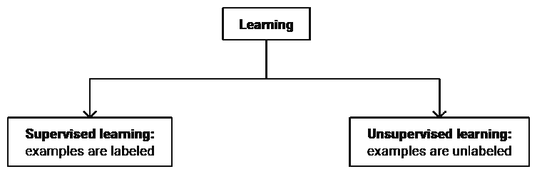
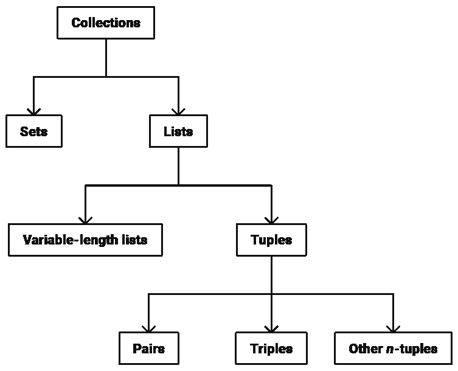
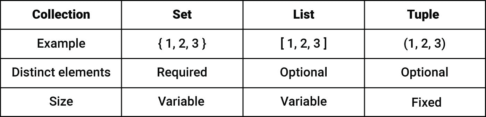
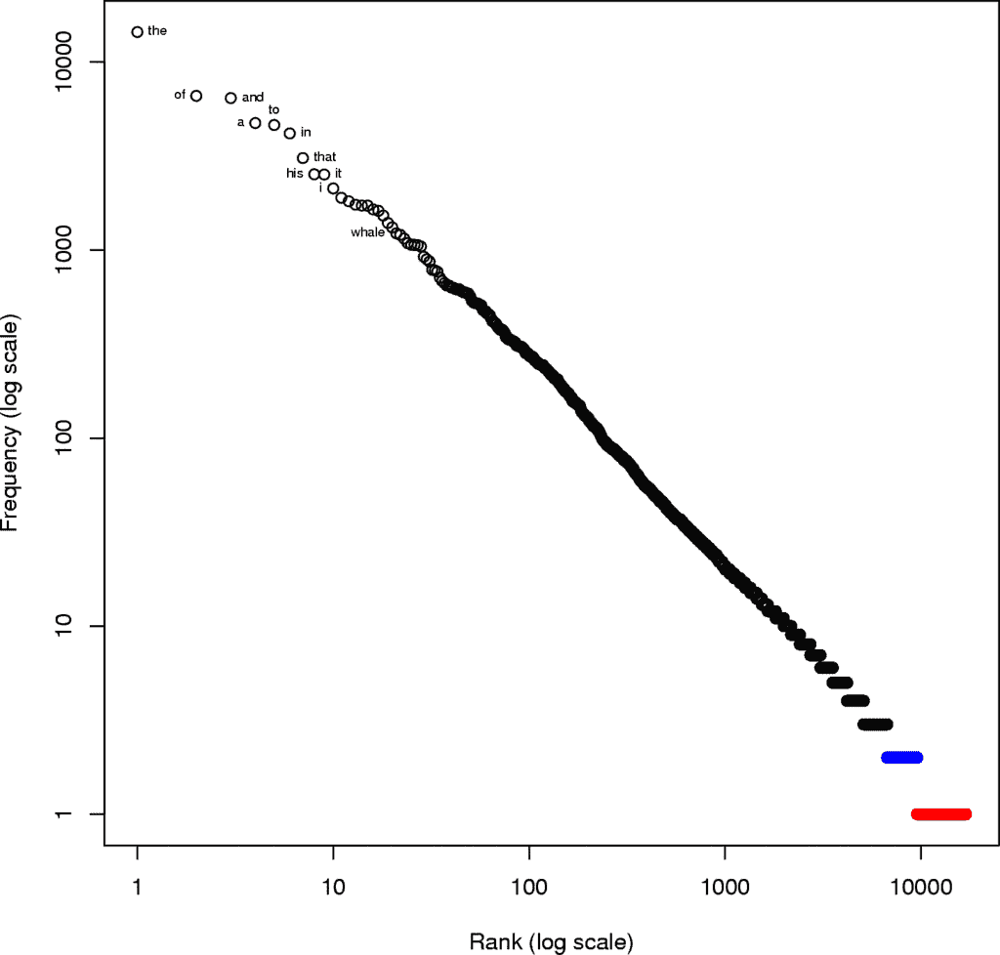

# 从零开始的机器学习:第 2 部分

> 原文：<https://towardsdatascience.com/machine-learning-from-scratch-part-2-99ce4c78a3cc?source=collection_archive---------4----------------------->

## 集合和数据

# 目录

*   [第 1 部分:属性和模式](/machine-learning-from-scratch-part-1-76603dececa6)
*   第 2 部分:集合和数据
*   [第三部分:数组和表示](/machine-learning-from-scratch-part-3-ed572330367d)
*   [第四部分:功能和分类器](/machine-learning-from-scratch-part-4-10117c005a28)

非常感谢您的关注和积极反馈！我很高兴看到你们许多人认为这些材料很有用。这个系列正在逐渐发展成为一个关于应用机器学习中最重要主题的全面和独立的教程。

[上次](/machine-learning-from-scratch-part-1-76603dececa6)，我们重点讲了属性和模式。本文的第一部分通过对数据集和集合的讨论扩展了我们的概念工具箱。第二部分将介绍自然语言处理并应用新概念。

# 数据

## 数据点

当您听到术语“数据”时，首先想到的一些联想是*收集、计数、评估、记录、测量、量化、评级、测量、跟踪和称重*。这些活动为机器学习提供了宝贵的原材料。

**数据**是测量属性值的任意集合。生物标记、财务数据、销售数据、网络连接、调查反馈、用户活动、视频记录、字数和你最喜欢的冰淇淋店的口味数量都属于数据范畴。

一个**数据**是一个属性值的单一测量。一个数据是这篇文章的字数(2268)。

假设我们对一组特定的属性感兴趣，并在多个场合测量它们的值——可能是在不同的时间、不同的位置或针对不同的对象。在这些场合中的任何一个进行的这种测量的集合是一个**数据点**。

例如，健身追踪器可以测量心血管表现、活动水平和睡眠质量。在特定时间为特定人收集的数据构成一个数据点。

## 例子

**示例**是为了解决机器学习问题而收集的数据点。

如果我们想预测在线广告的表现，每个例子都将描述过去发生的广告的特定显示。这包括关于广告的位置、格式和设计的特征，以及关于向其呈现的用户的某些词语和人口统计数据的存在或不存在。

一个例子是当**包括目标值时被标记为**，而当目标值不存在时**未被标记为**。

在广告示例中，当示例包括性能测量时，例如指示广告是否被点击的是/否值，则该示例被标记。

# 数据集

一个**数据集**是例子的集合。

监督学习使用带有标记示例的数据集。无监督学习是一种学习类型，将在后面的章节中介绍，它试图在未标记的例子中识别模式。

Fig. 1

在开发过程中，数据集被用作模式识别的来源，并用于评估机器学习系统的性能。

在生产中，系统会显示新的数据点。这些数据点通常相似，但很少与开发过程中可用的示例相同。

# 收集

数据排列在**集合**中。

下面的树显示了将在本系列中使用的集合类型:

Fig. 2

两种基本的集合类型是集合和列表。

## 设置

一个**集合**是不同对象的集合。换句话说，没有一个对象可以出现一次以上。属于一个集合的对象称为**成员**或**元素**。集合中元素的数量被称为它的基数或集合的大小。

特定集合用大写字母表示。集合的成员用小写字母书写。

花括号表示集合中对象的集合。一组基本的冰淇淋口味可以是这样的: *S = {香草、巧克力、草莓}。*

元素 x 属于集合 *S* 的事实被写成 *x ∈ S* 。集合 S 的大小用竖线表示: *|S|* 。

在上例中，我们有 *vanilla ∈ S* 和 *|S|=3* 。

## 列表

相反，**列表**是一个集合，其中的对象可以出现不止一次。属于列表的对象被称为**项**或元素。一个列表包含的项目数被称为列表的**大小**或**长度**。

我将使用方括号来表示列表。客户在我们的基本冰淇淋店订购两勺草莓冰淇淋和一勺香草冰淇淋，可以通过下面的列表表示:*【草莓，草莓，香草】。*

注意，在这种情况下，列表是正确的选择。使用集合表示订单的企业将无法提供正确数量的冰淇淋。

## 可变长度的元组和列表

列表可以进一步分为两个子类型:

*   元组(固定长度的列表)
*   可变长度列表

元组是固定长度的列表。换句话说，您既不能添加其他项目，也不能删除任何现有项目。

长度为 2 和 3 的元组分别被称为**对**和**三元组**。在这个系列中，长度为 1 的元组不太可能很快被使用。(为了完整起见，我将他们称为*单身族。)*长度为 4 或更长的元组使用两种不同的命名方案。有些人更喜欢拉丁前缀，称这些列表为四元组、五元组、六元组等。其他人更喜欢称它们为 4 元组、5 元组、6 元组等等。

元组用括号表示，可以用来表示数据。

假设您正在运营一个电子商务网站，该网站提供单一产品并允许客户发布评级。在这种情况下，评级的基本表示形式是一对:*(客户 id，评级)。*一旦您向站点添加第二个产品，格式需要从一对扩展到三对:*(客户 id，产品 id，评级)*。当您提供多种产品并允许客户随时更改他们的评分时，第四项是必需的:*(客户 id、产品 id、日期和时间、评分)*。

换句话说，元组的长度通常取决于您想要编码多少上下文信息。

当项目数量变化或无法预先预测时，使用**可变长度列表**。可以添加新项目，也可以删除现有项目。除非另有说明，术语*列表*总是指可变长度的列表。

为了结束我们对基本集合的讨论，我将概述我们已经讨论过的三种类型:

Fig. 3

## 高阶集合

在我忘记之前，关于这个主题还有最后一件事:集合可以被组织在集合中。

换句话说，我们可以有集合的集合、列表的集合、元组的集合、集合的列表、列表的列表、元组的列表、集合的元组、列表的元组和元组的元组。我将这些对象称为**高阶集合**。

例如，图像可以通过红/绿/蓝像素强度来表示。对于这三个颜色通道中的每一个，我们都有一个强度列表。图像整体可以看作是三个列表的列表。几个图像依次形成三个列表的列表。

有人提到，一个数据可以被认为是一个元组，一个数据点是一个属性值的集合(为特定目的和在特定场合测量)。有了高阶集合的概念，我们现在可以将数据点理解为一组元组。最后，监督学习中的数据集可以描述为一系列标记的示例，这些示例依次是对，由一组元组(数据点)和一个目标值组成。

正如你所看到的，我们可以很容易地从基本集合中构建越来越复杂的高阶集合。

# 大文本数据

既然我们已经讨论了数据集和集合，我们可以先来看看最近机器学习最有成效的应用之一:自然语言分析。

在本系列中，我们将探索适用于文本数据和图像的方法。这是由两个事实驱动的:

1.  计算机视觉和自然语言处理的大多数最新成果都是通过机器学习实现的。[1, 2]
2.  我们文明的很大一部分输出是以文本或图像的形式编码的。

*Fig. 4: The Long Room of the Old Library at Trinity College Dublin (Photo by* [*David Iliff*](https://en.wikipedia.org/wiki/Trinity_College_Library#/media/File:Long_Room_Interior,_Trinity_College_Dublin,_Ireland_-_Diliff.jpg) */ CC BY-SA 4.0)*

2010 年，谷歌图书搜索项目报告了近 1.3 亿本不同的图书[3]，而科学文章的数量估计到 2009 年已超过 5000 万篇[4]。

仅美国专利商标局 2011 年发布的专利数量就达到了 800 万件。[5]要获得专利，发明者必须披露技术信息。无论专利的经济影响可能是什么，它们显然包含有价值的见解，并受到机器学习分析的影响。

语音识别将语音翻译成文本，从而进一步扩大了文本分析的范围。平均来说，人类每天大约说 16000 个单词。从全球来看，这相当于在 24 小时内说了超过 100 万亿个单词。此外，据报道，每分钟有 400 小时的视频内容上传到 YouTube。[7]

大量文本数据的存在，加上机器的学习能力，催生了机器阅读。搜索引擎和虚拟助手每天提供给我们的答案，在很大程度上是通过阅读了数百万文本文档的系统获得的。

我们希望我们的人工智能助手能够涵盖广泛的主题，并提供准确的答案。在所有其他条件相同的情况下，更大的数据可用性有助于满足这两个要求:它增加了覆盖范围，并导致模式识别能力的提高。

# 词汇多样性

我们可以使用列表和集合之间的差异来计算我们的第一个自然语言处理特征。

**词汇表**是文本文档中的一组单词。换句话说，这是在文档中至少出现一次的单词的集合。另一方面，实际的文本可以被认为是一个单词列表(和一些其他符号)。

假设你的目标是确定一本书是否适合初级语言学习者。您可以用于此任务的一个特性是词汇大小(集合大小)和文本长度(列表大小)之间的比率。这被认为是**词汇多样性**的几个措施之一。

对于儿童书籍和针对外语学习者的教科书来说，该特征的价值相对较低。在这种情况下，词汇的规模很小，文本的长度(相对)很大，以提供充足的学习机会。

另一方面，我们有赫尔曼·梅尔维尔的小说《白鲸》。《T2》中 44%的单词只出现一次，75%的单词出现不超过四次。粗略地说，这本书的每一行都引入了一个新词，因此，这本书更适合高级学生和热心读者。

# 字数

术语**字数**是自我描述的缩影。它表示由一个单词和一个计数组成的一对。

一个例子是，在梅尔维尔的小说*中，单词*灵巧*出现了两次。*

一个单词计数并不能真正告诉我们什么。要开始执行文本分析，我们必须获得词汇表中每个单词的计数。

Fig. 5: Word counts in Melville’s “*Moby-Dick”*: Each circle represents a word. Words that occur once (hapax logemena) are shown in red. Words that occur twice (dis legomena) are shown in blue.

冠词、介词和代词往往位于频率排名的首位。在*白鲸*中出现频率最高的词是定冠词 *the* 。[8]

更有趣的是，单词 *his* 和 *whale* 分别排在#9 和#21。即使我们不知道内容的其他任何事情，仅仅通过看这两个统计数据，这本书似乎很可能与一个人和一条鲸鱼有关。

获取字数是自然语言处理工作流程中的首要步骤之一。计数可能会以复杂的方式进行处理并增加其他功能，但它们至少总会发挥一些作用。

在本系列的课程中，我们将扩展字数统计，并系统地使用它们作为有效文本分析的基础。

本系列的下一部分将讨论如何精确地表述你在机器学习方面面临的问题。它将结合到目前为止已经介绍过的所有概念来介绍函数并探索模型的概念。

# 感谢您的阅读！如果您喜欢这篇文章，请点击“鼓掌”按钮并跟随我阅读本系列的下一篇文章。

# 参考

[1] LeCun，y .，Bengio，y .和 Hinton，g .，2015 年。深度学习。*性质*， *521* (7553)，第 436 页

[2]坎布里亚和怀特，2014 年。自然语言处理研究综述。 *IEEE 计算智能杂志*， *9* (2)，第 48–57 页。

[3][http://book search . blogspot . de/2010/08/books-of-world-stand-up-and-be-counted . html](http://booksearch.blogspot.de/2010/08/books-of-world-stand-up-and-be-counted.html)

[4]金哈，A.E .，2010。5000 万篇:对现存学术文章数量的估计。*博学出版*， *23* (3)，第 263—258 页。

[5][https://www . USPTO . gov/learning-and-resources/IP-motion/millions-patents](https://www.uspto.gov/learning-and-resources/ip-motion/millions-patents)

[6] Mehl，M.R .，Vazire，s .，Ramírez-Esparza，n .，Slatcher，R.B .和 Pennebaker，J.W .，2007 年。女人真的比男人更健谈吗？。*科学*， *317* (5834)，第 82–82 页。

[7][https://www . Forbes . com/sites/stevenrosenbaum/2015/07/24/fans-self ie-and-the-future-of-TV/# 757 de 7435 ffd](https://www.forbes.com/sites/stevenrosenbaum/2015/07/24/fans-selfies-and-the-future-of-tv/#757de7435ffd)

[8]例如，见李，w .，p .和科乔，g .，2010 年。用双参数函数拟合排序语言数据。*熵*， *12* (7)，第 1743–1764 页。