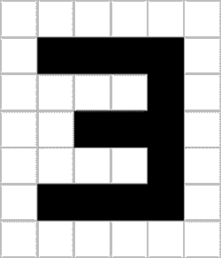
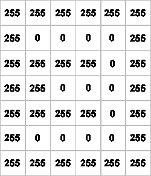
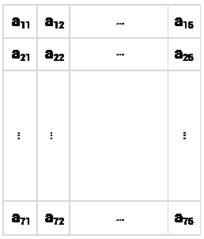
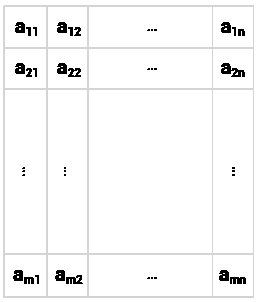
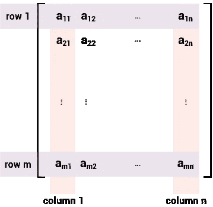
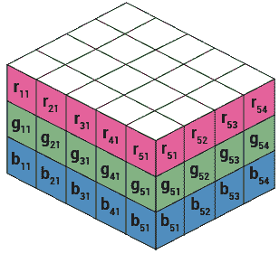
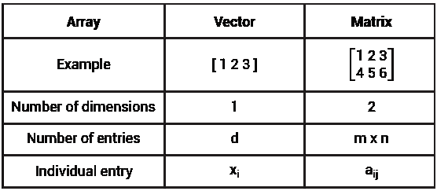
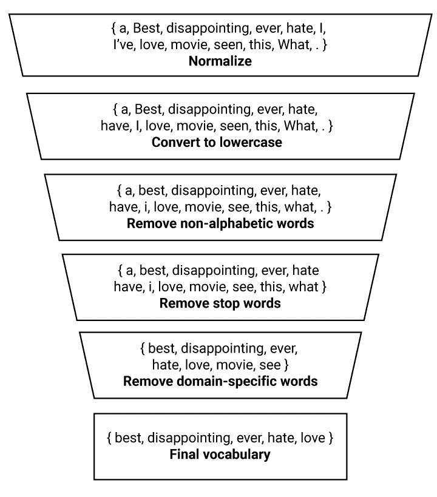

# 从零开始的机器学习:第 3 部分

> 原文：<https://towardsdatascience.com/machine-learning-from-scratch-part-3-ed572330367d?source=collection_archive---------5----------------------->

## 数组和表示

# 目录

*   第一部分:属性和模式
*   [第二部分:收集和数据](/machine-learning-from-scratch-part-2-99ce4c78a3cc)
*   第 3 部分:数组和表示
*   [第四部分:功能和分类器](/machine-learning-from-scratch-part-4-10117c005a28)

第 3 部分介绍了数组。这一系列高阶集合允许我们以机器学习算法可以处理的格式描述图像和文本文档。

在这个过程中，我们将讨论情感分析，这是自然语言处理的一个重要应用，用于市场研究和声誉管理。

# 数组

上一次，我们介绍了高阶集合的概念:在集合中组织的集合。

数组是机器学习中最重要的高阶集合族。它们用于表示图像、文本文档和许多其他类型的数据。

数组有三个重要的属性。我将首先列举它们，然后更详细地讨论:

1.  数组是一维或多维的列表。
2.  特定级别上的所有列表都具有相同的格式。
3.  我们假设数组中的所有元素都是数字。

## 向量、矩阵和 3D 阵列

一维数组就是一个*列表*。一个二维数组是一个列表的列表。而三维数组是*列表的列表的列表*。在本文中，我们不会使用任何三维以上的数组。

一维数组称为**向量**。二维数组称为**矩阵**。我们将不介绍三维数组的特殊术语，而简单地称它们为 **3D 数组**。

## 相同的级别，相同的格式

在数组中，给定级别上的所有列表都具有相同的格式。

考虑下面这个例子: *[ [ 1，2 ]，[ 3，4 ]，[ 5，6 ] ]* 。这是一个包含三个列表的列表。三个内部列表中的每一个都有相同数量的元素:2。因此，这个集合可以作为一个数组。

相比之下，集合 *[ [ 1，2，3]，[ 4 ]，[ 5，6 ] ]* 不符合数组的条件，因为内部列表的长度不同:分别为 3、1 和 2。

## 仅限数字

数组中的单个元素被称为它的**条目**(我将使用这个术语)或*元素*。

所有条目都被假定为数字。

# 图像表示

我们将首先讨论如何使用矩阵来表示灰度图像。后面一节将把我们的讨论扩展到彩色图像。名副其实，我们将一步一步来。

**图像**是排列在网格上的像素集合。

**像素**是屏幕上呈现的最小元素，也是计算机视觉中最低层次的分析。像素的特征在于以下属性:

1.  网格上的位置
2.  与光强度相关的一个或多个测量值

## 表示灰度图像

考虑以下数字 3 的例子:

Fig. 1

为了将该图像分解成像素，我们可以施加一个网格，将图像分割成单元:

Fig. 2

该网格中的每个单元将被视为一个像素。

像素的光强度不同，我们可以用 0 到 255 的灰度来衡量。值 0 对应黑色，值 255 对应白色。中间的值是不同的灰度。

使用这种尺度的测量，我们可以从视觉表示切换到数字表示:

Fig. 3

## 推广到其他图像

到目前为止，我们看到了一个高 7 像素、宽 6 像素的特定图像。

为了将这种表示推广到这种格式的所有图像，可以用变量替换特定值:

Fig. 4

我们可以用字母 *m* 表示图像的高度，用字母 *n* 表示图像的宽度。在前面的例子中，我们有 *m = 7* 和 *n = 6* 。

使用这个符号，我们现在可以从一个 *7 x 6* 图像推广到一个 *m x n* 图像。

Fig. 5

如果去掉灰色边框，在网格周围加上方括号，我们就得到一个矩阵表示。

# 作为数字表格的矩阵

Fig. 6

矩阵是一个或多个内部列表的外部列表。

图 6 示出了矩阵形式的条目为 m 行和 n 列。有两种方式来看待这个问题:我们可以把行看作内部列表，把矩阵看作行的列表，或者我们可以把重点放在列上，把矩阵看作列的列表。

从第一个角度来看，内部列表相互堆叠。例如，在矩阵 *[ [ 1，2 ]，[3，4] ]* 中，可以将列表 *[ 1，2 ]* 堆叠在列表 *[ 3，4 ]* 之上，形成一个表格。或者，我们可以将这两个列表视为表的列。

矩阵中的单个条目表示为 *a_ij* 。[我用下划线“_”表示下标。]

字母 *i* 代表行的索引，字母 *j* 对应列。例如，第 3 行第 2 列中的条目表示为 a_32。图 3 中，我们有 *a_32 = 255* 。

# RGB 图像的 3D 阵列

彩色图像最常通过 RGB 模型来描述，其中每个像素的颜色表示为三元组 *(r，g，b)* ，这三项分别对应红光、绿光和蓝光的强度。

为了用数字表示 RGB 图像，我们使用 3D 数组。二维数组形成一个表格，而三维数组可以被视为一个立方体:

Fig. 7

这涵盖了计算机视觉的机器学习方法的图像表示的基础。

接下来，我们将讨论向量如何与矩阵相关联，以及为什么它们适合于文本文档的表示。

# 向量作为矩阵的特殊情况

回想以下两个事实:

*   向量是一系列数字。
*   矩阵可以被认为是一个表格，按行和列排列。

结合这两个事实，向量可以被视为矩阵中的特定行或列。

一个**行向量**是一个单行的矩阵( *m = 1* )。一个**列向量**是一个单列的矩阵( *n = 1* )。

行向量、列向量和矩阵可以用方括号或圆括号括起来。逗号通常被省略。

图 3 中的矩阵由 7 个行向量和 6 个列向量组成。例如，我们可以从这个矩阵的第二行中提取以下行向量:*【255 0 0 0 0 255】。*

我们用 *x_i* 表示单个向量条目，用 *d* 表示条目数量。

向量和矩阵可以说是机器学习中最重要的两种数据结构。下面是一个快速对比:

Fig. 8

# 情感分析

当你在网上发表对一个品牌的看法时，计算系统可能会分析你的陈述，找出它表达的是积极还是消极的观点，并将结果用于市场研究和声誉管理目的。自然语言处理(NLP)的这种应用被称为**情感分析**。

一个重要的经验发现是，情绪分析的简单方法可以实现出色的性能，并且很难超越。[1，2]毕竟，许多顾客都强调要让任何愿意阅读的人都能理解。

我将使用情感分析来解释如何使用向量来表示文档。

# 文档表示

## 电影中的 NLP

电影评论是情感分析研究中一个流行的数据源。[3]它们很容易大量获得，提出了有趣的挑战，这将在后面的文章中讨论，并可以帮助预测票房收入[4]。

Copyright: [nyul / 123RF Stock Photo](https://www.123rf.com/profile_nyul)

虽然本节中概述的方法可以有效地应用于成千上万不同长度的综述，但我们将只使用一小部分表达明确意见的综述。这里的重点是概念。这些机器可以搬运重物。

计划是从一个初始词汇表开始，通过一系列操作传递词汇表中的单词，这些操作产生一组相关的特征。为语料库中的每个文档生成一个向量，并且文档向量中的每个条目将对应于所选特征之一。但首先我们应该澄清一些术语。

## 语料库、文档和单词

一个**文集**是文档的集合。

在 NLP 中，**文档**是任何具有我们感兴趣的属性的单词的集合。

一个文档可以短到一个单词或句子，也可以长到一整本书或一个网站。

在情感分析的情况下，我们对文档中表达的观点的极性感兴趣。它表达的是积极的还是消极的观点？

顺便说一下，我将使用术语**单词**来指代符号序列。根据这一定义，数字和标点符号也算作单词。

## 初始词汇

以下是我们将使用的语料库:

*   我喜欢这部电影。
*   我讨厌这部电影。
*   我看过的最好的电影。
*   多么令人失望的电影。

该语料库中按字母顺序排序的词汇包含以下单词:

*{ a，最好，失望，曾经，讨厌，我，我曾经，爱，电影，看过，这个，什么，。}*

在我们继续之前，我建议你停下来想一想下面的问题:你会使用这个词汇表中的每个单词来进行情感分析吗？或者我们可以删除或更改一些单词来提高模式识别？

## 管道

在许多 NLP 项目中，初始词汇表是通过管道传递的:一系列操作，其中一个步骤的输出是下一个步骤的输入。

本节中描述的特定操作序列简化了数据并消除了不相关的单词。

警告！小心行事！虽然下面提到的许多步骤在不同的任务和领域中相当可靠地工作，但是当应用得过于激进时，它们会过滤掉相关的单词。

代词等虚词就是一个很好的例子。这些词主要构成句子的句法。在大多数应用中，我们可以删除虚词，而不会造成信息的重大损失。然而，对于一些心理语言学的应用，这些词可以提供有用的特征。[5]例如，一项研究发现，虚词使用的相似性预示着浪漫的兴趣和关系的稳定性。[6]

强制性的警告已经过时，下面是整个过程的概述:

Fig. 9

我们应用的第一步可以称为**归一化**。缩略形式(如*我有)*展开(*我有*)，而拉长的词(如*loove*)则缩略为其常规形式(*爱*)。就我个人而言，我并不反对爱情。只是当所有爱的表达都有相同数量的 o 时，模式更容易识别。规范化的词汇表如下所示:

*{ a，最好，不争气，曾经，讨厌，有，我，爱，电影，看过，这个，什么，。}*

下一步是**转换成小写**。单词 *best* 和 *what* 的第一个字母是否大写对情感分析有影响吗？—不，不是真的:

*{ a，最好，不争气，曾经，讨厌，有，我，爱，电影，看，这个，什么，。}*

另一个常见的步骤是**删除非字母单词**。例如，句号携带的相关信息很少。让我们摆脱它:

*{ a，最好，不争气，曾经，讨厌，有，我，爱，电影，看，这个，什么}*

第 2 部分提到，一些词，包括冠词、限定词、介词和基本动词，几乎出现在每篇文章中:在正面评论和负面评论中，在电影评论和非电影评论中，在前一句中，在这一句中，在下一句中……你明白了。这些字叫做**停用字**。让我们删除它们:

*{最佳，失望，有史以来，恨，爱，电影，看}*

在特定的领域中，有一些词的行为类似于停用词，尽管它们通常不被认为是停用词。例如，单词 *movie* 和 *see* 出现在电影评论的很大一部分中，而没有提供关于观点极性的线索。我将这些词称为**特定领域停用词**。删除这些单词是管道中的最后一步，会产生以下结果:

*{最好的，令人失望的，有史以来，恨，爱}*

总的来说，我们已经排除了 13 个词汇中的 8 个，并且得到了我认为是一组直觉上似乎合理的词，这些词与情感分析相关。

## 二元文档向量

使用剩余的五个单词*(最好的、令人失望的、曾经的、讨厌的、喜欢的)*作为特征，我们现在可以将每个文档表示为具有五个条目的向量。对于每个特征，都有相应的向量条目。

**二元向量**是短文档的合适选择。这些向量的条目都是 0 或 1。

如果文档中存在该特征(单词),我们将特征值指定为 1，如果该特征不存在，则将值指定为 0。

以第三个文件为例(*我看过的最好的电影。*)。五个特性中的两个在本文档中出现:第一个特性(*最佳*)和第三个特性(*最佳*)。因此，我们将第一个和第三个条目设置为 1，将其他条目设置为 0。这给了我们矢量*【10100】*。

对语料库中的每个文档应用相同的过程，我们获得以下向量表示:

*   我喜欢这部电影。*→*【0 0 0 1】
*   我讨厌这部电影。*→*【0 0 1 0】
*   我看过的最好的电影。*→*【1 0 1 0 0】
*   多么令人失望的电影。*→*【0 1 0 0】

恭喜你！如果你正在阅读这篇文章，你已经学会了如何用机器学习算法可以处理的格式来表示图像和文本文档。

下一次，我们将讨论函数——我希望你们能像我一样对这个主题充满热情。

机器学习中用来预测未知属性的模型都有函数的形式。神经网络，包括您可能经常读到的深度神经网络，本质上是应用于数字数组的函数序列。

# 感谢您的阅读！如果您喜欢这篇文章，请点击“鼓掌”按钮并跟随我阅读本系列的下一篇文章。

# 参考

[1]王，s .和曼宁，C.D .，2012 年 7 月.基线和二元模型:简单，良好的情绪和主题分类。在*计算语言学协会第 50 届年会会议录:短文-第 2 卷*(第 90-94 页)。计算语言学协会。

[2]李，李，赵，赵，刘，王，杜，谢，2016 .加权神经 n-grams 模型:文本分类的新基线。在*colling 2016 年会议录，第 26 届计算语言学国际会议:技术论文*(第 1591-1600 页)。

[3] Maas，A.L .，Daly，R.E .，Pham，P.T .，黄，d .，ng，A.Y .和 Potts，c .，2011 年 6 月。学习用于情感分析的词向量。计算语言学协会第 49 届年会会议录:人类语言技术-第 1 卷(第 142-150 页)。计算语言学协会。

[4]阿苏尔和胡伯尔曼，文学学士，2010 年 8 月。用社交媒体预测未来。2010 年 IEEE/WIC/ACM 网络智能和智能代理技术国际会议论文集-第 01 卷(第 492–499 页)。IEEE 计算机学会。

[5] Pennebaker，J.W .，Francis，M.E .和 Booth，R.J .，2001 年。语言学调查与字数统计:LIWC 2001。*马赫威:劳伦斯·厄尔鲍姆协会*， *71* (2001 年)，第 2001 页。

[6]爱尔兰，M.E .，Slatcher，R.B .，Eastwick，P.W .，Scissors，L.E .，Finkel，E.J .和 Pennebaker，J.W .，2011 年。语言风格匹配预测关系的开始和稳定。《心理科学》,第 22 卷第 1 期，第 39-44 页。