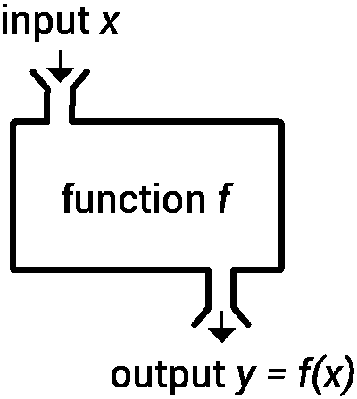
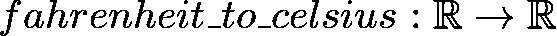
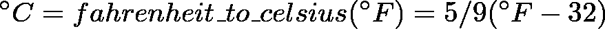
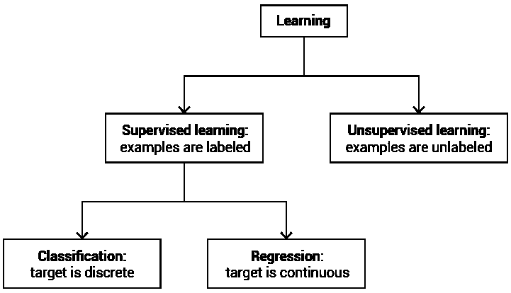
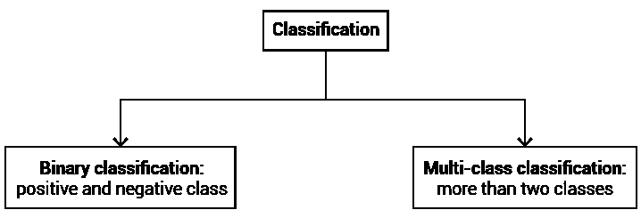
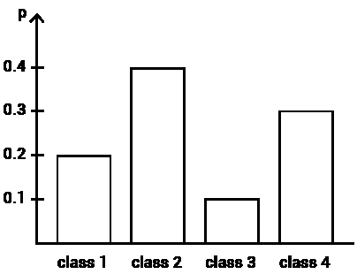
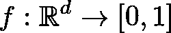
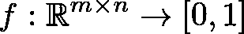
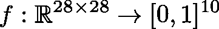

# 从零开始的机器学习:第 4 部分

> 原文：<https://towardsdatascience.com/machine-learning-from-scratch-part-4-10117c005a28?source=collection_archive---------9----------------------->

## 功能和分类

# 目录

*   [第 1 部分:属性和模式](/machine-learning-from-scratch-part-1-76603dececa6)
*   [第二部分:收集和数据](/machine-learning-from-scratch-part-2-99ce4c78a3cc)
*   [第三部分:数组和表示](/machine-learning-from-scratch-part-3-ed572330367d)
*   第 4 部分:功能和分类

Changelog:我在第 2 部分关于集合的讨论中添加了一些句子。

修改后的文本提到集合用大写字母表示，尤其是 *S* ，而小写字母用于集合成员。比如我们可以把冰淇淋基本口味的集合， *{香草、草莓、巧克力}* 称为 *S* 。

此外，更新后的部分引入了集合成员和集合大小的表示法。元素 *x* 属于集合 *S* 的事实被写成 *x ∈ S* 。比如我们有:*香草∈ S* 。器械组名称周围的竖线表示其大小。对于基本口味的设置，我们有 *|S| = 3* 。

# 功能

函数是机器学习的核心。

在项目开始时，业务目标是根据功能来指定的。

在项目过程中，几乎每一步都要用到函数来处理数据、发现模式和评估系统的性能。

在项目结束时，最终交付给客户的是另一个功能。可交付物可以用编程语言编码，或者采用几个低级功能组合的形式，但它仍然是一个功能。

## 函数将输入映射到输出

许多读者将熟悉数学和/或编程中的函数。

*数学上*，函数指定一个集合中的元素如何与另一个集合中的元素相关联。

*程序化*，一个函数处理一个输入生成一个输出。

下图结合了两种定义的各个方面:

Fig. 4.1: Edited version of a graphic released into the public domain by [Wvbailey](https://commons.wikimedia.org/wiki/File:Function_machine2.svg)

这两个定义是一致的。[1]函数的可接受输入属于一个集合，而函数生成的输出属于另一个集合。函数定义了我们如何从一个到另一个。

这就是关于函数本质的所有知识。

作为未来的预览，我将提到机器学习中心功能的输入是上次讨论的对象的表示(例如，像素强度和某些单词的存在或不存在)。函数的输出是我们感兴趣的目标的预测值。

# 注释

为了从数学上定义一个函数，我们需要指定两件事:

1.  涉及到的集合
2.  一个集合中的元素映射到另一个集合中的元素的规则。

## 函数中的集合

函数 *f* 将集合 *A* 中的元素映射到集合 *B* 中的元素的事实被写成 *f: A → B* 。

A 和 B 这两组分别称为**域**和**共域**。在许多情况下，它们可以引用同一个集合。

本符号中使用的字母( *f* 、 *A* 和 *B)* 可以理解为占位符。我们会经常使用不同的名字。

## 绘图

功能 *f* 的输入通常用字母 *x* 表示。在机器学习的上下文中， *x* 通常指代表一个对象的数组。

字母 *y* 表示功能的输出。我们将使用字母 *y* 来表示预测。

将这些积木组合起来，下面的等式简单地陈述了 *y* 是函数 *f* 对输入 *x* 的应用的输出: *f(x) = y* 。

## 功能名称

在许多情况下，我们需要引用不止一个函数。为了将它们分开，可以采用以下命名策略之一:

*   字母表中的其他字母，尤其是 *g* 和 *h*
*   下标(或上标)，如 *f_1* 、 *f_2* 等。
*   单词或单词缩写:如*增量*或 *inc*

# 简单的例子

考虑名为 *fahrenheit_to_celsius 的函数的自我描述示例。*

鉴于在实验室中已经达到了数万亿华氏度的温度[2]，我认为用这组实数来表示这个函数是公平的。在集合的层次上，我们可以写:

在单个元素的层次上，我们有:

使用强调数学和编程之间等价的风格，这个函数对应于下面的 Python 代码[3]:

# 实值函数

为了我们的目的，一个**标量**是一个实数【4】，或者换句话说，是实数ℝ.集合的一个成员或者，我们可以把标量想象成一个只有一个条目的向量，或者一个只有一行一列的矩阵。

一个实值向量由 *d* 实数组成，类似地属于集合ℝ^d.，一个实值矩阵有*m×n*实数项，属于ℝ^(m×n)。最后，实值 3D 数组属于 R^(m x n x o)[5]。

Fig. 4.2

本系列中使用的所有数组和函数都是实值的。这包括第 3 部分提到的二进制向量。当然，0 和 1 也是实数。为了强调它们是实数，我们可以把它们写成 0.0 和 1.0。

# 监督学习问题

现在我们已经介绍了实值函数，我们可以开始讨论使用监督机器学习可以解决的问题。

在高层次上，分类和回归是有区别的。

Fig. 4.3

# 分类

在**分类任务**中，我们试图预测的目标是离散的。它可以采用 *n* 值之一，或者换句话说，属于 *n* 类之一。

当感兴趣的对象被认为是*类别*的成员而不是*类*的成员时，术语分类被用来代替分类。例如，一些作者更喜欢术语*文档分类*而不是*文档分类*。

对于 *n = 2* ，预测正确类别的任务称为**二元分类**。这两类通常被称为*正类*和*负类*。

*n > 2* 的术语为**多级分类**或 *n* 级分类。

Fig. 4

将电子邮件归类为值得或不值得放在收件箱中是一项二元分类任务。给来自朋友、同事、服务、广告商和其他团体的电子邮件分配几个可能的标签之一涉及多个类别。

区分良性和恶性皮肤病变是一项二元分类任务。另一方面，癌症的分期是一个多类分类问题。

## 可能性

一个**区间***【a，b】*是一组实数，包括 *a* 和 *b* 之间的每一个数，包括端点。区间*【0，1】*包含从 0 到 1 的所有实数。

A **概率**p 是区间*【0，1】*的成员。

术语**反概率**是指 *1-p* 。显然，概率和反概率加起来是 1。

一个**概率分布**是一个向量，其 *d* 条目是总和为 1 的概率。我会把概率分布写成*【0，1]^d* 。

向量*【0.2，0.4，0.3，0.1】*是概率分布的一个例子。

Fig. 5

## 概率输出

分类输出是概率性的。

在二元分类中，输出是物体属于正类的概率 *p* 。反概率 *1-p* 是对象是否定类成员的概率。

高概率表明该对象很可能是正类的实例。

输出为零意味着不可能属于正类，而属于负类是确定的。相反，如果概率为 1，则一个对象必然属于正类。

比如假设输出为 *p = 0.85* 。这意味着有 85%的可能性该对象属于正类，有 15%的可能性(1–0.85 = 0.15)该对象是负类的成员。

在多类分类中，输出是一个概率分布。

## 分类器是函数

**分类器**是一个被设计用来执行分类的功能。

分类器的输入是对象的表示。生成的输出是一个预测。

如果输入是向量，则分类器的域和余域可以表述如下:

A function that maps a vector representation to a probability

类似地，如果物体用矩阵表示，我们写 *:*

A function that maps a matrix to a probability

假设 *|C|* 是类的数量，分类器将矩阵映射到适当长度的概率分布的事实被写成:

A function that maps a matrix to a probability distribution

## MNIST

如果不提到数字识别和 MNIST 数据集，任何关于机器学习本质的教程都是不完整的。

识别数字是机器学习中具有历史意义的重要任务。分类器接收图像的表示，并返回从 0 到 9 的十个可能数字的概率分布。然后，系统选择类别概率最高的数字。

*MNIST* 可以说是所有机器学习中最著名的数据集，包含 70，000 张 28x28 像素的灰度图像。这种标记图像集合的最广泛使用的形式已经在二十年前出版了。[7]

Fig. 6: A few samples from the MNIST data set (Image by [Josef Steppan](https://commons.wikimedia.org/wiki/File:MnistExamples.png) / CC BY-SA 4.0)

应用于 MNIST 数据的数字识别器是将 28 行 28 列的矩阵映射到 10 类概率分布的函数:

最初，这项任务有直接和明显的应用，例如在手写信件和支票的时代，邮政服务和金融服务的效率提高。

随着时间的推移，研究人员在数字识别任务中取得了接近人类的表现，并转向更雄心勃勃的目标。

与此同时，MNIST 数据集已经被重新用于测试机器学习的新想法。如果一个分类算法不能在 MNIST 上给出很好的结果，它很可能对更具挑战性的问题没有多大用处。

由于多年来对 MNIST 数据集的严格使用，实验结果可以很容易地与数百项同行评议的研究进行比较。这是标准化测试的一个重要好处。

# 回归

另一个监督学习的问题是回归。我想在本文中提供一个简要的概述，然后在第 5 部分中更详细地讨论这个主题。

在**回归任务**中，目标是连续的。换句话说，它可以取某个范围内的任何值。

根据上下文，术语**回归变量**指独立变量(输入)或设计用于执行回归的函数(类似于分类器)。

回归的一个经典应用是预测价格。在这种情况下，范围将是一组正实数(或介于 0 和最高价格之间的区间)。

回归的其他应用包括预测生物标记、需求、环境测量、性能、受欢迎程度、评级、风险、分数和产量。

# 基线

在这篇文章的结尾，我想讨论一下使用常量函数作为基线。

**常量函数**对每个输入返回相同的输出。它们被写成 *f(x) = c (* 其中 *c* 是一个常量值)并且可以作为基线。

在机器学习中，**基线**是生成预测的简单规则:可以用几句话描述的东西，没有任何复杂性。

可以说，最重要的基线是总是预测最频繁出现的目标值。(另一种方法是随机生成预测。如果没有关于目标值分布的可靠信息，后者可能是正确的选择。)

当您评估机器学习系统时，以下问题应该是首先想到的:

1.  我试图解决的问题的基线是什么？
2.  机器学习系统是否显著优于基线？

## 情感分析的基线

假设你委托一个机器学习专家开发一个定制的情感分析解决方案。要求是收集相关网站上对贵公司的提及，并在发现公开表达的意见时发送通知。

快进到第一次迭代，您会收到一份关于初始测试结果的报告:系统达到了 90%的准确率。这是好事还是坏事？嗯，看情况。

考虑两种情况:在第一种情况下，一个代表性的样本表明，超过 90%的公开表达的对你的公司的看法是积极的。好消息是顾客喜欢你。坏消息是，机器学习项目正在失败，因为系统没有超越总是预测最频繁目标的基线。如果正面评价由目标值 1 表示，则基线将是常数函数 *f(x) = 1* 。

在第二种情况下，你的公司是有争议的，公众舆论在粉丝和批评者之间平分秋色。在这种情况下，90%的准确率是项目成功的第一个迹象。

因此，基线提供了对系统性能预期的下限。

到目前为止，我们将分类器和回归器视为一个黑盒。

从下一篇文章开始，我们将打开这个盒子，描述应用机器学习中最常用的函数。

# 感谢您的阅读！如果你喜欢这篇文章，请点击“鼓掌”按钮，跟我来阅读这个系列的下一部分。

# 笔记

[1]这假设编程的函数对于给定的输入总是返回相同的输出，并且不会引起任何副作用。

[2][http://blogs . nature . com/news/2012/08/hot-stuff-CERN-physicians-create-record-breaking-subatomic-soup . html](http://blogs.nature.com/news/2012/08/hot-stuff-cern-physicists-create-record-breaking-subatomic-soup.html)

[3]当然，计算机使用的浮点数并不完全对应于一组实数。它们的范围有限，而且不够精确。

[4]更确切地说，标量是场的一个元素。字段是一组定义了特定规则的数字。实数是一个字段。

[5]不同的作者对 3D 阵列的维度使用不同的符号，尤其是最后一个。我与之交谈过的一位数学家更喜欢使用字母 *p* ，因为 *o* 在外观上与 *0* 很接近。最终，我决定选择字母 *o* 。用三个连续的字母很直观，字母 p 是留给概率的。

[6]缩写 MNIST 数据集代表*经修改的国家标准与技术研究所数据集。*

[7] LeCun，y .，Bottou，l .，Bengio，y .和 Haffner，p .，1998 年。基于梯度的学习在文档识别中的应用。*IEEE 会议录*， *86* (11)，第 2278–2324 页。