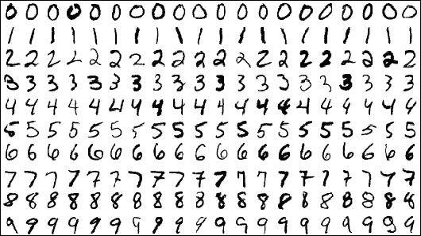
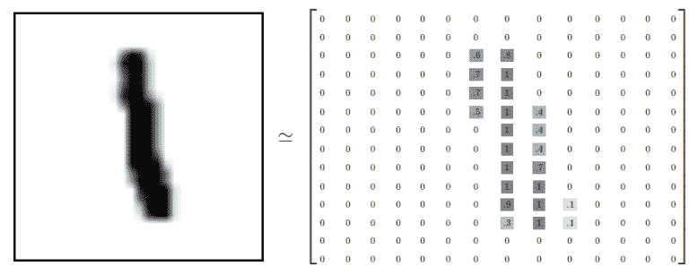
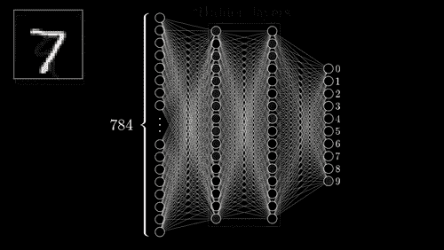
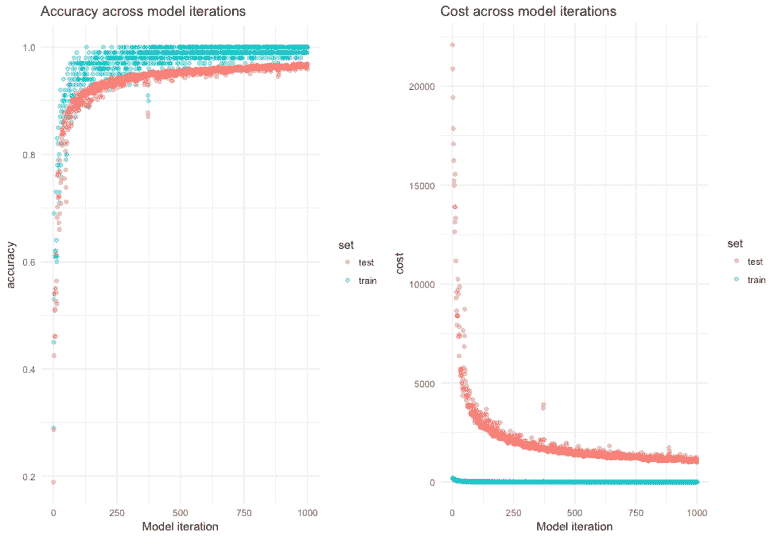

# 机器学习基础(二):神经网络

> 原文：<https://towardsdatascience.com/machine-learning-fundamentals-ii-neural-networks-f1e7b2cb3eef?source=collection_archive---------3----------------------->

在我之前的文章中，我通过展示成本函数和梯度下降在学习过程中的核心作用，概述了机器学习的工作原理。这篇文章通过探索神经网络和深度学习如何工作来建立这些概念。这篇文章很少解释，很多代码。原因是，我想不出任何方式能比三个蓝色一个棕色的不可思议的视频放在一起更清楚地阐明神经网络的内部工作方式——见完整播放列表[这里](https://www.youtube.com/playlist?list=PLZHQObOWTQDNU6R1_67000Dx_ZCJB-3pi)。

这些视频展示了如何向神经网络输入原始数据——如数字图像——并以惊人的精度输出这些图像的标签。这些视频以一种非常容易理解的方式强调了神经网络的基础数学，这意味着即使那些没有深厚数学背景的人也可以开始理解深度学习的本质。

这篇文章旨在作为这些视频的“代码”补充(完整的 Tensorflow 和 Keras 脚本可在文章末尾获得)。目的是演示如何在 Tensorflow 中定义和执行神经网络，使其能够识别如上所示的数字。

TensorFlow(对于那些不知道的人来说)是谷歌的深度学习库，虽然它很低级(我通常在我的深度学习项目中使用更高级的 Keras 库)，但我认为它是一种很好的学习方式。这仅仅是因为，尽管它在幕后做了大量不可思议的事情，但它需要你(是的，你！)来明确定义 NN 的架构。这样你会更好地理解这些网络是如何工作的。

# 神经网络

神经网络是大脑中发生的生物过程的数学和计算抽象。具体来说，它们粗略地模拟了相互连接的中子对刺激的反应——例如新的输入信息。我没有发现生物学类比对理解神经网络特别有帮助，所以我不会继续沿着这条路走下去。

神经网络通过计算输入向量的加权总和来工作，然后输入向量通过非线性激活函数，从而通过非线性转换层创建从输入到输出的映射。变换层或*隐藏层*中的权重(由中子表示)被反复调整，以表示输入到输出的数据关系。

# 定义层和激活

第一步，我们定义网络的架构。我们将创建一个四层网络，包括一个输入层，两个隐藏层和一个输出层。请注意一层的输出如何成为下一层的输入。就神经网络而言，这个模型非常简单，它由密集的*或*完全连接的层组成，但仍然非常强大。

**输入层**——有时也被称为**可见层**——是以原始形式表示数据的模型层。例如，对于数字分类任务，可见图层由对应于像素值的数字表示。

在 TensorFlow *(所有代码如下)*中我们需要创建一个占位符变量来表示这个输入数据，我们还将为每个输入对应的正确标签创建一个占位符变量。这有效地设置了训练数据——我们将用于训练神经网络的 *X* 值和 *y* 标签。

**隐藏层**使神经网络能够创建输入数据的新表示，模型使用它来学习数据和标签之间的复杂和抽象关系。每个隐藏层由神经元组成，每个神经元代表一个标量值。此标量值用于计算输入加上偏差的加权和(本质上是 y1 ~ wX + b)，从而创建线性(或更具体地说是仿射)变换。

在 Tensorflow 中，您必须明确定义构成该层的权重和偏差的变量。我们通过将它们包装在 *tf 中来做到这一点。变量*函数——这些被包装为*变量*,因为参数会随着模型学习最能代表数据关系的权重和偏差而更新。我们用方差非常低的随机值来实例化权重，并用零填充偏差变量。然后，我们定义发生在该层的矩阵乘法。

这个变换然后通过一个激活函数，(这里我使用 **ReLU** 或整流线性单元)使线性变换的输出变成非线性。这使得神经网络能够模拟输入和输出之间复杂的非线性 T21 关系——点击这里查看 Siraj Raval 关于激活函数的精彩视频讲解。

**输出层**是模型中的最后一层，在这种情况下，大小为 10，每个标签一个节点。我们将一个 **softmax 激活**应用到这一层，以便它跨最终层节点输出介于 0 和 1 之间的值——代表跨标签的概率。

# 成本函数和优化

既然定义了神经网络架构，我们就设置**成本函数**和**优化器**。对于这个任务，我使用分类交叉熵。我还定义了一个准确性度量，可以用来评估模型的性能。最后，我将优化器设置为随机梯度下降，并在实例化后调用它的 minimise 方法。

最后，可以运行模型——这里运行 1000 次迭代。在每次迭代中，一个小批量的数据被输入到模型中，它进行预测，计算损失，并通过反向传播，更新权重，重复这个过程。

** *摘自三蓝一棕的《但是，什么是神经网络视频***

这个简单的模型在测试集上达到了大约 95.5%的准确率，这还不算太差，但是还可以更好。在下面的图中，您可以看到模型每次迭代的准确性和成本，有一点非常明显，即训练集和测试集的性能之间存在差异。

这表明**过度拟合**——也就是说，模型学习训练数据太好，这限制了它的**泛化能力**。我们可以使用**正则化方法**来处理过度拟合，这将是我下一篇文章的主题。

感谢您的阅读🙂

页（page 的缩写）完整的 Tensorflow 脚本可以在[这里](https://gist.github.com/conormm/1c82b093c9c6002e7ca6ff6e9fb34f05)找到，相同的模型在 Keras [这里](https://gist.github.com/conormm/e1dd2ee37733f4817e09a41d625d9e7f)定义。

*原载于 2017 年 12 月 21 日 dataflume.wordpress.com**的* [*。*](https://dataflume.wordpress.com/2017/12/21/machine-learning-fundamentals-ii-neural-networks/)