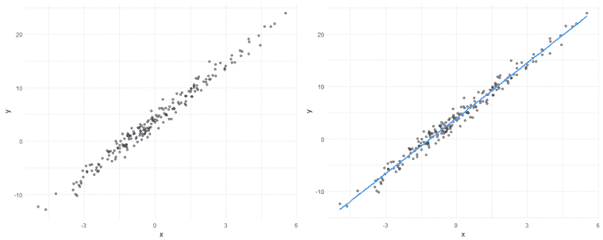
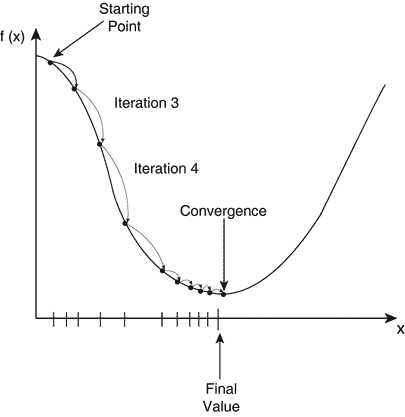
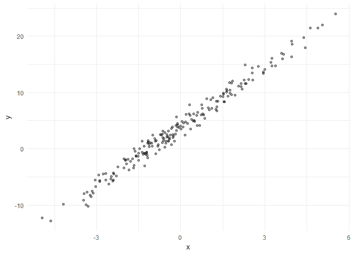
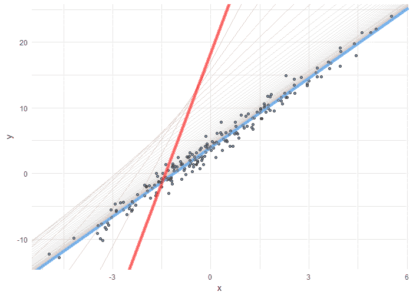
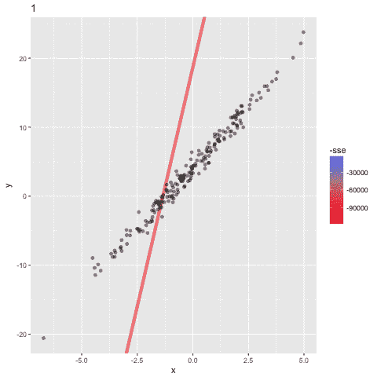
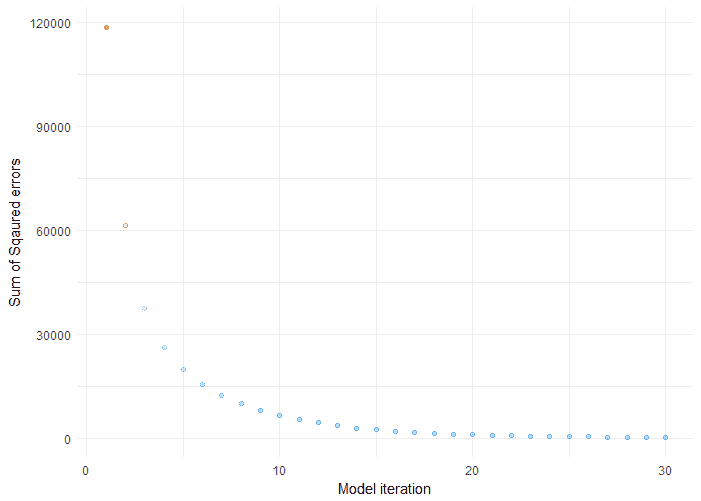
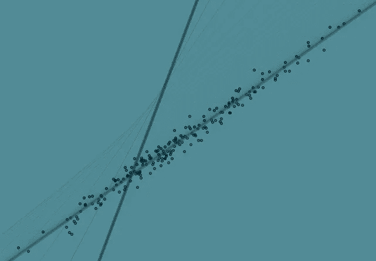

# 机器学习基础(一):成本函数和梯度下降

> 原文：<https://towardsdatascience.com/machine-learning-fundamentals-via-linear-regression-41a5d11f5220?source=collection_archive---------0----------------------->

## * *这是机器学习基础系列的第一部分。ML 基础(二):神经网络可以在[https://towards data science . com/machine-learning-fundamentals-II-Neural-Networks-f1 e 7 b 2 CB 3 eef](/machine-learning-fundamentals-ii-neural-networks-f1e7b2cb3eef)* *

在这篇文章中，我将使用一个简单的线性回归模型来解释两个**机器学习** (ML)基础；(1)成本函数和；(2)梯度下降。线性回归不是 ML 工具包中最强大的模型，但由于它的熟悉性和可解释性，它仍然在研究和行业中广泛使用。简单地说，线性回归用于估计连续的*或/和*分类数据与连续的输出变量之间的线性关系——你可以在我以前的帖子中看到这样的例子[https://conors datablog . WordPress . com/2017/09/02/a-quick-and-tidy-data-analysis/](https://conorsdatablog.wordpress.com/2017/09/02/a-quick-and-tidy-data-analysis/)。

在这篇文章中，我将使用 *X* 和 *y* 来指代变量。如果你喜欢更具体的东西(就像我经常做的那样)，你可以想象 *y* 是销售额， *X* 是广告支出，我们想要估计广告支出如何影响销售额。从视觉上，我将展示线性回归如何学习拟合这些数据的最佳直线:

# 机器学习什么？

人们在开始学习 ML 时经常遇到的一个问题是:

***“机器(即统计模型)实际学习的是什么？”***

这将因模型而异，但简单来说，模型学习函数 *f* ，使得 *f* ( *X* )映射到 *y* 。换成不同的 y*y*，模型学习如何取 *X* (即特征，或者更传统的说法，自变量)，以便预测 *y* (目标，响应或者更传统的说法，因变量)。

在简单线性回归(***y*~ B0+B1 **X***其中 *X* 是一列/变量)的情况下，模型“学习”(读取:估计)两个参数；

*   b0:偏差(或者更传统的说法是 T42 y 截距)；而且，
*   b1:坡度

偏差是当 *X* 为 0 时 *y* 的水平(即广告支出为 0 时的销售额),斜率是 *y* 中 *X* 中每单位增加的预计增加或减少的比率(即广告支出每磅增加多少销售额)。两个参数都是标量(单值)。

一旦模型学习了这些参数，它们就可以被用于在给定新的 *X* 值的情况下计算 *y* 的估计值。换句话说，当你不知道什么是 *y* 时，你可以使用这些学习到的参数来预测 *y* 的值——嘿，一个预测模型！

# 学习参数:成本函数

学习 LR 模型的参数有几种方法，我将集中讨论最能说明统计学习的方法；最小化一个**成本函数**。

记住，在 ML 中，重点是从数据中学习**。用一个简单的类比也许能更好地说明这一点。作为孩子，我们通常通过被告知不要做某事或因做了不该做的事而受到惩罚来学习什么是“正确的”或“好的”行为。例如，你可以想象一个四岁的孩子坐在火旁取暖，但不知道火的危险，她把手指放进去烧伤了。下一次她坐在火边，她没有被烧伤，但是她坐得太近，太热了，不得不离开。第三次她坐在火边时，她找到了既能保暖又不会有任何危险的距离。换句话说，通过经验和反馈(烧伤，然后变得太热)，孩子学会了坐在离火的最佳距离。在这个例子中，火的热量充当了**成本函数——它帮助学习者纠正/改变行为，以最大限度地减少错误。****

在最大似然法中，成本函数用于估计模型的表现有多差。简而言之， ***成本函数是衡量模型在估计 X 和 y 之间关系的能力方面有多差的标准。*** 这通常表示为预测值和实际值之间的差异或距离。成本函数(你也可以看到这被称为*损失*或*误差*。)可以通过迭代运行模型来估计，以将估计的预测与“基本事实”(已知的 *y* 值)进行比较。

因此，ML 模型的目标是找到使成本函数最小化的参数、权重或结构。

# 最小化成本函数:梯度下降

既然我们知道模型通过最小化成本函数来学习，您可能自然会想知道成本函数是如何最小化的—输入**梯度下降**。梯度下降是一种有效的优化算法，试图找到一个函数的局部或全局最小值。

梯度下降使模型能够学习模型应该采用的梯度或*方向*，以减少误差(实际 y 和预测 y 之间的差异)。简单线性回归示例中的方向指的是应该如何调整或校正模型参数 b0 和 b1 以进一步降低成本函数。随着模型的迭代，它逐渐向最小值收敛，在该最小值处，对参数的进一步调整产生很少或零损失变化，这也称为收敛。

在这一点上，模型已经**优化了权重**，使得它们最小化成本函数。这个过程是积分(没有微积分双关语的意思！)到 ML 过程中，因为它极大地加速了学习过程——你可以把它看作是一种接受纠正性反馈的方式，以改进你以前的表现。梯度下降过程的替代方案将是强力强制参数的潜在无限组合，直到最小化成本的集合被识别。很明显，这是不可行的。因此， ***，*** 梯度下降使得学习过程能够对所学习的估计进行校正更新，从而将模型移向参数的最佳组合。

# 在线性回归模型中观察学习

为了观察线性回归中的学习，我将设置参数 b0 和 b1，并使用模型从数据中学习这些参数。换句话说，我们知道 *X* 和 *y* 之间关系的基本事实，并且可以通过响应于成本的参数的迭代校正来观察学习这种关系的模型(注意:下面的代码是用 R 编写的)。

这里我定义了偏差和斜率(分别等于 4 和 3.5)。我还向 *X* 添加一列 1(为了实现矩阵乘法)。我还添加了一些高斯噪声到 *y* 中，以掩盖真实的参数——即产生纯粹随机的误差。现在我们有了一个带有两个变量的数据框架， *X* 和 *y，*看起来具有正的线性趋势(随着 *X* 增加， *y* 的值增加)。

接下来，我定义学习率——它控制每个梯度的步长。如果这个值太大，模型可能会错过函数的局部最小值。如果太小，模型将需要很长时间才能收敛(复制代码并亲自尝试一下！).Theta 存储参数 b0 和 b1，它们用随机值初始化(我已经将它们都设置为 20，这适当地远离真实参数)。n_iterations 值控制模型迭代和更新值的次数。也就是说，模型将进行多少次预测、计算成本和梯度以及更新权重。最后，我创建了一些占位符来捕捉模型每次迭代时的 b0、b1 和均方误差(MSE)的值(创建这些占位符可以避免向量的迭代增长，这在 R 中是非常低效的)。

这种情况下的 ***MSE*** 就是代价函数。它仅仅是预测 y 和实际 y 之间的平方差的 ***平均值*** ***(即残差)***

现在，我们运行循环。在每次迭代中，模型将根据θ值预测 *y* ，计算残差，然后应用梯度下降来估计校正梯度，然后使用这些梯度更新θ值——该过程重复 100 次。当循环结束时，我创建一个数据帧来存储学习到的参数和每次迭代的损失。

当迭代完成后，我们可以绘制出比模型估计的线条。

首先要注意的是粗粗的红线。这是从 b0 和 b1 的初始值估计的线。可以看到，这与数据点完全不符，因此它具有最高的误差(MSE)。但是，您可以看到这些线逐渐向数据点移动，直到确定最佳拟合线(蓝色粗线)。换句话说，在每次迭代时，模型已经学习了 b0 和 b1 的更好的值，直到它找到最小化成本函数的值。模型学习到的 b0 和 b1 的最终值分别为 3.96 和 3.51，非常接近我们设置的参数 4 和 3.5！

瞧啊。我们的机器！它学会了！！

我们还可以看到模型迭代中 SSE 的减少。在收敛和稳定之前，这在早期迭代中需要急剧下降。

我们现在可以使用存储在 theta 中的 b0 和 b1 的学习值来预测新的值 *X* 的值 *y* 。

# 摘要

这篇文章介绍了一种非常简单的理解机器学习的方法。不言而喻，ML 还有很多内容，但是获得对“引擎盖下”正在发生的事情的基本原理的初步直觉可以大大有助于提高您对更复杂模型的理解。

