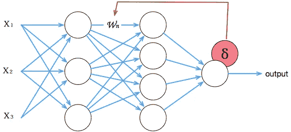
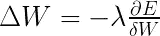
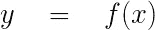
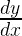
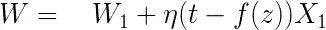
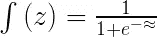
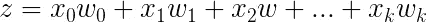
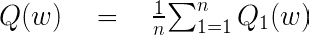
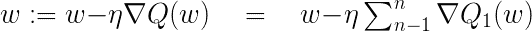
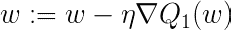

# 机器学习:这个漂亮的黑匣子有多黑

> 原文：<https://towardsdatascience.com/machine-learning-how-black-is-this-black-box-f11e4031fdf?source=collection_archive---------0----------------------->

Kazimir Malevich Black Square 1915

现在的软件比几十年前好得多。机器学习比以前更好了。机器学习软件库现在已经成熟，并且经过了很好的测试。围绕它的技术也要好得多。作为一名工程师，我已经习惯了使用更高级和抽象的库、框架来掩盖底层操作，并且经常使用完全的黑盒。我说的黑盒指的是工具，我很少关心里面发生了什么。

人工神经网络(ann)有一个很大的优势，因为在对系统建模之前不需要物理先验信息。当一个新的计算在网络上运行时，它以一个[不同的新权重矩阵](https://www.tu-braunschweig.de/Medien-DB/igp/heinert_2008.pdf)结束。这是从小的随机值开始，然后随着程序的运行进行调整的结果。这就是为什么安的是黑盒。

除了随机起点这一至少从数学上难以描述网络行为的原因之外；网络处于变化之中，而数学实际上是无状态的。那是我们可以用数学来描述的；一个开始，一个结束，一个过程中的一个点，但学习过程是许多操作的结果序列，不是无状态的。

具有很少层的简单网络中的几个步骤可以由触发的函数和由此产生的权重调整来表示。添加更多的层，需要不同类型和比例的表示。在少量液体中表现能量波是可以的，但这不是描述海洋的方式。

除了人工神经网络的密度，这些系统允许[随机变量和任意黑盒确定性函数](https://papers.nips.cc/paper/6421-bayesian-optimization-for-probabilistic-programs.pdf)的结合。它们支持推理算法和嵌套优化的智能初始化。

 [## 张量流-神经网络游乐场

### 这是一种构建从数据中学习的计算机程序的技术。它非常松散地基于我们如何思考…

playground.tensorflow.org](http://playground.tensorflow.org/#activation=sigmoid&batchSize=4&dataset=gauss&regDataset=reg-plane&learningRate=0.03&regularizationRate=0&noise=0&networkShape=4,1&seed=0.12353&showTestData=false&discretize=false&percTrainData=50&x=true&y=true&xTimesY=false&xSquared=true&ySquared=true&cosX=false&sinX=false&cosY=false&sinY=false&collectStats=false&problem=classification&initZero=false&hideText=false) 

人工神经网络通过从示例中学习来生成规则。为了学习，他们使用[调整重量和测量](http://playground.tensorflow.org/#activation=sigmoid&batchSize=4&dataset=gauss&regDataset=reg-plane&learningRate=0.03&regularizationRate=0&noise=0&networkShape=4,1&seed=0.12353&showTestData=false&discretize=false&percTrainData=50&x=true&y=true&xTimesY=false&xSquared=true&ySquared=true&cosX=false&sinX=false&cosY=false&sinY=false&collectStats=false&problem=classification&initZero=false&hideText=false)的过程来匹配已知的结果。他们在运行中创建自己的基于示例的规则。它们的操作方式没有详细说明它们如何使用诸如反向传播之类的东西来评估和调整权重。

A backpropogation function adjusting a weight within a network

The backpropagation formula

神经网络是能得出复杂答案的系统。为此，他们会生成自己的问题和规则。一些人认为，这些规则的出台缺乏透明度是一个问题。一些人认为，缺乏透明度，即黑箱问题，可能会妨碍人工神经网络的实用性。人们认为，如果我们依靠人工神经网络来寻找答案，它们需要能够解释自己，并告诉我们它们是如何得出答案的。

我仍然很乐意在手机上使用计算器来计算一个数的平方根，或者使用我当时使用的任何编程语言的内置数学函数。所有这些都使用不同的近似方法来解决平方根问题。然而事实是，在大多数情况下，如果我用来求平方根的方法得到了一个接近的估计值，我会很高兴。我们应该放心地相信黑盒吗？

# 把光线照进盒子里。

了解神经网络工作情况的一种方法是使用测试输入来探测网络，并在已知预期结果的情况下测量输入变量对输出的影响。有点像审问技巧，问一个你知道答案的问题来测试这个问题的真实性。对于使用反向传播的人工神经网络，这可以通过在反向传播步骤中跟踪误差项，然后测量每个输入影响输出的量来实现。

另一种学习信任网络衍生知识的方法是提取网络使用的规则。权重来自沿着输入和输出之间的非线性路径的变换。构成知识的所有值只是一系列数值。提取规则的另一个过程是通过启动学习过程来提取规则，从而将数值转化为符号形式。

查看规则不需要直接检查权重矩阵，而是象征性地呈现规则。通过比较输入/输出映射和形成决策树来提取规则。基于分类器搜索的决策树，寻找一系列智能组织给定数据集的规则。

神经网络接受输入并输出知识。网络使用一系列输入，然后创建输出，它们一起提供新的数据集。有可能形成该过程的符号和视觉表示。通过将输入和新输出传递给决策树分类器，我们可以揭示网络是如何获得其知识的。除了揭示网络使用的规则，它还给我们一种可视化这些规则的方式。

## 我们需要了解电才能开灯吗

> 机器学习的经典观点基于简约的理念。几乎在任何公式中，学习都可以归结为从数据中提取低复杂度的模式。

为什么要寻找网络建立规则的方式呢？如果一开始就对网络进行了适当的训练，这是一种多余的努力吗？然而，提取符号知识的能力有一些潜在的优势。从网络中获得的知识可以导致对数据中的模式和相关性的新见解。从符号知识中，更容易看出数据的哪些特征对结果是重要的。

给一个机器学习模型编程，把它正在做的事情表示成另一个模型，并不太难。这样做的问题是，它可能存在于平凡或琐碎的层面。这可能很耗时，而且不太适合理解大型复杂结构。还有一个问题是，导出的模型不能提供更清晰的理解。如果它减少了目标网络创建的规则，它可能过于简洁或给出不完整的描述，但可疑的危险是它会放大规则并进一步模糊所寻求的理解。

一种不同的方法是使用黑盒函数，并查看输入对该函数的重要性。应用它来量化算法超参数优化的[效应](http://jmlr.org/proceedings/papers/v32/hutter14.pdf)。

有一个软件库可以解决黑盒优化问题。这些方法使用基于序列模型的优化(贝叶斯优化)，这是一种解决此类问题的迭代方法。 [AutoWeka](https://github.com/automl/autoweka) 是一个设计用于在 Weka 中提供[自动模型选择和超参数优化的例子，WEKA 是一个易于使用的通常可用的机器学习算法的集合，用于使用机器学习的数据挖掘任务。](http://www.cs.ubc.ca/labs/beta/Projects/autoweka/papers/16-599.pdf)

## 让盒子不断告诉我们我们所知道的

处理黑盒的另一种方法是通过增加更多的层来使网络更加密集。这是进入[深层网络](http://ufldl.stanford.edu/tutorial/supervised/MultiLayerNeuralNetworks/)驻留的地方。深度网络的各种架构的土地，包括:[卷积神经网络](https://www.tensorflow.org/versions/r0.12/tutorials/deep_cnn/index.html#convolutional-neural-networks) (CNN 的)、[递归神经网络](https://www.tensorflow.org/versions/r0.12/tutorials/recurrent/index.html) (RNN)、[递归神经网络](https://pseudoprofound.wordpress.com/2016/06/20/recursive-not-recurrent-neural-nets-in-tensorflow/)，以及[解耦神经接口](https://deepmind.com/blog/decoupled-neural-networks-using-synthetic-gradients/) (DNI)和[可微分神经计算机](https://deepmind.com/blog/differentiable-neural-computers/) (DNCs)的更新模型。

> 深度学习背后的一个关键思想是从给定的数据集中提取高级特征。因此，深度学习旨在克服通常繁琐的特征工程任务的挑战，并帮助参数化具有许多层的传统神经网络。塞巴斯蒂安·拉什卡

深度网络与其传统的人工神经网络亲戚非常不同。形象化深层网络有多么不同的一个方法是，就其本质而言，它们过度适应它们从中学习的数据。这与更传统的人工神经网络相反，后者的目标是更接近拟合曲线。

当没有太多参数时，获得良好的拟合是可行的。深度学习可以接受多个输入，并通过多个层进行计算。即使使用随机权重，深层网络的隐藏层也非常强大，能够表示高度非线性的函数。

大多数深度学习算法采用某种形式的优化，通过调整 *x* 的值来最小化或最大化函数 *f(x)* 。要调整的函数称为目标函数、损失函数、误差函数或成本函数。深度学习利用这些功能来衡量和调整结果(预测、分类等)与输入的接近程度。目标是最小化损失函数。

函数的导数

给出了点 *x* 处 *f(x)* 的斜率，该斜率指定了输入微小变化的比例，以匹配输出的相应变化。

当大量重复和层可用时，减少损失函数的简单解决方案工作良好。一个反复出现的问题是，需要大的训练集来提供可靠的概括，因此需要大量的计算资源。

## 随机梯度下降

梯度下降法不是查看网络中的所有权重并重新计算它们，而是一种缩小相关权重空间的寻路方法，因此减少了更新和所需计算的次数。

随机梯度下降(SGD)方法用于许多机器学习模型，并且是用于 ANN 的主要算法，它还提供了一种在深度网络中产生精确结果的简单方法。随机梯度下降能够使用一小组样本给出损失的近似估计，从而减少所需的计算量。

The Stochastic Gradient Descent Algorithm

其中 X 是 Xi 的输入值集合，W 是每个 Xi 值的重要性因子(权重)集合。正权重意味着该风险因素增加了结果的概率，而负权重意味着该风险因素降低了结果的概率。目标输出值η是学习率(学习率的作用是控制每次迭代时权重被修改到的水平。在这种情况下，f(z)是将一个大的输入域映射到一小组输出值的函数所生成的输出。

函数 f(z)是逻辑函数:

在损失函数中

期望估计使 *Q(w)最小的参数 *w* 。*

梯度下降是

其中η是学习率。

任意单点的随机梯度下降近似为

因此，以学习速率η的初始向量 *w* 随着训练数据的随机洗牌而被迭代 *i* 次*次。通过使连接随机，由于不需要训练隐藏层的权重，所以训练时间更快是可能的。*

虽然对收敛如何发生或合理的概括如何得出的理解水平是模糊的，但深度学习最适合应用于我们知道期待什么答案但很难找到它们的任务。此类任务的常见示例有:语音识别、图像分类、异常检测和字符识别都不是在处理未知数。

## 将黑盒视为给出正确答案的机器

 [## 快，画！

### 神经网络可以学习识别涂鸦吗？看看它与你的画配合得有多好，并帮助教它，只要…

quickdraw.withgoogle.com](https://quickdraw.withgoogle.com/) 

如果一个网络[识别出一个字符是一个‘a’](http://karpathy.github.io/2015/05/21/rnn-effectiveness/)或者一个[画成一条鱼](https://aiexperiments.withgoogle.com/)，我们可以立即评估它的潜在正确性。如果网络将随机的灰色纹理识别为鹦鹉，我们可以很快看出它被[愚弄了，而且很愚蠢。我们不需要知道它是如何被愚弄的，因为我们使用经验主义来测试网络的准确性。知道了这一点，我们就可以想办法增加体重调整等功能。](http://static.googleusercontent.com/media/research.google.com/en//pubs/archive/44903.pdf)

知道隐藏层如何工作的保证可以被另一种知识所取代。深度学习模型的性能及其范围替代；了解内脏的需要；语用评价。能够查看使用[深度强化学习](https://arxiv.org/pdf/1312.5602.pdf)所获得的结果和性能，提供了一种实用的方式来查看正在发生的事情。

> “我们需要想办法打开深度学习黑匣子。一个强有力的方法是可视化表达。”[克里斯托弗·奥拉](https://colah.github.io/posts/2015-01-Visualizing-Representations/)

还有另一种方式来查看黑盒。当使用神经网络来承担诸如翻译和自然语言处理的语言任务时，使用单词甚至短语的向量表示，这些被称为单词嵌入。

[向量空间模型](https://en.wikipedia.org/wiki/Vector_space_model)(VSM)表示(嵌入)连续向量空间中的单词，其中语义相似的单词被映射到附近的点(“彼此邻近嵌入”)。这些源于这样一种理论，即出现在相同语境中的单词共享语义。这是像 Word2Vec 这样的程序使用两层神经网络在多维向量空间内重建单词的语言上下文的方式；给出了一个[字的矢量表示法](https://www.tensorflow.org/tutorials/word2vec/)。

网络的隐层学习对输入数据进行变换，并以多维方式表示。它给出了空间中一个词与另一个词的接近程度的值。很难将这个空间可视化，但是使用[降维](http://distill.pub/2016/misread-tsne/)来可视化高维表示的技术也将提供一种检查网络所使用的模型的方法。

Word2Vec 以数学方式检测单词与输入语料库中与之接近的其他单词的相似性。它给出单词特征的数字表示，例如上下文。它根据输入的其他单词训练单词。有两种方法可以做到这一点。一种是使用上下文来预测目标单词(一种称为连续单词包的方法)。另一种使用一个单词来预测目标上下文(称为跳格)。

该程序是一个神经网络的例子，它传递定义为向量的单词之间的关系，这些可以在空间中映射。这意味着深度学习过程有一个代表性的输出，即使很难可视化。谷歌开源的嵌入式投影仪在一定程度上克服了这个困难。

 [## 嵌入式投影仪-高维数据的可视化

### 最合适的困惑值取决于数据的密度。不严格地说，更大的…

projector.tensorflow.org](http://projector.tensorflow.org/) 

Christopher Colah 写道“不可思议的想法，不可理解的数据”以及如何“作为一名机器学习研究人员(他的工作)基本上是与不可理解的数据斗争——人类思维几乎不可能理解——并试图建立工具来思考和使用它”。然后，可视化成为理解深度学习网络实际上在做什么的理想工具。

## 反省

另一个克服对未知事物的黑箱恐惧的解决方案是开发一个具有自我知识的模型，一个能够回忆、叙述、推理、反思和自我分析的模型；有记忆的模型。一个有自我意识并从历史中学习的人。一种模型，能够表示变量和数据结构，并在长时间范围内存储数据。几种神经网络模型([注意力和增强递归神经网络](http://distill.pub/2016/augmented-rnns/))提供了一种将网络连接在一起的方式，允许一个网络探索另一个网络。

黑盒问题的一个方面是，迄今为止，大多数网络忽略了它们在每个学习周期中获得的知识。通过允许持有相同过程的多个副本，一种形式的递归神经网络(RNN)架构使用**长短期** - **短期记忆** (LSTM)允许学习周期持续足够长的时间以改进下一个周期。网络之间的接口将允许网络之间相互通信。

向网络中添加读写存储器使得能够存储知识的学习机器成为可能，可微分神经计算机(DNC)就是这样。虽然通过为模型提供独立的可读写内存[在架构上构建更加复杂，但 DNC](https://deepmind.com/blog/differentiable-neural-computers/)将能够揭示更多关于它们黑暗部分的信息。所以对付黑盒的方法就是让它们黑一点，给它们学习黑魔法的方法。

## 就这么干吧

科学有着从实践中学习的悠久传统，即利用实验来形成理论。这也是一个提出命题或提出论文进行测试的领域。本文引用的很多材料都是机器学习的前沿。正如《机器如何学习》一书的作者瑞恩·洛威在最近的一篇评论文章中评论的那样，“我们认为，在等待‘完美’的时候，不发表‘好’的东西并不是科学前进的有效途径。”。

访问数据是另一种打开窥视黑匣子正在做什么的方法，能够使用相同的数据复制实验。一个重要的举措是开源，不仅是算法的设计，还有他们用来训练和喂养它们的数据集。谷歌、微软、脸书、阿帕奇、科学界、政府机构和许多其他公司不仅开源了软件，还开源了训练数据和 T2 实验室。

深度学习和物理学之间的相似性被用来描述[为什么深度神经网络如此有效](https://arxiv.org/pdf/1608.08225v2.pdf)。共享可追溯到物理定律的简化属性，并使用两者都通用的某些层次形式的数据，这表明主题的结构与学习过程被要求执行的任务非常匹配。

考虑亚分子物理规范理论和大型强子对撞机的两端。两者都是用来寻求发现相似的启示的。科学家利用 LHC 发现了令人惊讶的结果，弦理论学家预测了令人惊讶的粒子。两者有时会汇聚到一起寻求，有时会展示联合起来的洞察力，一方告知另一方。有时令人震惊的理论，如[理论](https://arxiv.org/pdf/1001.0785v1.pdf)认为引力是一种熵力，而不是爱因斯坦建议的基本相互作用，在理论建议的[测试](https://arxiv.org/pdf/1612.03034v2.pdf)完成后，这些理论会被证明是可信的。

理论理解和实际应用是不总是相同的道路，但它们可能会导致相同的地方。机器学习的架构、算法和模型遵循类似的路径。一方面，理论知识遵循从实验中获得的知识，另一方面，理论表明实验需要去哪里。

> 参考资料:
> 
> 人工神经网络——如何打开黑匣子？[https://www . tu-braunschweig . de/Medien-DB/IGP/heinert _ 2008 . pdf](https://www.tu-braunschweig.de/Medien-DB/igp/heinert_2008.pdf)
> 
> 概率程序的贝叶斯优化[https://papers . nips . cc/paper/6421-概率程序的贝叶斯优化. pdf](https://papers.nips.cc/paper/6421-bayesian-optimization-for-probabilistic-programs.pdf)
> 
> 一种评估超参数重要性的有效方法【http://jmlr.org/proceedings/papers/v32/hutter14.pdfT4
> 汽车[https://github.com/automl/autoweka](https://github.com/automl/autoweka)
> 
> auto-WEKA 2.0:WEKA 中的自动模型选择和超参数优化[http://www . cs . UBC . ca/labs/beta/Projects/auto WEKA/papers/16-599 . pdf](http://www.cs.ubc.ca/labs/beta/Projects/autoweka/papers/16-599.pdf)
> 
> 多层神经网络深度学习教程[http://ufldl . Stanford . edu/Tutorial/supervised/MultiLayerNeuralNetworks/](http://ufldl.stanford.edu/tutorial/supervised/MultiLayerNeuralNetworks/)
> 
> 卷积神经网络[https://www . tensor flow . org/versions/r 0.12/tutorials/deep _ CNN/index . html #卷积神经网络](https://www.tensorflow.org/versions/r0.12/tutorials/deep_cnn/index.html#convolutional-neural-networks)
> 
> 递归神经网络[https://www . tensor flow . org/versions/r 0.12/tutorials/recurrent/index . html](https://www.tensorflow.org/versions/r0.12/tutorials/recurrent/index.html)
> 
> 递归(非递归！)TensorFlow 中的神经网络[https://pseudo essential . WordPress . com/2016/06/20/recursive-not-recursive-Neural-Nets-in-tensor flow/](https://pseudoprofound.wordpress.com/2016/06/20/recursive-not-recurrent-neural-nets-in-tensorflow/)
> 
> 使用合成梯度解耦神经接口[https://deep mind . com/blog/decoupled-Neural-networks-Using-Synthetic-Gradients/](https://deepmind.com/blog/decoupled-neural-networks-using-synthetic-gradients/)
> 
> 可微分神经计算机【https://deepmind.com/blog/differentiable-neural-computers/ 
> 
> Python 机器学习书籍 ISBN-13:978–1783555130[https://github.com/rasbt/python-machine-learning-book](https://github.com/rasbt/python-machine-learning-book)
> 
> 递归神经网络的不合理有效性【http://karpathy.github.io/2015/05/21/rnn-effectiveness/ 
> 
> 介绍人工智能实验【https://aiexperiments.withgoogle.com/ 
> 
> 重新思考计算机视觉的初始架构[http://static . Google user content . com/media/research . Google . com/en//pubs/archive/44903 . pdf](http://static.googleusercontent.com/media/research.google.com/en//pubs/archive/44903.pdf)
> 
> 用深度强化学习玩雅达利[https://arxiv.org/pdf/1312.5602.pdf](https://arxiv.org/pdf/1312.5602.pdf)
> 
> 理解深度学习需要重新思考一般化[https://openreview.net/pdf?id=Sy8gdB9xx](https://openreview.net/pdf?id=Sy8gdB9xx)
> 
> 声波化的希格斯数据显示了一个令人惊讶的结果[http://home . CERN/about/updates/2016/04/sonified-Higgs-data-show-surprise-result](http://home.cern/about/updates/2016/04/sonified-higgs-data-show-surprising-result)
> 
> 单词的矢量表示法[https://www.tensorflow.org/tutorials/word2vec/](https://www.tensorflow.org/tutorials/word2vec/)
> 
> 如何有效地使用 t-http://distill.pub/2016/misread-tsne/[SNE](http://distill.pub/2016/misread-tsne/)
> 
> 可视化表示:深度学习和人类[https://colah . github . io/posts/2015-01-Visualizing-presentations/](https://colah.github.io/posts/2015-01-Visualizing-Representations/)
> 
> 深度学习开放数据[https://deeplearning4j.org/opendata](https://deeplearning4j.org/opendata)
> 
> 开源 DeepMind 实验室[https://deepmind.com/blog/open-sourcing-deepmind-lab/](https://deepmind.com/blog/open-sourcing-deepmind-lab/)
> 
> 为什么深度廉价学习效果这么好？[https://arxiv.org/pdf/1608.08225v2.pdf](https://arxiv.org/pdf/1608.08225v2.pdf)
> 
> 弦理论可以检验吗？[http://www . PBS . org/wgbh/nova/blogs/physics/2012/09/can-string-theory-be-tested/](http://www.pbs.org/wgbh/nova/blogs/physics/2012/09/can-string-theory-be-tested/)
> 
> 超对称预测标准模型中每个粒子的伙伴粒子，以帮助解释为什么粒子有质量【https://home.cern/about/physics/supersymmetry
> 
> 紧急引力和黑暗宇宙【https://arxiv.org/pdf/1611.02269v1.pdf 
> 
> 利用弱引力透镜测量首次测试弗林德的紧急引力理论[https://arxiv.org/pdf/1612.03034v2.pdf](https://arxiv.org/pdf/1612.03034v2.pdf)