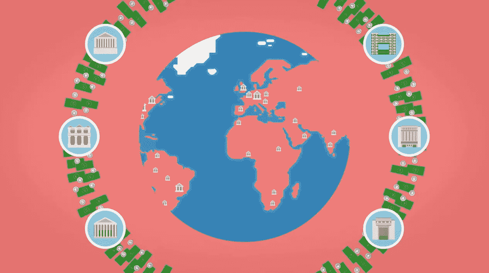

# 金融中的机器学习

> 原文：<https://towardsdatascience.com/machine-learning-in-finance-2074bc6bf3da?source=collection_archive---------11----------------------->

应用人工智能对金融企业来说有很多好处。事实上，很多人已经成功做到了这一点。为了让你有一个想法——这里有一个人工智能在金融领域的顶级应用的总结。

# 人工智能交易

谈金融不能不谈交易的机器学习。事实上，有太多的东西值得讨论，我们用了一整篇文章来讨论交易的机器学习

让我们看看最重要的几点:

# 人工智能不会取代交易员，而是帮助他们

交易者需要处理大量的信息——及时了解最新情况，并对事情的发展趋势有一个清晰的预感。

他们还进行严格的统计分析，以找出他们怀疑的小型市场低效的细节。

所有这些都需要时间——因为交易是一个竞争性的游戏——你越快，你得到的馅饼就越多。

人工智能帮助交易者更快、更准确地进行分析，通过**发布新闻**(例如情绪分析)；**提高对外部因素(如降雨、货物供应或选举结果)的预测**，并为交易者自动微调**高频交易机器**。

# 自动化且有利可图的人工智能交易基本上是一种幻想

在与其他人竞争的复杂系统中(如股票市场)，人工智能仍然比人类弱得多，所以要警惕任何承诺从纯人工智能系统中获利的东西。

你犯了很多错误，让它看起来是可能的，但实际上却不是。

关于为什么会这样，以及如何使用人工智能的更多细节，请查看关于交易的机器学习的深度文章

# 让投资组合管理更好更便宜

投资组合经理会告诉你把钱投资到哪里——这取决于你的财务目标是什么，以及你能应对多大的市场波动(你的风险承受能力)。

他们挑选不同类型的投资，并安排一个投资组合(一份资产清单，加上你应该投入其中的资金比例)。如果市场发生变化(这种情况经常发生),就需要通过在不同资产之间转移资金来重新调整投资组合。

对一个人来说，这份工作是一个时间密集型的过程——因此银行收取很高的费用，并且只提供给他们富有的客户。但是好的投资建议对每个人都有帮助，不管你的存款有多少。

这就是“机器人顾问”迅速崛起的原因。他们不仅非常便宜，而且实际上比昂贵的人力投资组合经理做得更好。

为什么？因为许多人类顾问无法帮助自己，并通过“秘密提示”向他们的客户承诺高额回报——这在有效的市场中总是一种幻觉，因此是一个坏主意。这些“建议”最终会给你的投资组合增加很多风险——可能会让你的大部分积蓄化为乌有(我见过几次这种情况——这可不太妙)。

**人工智能在投资组合管理中如此有用的秘密**在于，决定你的理想资产组合(投资组合)的每一个因素都可以**很容易地用数字表示**:你的年龄、收入、家庭状况、何时需要钱(买房子、孩子、教育等等)。)和你的风险承受能力——这些都很容易，但都是数据库中的数字。

从这个数据库中，人工智能可以预测你的偏好(比如你什么时候可能需要多少钱)。一旦你有了这些信息，那么正确分配你的钱就是简单地解决一个数学公式——这对任何计算机来说都是小菜一碟。

想了解更多？深入了解[现代投资组合理论](https://en.wikipedia.org/wiki/Modern_portfolio_theory)背后的细节

# 使欺诈检测更加强大

随着数字商务(通过信用卡和在线支付)的发展，欺诈的动机也在不断增加。

传统的欺诈模式依赖于简单的规则系统——旨在抓捕欺诈者的清单。这些发现欺诈的简单方法的最大缺点是它们会产生很多假警报。这意味着一个合法的顾客会被拒绝购买——然后他理所当然地感到不安，会去别的地方购买。

**机器学习可以产生更准确的欺诈检测清单**——同时也减少了错误警报。为什么 AI 模型更好？以下是三大原因:

*   **数据驱动**:机器学习模型检查所有欺诈性购买的例子，并在没有人类偏见的情况下，找到将欺诈者与正常客户区分开来的确切模式。
*   **更复杂**:机器学习模型可以轻松捕捉成千上万的小模式，并在检查交易时使用它们。手写清单时不太现实的东西。这使得模型更加准确，并产生更少的错误警报。
*   **持续更新**:诈骗者很有创意，不断尝试新事物来欺骗系统。一旦你发现了你的系统还没有发现的欺诈，只需要几分钟就可以更新模型，并让它从现在开始学习如何识别新的伎俩。—伟大的事情是:无论你是在与 1 个还是数千个有创造力的欺诈者作战，人工智能系统都可以轻松地学习所有人的模式，无需抄近路和一概而论。

欺诈系统也大多是副作用,就像交易中的算法:仍然需要有人对被标记为欺诈的交易进行最终检查。为什么？因为一对一人类仍然更擅长阅读人类的行动——机器学习只是让我们的工作变得更容易。

想了解更多？我们写了一篇关于如何使用人工智能更好地检测[移动点击欺诈](https://www.datarevenue.com/en/usecases/stopping-mobile-click-fraud)的文章。

# 使保险承保更加准确和个性化

与投资组合管理(上文)类似，保险承保是一项具有一组清晰的量化因素(输入)、量化目标和固定输出的工作:保险价格及其随时间推移的保费。

这是**自动化统计决策的理想环境***——意思是:机器学习。

多年来，承保人已经使用更简单的统计模型来估计承保风险，并决定合适的保费应该是多少。

机器学习模型可以走得更远——让几乎整个核保工作变得廉价和可扩展。这个问题的关键在于一家保险公司的数据:他们已经计算出的数千份合同——在人类输入的情况下——是训练机器学习模型学习自己撰写合同的理想基础。

像这样的 Machin learning 模型为廉价的个性化承保打开了大门。这在 B2C 领域尤其有用(如人寿保险)。

但这只是开始——保险业务是如此彻底的统计数据，以至于人工智能还有更多应用。这里有两个例子:

# 好的司机支付较少的汽车保险

一些保险公司已经从你驾驶的方式(你的远程信息签名)中预测出你发生事故的风险。他们使用算法来学习哪种驾驶行为是安全驾驶员的标志，然后向他们提供更便宜的费率。

这使得保险从竞争中脱颖而出，吸引那些不想为危险司机的错误买单的安全司机。

# 预测你会选择哪种保险

机器学习让保险公司的生活变得更容易的另一种方式是预测你最终会选择哪种保险。这让你的顾问的工作变得容易多了，因为他可以马上向你提出对你来说最有意义的选择。

# 这只是冰山一角

还有很多应用，比如:预测你是否会成为**忠实客户**，未来是否会**拖欠保险**或者**提出索赔**。

# 银行服务的目标销售

银行有很多关于你的非常有价值的数据——除了知道你的年龄、收入和住址——他们还知道你的确切消费行为。委婉地说，这揭示了你的许多情况。也许比你的网上浏览行为更多。

如果一家银行使用了隐藏在数据中的所有信息，它可以了解你的很多信息，包括:**你现在对哪些服务感兴趣**。

银行雇佣顾问，他们可以给 soma 个人建议——但是他们只有时间给大客户，而且顾问需要很多经验才能正确解读迹象。

机器学习可以找到您数据中的信息，并预测哪种银行产品符合您当前的兴趣:

*   新信用卡还是更高的信用卡额度？
*   临时贷款？或者也许
*   一个房贷，因为你表现的像是马上要买房的人。

不仅如此，他们还可以使用机器学习来预测你偿还信贷、贷款或抵押贷款的可能性，从而预测他们应该向你收取的利息。

这将日益导致**主动放贷。**得益于算法分析，银行不再等待你申请贷款，而是为你和他们数百万的其他客户提供量身定制的贷款。

# 流失预测:预测你是否会换银行

一旦你决定换银行，并让你的顾问知道，通常要说服你留下来就太晚了。如果他们能早点看到预警信号，并在你决定离开之前有机会让你更开心，那就更好了*。*

银行可以使用与上述相同的资料——根据你的数据和交易历史建立——来预测你是否有可能离开并转投另一家银行。这给顾问们提供了早期预警，让他们知道应该关注谁，并让银行挽救了许多原本会流失的客户。

# 那么为什么 AI 在金融领域如此有用呢？

简单来说就是因为金融是一个用数据和统计玩的游戏。金融产品大多是数学赌注:平均而言，应该获利的统计方程式。

在这个游戏的更简单和更重复的部分，我们可以用我们的大脑代替机器学习，并自动化许多决策。

除非我们直接和其他人竞争——比如在交易或欺诈中——人类让游戏变得更加复杂。那我们最好使用我们最强的武器:我们自己的大脑。

*原载于*[*www.datarevenue.com*](https://www.datarevenue.com/en/usecases/machine-learning-in-finance)*。*