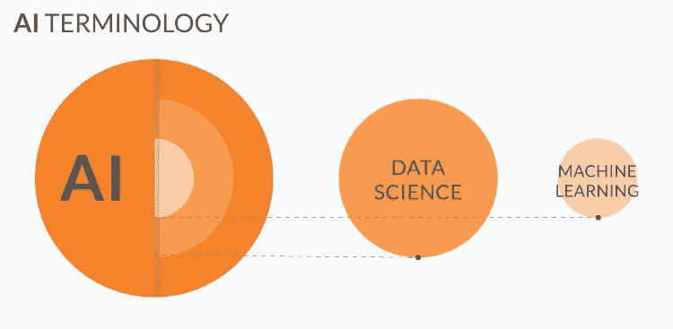
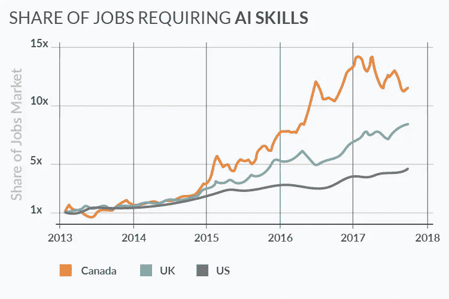
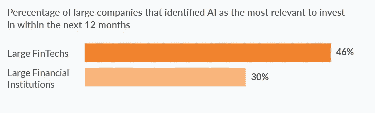
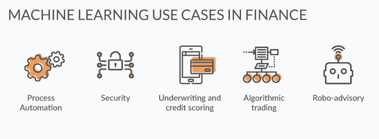
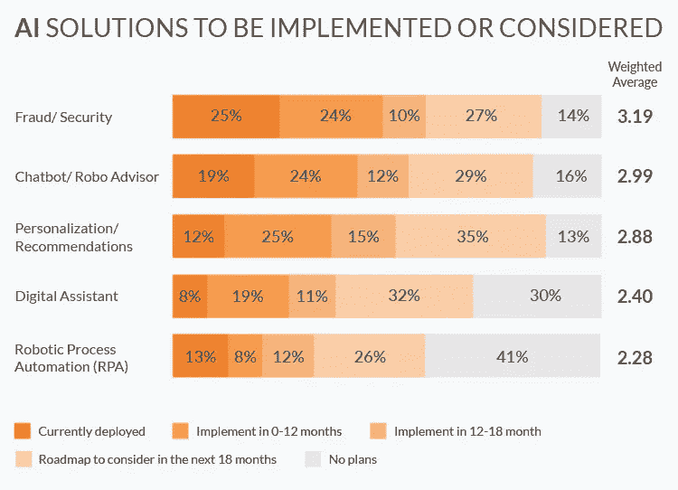
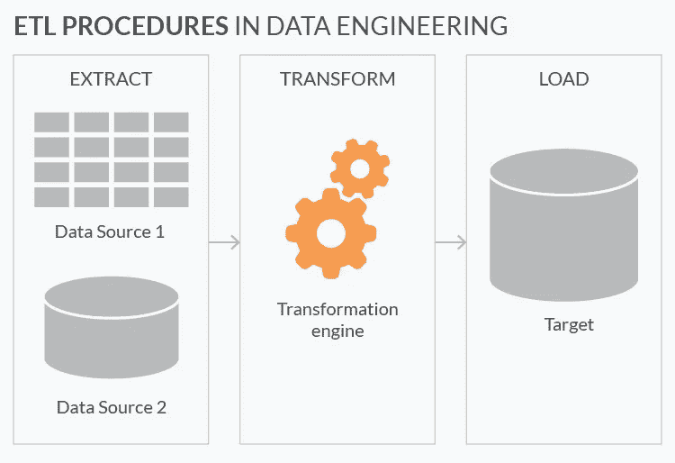
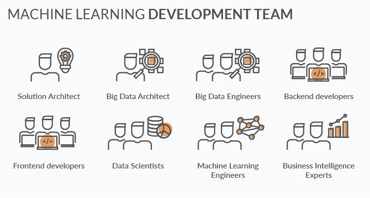

# 金融中的机器学习:为什么、什么和如何

> 原文：<https://towardsdatascience.com/machine-learning-in-finance-why-what-how-d524a2357b56?source=collection_archive---------0----------------------->

金融领域的机器学习可能会产生神奇的效果，尽管它的背后并没有什么神奇之处(嗯，可能只有一点)。尽管如此，机器学习项目的成功更多地取决于建立有效的基础设施，收集合适的数据集，以及应用正确的算法。

机器学习正在金融服务业取得重大进展。让我们看看为什么金融公司应该关心，他们可以用 [AI 和机器学习](https://www.n-ix.com/machine-learning-ai/)实现什么解决方案，以及他们究竟如何应用这项技术。

# 定义

我们可以将**机器学习(ML)定义为数据科学**的一个子集，它使用统计模型来获得洞察力并做出预测。下图解释了人工智能、数据科学和机器学习之间的关系。为了简单起见，我们在这篇文章中主要关注机器学习。

机器学习解决方案的神奇之处在于，它们从经验中学习**，而不是被明确编程**。简单地说，您需要选择模型并向它们提供数据。然后，该模型会自动调整其参数以改善结果。

数据科学家用现有数据集训练机器学习模型，然后将训练有素的模型应用到现实生活中。

该模型作为后台进程运行，并根据其训练方式自动提供结果。数据科学家可以根据需要频繁地重新训练模型，以保持它们的最新和有效。例如，我们的客户 [Mercanto](https://mercanto.app/) 每天都在重新训练机器学习模型。

一般来说，你输入的数据越多，结果就越准确。巧合的是，巨大的数据集在金融服务行业非常普遍。有数十亿字节的交易、客户、账单、资金转账等数据。**这非常适合机器学习**。

随着技术的发展，最好的算法是开源的，很难想象没有机器学习的金融服务的未来。

也就是说，**大多数金融服务公司仍然**没有准备好**从这项技术中获取真正的价值，原因如下:**

1.  企业通常对机器学习及其对组织的价值抱有完全不切实际的期望。
2.  机器学习中的 R&D 成本很高。
3.  DS/ML 工程师的短缺是另一个主要问题。下图说明了对人工智能和机器学习技能需求的爆炸式增长。
4.  在更新数据基础设施方面，财务主管不够灵活。

我们将在这篇文章的后面讨论如何克服这些问题。首先，让我们看看为什么金融服务公司不能忽视机器学习。

# 为什么要考虑金融领域的机器学习？

尽管面临挑战，许多金融公司已经开始利用这项技术。下图显示，金融服务公司的高管们非常重视机器学习，他们这样做有很多理由:

1.  流程自动化降低了运营成本。
2.  由于更高的生产力和增强的用户体验而增加了收入。
3.  更好的合规性和增强的安全性。

有各种各样的开源机器学习算法和工具，非常适合金融数据。此外，成熟的金融服务公司拥有雄厚的资金，可以购买最先进的计算硬件。

由于金融领域的定量性质和大量历史数据，机器学习有望增强金融生态系统的许多方面。

这就是为什么如此多的金融公司正在大力投资机器学习研发。至于落后者，忽视人工智能和人工智能可能会被证明是代价高昂的。

# 金融领域有哪些机器学习用例？

让我们来看看金融领域一些很有前景的机器学习应用。

# 工序自动化

**流程自动化是机器学习在金融领域最常见的应用之一**。该技术允许取代手工作业，自动化重复性任务，并提高生产率。

因此，机器学习使公司能够优化成本、改善客户体验和扩大服务。以下是机器学习在金融领域的自动化应用案例:

*   聊天机器人
*   呼叫中心自动化。
*   文书自动化。
*   员工培训游戏化，等等。

以下是银行业流程自动化的一些示例:

**摩根大通**推出了一个合同智能(COiN)平台，该平台利用了机器学习技术之一的自然语言处理。该解决方案处理法律文档并从中提取重要数据。手动审查 12，000 份年度商业信贷协议通常需要大约 360，000 个工时。然而，机器学习允许在几个小时内审查相同数量的合同。

**BNY·梅洛**将流程自动化集成到他们的银行生态系统中。这项创新每年节省了[30 万美元](http://www.reuters.com/article/us-bony-mellon-technology-ai-idUSKBN186253)，并带来了[大范围的运营改进](https://www.bnymellon.com/us/en/who-we-are/people-report/innovate/the-rise-of-robots.jsp)。

**富国银行**通过 Facebook Messenger 平台使用一个[人工智能驱动的聊天机器人](https://www.wellsfargo.com/about/press/2017/chat-bot_0418.content)与用户交流，并提供密码和账户方面的帮助。

**Privatbank** 是一家乌克兰银行，在其移动和网络平台上实现了聊天机器人助手。聊天机器人加快了一般客户查询的解决，并允许减少人工助理的数量。

# 安全性

随着交易、用户和第三方集成数量的增加，金融领域的安全威胁也在增加。而机器学习算法在**检测欺诈**方面非常出色。

例如，银行可以利用这项技术实时监控每个账户的数千个交易参数。该算法检查持卡人采取的每个行动，并评估试图进行的活动是否是该特定用户的特征。这种模型可以高精度地发现欺诈行为。

如果系统识别出**可疑账户行为**，它可以要求用户提供额外的身份证明来验证交易。或者甚至完全阻止该交易，如果该交易有至少 95%的可能性是欺诈的话。机器学习算法只需要几秒钟(甚至几秒钟)就可以评估一项交易。这种速度有助于实时防止欺诈，而不仅仅是在犯罪发生后发现它们。

**金融监控**是金融领域机器学习的另一个安全用例。数据科学家可以训练系统来检测大量的小额支付，并将此类洗钱技术标记为 smurfing。

机器学习算法也能显著增强**网络安全**。数据科学家训练一个系统来发现和隔离网络威胁，因为机器学习在分析数以千计的参数和实时性方面首屈一指。在不久的将来，这项技术很有可能会为最先进的网络安全网络提供动力。

**Adyen** 、 **Payoneer** 、 **Paypal** 、 **Stripe** 和 **Skrill** 是一些在安全机器学习领域投入巨资的著名金融科技公司。

# 承销和信用评分

**机器学习算法非常适合金融和保险领域常见的承保任务**。

数据科学家在数千个客户资料上训练模型，每个客户有数百个数据条目。然后，一个训练有素的系统可以在现实生活环境中执行相同的承保和信用评分任务。这种评分引擎帮助人类员工更快更准确地工作。

银行和保险公司拥有大量的历史消费者数据，因此可以使用这些条目来训练机器学习模型。或者，他们可以利用大型电信或公用事业公司生成的数据集。

例如， **BBVA 银行与另一个信用评分平台 Destacame 合作。该银行旨在为拉丁美洲信用记录不佳的客户增加信贷渠道。Destacame 通过开放 API 访问公用事业公司的账单支付信息。使用账单支付行为，Destacame 为客户生成一个信用评分，并将结果发送给银行。**

# 算法交易

在算法交易中，**机器学习帮助做出更好的交易** **决策**。一个数学模型实时监控新闻和交易结果，并检测可能迫使股价上涨或下跌的模式。然后，它可以根据自己的预测，主动卖出、持有或买入股票。

**机器学习算法可以同时分析成千上万的数据源，**这是人类交易员不可能实现的。

机器学习算法有助于人类交易员获得相对于市场平均水平的微弱优势。此外，鉴于交易量巨大，这一小小的优势往往会转化为可观的利润。

# 机器人顾问

机器人顾问现在在金融领域很常见。目前，机器学习在咨询领域有两个主要应用。

**投资组合管理**是一项在线财富管理服务，利用算法和统计数据来分配、管理和优化客户的资产。用户输入他们目前的金融资产和目标，比如说，在 50 岁时存下 100 万美元。然后，机器人顾问根据风险偏好和预期目标，在投资机会中分配当前资产。

**理财产品推荐**。许多在线保险服务使用机器人顾问向特定用户推荐个性化的保险计划。由于费用较低，以及个性化和标准化的建议，客户选择机器人顾问而不是个人理财顾问。

# 如何在金融中利用机器学习？

尽管人工智能和机器学习有诸多优势，但即使是财大气粗的公司也很难从这项技术中挖掘出真正的价值。金融服务业的在职者希望利用机器学习的独特机会，但实际上，他们对数据科学如何工作以及如何使用它有一个模糊的想法。

他们一次又一次地遇到类似的挑战，比如缺乏业务关键绩效指标。这反过来导致**不切实际的估计和耗尽预算**。仅仅有一个合适的软件基础设施是不够的(尽管这将是一个好的开始)。交付有价值的机器学习开发项目需要清晰的愿景、扎实的技术天赋和决心。

一旦你很好地理解了这项技术将如何帮助实现业务目标，就开始进行想法验证。这是数据科学家的任务。他们调查这个想法，并帮助你制定可行的 KPI 和做出现实的估计。

**注意**此时你需要收集所有的数据。否则，您将需要一名数据工程师来收集和清理这些数据。

根据特定的使用案例和业务条件，金融公司可以遵循不同的路径来采用机器学习。我们去看看。

# 放弃机器学习，转而关注大数据工程

通常，金融公司开始他们的机器学习项目只是为了意识到他们只需要适当的数据工程。 [Max Nechepurenko](https://www.linkedin.com/in/maksym-nechepurenko-23541810/) ，**N-iX 的高级数据科学家**，评论道:

> *在开发[数据科学]解决方案时，我建议使用* [*奥卡姆剃刀*](https://en.wikipedia.org/wiki/Occam%27s_razor) *原则，这意味着不要过于复杂。大多数以机器学习为目标的公司实际上需要专注于可靠的数据工程，将统计数据应用于聚合数据，并将这些数据可视化。*

仅仅将统计模型应用于经过处理且结构良好的数据，就足以让银行隔离其运营中的各种瓶颈和低效。

这些瓶颈的例子有哪些？这可能是特定分行的排队、可以消除的重复任务、低效的人力资源活动、移动银行应用程序的缺陷等等。

此外，任何数据科学项目的最大部分都可以归结为构建一个协调的平台生态系统，从数百个来源(如 CRM、报告软件、电子表格等)收集孤岛数据。

在应用任何算法之前，您需要对数据进行适当的结构化和清理。只有这样，你才能进一步将数据转化为洞察力。事实上，ETL(提取、转换和加载)和进一步清理数据占了机器学习项目时间的 80%左右。

# 使用第三方机器学习解决方案

即使你的公司决定在即将到来的项目中利用机器学习，你也不一定需要开发新的算法和模型。

大多数机器学习项目处理的都是已经解决的问题。谷歌、微软、亚马逊和 IBM 等科技巨头将机器学习软件作为服务出售。

这些开箱即用的解决方案已经被训练来解决各种业务任务。如果你的项目覆盖相同的用例，你相信你的团队能胜过这些拥有巨大 R&D 中心的科技巨头的算法吗？

一个很好的例子是谷歌的多种即插即用推荐解决方案。该软件适用于各种领域，检查它们是否适合您的业务案例是合乎逻辑的。

机器学习工程师可以实现专注于您的特定数据和业务领域的系统。专家需要从不同的来源提取数据，转换数据以适应特定的系统，接收结果，并可视化结果。

代价是缺乏对第三方系统的控制和有限的解决方案灵活性。此外，机器学习算法并不适合每个用例。 [Ihar Rubanau](https://www.linkedin.com/in/irubanau/) ，**N-iX 的高级数据科学家**评论:

> *目前还不存在通用的机器学习算法。在将算法应用于不同领域的不同业务案例之前，数据科学家需要调整和微调算法。*

因此，如果谷歌的现有解决方案解决了你特定领域的特定任务，你可能应该使用它。如果没有，那么就以定制开发和集成为目标

# 创新和整合

从头开始开发机器学习解决方案是风险最大、成本最高、最耗时的选择之一。尽管如此，这可能是将 ML 技术应用于某些商业案例的唯一方法。

机器学习的研究和开发针对特定领域的独特需求，需要进行深入的调查。如果没有现成的解决方案来解决这些具体问题，第三方机器学习软件很可能会产生不准确的结果。

尽管如此，你可能还是需要大量依赖谷歌等公司的开源机器学习库。当前的机器学习项目主要是将现有的最先进的库应用于特定的领域和用例。

在 N-iX，我们已经确定了成功的**企业研发项目在机器学习**中的七个共同特征。他们在这里:

1.  **明确的目标**。在收集数据之前，你至少需要对你想要用人工智能和机器学习实现的结果有一些大致的了解。在项目的早期阶段，数据科学家将帮助您将想法转化为实际的 KPI。
2.  **机器学习解决方案的健壮架构设计**。你需要一个有经验的软件架构师来执行这项任务。
3.  **合适的大数据工程生态系统**(基于 Apache Hadoop 或 Spark)是必备的。它允许收集、集成、存储和处理来自金融服务公司众多孤立数据源的大量数据。大数据架构师和大数据工程师负责构建生态系统。
4.  **在新创建的生态系统上运行 ETL 过程**(提取、转换和加载)。大数据架构师或机器学习工程师执行这项任务。
5.  **最后的数据准备**。除了数据转换和技术清理之外，数据科学家可能需要进一步细化数据，以使其适合特定的业务案例。
6.  **应用适当的算法**，基于这些算法创建模型，微调模型，并用新数据重新训练模型。数据科学家和机器学习工程师执行这些任务。
7.  **洞察力的清晰可视化**。商业智能专家对此负责。此外，您可能需要前端开发人员使用易于使用的 UI 来创建仪表板。

小项目可能需要更少的努力和更小的团队。例如，一些 R&D 项目处理小数据集，因此它们可能不需要复杂的大数据工程。在其他情况下，根本不需要复杂的仪表板或任何数据可视化。

# 关键要点

*   金融从业者最常使用机器学习来实现流程自动化和安全性。
*   在收集数据之前，您需要对数据科学的预期结果有一个清晰的认识。在项目开始之前，有必要设置可行的 KPI 并做出现实的估计。
*   许多金融服务公司需要数据工程、统计和数据可视化，而不是数据科学和机器学习。
*   训练数据集越大、越干净，机器学习解决方案产生的结果就越准确。
*   您可以根据需要频繁地重新训练您的模型，而无需停止机器学习算法。
*   没有适用于不同商业案例的通用机器学习解决方案。
*   机器学习中的 R&D 代价高昂。
*   像谷歌这样的科技巨头创造了机器学习解决方案。如果你的项目关注这样的用例，你不能期望胜过 Google、Amazon 或 IBM 的算法。

*最初发表于*[*www.n-ix.com*](https://www.n-ix.com/machine-learning-in-finance-why-what-how/)