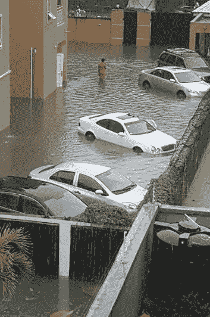
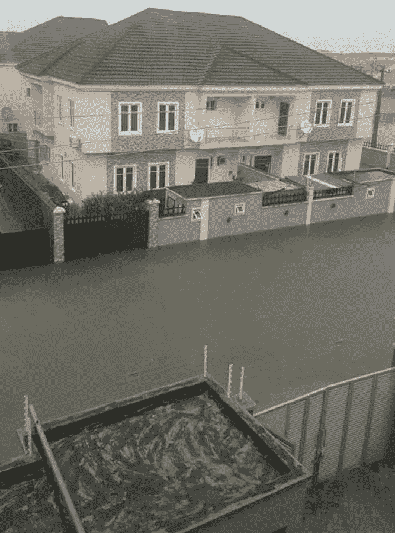
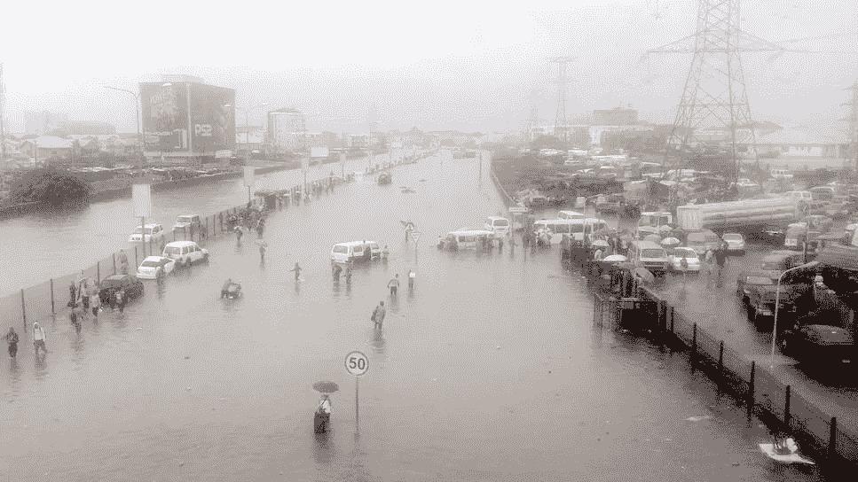
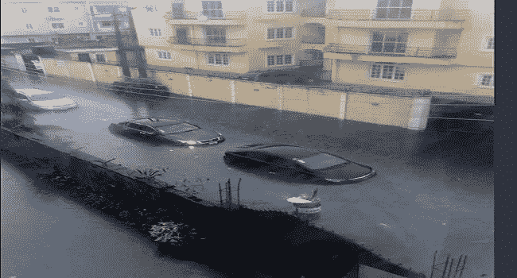
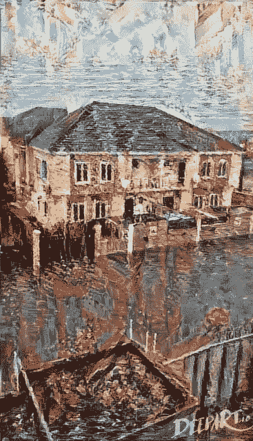
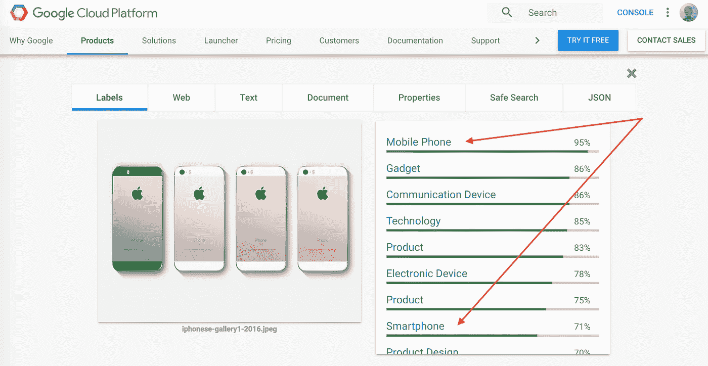
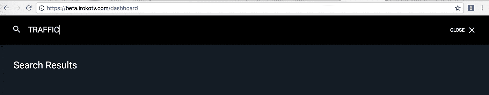
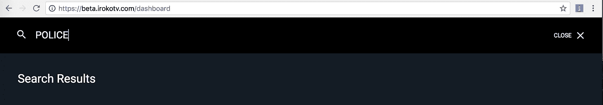

# 尼日利亚的机器学习，今天？

> 原文：<https://towardsdatascience.com/machine-learning-in-nigeria-today-b2a953145c1f?source=collection_archive---------4----------------------->

拉各斯 [2017 女性科技创客峰会](https://www.womentechmakers.com/iwd17)是其他 14 个全球峰会之一，但也是唯一一个在非洲举办的峰会，于 4 月在[拉各斯商学院](https://www.google.com.ng/url?sa=t&rct=j&q=&esrc=s&source=web&cd=1&cad=rja&uact=8&ved=0ahUKEwjIxK3szY7VAhWhK8AKHTCYCwIQFgglMAA&url=http%3A%2F%2Fwww.lbs.edu.ng%2F&usg=AFQjCNGfQelfrHF8abnU-qLu6E3q7MoCJg)成功举办。

这是丰富多彩的，引人入胜的，充满了许多时刻，我相信 300 多名与会者还没有忘记。

主题为“讲述你的故事”，由来自 Google、silences、Andela、SheLeadsAfrica 的摇滚明星演讲者和来自尼日利亚各地的许多知名女性在科技组织/倡议中进行了精彩的演讲和会议。

我喜欢下午有两个研讨会。一个是在公共演讲上无语，标记为“开发你的故事”，另一个是在[tensor flow](https://www.tensorflow.org/)——谷歌的开源机器学习 API。

当然，两个研讨会都很成功...

# 这是我作为 SSA 社区经理最后一次参与谷歌开发者关系

在活动的筹备过程中，当我准备共同主持 [Tensorflow](https://www.tensorflow.org/) 研讨会时，我一直在思考如何让机器学习(简称 ML)对今天的非洲企业和初创公司有价值，以及是否有我可以开发的核心用例，让 ML 与与会者更相关。

当然，在当今一些最引人注目的应用程序中，我们喜欢并认为理所当然的许多伟大特性都是 ML 驱动的；就像 GMail 中良好的垃圾邮件过滤和智能回复，Google Photos 中的自动图像识别和分类，甚至是上传到脸书的图像中便于标记的人脸识别。

我思考最多的问题是，非洲的企业如何利用机器学习来实现很酷的功能和服务，或者为现有的功能和服务创造更好的用户体验？

我决定引用常见的疑点——电子商务和娱乐——作为非洲人可以从 ML 中获得快速成功和巨大支持的垂直行业。我与导师分享了我的想法，她在 [Tensorflow](https://www.tensorflow.org/) 研习班的课程中将这些想法作为伟大的 ML 范例呈现出来。

一切都很顺利——除了我没有按计划发表这篇文章。从那时起我就把它留在草稿里，到现在已经快 3 个月了！

# 最近拉各斯洪水的启示

这篇文章不发表，这个周末就不会过去。想到这里，我不禁想起了许多拉各斯居民的日常琐事、挣扎和现实——疯狂的交通、拥堵、不分青红皂白的垃圾处理、鲁莽的驾驶和停车、需要一年(或更长时间)预付的昂贵租金、兜售(或者你也可以称之为粗人)、糟糕的道路、维护不善的下水道、洪水等等

今年，我亲身经历了一年一度的拉各斯洪水。曾经有一段时间，水涨到了我的腰带以下。不要相信我的话，看下面几张照片..

今天的尼日利亚，机器学习能解决这些吗？这值得探索，我很高兴我不是唯一一个朝这个方向思考的人

最近拉各斯的洪水让我想到了威尼斯..甚至像 T2 威尼斯 T3 一样设计和建造的拉各斯。然后我突然想起机器学习可以帮助我[通过威尼斯](https://www.theverge.com/2017/3/30/15124466/ai-photo-style-transfer-deep-neural-nets-adobe)的眼睛想象我被洪水淹没的拉各斯。

使用 https://deepart.io ，我用一幅威尼斯的画转换了一些最近拉各斯洪水的照片。一个威尼斯主题但没有独木舟的拉各斯看起来可能是这样的:

有人也一直忙着为尼日利亚的机器学习出疯狂的随机想法。

# 玩笑归玩笑，机器学习拯救世界

好的。除了威尼斯主题的洪水淹没的拉各斯和优化自动驾驶汽车的算法的新奇之外，对于每年洪水淹没的拉各斯，我们今天可以从非洲的机器学习中受益吗？

## 图像识别和分类

许多以图像为主的非洲应用程序可以通过图像识别、分类和标记来改善功能和用户体验。

在 Konga 上搜索*“智能手机”*，仅显示名称中带有*“智能手机”*(包括空格)*的项目。“智能手机”也一样。*没有一个结果包括 iPhone，一款 Konga 目录中的智能手机？

电子商务平台可以通过使用来自商品图像的元数据自动标记商品目录中的商品来优化这种用户体验。[谷歌云视觉 API](https://cloud.google.com/vision) 可以通过分析 iPhone 的照片来自动识别 iPhone 是否为智能手机。然后可以用它来标记商品，并建立一个索引，以便在搜索过程中识别它。

我也喜欢搜索只有游泳池的酒店。有高尔夫球场的酒店怎么样？分析他们的图像库可以揭示这些。

## 视频标记、标签和编目

我是一个爸爸，我的儿子刚满一岁。我们关系很好，我妻子有时会嫉妒。他喜欢卡通片，当卡通人物唱歌或跳舞时，他喜欢跳舞。他对电影也是如此。 [iROKOtv](http://irokotv.com/dashboard) 如何帮我在尼日利亚电影中加入唱歌或跳舞的场景？

我有一个肯尼亚朋友，她第一次去拉各斯，当她乘坐的一辆汽车被拿着枪的尼日利亚警察拦下时，她吓了一跳。虽然对许多尼日利亚人来说，这是相对正常的，但这是她第一次近距离使用这种武器。在她下一次访问之前， [iROKOtv](http://irokotv.com/dashboard) 能否通过在尼日利亚电影中加入警察或枪战场景来帮助她更好地适应尼日利亚的警察现实？

在 iROKOtv 上搜索“警察”或“交通”什么也没有，我想这是因为没有电影或演员的名字中有这些词。

对于 2018 年的情人节广告活动，iROKOtv[将如何从其目录中创建最佳接吻场景的精彩视频？如果 iROKOtv](http://irokotv.com/dashboard) 的目录中有[婚礼派对](https://en.wikipedia.org/wiki/The_Wedding_Party_(2016_film))，搜索“舞蹈”会出现它吗，因为它是尼日利亚电影中最好的舞蹈场景之一？

Google 的[云视频智能 API 可以帮助解决这些用例。像](https://cloud.google.com/video-intelligence)[视觉 API](https://cloud.google.com/vision/) 一样，它分析视频和表面元数据，这些元数据可用于[识别、分类和搜索它们](https://www.youtube.com/watch?v=mDAoLO4G4CQ)。

# 行动呼吁

今天，机器学习在非洲有着巨大的潜力！大型科技公司(谷歌、苹果、微软 e.t.c)已经将[人工智能](https://www.google.com.ng/url?sa=t&rct=j&q=&esrc=s&source=web&cd=4&cad=rja&uact=8&ved=0ahUKEwjyxeqE1o7VAhVRlxQKHRdXAhUQFgg2MAM&url=https%3A%2F%2Fen.wikipedia.org%2Fwiki%2FArtificial_intelligence&usg=AFQjCNHTX72mVmxztKnY53AA7IzAHbGlTw)命名为未来——不是应用程序，不是移动设备，也不是操作系统——而是我们赋予计算机学习、做事和做人的能力，以及它所蕴含的潜力。这是实现变革体验的能力。

借助 Tensorflow、Cloud Vision API 和 Video Intelligence API 等工具，我们不必等到我们可以实现算法，让自动驾驶汽车在我们的地形中工作。我们可以马上开始获得价值

我们的用户使用谷歌照片、脸书等获得了很好的体验，并有很高的期望。再说，****就是看*** ..*

*我想收到你的来信。请在下面的评论区分享你的想法，或者发推文 [@chaluwa](https://twitter.com/chaluwa) 提出任何问题或建议。另外，如果你觉得这篇文章有用，别忘了推荐和分享它。*