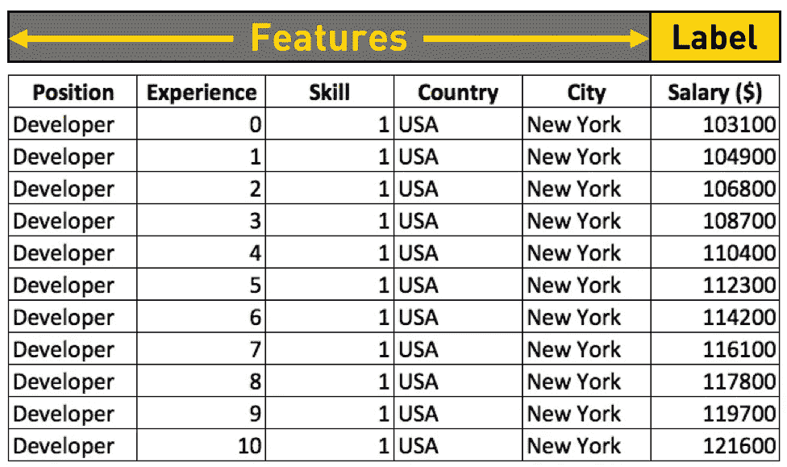
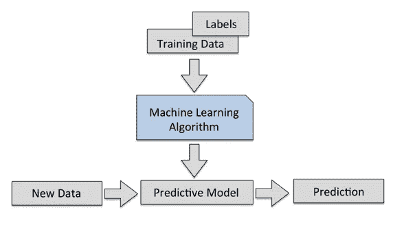
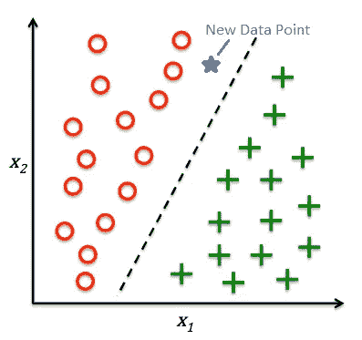
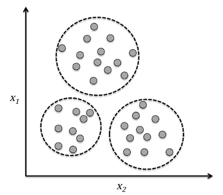
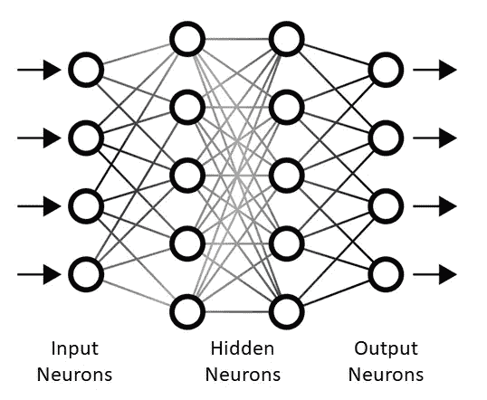
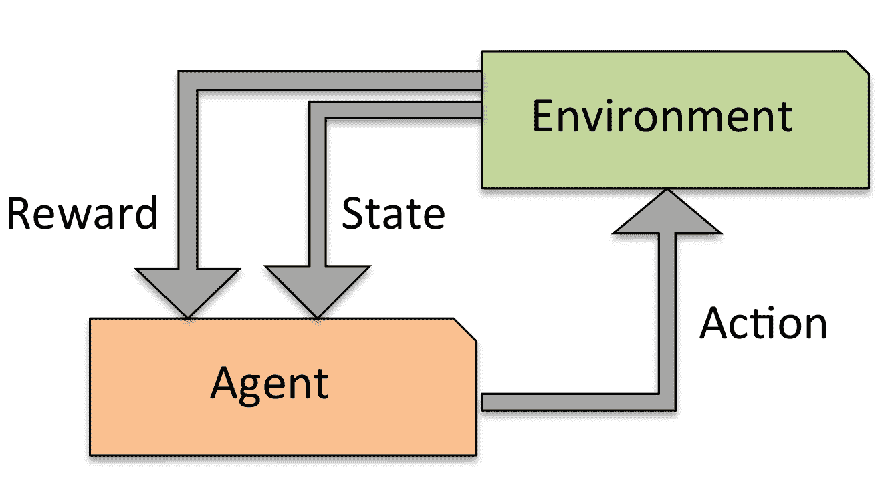
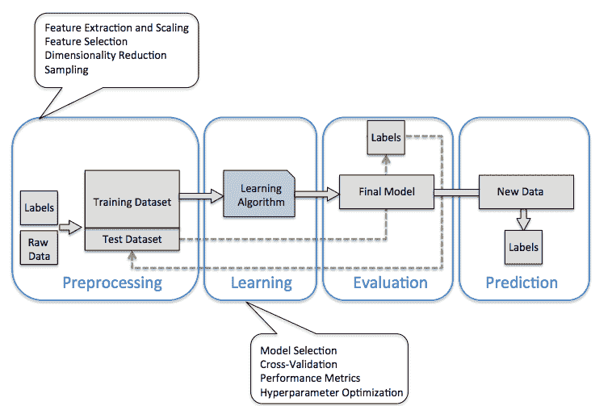
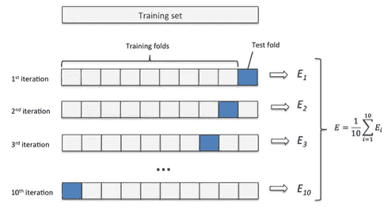

# 机器学习导论:综合指南

> 原文：<https://towardsdatascience.com/machine-learning-introduction-a-comprehensive-guide-af6712cf68a3?source=collection_archive---------5----------------------->

Picture from [Unsplash](https://unsplash.com/photos/GQCYOS_MH0w)

这是我将描述机器学习概念、类型、算法和 python 实现的系列文章的第一篇。

该系列的主要目标是:

1.  创建机器学习理论和直觉的综合指南。
2.  分享和解释用 python 开发的机器学习项目，以实用的方式展示所解释的概念和算法，以及它们如何应用于现实世界的问题。
3.  在主题中留下我的知识的数字足迹，并激励其他人在自己的领域中学习和应用机器学习。

本系列中公开的信息有几个来源，主要有:

*   机器学习工程师纳米学位(Udacity)
*   Python 机器学习书籍(Sebastian rasch ka & va hid Mirjalili)
*   用 Python 书深度学习(Francois Chollet)
*   用 Python 书精通机器学习(Jason Brownlee)
*   何塞·波尔蒂利亚教授的 Python 数据科学和机器学习课程(Udemy)
*   曼努埃尔·加里多的机器学习和数据科学与 Python 课程

# 什么是机器学习？

由于技术和传感器价格的大幅下降，我们现在可以创建、存储和发送比历史上任何时候都多的数据。仅在过去两年中，全球就有高达 90%的数据被创建。以我们目前的速度，每天有 250 亿字节的数据被创建，而且这一速度还会继续增长。这些数据提供给机器学习模型，并且是这门科学近年来经历的繁荣的主要驱动力。

机器学习是人工智能的一个子领域，可以描述为:

*“机器学习是一门让计算机像人类一样学习和行动的科学，通过以观察和现实世界互动的形式向它们提供数据和信息，以自主的方式随着时间的推移改善它们的学习。”—丹·法盖拉*

机器学习提供了一种有效的方法来捕获数据中的知识，以逐步提高预测模型的性能，并做出数据驱动的决策。它已经成为一项无处不在的技术，我们享受着它的好处:垃圾邮件过滤器、无人驾驶汽车、图像和语音识别以及[世界级围棋选手](https://en.wikipedia.org/wiki/AlphaGo_versus_Lee_Sedol)。

下一个视频展示了视频监控机器学习应用的实时事件检测。

# 基本术语和符号

通常在机器学习中，使用矩阵和向量符号来表示数据。该数据通常以矩阵形式使用，其中:

*   矩阵中的每一行都是一个样本、观察值或数据点。
*   每一列都是观察特征(或属性)。
*   通常有一个列(或特征)，我们称之为目标、标签或响应，它是我们试图预测的值或类。

Table By Author

训练一个机器学习模型，就是给机器学习算法提供训练数据，从中学习。

关于机器学习算法，它们通常有一些内部参数。ie:在决策树中，有深度、节点数、叶子数等参数……这些内部参数被称为超参数。

泛化是模型对新数据进行预测的能力。

# 机器学习的类型

本系列将学习的机器学习类型有:

*   监督学习
*   无监督学习
*   深度学习。

在这个系列中，我们将探索和研究所有提到的机器学习类型，我们还将更深入地挖掘一种叫做“强化学习”的深度学习技术。

# 监督学习

监督学习是指一种用一组样本训练的机器学习模型，其中期望的输出信号(或标签)是已知的。模型从这些已知的结果中学习，并调整其内部参数以适应输入数据。一旦模型经过适当的训练，它就可以对未知的或未来的数据做出准确的预测。

一般流程概述:

Figure by Author

监督学习有两个主要应用:分类和回归。

1.  **分类**:

分类是监督学习的一个子类，其目标是基于过去的观察来预测新实例的分类类别标签(离散的、无序的值、组成员)。典型的例子是电子邮件垃圾邮件检测，这是一种二元分类(电子邮件要么是-1-垃圾邮件，要么不是-0-垃圾邮件)。还有多类分类，如手写字符识别(类别从 0 到 9)。

二进制分类的一个例子:有两个类别，圆和十字，以及两个特征，X1 和 X2。该模型能够找到每个数据点的特征与其类别之间的关系，并在它们之间设置边界线，因此当提供新数据时，它可以估计其所属的类别，给定其特征。

Figure by Author

在这种情况下，新数据点落入圆形子空间，因此，模型将预测其类别为圆形。

**2。回归**:

回归也用于将类别分配给未标记的数据。在这种类型的学习中，我们被给予一些预测(解释)变量和一个连续的反应变量(结果)，我们试图找到这些变量之间的关系，使我们能够预测一个连续的结果。

线性回归的一个例子:给定 X 和 Y，我们拟合一条直线，使样本点和拟合直线之间的距离最小化(使用一些标准，如平均平方距离(SSE))。然后，我们将使用拟合线的截距和斜率来预测新数据的结果。

Figure by Author

# 无监督学习

在无监督学习中，我们处理未知结构的未标记数据，目标是探索数据的结构以提取有意义的信息，而无需参考已知的结果变量。

主要有两类:聚类和降维。

1.  **聚类:**

聚类是一种探索性的数据分析技术，用于将信息组织成有意义的群或子群，而无需事先了解其结构。每个群集是一组相似的对象，它们与其他群集的对象不同。

Figure by Author

**2。降维:**

通常情况下，处理的数据中的每个观察值都带有大量的特征，换句话说，这些特征具有很高的维数。这对机器学习算法的计算性能来说是一个挑战，因此降维是用于处理这个问题的技术之一。

降维方法通过发现特征之间的相关性来工作，这意味着存在冗余信息，因为一些特征可以用其他特征来部分解释。它从数据中去除噪声(噪声也会降低模型的性能)，并将数据压缩到一个更小的子空间，同时保留大部分相关信息。

# 深度学习

深度学习是机器学习的一个子领域，它使用人工神经网络的分层结构，人工神经网络以类似于人脑的方式构建，神经元节点连接成一个网络。该架构允许以非线性方式处理数据分析。

神经网络的第一层将原始数据作为输入，对其进行处理，提取一些信息，并将其作为输出传递给下一层。然后每一层处理前一层给出的信息并重复，直到数据到达最后一层，最后一层进行预测。

该预测与已知结果进行比较，然后通过一种称为反向传播的方法，该模型能够学习产生准确输出的权重。

Figure by Author

# 强化学习

强化学习是深度学习最重要的分支之一。目标是建立一个模型，其中有一个代理采取行动，目的是提高其性能。这种改进是通过在代理每次执行属于开发人员希望代理执行的一组动作中的一个动作时给予特定的奖励来实现的。

奖励是对行动达到预定目标的程度的衡量。然后，代理使用这个反馈来调整它未来的行为，目的是获得最大的回报。

一个常见的例子是象棋引擎，其中代理从一系列可能的行动中做出决定，这取决于棋盘的部署(这是环境的状态)以及在赢得或输掉游戏时给出的奖励。

Figure by Author

# **构建机器学习模型的一般方法**

Figure by Author

## 预处理:

这是任何机器学习应用程序中最关键的步骤之一。通常数据的格式对于模型来说不是最佳的(甚至是不合适的)。在这种情况下，预处理是一项必须完成的任务。

许多算法要求特征在相同的尺度上(例如:在[0，1]范围内)以优化其性能，这通常通过对数据应用归一化或标准化技术来实现。

我们还可以发现，在某些情况下，所选择的特征是相关的，因此对于从中提取有意义的信息来说是冗余的。然后，我们必须使用降维技术将特征压缩到更小的维度子空间。

最后，我们将把原始数据集随机分成训练和测试子集。

## 训练和选择模型

为了训练和选择性能最好的算法，有必要对一系列不同的算法进行比较。为此，有必要选择一个度量标准来衡量模型的性能。分类问题中一个常用的是分类精度，即正确分类实例的比例。在回归问题中，最受欢迎的是均方误差(MSE ),它测量估计值和真实值之间的平均平方差。

Figure bu Author

最后，在使用测试子集对模型进行最终评估之前，我们将使用一种称为交叉验证的技术来确保我们的模型在真实世界数据中表现良好。

这种技术将训练数据集划分为更小的训练和验证子集，然后估计模型的泛化能力，换句话说，估计当提供新数据时它可以预测结果的程度。然后，它重复这个过程， *K* 次，并通过除以在 *K* 次迭代之间获得的度量的总和来计算模型的平均性能。

Figure by Author

一般来说，库提供的机器学习算法的默认参数不是与我们的数据一起使用的最佳参数，因此我们将使用超参数优化技术来帮助我们对模型的性能进行微调。

## 评估模型并使用新数据进行预测

一旦我们为我们的训练数据集选择并拟合了一个模型，我们就可以使用测试数据集来估计这个未知数据的性能，因此我们可以估计模型的泛化误差。或者使用其他度量来评估它。

如果我们对获得的度量值感到满意，那么我们可以使用该模型对未来数据进行预测。

# 包裹

在这篇文章中，我们学习了什么是机器学习，描绘了它的本质、动机和应用的大画面。

我们还学习了一些基本的符号和术语，以及不同种类的机器学习算法:

*   监督学习，有分类和回归问题。
*   无监督学习，带聚类和降维。
*   强化学习，代理从它的环境中学习。
*   深度学习及其人工神经元网络。

最后，我们介绍了构建机器学习模型的典型方法，并解释了其主要任务:

*   预处理。
*   培训和测试。
*   选择模型。
*   评估中。

*如果你喜欢这篇文章，那么你可以看看我关于数据科学和机器学习的其他文章* [*这里*](https://medium.com/@rromanss23) *。*

*如果你想了解更多关于机器学习、数据科学和人工智能的知识* ***请在 Medium*** *上关注我，敬请关注我的下一篇帖子！*