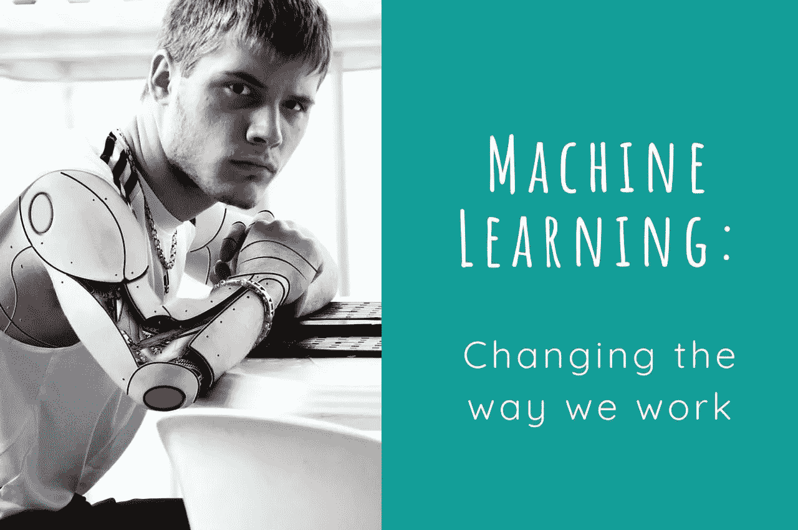

# 机器学习正在颠覆会计行业

> 原文：<https://towardsdatascience.com/machine-learning-is-disrupting-the-accounting-industry-dadca0daed5f?source=collection_archive---------2----------------------->

“机器学习”一词在过去一年左右已经成为一个时髦词汇。每年都有数十亿美元投资于人工智能(AI)技术——根据麦肯锡全球研究所的研究，2016 年的投资在 260 亿至 390 亿美元之间——其中近 60%投入了机器学习。

金融服务以及高科技和电信是领先的早期采用者。麦肯锡预测，这三个行业将在未来三年继续引领 AI 的采用。

这项技术变得非常复杂，早期采用者开始看到明显的好处。在金融服务行业，采用主动战略的人工智能采用者的利润率比不采用者高出约 12.5%。

Xero 是一个面向小企业的云会计平台，今年早些时候在他们的软件中引入了机器学习。

# 什么是机器学习？

机器学习是人工智能的一个子领域。人工智能领域的先驱阿瑟·塞缪尔(Arthur Samuel)在 1959 年创造了“机器学习”一词，根据他的说法，机器学习赋予了“计算机无需明确编程就能学习的能力”。

机器学习使用神经网络，其功能设计与人脑相同。当算法处理和分析足够多的数据时，它们开始识别模式，建立联系，并根据数据包含的元素对其进行分类。

计算机不如人类聪明，但因为它们处理数据的速度比人快得多，所以它们的速度非常快，而且得出的结论通常非常准确。

# 机器学习如何影响金融

会计软件变得越来越智能，它已经在执行以前需要人工干预的任务。重复、手动和繁琐的任务被消除，因此簿记员和企业主现在可以花更少的时间来更新他们的帐户，而将更多的时间用于其他重要的任务。

以下是这项技术已经影响到的一些具体任务的示例:

*   会计应用程序学习发票编码行为，并建议交易应分配到哪里。例如，如果销售人员通常将产品分配到特定的销售帐户，下次销售人员将该项目添加到发票时，会计应用程序会自动将其分配到正确的帐户。它还关注簿记员和会计师纠正的错误。例如，如果企业所有者将一些东西分配到错误的账户，而会计纠正了错误，会计应用程序将把会计的选择作为正确的选择。
*   银行对账是自动化的。同样，技术从以前的分配和账户选择中学习，然后为新的银行交易提供正确的建议。
*   银行使用人工智能聊天机器人来帮助客户解决常见的查询。来自会计程序的聊天机器人，如 [Xero](https://www.xero.com/blog/2017/02/artificial-intelligence-machine-learning-transform-accounting/) ，可以让你查询最新的财务数据，如银行里有多少钱，某个账单何时到期，谁欠你钱，它甚至可以将用户与他们目录中的 Xero advisors 联系起来。

此外，这项技术也将在不久的将来影响审计人员的工作。目前，审计员只研究交易的精选样本。他们雇佣了大量的会计团队，加班加点在截止日期前完成审计。流经公司的大量交易限制了审计人员可以手动检查的交易数量。

据普华永道称，未来审计师将能够[审计 100%的公司财务交易](http://ww2.cfo.com/auditing/2017/02/artificial-intelligence-audits/)。机器学习算法将处理和审查数据，识别异常，并编制异常值列表，供审计人员检查。审计人员可以将他们的技能用于调查和推断模式或异常背后的原因，而不是花大部分时间检查数据。

# 为什么这对行业来说是好消息

在与不懂会计的小企业主一起工作时，你可能已经看到他们发现让他们的账簿保持最新并记住在哪里分配交易很有挑战性。这会造成时间损失和不必要的错误，作为他们的会计，你必须在以后纠正这些错误。这也意味着他们的账目从来都不准确，让他们对自己的财务表现一无所知。自动建议或完成会计代码的机器学习技术消除了错误，节省了大量时间。

除了节省时间之外，如果审计师能够检查一家公司的每一笔交易，他们的财务信息将更加准确，审计师可以花更多的时间分析财务数据，为客户提供更好的建议。

技术可以做繁重的工作，数字运算和报告编辑，而会计师专注于判断密集型任务。机器不能像人类一样思考。他们也没有我们的情商。技术使会计师更有效率和生产力，以便会计师可以解释数据，为他们的客户提供更好的见解和商业建议。

# 会计行业的未来如何？

根据总部设在香港的投资公司 CLSA 的说法，人工智能创造的就业机会将多于它“摧毁”的就业机会，但这种转变将是痛苦的。在接下来的五到十年里，我们可以期待看到财务领域的重大变化，会计师将需要学会快速适应。

据埃森哲称，到 2020 年，超过 80%的传统金融服务将由包括人工智能在内的跨职能团队提供。人工智能将处理数据，寻找异常，并编制报告，而人类会计师将分析数据，并根据他们的经验和知识向客户提供明智的建议。

如果你不是一个精通技术的会计师，不要被这个吓到。这只是一种不同的思考方式，一种容易学习的方式。从 Xero 这样的云会计程序开始尝试吧。一旦你习惯了这一点，你会发现很容易采用其他智能技术，并利用它们为你服务。

观看国际象棋传奇人物加里·卡斯帕罗夫的有趣的 [Ted 演讲](https://www.ted.com/talks/garry_kasparov_don_t_fear_intelligent_machines_work_with_them)，关于我们如何不应该害怕智能机器，而是应该与它们合作。

*来源:*

*麦肯锡全球研究院，人工智能，下一个数字前沿:*[*http://www . McKinsey . com/business-functions/McKinsey-analytics/our-insights/how-Artificial-Intelligence-can-deliver-real-value-to-companies*](http://www.mckinsey.com/business-functions/mckinsey-analytics/our-insights/how-artificial-intelligence-can-deliver-real-value-to-companies)

*本文原载于*[*thecreativeaccountant.net*](https://thecreativeaccountant.net/machine-learning-is-disrupting-the-accounting-industry/)*。*