# 机器学习是癌症预测的未来

> 原文：<https://towardsdatascience.com/machine-learning-is-the-future-of-cancer-prediction-e4d28e7e6dfa?source=collection_archive---------3----------------------->

## 在准确预测癌症的发展方面，机器学习模型比病理学家更好。

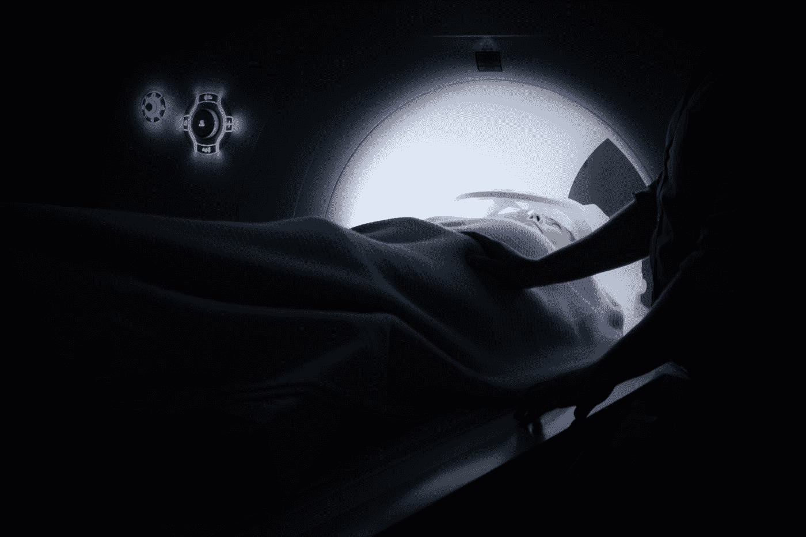

Photo by [Ken Treloar](https://unsplash.com/@kentreloar?utm_source=medium&utm_medium=referral) on [Unsplash](https://unsplash.com?utm_source=medium&utm_medium=referral)

每年，病理学家在全世界诊断出 1400 万新的癌症患者。这意味着数百万人将面临多年的不确定性。

几十年来，病理学家一直在进行癌症诊断和预测。大多数病理学家诊断癌症的成功率为 96-98%。他们很擅长这部分。

问题出现在下一部分。根据奥斯陆大学医院的数据，病理学家的预后准确率只有 60%。预后是在癌症被诊断后进行的活组织检查的一部分，它预测疾病的发展。

是时候进行病理学的下一步了。

# 机器学习简介

—

**病理学的下一步是机器学习。**

—

机器学习是人工智能的核心分支之一。这是一个接收数据、发现模式、使用数据训练自己并输出结果的系统。

*那么是什么让一台* ***机器*** *比一名训练有素的专业人员更优秀呢？*

与病理学家相比，ML 具有关键优势。

首先，机器可以比人工作得快得多。活检通常需要病理学家 10 天的时间。一台计算机可以在几秒钟内完成数千次活检。

机器可以做一些人类不擅长的事情。他们可以重复数千次而不会感到疲惫。**每次迭代后，机器都会重复该过程，以便做得更好**。人类也这样做，我们称之为练习。虽然熟能生巧，但是再多的练习也无法使人接近计算机的计算速度。

另一个优点是机器的精确度很高。随着物联网技术的出现，世界上有如此多的数据，人类不可能全部查看。这就是机器帮助我们的地方。他们可以比我们做得更快，进行精确的计算，发现数据中的模式。这就是它们被称为计算机的原因。

# 机器学习的简要技术说明

首先，有两大类机器学习，

1.  监督学习
2.  无监督学习

# 监督学习被输入标记数据

监督学习也许用它自己的名字来描述是最好的。监督学习算法是一种由给定数据“教授”的算法。

模型使用标记的数据训练自己，然后测试自己。重复这一过程，直到获得最佳结果。一旦完成，它就可以对未来的实例进行预测。

# 无监督学习从未标记的数据中得出结论

在无监督学习中**数据集没有被标记。**相反，**模型的工作是通过寻找模式(如分组和聚类)来创建适合数据的结构**。

把无监督学习想象成婴儿。婴儿出生在这个世界上，除了本能之外，不知道什么是“对”或“错”。随着他们的成长，他们会看、摸、听、感觉(输入数据)并尝试一些东西(测试数据)，直到他们知道是什么。

好的，你知道 ML 的两个主要类别。酷毙了。现在让我们更深入地研究一下 ML 使用的一些技术。

# 回归使结果更加准确

**回归的主要目标是最小化模型的成本函数。**

*什么是成本函数？*

成本函数是计算值 x 的假设和实际值 x 之间的距离的函数。基本上，它告诉你结果离实际答案有多远。

回归的全部意义在于找到一个超平面(多维线的花哨说法)，该超平面使成本函数最小化，以创建数据点之间的最佳可能关系。

Linear regression making the relationship more accurate

它从一条没有相关性的随机线开始，重复使用梯度下降成为最佳关系。

使用一种叫做**梯度下降的算法进行回归。**在该算法中，通过模型调整其参数来降低成本函数。

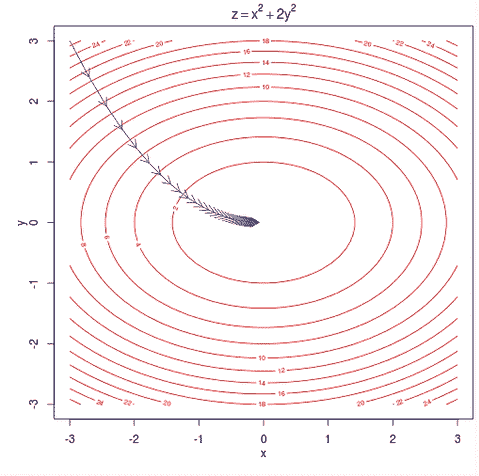

Think of descent as you running down a hill, trying to get to the lowest point.

同时，随着梯度下降使代价函数越来越低，结果也变得更加精确。

这就是通过使用回归来更好地拟合给定数据，从而使您的模型变得更加准确的方法。

# 分类将数据点分类成组

监督学习模型不仅仅可以做回归。ML 最有用的任务之一是分类。

分类算法**在数据点**之间建立边界，根据它们与模型参数匹配的特征，将它们分类为某一组。

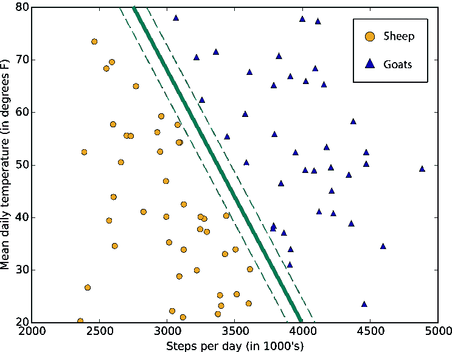

In this model, data points are classified as either being sheep or goat. This is conditional on their steps per day depending on average daily temperature.

使用称为逻辑回归的过程来创建类别之间的界限。

需要记住的一个重要事实是**边界不依赖于数据**。

还记得成本函数吗？惊喜！它也用于分类。

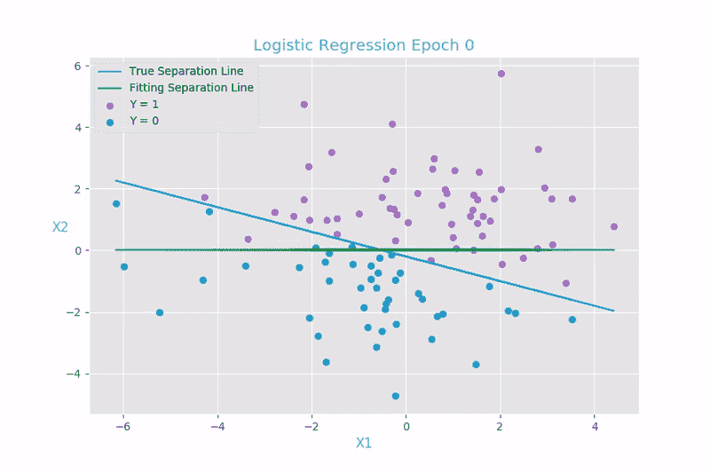

In classification, it is used similarly to regression to find the best possible fit to the data.

# 支持向量机

SVM 算法是用于分类和回归的监督学习算法。

SVM 算法的目标是通过创建一个边界**来对数据进行分类，该边界在其自身和数据之间具有最大可能的余量**。

# 决策树缩小到一个结果

决策树是一个树状模型(i *f 树长倒了)*用 ML 表示概率和决策。

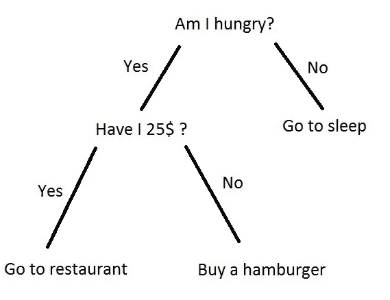

The process of deciding what you’ll be eating

如上图所示，DT 使用条件语句来缩小某个值在某个实例中出现的概率。它使用 DT 模型来预测某个实例具有某个结果的**概率。**

DT 继续分裂成更多的节点，直到每个输入都有结果。

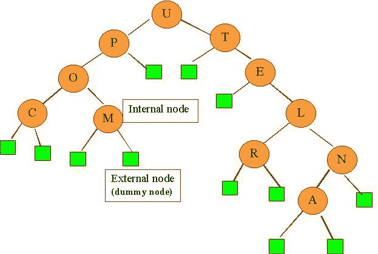

Basically, **internal nodes split further** while **external nodes are like a stop sign.**

# 贝叶斯网络估计概率

BN 是一个类似于决策树的分类器。不同的是， **BN 分类器显示概率估计**而不是预测。

变量的数据集和它们的条件依赖关系以一种叫做有向无环图的可视化形式显示出来。

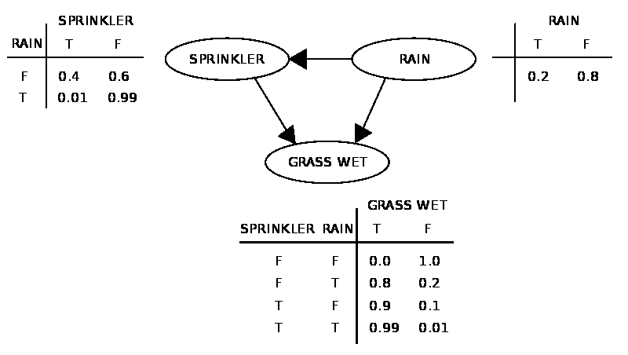

在上面的例子中，草地潮湿的两个原因要么是因为下雨，要么是因为洒水器。使用 BN 模型，可以找到每种可能情况的概率。

# 人工神经网络从数据中学习

安从给定的数据中学习。它从我们自己的神经系统中获得灵感，尽管它们的工作方式不尽相同。

ANN 模型在我们称之为输入层的一层中输入大量数据。从这些数据中，进行比较，**模型自动识别数据的特征并给其贴上标签。**

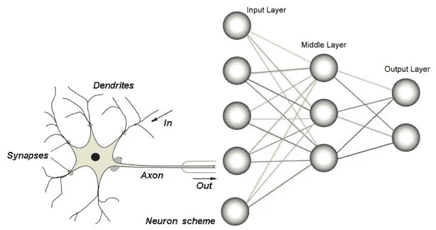

They’re kind of similar I guess?

在 ANN 中有三种层类型。

*   输入层
*   隐藏层
*   输出层

这就是人工神经网络的工作方式——首先，输入层的每个神经元都被赋予一个值，称为激活函数。然后，它被分配一个随机权重，而隐藏层神经元被分配一个随机偏差值。在隐藏层中，一种称为激活函数的算法为隐藏层神经元分配一个新的权重，该权重乘以输出层中的随机偏差值。

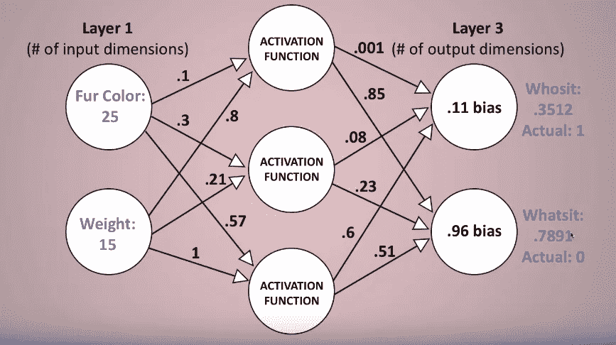

The first model with random bias and weights. The network is essentially guessing at this point.

这个激活函数乘以一个随机权重，通过称为反向传播的过程，随着迭代次数的增加而变得更好。

通过这种方式，模型对给定实例的输出进行随机预测。使用反向传播，人工神经网络模型调整其参数，使答案更准确。

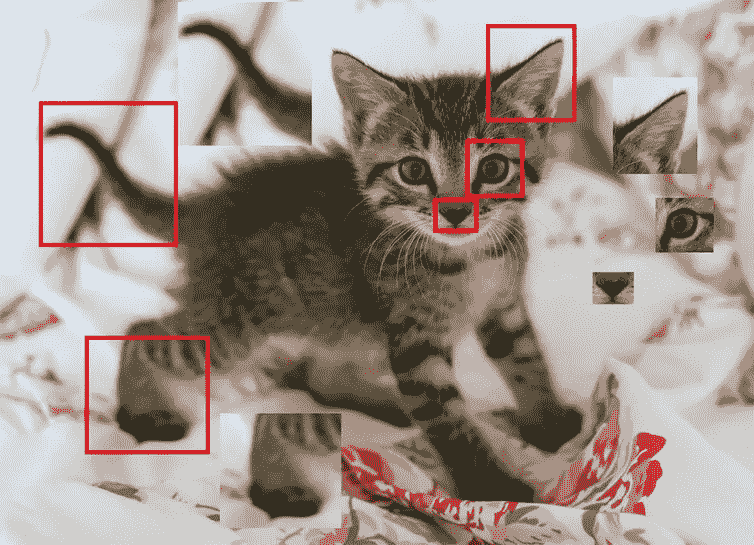

Machines think this cat is pretty adorable too.

例如，如果一个模型要从一个大型图像数据库中对猫进行分类，它将通过识别构成眼睛和尾巴等特征的边缘来学习，并最终扩大到识别整只猫。把这个过程想象成搭建乐高。你确定不同的部分，把不同的部分放在一起，最后把所有不同的部分放在一起，就成了你的杰作。

# 回到机器学习癌症预测

好了，现在你对机器学习有了一定的了解。

现在，到了精彩的部分。现在，您将了解一些用于癌症活检和预后的模型。

# 预测癌症易感性的模型

我要展示的第一个模型是用来区分乳腺癌患者的肿瘤是恶性还是良性的。

在这个模型中，人工神经网络被用来完成任务。该模型使用大量隐藏层构建，以更好地概括数据。成千上万的乳房 x 线照片记录被输入该模型，以便它能够学习区分良性和恶性肿瘤。在输入之前，所有的数据都经过了放射科医生的审核。

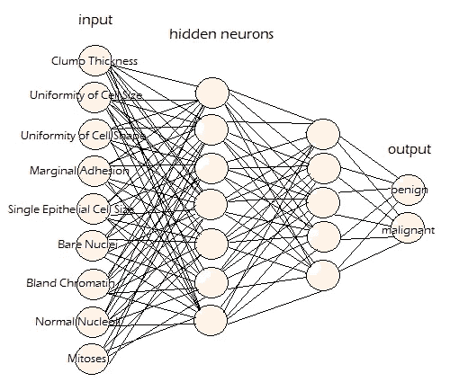

An example of what a cancer prediction neural network’s inputs could be.

该模型在很大程度上是成功的，AUC 的准确度为 0.965 (AUC，或曲线下面积是检验模型成功的一种方法)。尽管这种模型是准确的，但它相对于病理学家的主要优势是更加一致、有效和不容易出错。

# 预测癌症复发的模型

好吧，预测癌症很简单。但是对人类来说，预测癌症的 T2 复发是一项更加复杂的任务。幸运的是，机器越来越擅长这个。让我来解释一下。

该模型使用多种 ML 技术来学习如何预测癌症患者完全缓解后口腔癌的复发。为该模型从 86 名患者中收集了临床、影像和基因组来源的数据。特征选择算法将模型的特征从 110 个以上减少到 30 个以下。这使得模型更加有效，并大大减少了偏差。该模型使用 BN、ANN、SVM、DT 和 RF 进行测试，将患者数据分类为癌症复发和未复发的患者。

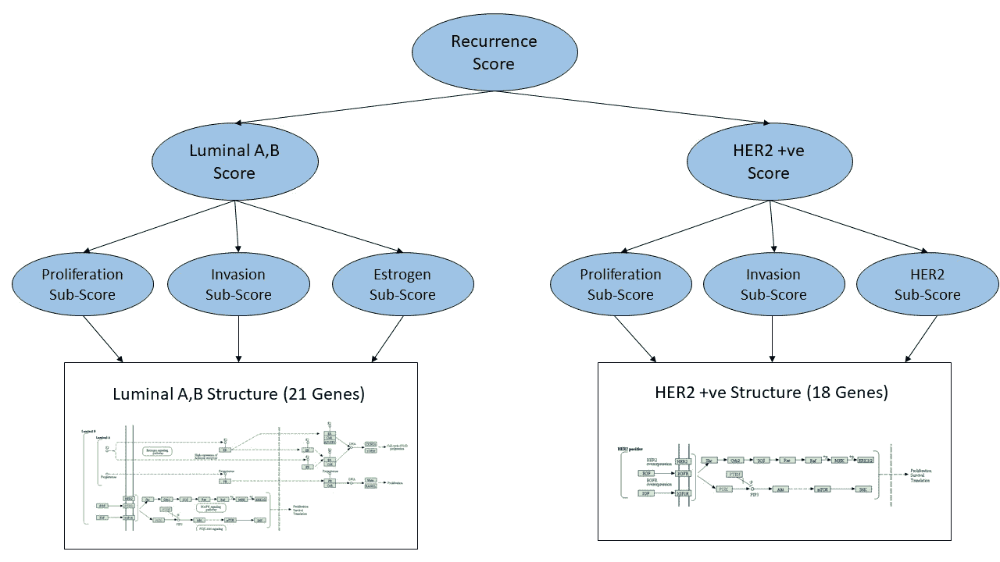

This BNN model predicts the recurrence of breast cancer.

最后，该模型使用特征选择数据和 BN 正确地预测了所有患者。尽管这是一个非常精确的模型，但它的数据集非常小，只有 86 名患者。

在另一项类似的研究中，研究人员制作了一个 ML 模型，使用 SVM 氏、ANN 和回归来测试，以将患者分为癌症复发的低风险和高风险组。SVM 模型优于其他两个模型，准确率为 84%。这是开创性的，因为它比病理学家**要精确得多。**

# 预测癌症存活率的模型

该模型采用了 162，500 条记录和 16 个关键特征的数据集。利用肿瘤的大小和患者的年龄等特征，该模型为患者是否存活创建了一个分类模型。该模型使用 SVM、人工神经网络和半监督学习(SSL:监督和非监督学习的混合)进行了测试。它发现 SSL 是最成功的，准确率为 71%。

另一项研究使用人工神经网络来预测肺癌患者的存活率。它有 83%的准确率。这项研究被认为在很大程度上是准确的，尽管它没有考虑其他与死亡相关的因素，如血凝块。

# 癌症预后的未来是什么样子的？

人工智能将在未来几十年内改变医疗行业——如果病理学没有被打乱，那就没有意义了。

目前，ML 模型仍处于癌症预后的测试和实验阶段。随着数据集越来越大，质量越来越高，研究人员正在建立越来越精确的模型。

未来的癌症活检可能是这样的:
你在诊所或家里进行临床测试。数据被输入病理 ML 系统。几分钟后，您收到一封电子邮件，其中有一份详细的报告，对您的癌症发展进行了准确的预测。

虽然你今天可能看不到人工智能做病理学家的工作，但你可以期待在未来几十年里人工智能取代当地的病理学家，这非常令人兴奋！

最大似然模型还有很长的路要走，大多数模型仍然缺乏足够的数据，并遭受偏见。然而，我们可以肯定的是 **ML 是病理学**的下一步，而**它将颠覆这个行业。**

> “肯定会有工作中断。因为将要发生的是机器人将能够做得比我们更好。……我指的是我们所有人，”—埃隆·马斯克

—

# 关键要点

*   机器学习是人工智能的一个分支，它使用许多技术来完成任务，在每次迭代后自我完善。
*   病理学家在诊断癌症方面很准确，但在预测癌症发展时，准确率只有 60%。
*   机器学习是我们克服这一障碍并创建高精度病理学系统的下一步。

**感谢阅读！如果你喜欢这篇文章:**

*   确保通过分享来表示支持
*   通过 [Linkedin](https://www.linkedin.com/in/sohailsayed/) 与我保持联系
*   关注我在媒体上更多这样的文章！