# 机器学习竞赛:第三部分优化

> 原文：<https://towardsdatascience.com/machine-learning-kaggle-competition-part-three-optimization-db04ea415507?source=collection_archive---------9----------------------->


## 充分利用机器学习模型

如何最好地描述一场 Kaggle 比赛？是伪装成比赛的机器学习教育！尽管有对 [Kaggle](https://www.kaggle.com/) 的[有效的批评](https://www.quora.com/Why-did-Kaggle-start-having-a-bad-reputation)，但总体而言，这是一个伟大的社区，提供了[有趣的问题](https://www.kaggle.com/competitions)，数千名数据科学家愿意分享他们的知识，以及[探索新想法的理想环境](https://www.kaggle.com/learn/overview)。作为证据，如果不是因为 [Kaggle 家庭信贷竞赛](https://www.kaggle.com/c/home-credit-default-risk/)，我永远也不会知道梯度推进机器，或者，这篇文章的主题之一，自动化模型优化。

在本文中，系列文章的第三部分([第一部分:入门](/machine-learning-kaggle-competition-part-one-getting-started-32fb9ff47426)和[第二部分:改进)](/machine-learning-kaggle-competition-part-two-improving-e5b4d61ab4b8)记录我为这次竞赛所做的工作，我们将关注机器学习管道的一个关键方面:通过超参数调整进行模型优化。在第二篇文章中，我们决定选择梯度推进机作为我们的模型，现在我们必须通过优化来充分利用它。我们将主要通过两种方法来实现这一点:随机搜索和使用贝叶斯优化的自动调优。

这里介绍的所有工作都可以在 Kaggle 上运行。文章本身将突出关键思想，但代码细节都在笔记本中(无需安装即可免费运行！)

1.  [随机和网格搜索](https://www.kaggle.com/willkoehrsen/intro-to-model-tuning-grid-and-random-search)
2.  [自动超参数调整](https://www.kaggle.com/willkoehrsen/automated-model-tuning)
3.  [调谐结果](https://www.kaggle.com/willkoehrsen/model-tuning-results-random-vs-bayesian-opt/notebook)

对于这篇文章，我们将跳过背景，所以如果你在任何时候感到迷茫，我鼓励你去以前的文章和笔记本。所有的笔记本都可以在 Kaggle 上运行，而不需要下载任何东西，所以我强烈推荐你去看看它们或者参加比赛！

## 概述

在本系列的第[部分，我们熟悉了数据集，执行了探索性数据分析，尝试了功能工程，并构建了一些基线模型。我们这一轮的公开排行榜得分是 **0.678** (目前我们在排行榜上的排名低于 4000)。](/machine-learning-kaggle-competition-part-two-improving-e5b4d61ab4b8)

[第二部分](/machine-learning-kaggle-competition-part-two-improving-e5b4d61ab4b8)涉及深入的手工特征工程，接着是特征选择和更多建模。使用扩展(然后收缩)的功能集，我们最终得到了 0.779 的分数**，比基线有了很大的提高，但还不到竞争对手的前 50%。在这篇文章中，我们将再次提高我们的分数，并在排行榜上上升 1000 位。**

# **机器学习优化**

**机器学习环境中的优化意味着找到一组模型超参数值，该组模型超参数值对于给定的数据集产生最高的交叉验证分数。与在训练期间学习的模型参数相反，模型超参数由数据科学家在训练之前设置。深度神经网络中的层数是模型超参数，而决策树中的分裂是模型参数。我喜欢把模型超参数看作是我们需要为数据集调整的设置:**对于每个问题来说，理想的值组合都是不同的**！**

****

**A machine learning model has to be tuned like a radio — if anyone remembers what a radio was!**

**有几种方法可以调整机器学习模型:**

1.  ****手动**:用直觉/经验/猜测选择超参数，用数值训练模型，寻找验证分数重复过程，直到你失去耐心或者对结果满意。**
2.  ****网格搜索**:设置一个超参数网格，对于每个数值组合，训练一个模型，找到验证分数。在这种方法中，尝试了超参数值的每个组合，这是非常低效的！**
3.  ****随机搜索**:设置超参数网格，选择*随机*数值组合，训练模型，寻找验证分数。搜索迭代的次数基于时间/资源。**
4.  ****自动超参数调整**:使用梯度下降、贝叶斯优化或进化算法等方法引导搜索最佳超参数。与随机或网格*非知情*方法相比，这些方法使用先前的结果在*知情搜索*中选择下一个超参数值。**

**这些是按照效率增加的顺序排列的，手动搜索花费的时间最多(通常产生的结果最差)，而自动方法最快地收敛到最佳值，尽管与机器学习中的许多主题一样，情况并不总是如此！[正如这篇伟大的论文所示，](http://www.jmlr.org/papers/volume13/bergstra12a/bergstra12a.pdf)随机搜索做得出奇的好(我们很快就会看到)。**

**(还有其他超参数调谐方法，如[进化](https://en.wikipedia.org/wiki/Hyperparameter_optimization#Evolutionary_optimization)和[基于梯度](https://en.wikipedia.org/wiki/Hyperparameter_optimization#Gradient-based_optimization)。不断有更好的方法被开发出来，所以一定要跟上当前的最佳实践！)**

**在本系列的第二部分中，我们决定使用 [Gradient Boosting Machine (GBM)模型](http://blog.kaggle.com/2017/01/23/a-kaggle-master-explains-gradient-boosting/),因为它在具有许多特性的结构化数据上具有卓越的性能。GBM 非常强大(但是很容易用 Python 实现)，但是它有几十个超参数，这些参数会显著影响性能，必须针对问题进行优化。如果您想感到不知所措，请查看 LightGBM 库上的文档:**

**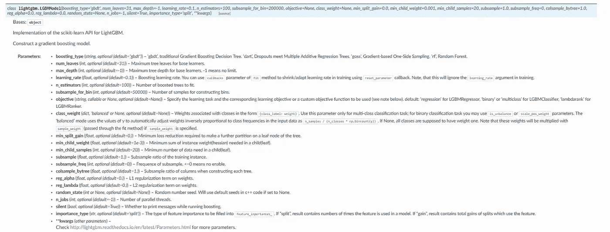**

**LightGBM Documentation**

**我不认为世界上有任何人能够看到所有这些并挑选出最佳的价值观！因此，我们需要实现选择超参数的四种方法之一。**

**对于这个问题，我甚至没有尝试手动调优，因为这是我第一次使用 GBM，也因为我不想浪费任何时间。我们将直接跳到使用贝叶斯优化的随机搜索和自动化技术。**

## **实现网格和随机搜索**

**[在第一本笔记本](https://www.kaggle.com/willkoehrsen/intro-to-model-tuning-grid-and-random-search)中，我们介绍了网格和随机搜索的实现，涵盖了优化问题的四个部分:**

1.  ****目标函数:**接受超参数并返回我们试图最小化或最大化的分数的函数**
2.  ****域:**我们要搜索的超参数值的集合。**
3.  ****算法:**选择目标函数中要评估的下一组超参数的方法。**
4.  ****结果历史:**包含每组超参数和目标函数的结果分数的数据结构。**

**这四个部分也构成了贝叶斯优化的基础，所以在这里列出它们将有助于实现。关于代码的细节，请参考笔记本，但这里我们将简要地触及每个概念。**

## **目标函数**

**目标函数接受一组输入，并返回一个我们希望最大化的分数。在这种情况下，输入是模型超参数，得分是对训练数据的 5 重交叉验证 ROC AUC。伪代码中的目标函数是:**

```
def objective(hyperparameters):
    """Returns validation score from hyperparameters"""

    model = Classifier(hyperparameters) validation_loss = cross_validation(model, training_data, 
                                       nfolds = 5) return validation_loss
```

**超参数优化的目标是找到传递给`objective`函数时返回最佳值的`hyperparameters`。这似乎很简单，但问题是评估目标函数在时间和计算资源方面非常昂贵。我们无法尝试超参数值的每个组合，因为我们的时间有限，因此需要随机搜索和自动化方法。**

## **领域**

**定义域是我们搜索的一组值。对于 GBM 的这个问题，域如下:**

**我们可以看到其中的两种分布，学习率是对数正态分布，叶子的数量是均匀正态分布:**

**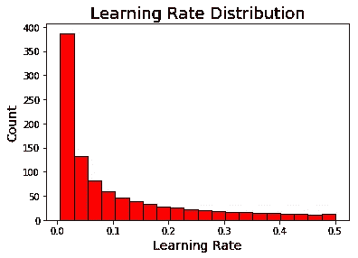****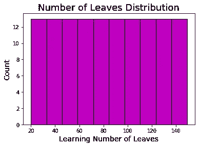**

# **算法**

**虽然我们通常不这样认为，但网格和随机搜索都是算法。在网格搜索的情况下，我们输入域，算法为有序序列中的每个超参数选择下一个值。网格搜索的惟一要求是，它对网格中的每种组合都尝试一次(且只尝试一次)。对于随机搜索，我们输入域，每次算法给我们一个超参数值的随机组合来尝试。除了随机选择下一个值之外，对随机搜索没有任何要求。**

**随机搜索可以按如下方式实现:**

```
import random *# Randomly sample from dictionary of hyperparameters*
random_params = {k: random.sample(v, 1)[0] for k, v **in**          
                    param_grid.items()} **{'boosting_type': 'goss',
 'colsample_bytree': 0.8222222222222222,
 'is_unbalance': False,
 'learning_rate': 0.027778881111994384,
 'min_child_samples': 175,
 'num_leaves': 88,
 'reg_alpha': 0.8979591836734693,
 'reg_lambda': 0.6122448979591836,
 'subsample': 1.0,
 'subsample_for_bin': 220000}**
```

**这实际上是一个非常简单的算法！**

## **结果历史**

**结果历史是包含超参数组合和目标函数的结果分数的数据结构。当我们进行贝叶斯优化时，模型实际上*使用过去的结果来决定下一个要评估的超参数*。随机和网格搜索是*不了解情况的*方法，不使用过去的历史，但是我们仍然需要历史，以便我们可以找出哪个超参数工作得最好！**

**在这种情况下，结果历史只是一个数据框架。**

**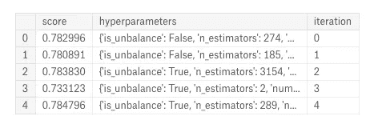**

# **贝叶斯超参数优化**

**使用贝叶斯优化的自动超参数调整听起来很复杂，但事实上它使用了与随机搜索相同的四个部分，唯一的区别是使用了**算法**。对于这次比赛，我使用了 Hyperopt 库和 Tree Parzen Estimator (TPE)算法，并在[的笔记本](https://www.kaggle.com/willkoehrsen/automated-model-tuning)中做了展示。对于概念性的解释，请参考[这篇文章](/a-conceptual-explanation-of-bayesian-model-based-hyperparameter-optimization-for-machine-learning-b8172278050f)，对于 Python 的实现，请查看笔记本或[这篇文章](/automated-machine-learning-hyperparameter-tuning-in-python-dfda59b72f8a)。**

**贝叶斯优化[的基本概念](https://sigopt.com/static/pdf/SigOpt_Bayesian_Optimization_Primer.pdf)是使用之前的评估结果来*推理*哪些超参数表现更好，并使用该推理来选择下一个值。因此，该方法应该花费较少的迭代次数来评估具有较差值的目标函数。理论上，贝叶斯优化比随机搜索能以更少的迭代收敛到理想值(虽然随机搜索还是能侥幸成功)！贝叶斯优化的[目标是:](https://papers.nips.cc/paper/4443-algorithms-for-hyper-parameter-optimization)**

1.  **为了找到由性能测量的更好的超参数值**
2.  **使用比网格或随机搜索更少的迭代次数进行优化**

**这是一个强大的方法，有望带来巨大的成果。问题是，实践中的证据表明情况是这样的吗？为了回答这个问题，我们转向[最终笔记本](https://www.kaggle.com/willkoehrsen/model-tuning-results-random-vs-bayesian-opt)，深入了解模型调整结果！**

# **超参数优化结果**

**在实现随机搜索和贝叶斯优化的艰苦工作之后，[第三个笔记本](https://www.kaggle.com/willkoehrsen/model-tuning-results-random-vs-bayesian-opt)是一个有趣的和揭示性的探索结果。有超过 35 个情节，所以如果你喜欢视觉效果，那就去看看吧。**

**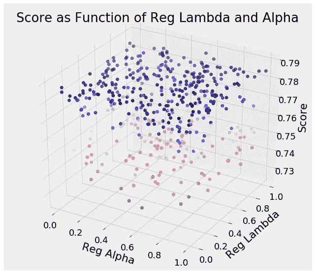**

**虽然我试图在 Kaggle 上完成整个比赛，但对于这些搜索，我在一台 64 GB 内存的计算机上进行了 500 次随机搜索和 400 次贝叶斯优化迭代，每次耗时约 5 天(感谢亚马逊 AWS)。所有的结果都是可用的，但是你需要一些真正的硬件来重做实验！**

**首先:哪种方法做得更好？下图总结了随机搜索的 501 次迭代和贝叶斯优化的 402 次迭代的结果(在数据框中称为`opt`):**

**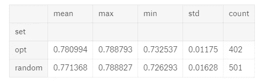**

**Random Search and Bayesian Optimization ( `opt`) results**

****按最高分计算，随机搜索略胜一筹，但如果我们按平均分衡量，贝叶斯优化胜出。****

**好消息是，这几乎正是我们所期望的:**随机搜索可以在一组很大的值上发生，因为它彻底探索了搜索空间，但贝叶斯优化将通过从以前的结果进行推理来“关注”最高得分的超参数值。**让我们来看一个非常有启发性的图表，交叉验证分数的值与迭代次数的关系:**

**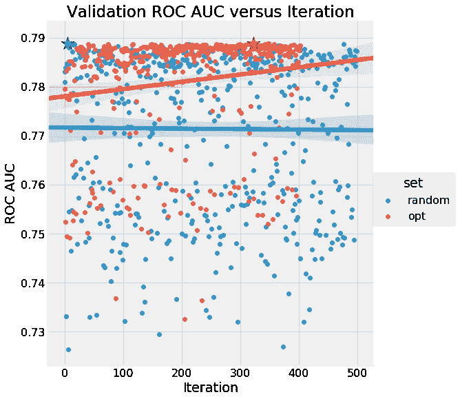**

**我们绝对没有看到随机搜索的趋势，而贝叶斯优化(再次由`opt`显示)在试验中有所改善。如果你能理解这个图表，那么你可以看到这两种方法的好处:随机搜索探索搜索领域，但贝叶斯优化随着时间的推移变得更好。我们还可以看到，贝叶斯优化似乎达到了一个平台，表明进一步试验的回报递减。**

**第二个主要问题:什么是最佳超参数值？以下是贝叶斯优化的最佳结果:**

```
**boosting_type             gbdt
colsample_bytree      0.614938
is_unbalance              True
learning_rate        0.0126347
metric                     auc
min_child_samples          390
n_estimators              1327
num_leaves                 106
reg_alpha             0.512999
reg_lambda            0.382688
subsample             0.717756
subsample_for_bin        80000
verbose                      1
iteration                  323
score                 0.788793**
```

**我们可以使用这些结果来建立一个模型并将预测提交给竞争对手，或者通过允许我们围绕最佳值定义一个集中的搜索空间，它们可以用于通知进一步的搜索。**

## **超参数图**

**要考虑的一个有趣的方面是每个超参数的每个搜索方法尝试的值。下图显示了每种搜索方法的核密度估计(KDE)函数以及采样分布(超参数网格)。垂直虚线表示每种方法的最佳值。首先是学习率:**

**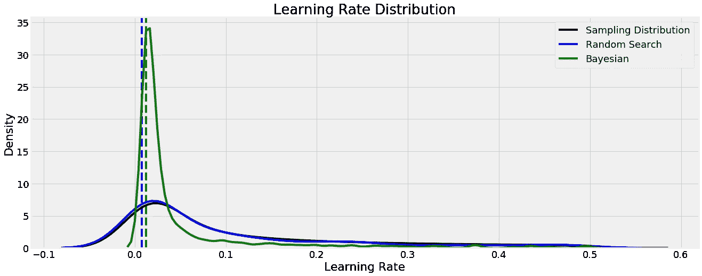**

**尽管学习率分布跨越了几个数量级，但两种方法都发现最优值在该域中相当低。通过将我们的搜索集中在这个区域，我们可以使用这个知识来通知进一步的超参数搜索。在大多数情况下，较低的学习率会提高交叉验证的性能，但代价是增加运行时间，这是我们必须做出的权衡。**

**让我们看看其他一些图表。对于大多数超参数，两种方法得出的最佳值相当接近，但对于`colsample_bytree`却不是这样:**

**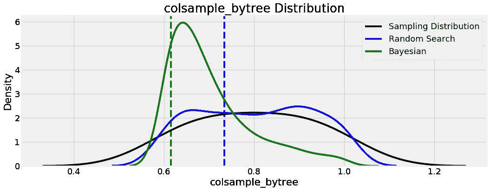**

**这是指在 GBM 中构建每个树时使用的列的分数，随机搜索发现最优值高于贝叶斯优化。同样，这些结果可以用于进一步的搜索，因为我们看到贝叶斯方法倾向于集中在 0.65 左右的值。**

**我们将展示该分析中的另外两个图，因为它们相当有趣，涉及两个正则化参数:**

**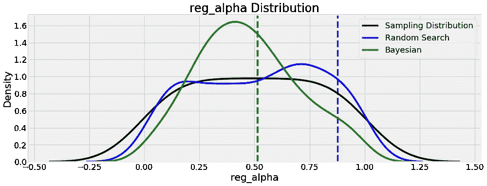****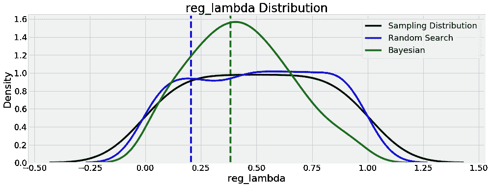**

**这里值得注意的是，这两个超参数似乎是相互补充的:如果一个正则化值高，那么我们希望另一个正则化值低，反之亦然。也许这有助于模型在[偏差/方差](http://www.cs.cmu.edu/~wcohen/10-601/bias-variance.pdf)之间取得平衡，这是机器学习中最常见的问题。**

## **超参数与迭代**

**虽然随机搜索不会改变值在搜索中的分布，但贝叶斯优化会改变，因为它会专注于搜索域中它认为最佳的值。我们可以通过绘制迭代的超参数值来看到这一点:**

**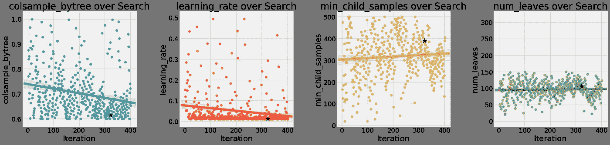****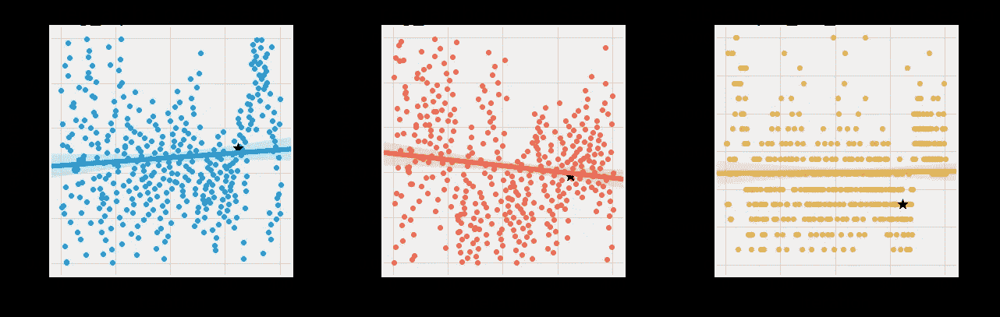**

**趋势最明显的超参数是`colsample_bytree`和`learning_rate`，这两个参数在试验中持续下降。`reg_lambda`和`reg_alpha`正在背离，这证实了我们之前的假设，即我们应该减少其中一个，同时增加另一个。**

**我们要小心不要把太多的值放在这些结果中，因为贝叶斯优化可能已经找到了它正在利用的交叉验证损失的局部最小值。这里的趋势很小，但令人鼓舞的是，在接近搜索结束时发现了最佳值，表明交叉验证分数在继续提高。**

## **超参数与交叉验证分数**

**接下来的这些图显示了单个超参数的值与分数的关系。我们希望避免过于强调这些图表，因为我们不会一次改变一个超参数，而且多个超参数之间可能存在复杂的相互作用。一个真正精确的图表应该是 10 维的，显示所有**超参数的值和结果分数。如果我们能够理解一个 **10 维的**图，那么我们也许能够计算出超参数的最佳组合！****

**这里随机搜索是蓝色的，贝叶斯搜索是绿色的:**

**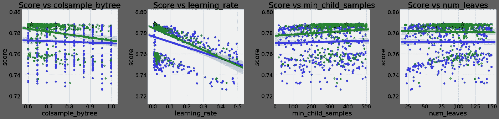**

****唯一明显的区别是分数随着学习率的增加而降低。**我们不能说这是由于学习率本身，还是其他因素(我们将很快研究学习率和估计数之间的相互作用)。**

**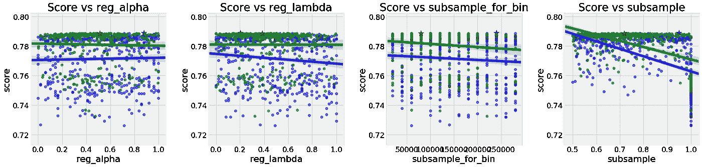**

**这里没有任何强劲的趋势。由于`boosting_type = 'goss'`不能使用`subsample`(必须设置为等于 1.0)，所以相对于子样本的分数有点偏差。虽然我们不能一次查看所有 10 个超参数，但如果我们转向 3D 图，我们可以一次查看两个！**

# **三维绘图**

**为了尝试和检验超参数的同时效应，我们可以用 2 个超参数和分数制作 3D 图。真正精确的图应该是 10 维的(每个超参数一个),但在这种情况下，我们将坚持 3 维。(详见代码，Python 中的 3D 绘图非常简单)。首先，我们可以显示`reg_alpha`和`reg_lambda`，正则化超参数与分数的关系(针对贝叶斯选择):**

**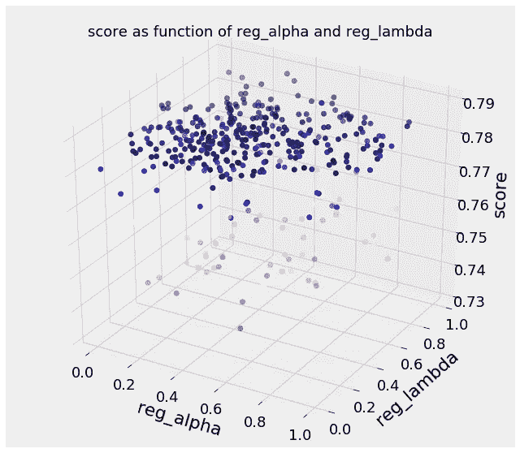**

**这有点难以理解，但如果我们记得最好的分数出现在`reg_alpha`的 0.5 分和`reg_lambda`的 0.4 分左右，我们可以看到该地区的分数普遍较高。**

**接下来是`learning_rate`和`n_estimators`(集合中训练的决策树数量)。虽然学习率是网格中的一个超参数，但决策树的数量(也称为推进轮数)是通过 5 重交叉验证的早期停止来发现的:**

**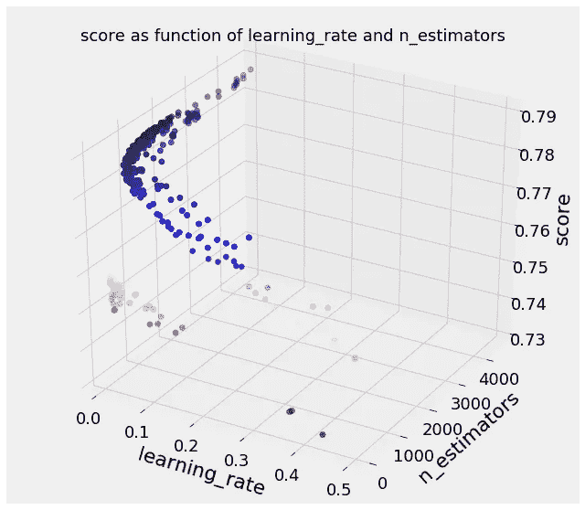**

**这一次有一个明显的趋势:较低的学习率和较高的估计数会增加分数。这种关系是预期的，因为较低的[学习率](https://machinelearningmastery.com/tune-learning-rate-for-gradient-boosting-with-xgboost-in-python/)意味着每棵树的贡献减少，这需要训练更多的树。扩展的树数量增加了模型适应训练数据的能力(同时也增加了运行时间)。此外，只要我们使用足够折叠的早期停止，我们就不必担心与更多的树过度拟合。当结果与我们的理解一致时，感觉真好(*尽管当结果与我们的理解不一致时，我们可能会学到更多！*)**

## **关联热图**

**对于最后的图，我想显示每个超参数之间的相互关系和分数。这些图不能证明因果关系，但它们可以告诉我们哪些变量是相关的:**

**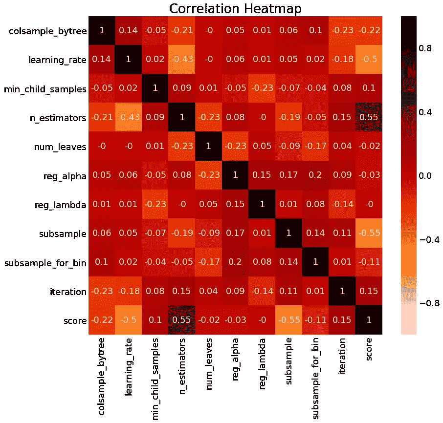**

**Correlation Heatmap for Bayesian Optimization**

**我们已经从图表中找到了大部分信息，但是我们可以看到学习率和分数之间的*负相关*，以及估计数和分数之间的*正相关*。**

# **测试最佳超参数**

**探索的最后一步是在一个完整的数据集上实现随机搜索最佳超参数和贝叶斯优化最佳超参数(数据集来自[这个内核](https://www.kaggle.com/jsaguiar/updated-0-792-lb-lightgbm-with-simple-features)，我要感谢[作者](https://www.kaggle.com/jsaguiar)将其公之于众)。我们训练模型，在测试集上进行预测，最后上传到比赛中，看看我们在公共排行榜上的表现如何。努力了这么久，成绩还撑得住吗？**

*   ****随机搜索结果得分 0.790****
*   ****贝叶斯优化结果得分 0.791****

**如果我们按照公共排行榜上的最佳分数，贝叶斯优化胜出！然而，公共排行榜仅基于 10%的测试数据，因此这可能是过度拟合测试数据的特定子集的结果。**总的来说，我认为完整的结果——包括交叉验证和公共排行榜——表明当运行足够多的迭代时，两种方法产生相似的结果。**我们可以确定的是，这两种方法都比手动调优！与我们之前的工作相比，我们最终的模型足以让我们在排行榜上上升 1000 位。**

**最后，以另一个图结束，我们可以看看来自训练过的 GBM 的特征重要性:**

**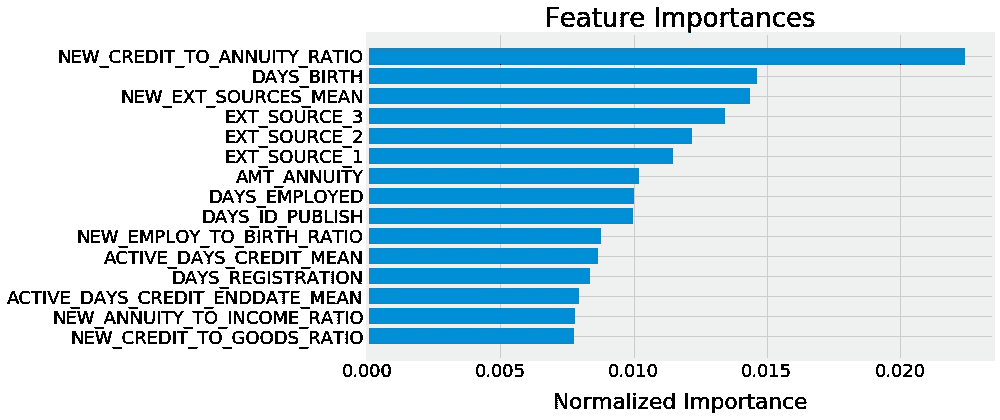**

**`NEW_CREDIT_TO_ANNUITY_RATIO`和`NEW_EXT_SOURCES_MEAN`是 Kaggle 上的数据科学社区导出的特征，而不是原始数据中的特征。看到这些重要性如此之高令人欣慰，因为它显示了特性工程的[价值。](https://www.featurelabs.com/blog/secret-to-data-science-success/)**

# **结论和后续步骤**

**这项工作的主要收获是:**

*   ****使用贝叶斯优化的随机搜索和自动超参数调整是模型调整的有效方法****
*   ****贝叶斯优化倾向于“集中”在更高的得分值上，而随机搜索更好地探索可能性****
*   ****当给定足够的迭代次数时，两种方法在交叉验证和测试分数方面产生相似的结果****
*   ****优化超参数对性能有显著影响，可与特征工程相比拟****

**从这里去哪里？嗯，总有很多其他方法可以尝试，比如[自动化特征工程](/automated-feature-engineering-in-python-99baf11cc219)或者将问题作为时间序列来处理。我已经写了一本关于[自动化特征工程](https://www.kaggle.com/willkoehrsen/automated-feature-engineering-basics)的笔记本，所以这可能是我下一步的重点。我们还可以尝试其他模型，甚至进入深度学习领域！**

**我乐于接受建议，所以请在 Kaggle 或 Twitter 上告诉我。感谢阅读，如果你想看看我在这个问题上的其他作品，这里有一整套笔记本:**

*   **[温柔的介绍](https://www.kaggle.com/willkoehrsen/start-here-a-gentle-introduction)**
*   **[手动特征工程第一部分](https://www.kaggle.com/willkoehrsen/introduction-to-manual-feature-engineering)**
*   **[手册特征工程第二部分](https://www.kaggle.com/willkoehrsen/introduction-to-manual-feature-engineering-p2)**
*   **[自动化特征工程简介](https://www.kaggle.com/willkoehrsen/automated-feature-engineering-basics)**
*   **[高级自动化特征工程](https://www.kaggle.com/willkoehrsen/tuning-automated-feature-engineering-exploratory)**
*   **[功能选择](https://www.kaggle.com/willkoehrsen/introduction-to-feature-selection)**
*   **[模型调整简介:网格和随机搜索](https://www.kaggle.com/willkoehrsen/intro-to-model-tuning-grid-and-random-search)**
*   **[自动模型调整](https://www.kaggle.com/willkoehrsen/automated-model-tuning)**
*   **[模型调优结果](https://www.kaggle.com/willkoehrsen/model-tuning-results-random-vs-bayesian-opt)**

**那里应该有足够的内容让任何人忙碌一会儿。现在可以开始为下一篇文章做更多的学习/探索了！数据科学最棒的地方在于，你一直在移动，寻找下一个需要征服的技术。每当我发现那是什么，我一定会分享它！**

**一如既往，我欢迎反馈和建设性的批评。我可以在 Twitter [@koehrsen_will](http://twitter.com/@koehrsen_will) 上找到。**