# 机器学习卡格竞赛第二部分:提高

> 原文：<https://towardsdatascience.com/machine-learning-kaggle-competition-part-two-improving-e5b4d61ab4b8?source=collection_archive---------0----------------------->

## 特征工程、特征选择和模型评估

像生活中的大多数问题一样，有几种潜在的方法来进行 Kaggle 竞赛:

1.  把自己锁起来，远离外面的世界，孤立地工作

我建议不要走“孤独的天才”之路，不仅因为它非常孤独，还因为你会错过竞争中最重要的部分:向其他数据科学家学习的 T2。如果你独自工作，你最终会依赖同样的老方法，而世界上的其他人会采用更有效和准确的技术。

作为一个具体的例子，我最近依赖于随机森林模型，自动将其应用于任何监督的机器学习任务。这场比赛终于让我意识到，虽然随机森林是一个体面的起步模式，但其他人都已经转移到更高级的[渐变助推机](https://medium.com/mlreview/gradient-boosting-from-scratch-1e317ae4587d)。

另一种极端的方法也有局限性:

2.复制一个领导者的脚本(在 Kaggle 上被称为[“内核”)，运行它，无需编写一行代码就能冲上排行榜](https://www.kaggle.com/kernels)

我也不推荐“复制粘贴”的方法，不是因为我反对使用别人的代码(有适当的归属)，而是因为你仍然在限制你学习的机会。相反，我推荐的是一种混合方法:阅读他人所做的工作，理解甚至使用他们的代码，用你自己的想法建立在他人的工作之上。然后，向公众发布您的代码，这样其他人也可以做同样的过程，扩大社区的集体知识。

在这个关于参加 Kaggle 机器学习竞赛的系列的第二部分中，我们将对我们在第一部分中[开发的初始提交进行改进。](/machine-learning-kaggle-competition-part-one-getting-started-32fb9ff47426)

本文记录的主要结果是:

*   **ROC AUC 从基线 0.678 增加至 0.779**
*   **在排行榜上获得超过 1000 个名次**
*   **功能工程从 122 个功能增加到 1465 个**
*   **特征选择将最终特征数量减少到 342 个**
*   **决定使用梯度推进机器学习模型**

我们将介绍我们是如何实现这些结果的——涵盖机器学习中的许多主要思想，并在适用的情况下建立在他人的代码上。我们将关注任何机器学习项目的三个关键步骤:

1.  **特色工程**
2.  **功能选择**
3.  **车型评测**

为了从这篇文章中获得最大的收获，你会想要关注 Kaggle 上的 Python 笔记(当它们出现时会链接到)。这些笔记本可以在 Kaggle 上运行，无需在您的计算机上下载任何内容，因此几乎没有准入门槛！在这篇文章中，我将在较高的层次上触及要点，并在笔记本中提供完整的细节。

## 简要概述

如果你是新手，我强烈推荐你从[这篇文章](/machine-learning-kaggle-competition-part-one-getting-started-32fb9ff47426)和[这款笔记本](https://www.kaggle.com/willkoehrsen/start-here-a-gentle-introduction)开始了解。

Kaggle 上的[房屋信用违约风险竞赛](https://www.kaggle.com/c/home-credit-default-risk)是一个标准的机器学习分类问题。给定一个历史贷款数据集，以及客户的社会经济和财务信息，我们的任务是建立一个模型，可以预测客户拖欠贷款的概率。

在本系列的[第一部分，我们研究了问题的基础，探索了数据，尝试了一些特性工程，并建立了一个基线模型。使用随机森林和七个数据表中的一个，我们在](/machine-learning-kaggle-competition-part-one-getting-started-32fb9ff47426)[公共排行榜](https://www.kaggle.com/c/home-credit-default-risk/leaderboard)上得到了一个 **0.678 ROC AUC** ( [曲线下的接收器操作特征面积](https://en.wikipedia.org/wiki/Receiver_operating_characteristic))。(公共排行榜仅根据 20%的测试数据计算得出，最终排名通常会发生显著变化。)

为了提高我们的分数，在这篇文章和一系列关于 Kaggle 的附带笔记本中，我们将主要关注特征工程，然后关注特征选择。一般来说，相对于在机器学习问题上投入的时间而言,[最大的收益将出现在特征工程阶段。在我们开始尝试构建一个更好的模型之前，我们需要专注于以最有效的方式使用所有的数据！](https://www.featurelabs.com/blog/secret-to-data-science-success/)

## 关于机器学习现状的说明

这篇文章的大部分内容看起来是探索性的(或者甚至是武断的)，我并不声称我已经做出了最好的决定！在机器学习中有很多旋钮需要调整，通常唯一的方法是尝试不同的组合，直到我们找到最有效的组合。机器学习更多的是经验性的，而不是理论性的，它依赖于测试，而不是从基本原则或一套硬性规则出发。

在一篇[很棒的博文中，皮特·沃顿](https://petewarden.com/2016/04/18/how-to-break-into-machine-learning/)解释说，机器学习有点像敲打电视机的侧面，直到它工作为止。这是完全可以接受的，只要我们写下我们在电视上做的准确的“爆炸”和每次的结果。然后，我们可以分析我们做出的选择，寻找任何影响未来决策的模式，并找到哪种方法最有效。

我这个系列的目标是让其他人参与到机器学习中来，将我的方法放在那里以获得反馈，并记录我的工作，以便我下次可以记得我做了什么！任何评论或问题，无论是在这里还是在 Kaggle 上，都非常感谢。

# 特征工程

[特征工程](https://en.wikipedia.org/wiki/Feature_engineering)是从现有数据中创建新特征的过程。目标是构建有用的特征，帮助我们的模型了解数据集中的信息和给定目标之间的关系。在许多情况下——包括这个问题——[数据分布在多个表](https://www.kaggle.com/c/home-credit-default-risk/data)中。因为机器学习模型必须用单个表来训练，所以特征工程要求我们在一个表中总结所有的数据。

本次比赛共有 [7 个数据文件。](https://www.kaggle.com/c/home-credit-default-risk/data)在第一部分中，我们只使用了单一数据源，即包含每个客户的社会经济信息和贷款申请特征的主文件。我们将这个表称为`app`。(对于看惯了熊猫的人来说，一张桌子只是一个`dataframe`)。

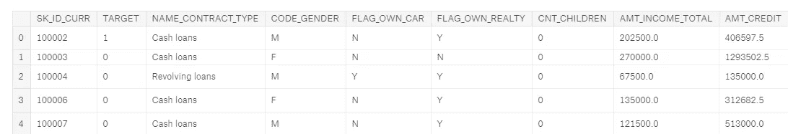

Main training dataframe

我们可以看出这是训练数据，因为它包含标签`TARGET`。值为 1 的`TARGET`表示未偿还的贷款。

`app`数据框架是[整齐的结构化数据](https://vita.had.co.nz/papers/tidy-data.pdf):每个观察值都有一行——客户的贷款申请——列包含[特征](https://en.wikipedia.org/wiki/Feature_(machine_learning))(也称为解释变量或预测变量)。每个客户端的应用程序(我们称之为“客户端”)在这个数据帧中都有一行，由`SK_ID_CURR`标识。因为每个客户端在此数据帧中都有一个唯一的行，所以它是数据集中所有其他表的父级，如下图所示，图中显示了这些表之间的关系:

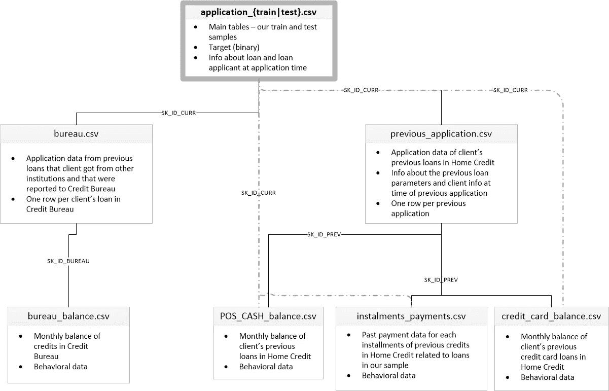

Relationship of data files ([Source](https://www.kaggle.com/c/home-credit-default-risk/data))

当我们制作特征时，我们希望将它们添加到这个主数据框架中。在特征工程结束时，每个客户端仍然只有一行，但是有更多的列从其他数据表中获取信息。

其他六个表格包含了客户以前的贷款信息，既有家庭信贷[(举办竞赛的机构)，也有其他信贷机构。例如，这里是`bureau`数据框架，包含客户以前在*其他*金融机构的贷款:](http://www.homecredit.net/)

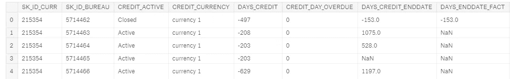

bureau dataframe, a child of app

该数据帧是*父* `app`的*子*表:对于父表中的每个客户端(由`SK_ID_CURR`标识)，子表中可能有许多观察值。这些行对应于单个客户的多项先前贷款。`bureau`数据框又是`bureau_balance`数据框的父数据框，在那里我们有以前每笔贷款的每月信息。

让我们来看一个从子数据帧创建新特性的例子:每个客户在其他机构的先前贷款数量的计数。尽管我写了一篇关于自动化特征工程的文章，但是在这篇文章中，我们将坚持手工操作。**第一本 Kaggle 笔记本要看的** [**就在这里；是一本全面指导**](https://www.kaggle.com/willkoehrsen/introduction-to-manual-feature-engineering) **特征工程的手册。**

计算这一特性需要按照客户端 id 对`bureau`数据帧进行分组(使用`groupby`)，计算一个聚合统计(使用`agg`和`count`)，然后将结果表与主数据帧合并(使用`merge`)。这意味着，对于每个客户，我们收集他们以前的所有贷款，并计算总数。这是用 Python 写的:

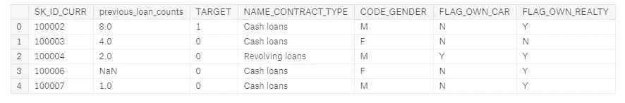

app dataframe with new feature in second column

现在，我们的模型可以使用以前贷款数量的信息作为客户是否会偿还贷款的预测因素。为了检查这个新变量，我们可以制作一个[内核密度估计(kde)图](/histograms-and-density-plots-in-python-f6bda88f5ac0)。这显示了单个变量的分布，可以认为是一个平滑的直方图。为了查看这个特性的分布是否根据客户是否偿还了贷款而变化，我们可以用`TARGET`的值来给 kde 着色:

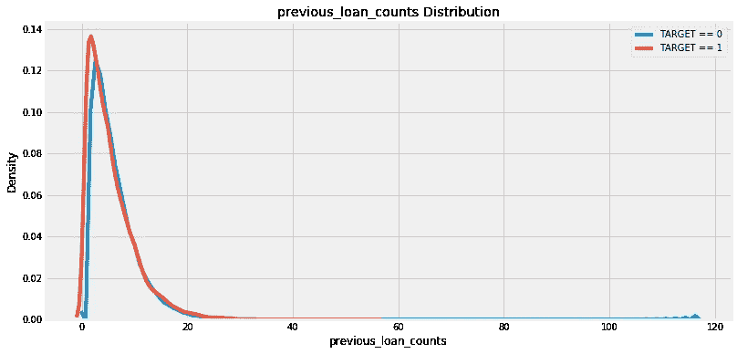

虽然`TARGET==1`分布的峰值稍微在`TARGET==0`分布的左侧，但是在分布上似乎没有太大的差异。这可能表明，没有偿还贷款的客户以前在其他机构的贷款较少。基于我极其有限的领域知识，这种关系是有意义的！

一般来说，我们不知道一个特性在一个模型中是否有用，直到我们构建并测试这个模型。因此，我们的方法是构建尽可能多的特性，然后只保留那些最相关的特性。“最相关”没有严格的定义，但在“特性选择”部分，我们会看到一些衡量方法。

现在，让我们看看如何从`app`数据帧的子数据帧获取信息，而不是从`app`数据帧的子数据帧获取信息！`bureau_balance`数据帧包含关于*每笔先前贷款*的每月信息。这是`bureau`数据框架的一个子框架，因此要将该信息放入主数据框架，我们必须进行两次分组和聚合:首先通过贷款 id ( `SK_ID_BUREAU`)，然后通过客户 id。

例如，如果我们想为每个客户计算在`bureau_balance`数据框架中每笔先前贷款的`MONTHS_BALANCE`最大数量的平均值，我们可以这样做:

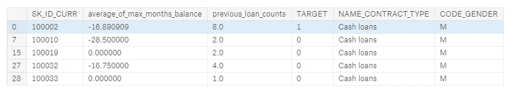

app dataframe with new feature in second column

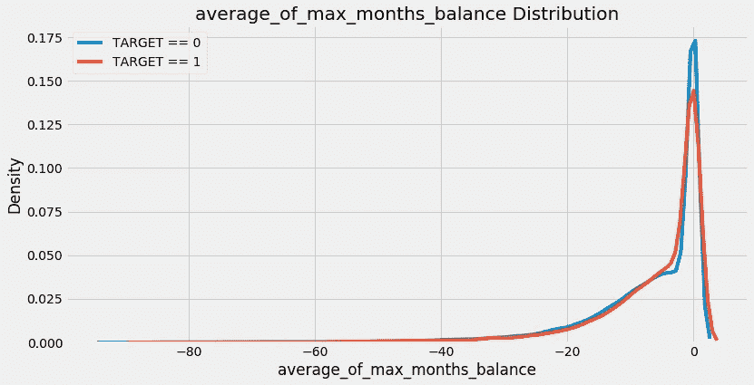

Distribution of new feature

对于单个特性来说，这是一个很大的代码量，你可以很容易地想象，在几个特性之后，手工的特性工程过程会变得很乏味！这就是为什么我们要编写这样的函数，它采取这些单独的步骤，并在每个数据帧上重复这些步骤。

我们不是一遍又一遍地重复代码，而是将它放入一个名为重构的函数[中，然后每当我们想要执行相同的操作时就调用这个函数。编写函数可以节省我们的时间，并允许更具重复性的工作流，因为它每次都会以完全相同的方式执行相同的操作。](https://bids.berkeley.edu/news/joy-code-refactoring)

下面是一个基于上述步骤的函数，可以在任何子数据帧上使用该函数来计算数字列的聚合统计信息。它首先通过一个分组变量(比如客户机 id)对列进行分组，计算每一列的`mean, max, min, sum` ，重命名这些列，并返回结果 dataframe。然后，我们可以将这个数据帧与主`app`数据合并。

(这个函数在很大程度上借鉴了 Kaggle 上 [olivier](https://www.kaggle.com/ogrellier) 的[这个内核](https://www.kaggle.com/ogrellier/good-fun-with-ligthgbm))。

(这个函数的一半代码行是文档。编写正确的 docstrings 不仅对其他人理解我们的代码至关重要，而且当我们回头看自己的代码时也能理解它！)

要查看这一过程，[请参考笔记本](https://www.kaggle.com/willkoehrsen/introduction-to-manual-feature-engineering)，但是我们可以清楚地看到这将节省我们大量的工作，尤其是要处理 6 个子数据帧。

这个函数处理数值变量，但是仍然留下分类变量。分类变量通常表示为字符串，只能取有限数量的值(与连续变量相反，连续变量可以是任何数值)。机器学习模型无法处理`string`数据类型，所以我们必须找到一种方法，以`numeric`的形式捕捉这些变量中的信息。

作为分类变量的一个例子，`bureau`表中有一个名为`CREDIT_ACTIVE`的列，它记录了以前每笔贷款的状态:

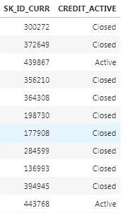

Two columns of the bureau dataframe showing a categorical variable (CREDIT_ACTIVE)

我们可以通过计算每个客户拥有的每种类型贷款的数量来用数字形式表示这些数据。此外，我们可以通过将某一特定贷款类型的计数除以总计数来计算每种贷款类型的标准化计数。我们以此结束:

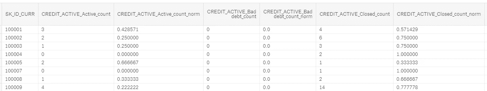

Categorical CREDIT_ACTIVE features after processing

现在，这些分类特征可以传递到机器学习模型中。这个想法是，我们不仅要获取每种贷款的数量，还要获取这种贷款的相对频率。像以前一样，我们实际上不知道这些新功能是否有用，唯一确定的方法是制作这些功能，然后在模型中测试它们！

我们可以再次编写一个函数来为我们计算分类变量的计数，而不是为每个子数据帧手动执行此操作。最初，我开发了一个非常复杂的方法来完成这项工作，包括数据透视表和各种聚合，但后来我看到其他代码中有人使用 one-hot 编码在大约两行代码中完成了同样的事情。我立即放弃了我的工作时间，转而使用这个版本的功能！

该功能再次为我们节省了大量时间，并允许我们对每个数据帧应用完全相同的步骤。

一旦我们编写了这两个函数，我们就可以使用它们将七个独立文件中的所有数据提取到一个单独的训练(和一个测试数据帧)中。如果你想看到这个实现，你可以看看[第一](https://www.kaggle.com/willkoehrsen/introduction-to-manual-feature-engineering)和[第二](https://www.kaggle.com/willkoehrsen/introduction-to-manual-feature-engineering-p2)手动工程笔记本。以下是最终数据的示例:

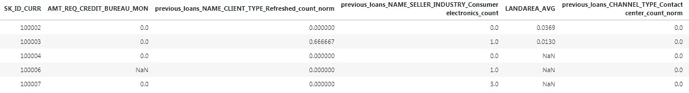

使用所有七个表中的信息，我们最终得到总共 1465 个特征！(摘自某原 122)。

我们如何知道这些特性是否有帮助呢？一种方法是计算变量与`TARGET`之间的[皮尔逊相关系数](https://en.wikipedia.org/wiki/Pearson_correlation_coefficient)。这是一个相对粗略的重要性衡量标准，但它可以作为与客户还贷能力相关的变量的近似值。以下是与`TARGET`最相关的变量:

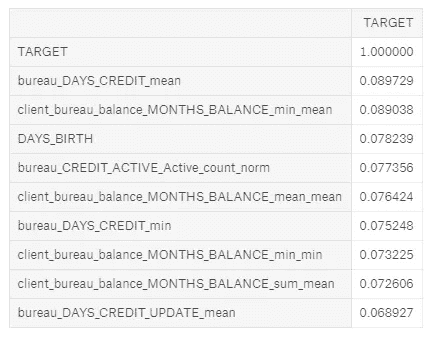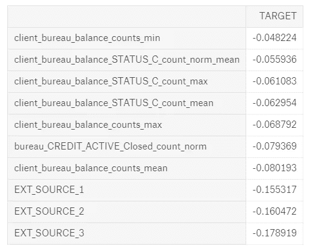

Most Positive (left) and Negative (right) correlated variables with the TARGET

`EXT_SOURCE_`变量来自原始特征，但是我们创建的一些变量是最相关的。然而，我们希望避免过度解读这些数字。每当我们制作大量特征时，我们都会遇到[多重比较问题](/the-multiple-comparisons-problem-e5573e8b9578):我们做的比较越多——在这种情况下是与目标的相关性——它们中的一些就越有可能由于随机噪声而变大。由于相关性如此之小，我们在解读数字时需要特别小心。

我们制作的最负相关变量`client_bureau_balance_counts_mean`，代表每个客户在`bureau_balance`数据中出现贷款次数的平均值。换句话说，它是每个客户以前每笔贷款的平均月记录数。kde 图如下:

现在我们有了 1465 个特性，我们遇到了特性太多的问题！更危险的是，这被称为维度的[诅咒](https://en.wikipedia.org/wiki/Curse_of_dimensionality)，它通过特征选择的关键步骤来解决。

# 特征选择

太多的特征会降低训练速度，降低模型的可解释性，最重要的是，会降低模型在测试集上的泛化性能。当我们有不相关的特征时，这些特征淹没了重要的变量，并且随着特征数量的增加，模型学习数据和目标之间的关系所需的数据点的数量呈指数增长([维度诅咒解释](https://stats.stackexchange.com/questions/169156/explain-curse-of-dimensionality-to-a-child))。

在完成了制作这些特征的所有工作之后，我们现在必须只选择那些“最重要”的，或者说，丢弃那些不相关的。

**下一个要浏览的笔记本** [**在这里:功能选择指南**](https://www.kaggle.com/willkoehrsen/feature-selection) **n 它相当全面，尽管它仍然没有涵盖所有可能的方法！**

有许多方法可以减少功能的数量，这里我们将介绍三种方法:

1.  移除共线变量
2.  删除有许多缺失值的变量
3.  使用特性重要性只保留“重要的”变量

## 移除共线变量

[共线变量](https://en.wikipedia.org/wiki/Multicollinearity)是彼此高度相关的变量。这些变量是多余的，因为我们只需要保留每对共线要素中的一个，就可以保留两个要素中的大部分信息。高度相关的定义可以变化，这是另一个没有固定规则的数字！作为共线变量的一个例子，以下是中值公寓面积与平均公寓面积的关系图:

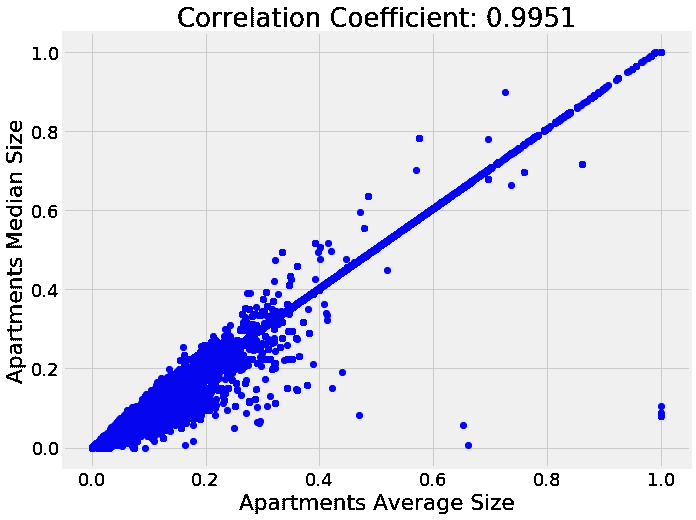

为了识别高度相关的变量，我们可以计算数据中每个变量与其他变量的相关性(这是一个计算量相当大的过程)！然后，我们选择相关矩阵的上部三角形，并基于阈值从每对高度相关的变量中移除一个变量。这在下面的代码中实现:

(这段代码改编自[这篇博文](https://chrisalbon.com/machine_learning/feature_selection/drop_highly_correlated_features/)。)

在这个实现中，我使用 0.9 的相关系数阈值来删除共线变量。因此，对于相关性大于 0.9 的每对特征，我们移除该对特征中的一个。**在总共 1465 个特征中，这移除了 583 个，**表明我们创建的许多变量是多余的。

## 删除缺少的列

在所有的特征选择方法中，这似乎是最简单的:只需消除任何超过一定百分比的缺失值的列。然而，[即使这个操作](https://www.quora.com/How-can-I-handle-missing-features-in-machine-learning#)也会带来另一个选择，即删除一列的缺失值的阈值百分比。

此外，一些模型，如 LightGBM 中的[梯度增强机器，可以处理缺失值而无需插补，然后我们可能根本不想删除任何列！但是，因为我们最终将测试几个需要估算缺失值的模型，所以我们将删除定型集或测试集中缺失值超过 75%的任何列。](https://github.com/Microsoft/LightGBM/blob/master/docs/Advanced-Topics.rst)

这个阈值不是基于任何理论或经验法则，而是基于尝试几种选择，看哪种在实践中效果最好。做这些选择时要记住的最重要的一点是，它们不必做了一次就忘记了。如果模型的表现不如预期，可以在以后再次访问它们。请务必记录下您采取的步骤和性能指标，这样您就可以看到哪个效果最好！

**删除缺失值超过 75%的列会从数据中删除 19 列，剩下 863 个特征。**

## 使用特征重要性的特征选择

我们将使用的最后一种选择特征的方法是基于机器学习模型的结果。利用基于决策树的分类器，例如决策树的集合(随机森林、额外的树、梯度提升机器)，我们可以提取并使用称为特征重要性的度量。

这方面的技术细节很复杂([它与在模型中包含特征](https://stackoverflow.com/questions/15810339/how-are-feature-importances-in-randomforestclassifier-determined)减少杂质有关)，但是我们可以使用相对重要性来确定哪些特征对模型最有帮助。我们还可以使用特性重要性来识别和删除对模型帮助最小的特性，包括任何重要性为 0 的特性。

为了找到特征的重要性，我们将使用来自 [LightGBM 库](https://lightgbm.readthedocs.io/en/latest/Python-Intro.html)的梯度增强机器(GBM)。使用具有两次训练迭代的早期停止来训练该模型，并且在训练运行中对特征重要性进行平均以减小方差。

**在特征上运行这个识别出重要性为 0.0 的 308 个特征。**

删除重要性为 0 的特征是一个非常安全的选择，因为这些特征在任何决策树中都不会用于分割节点。因此，移除这些特征不会对模型结果产生影响(至少对于这个特定的模型来说)。

这对于特性选择来说不是必须的，但是因为我们有特性的重要性，我们可以看到哪些是最相关的。为了尝试了解模型在进行预测时会考虑哪些因素，我们可以设想 15 个最重要的特征:

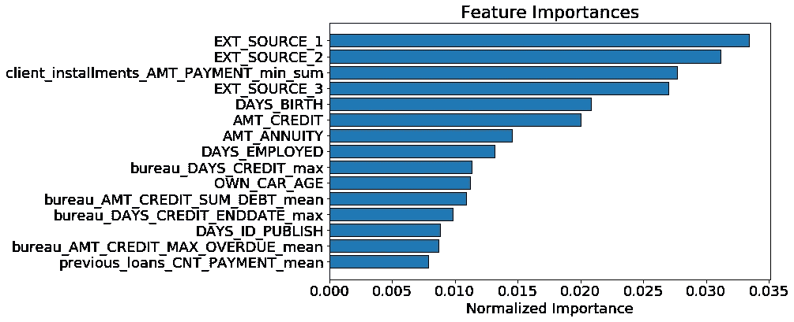

Top 15 most important features

我们看到我们构建的一些特性进入了前 15 名，这应该给我们一些信心，我们所有的努力都是值得的！我们的一个功能甚至进入了前五名。这个特性，`client_installments_AMT_PAYMENT_min_sum`表示每个客户以前在 Home Credit 贷款的最低分期付款总额。也就是说，对每个客户来说，这是他们以前每笔贷款的最低还款额的总和。

特性重要性并没有告诉我们这个变量的较低值是否对应于较低的默认率，它只是让我们知道这个特性对于进行决策树节点的分割是有用的。特性重要性是有用的，但是它们不能提供对模型的完全清晰的解释！

在移除 0 个重要特征之后，我们有 536 个特征和另一个选择要做。如果我们认为我们仍然有太多的功能，我们可以开始删除那些最不重要的功能。在这种情况下，我继续进行特性选择，因为我想测试除 gbm 之外的模型，这些模型不能很好地处理大量的特性。

我们做的最后一个特征选择步骤是只保留占 95%重要性的特征。根据梯度推进机，342 个特征足以覆盖 95%的重要性。下图显示了累积重要性与特征数量的关系。

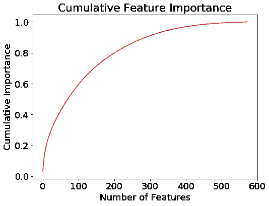

Cumulative feature importance from the gradient boosting machine

我们还可以使用其他一些降维技术，比如[主成分分析(PCA)](http://www.cs.otago.ac.nz/cosc453/student_tutorials/principal_components.pdf) 。该方法在减少维数方面是有效的，但是它也将特征变换到低维特征空间，在该空间中它们没有物理表示，这意味着 PCA 特征不能被解释。此外，PCA 假设数据是正态分布的，这对于人工生成的数据可能不是有效的假设。在笔记本中，我展示了如何使用 pca，但实际上并没有将它应用于数据。

然而，我们可以使用 pca 进行可视化。如果我们将前两个主成分用`TARGET`的值着色，我们会得到如下图像:

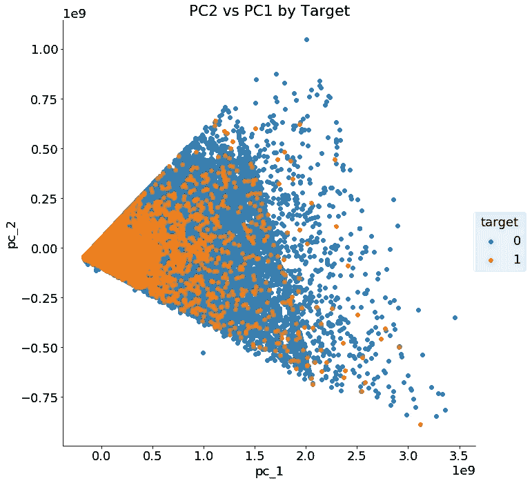

First two principal components of the data

这两个类别并没有完全分开，只有两个主要部分，显然我们需要两个以上的特征来识别哪些客户将偿还贷款，哪些不会。

在继续之前，我们应该记录我们采取的功能选择步骤，以便我们记住它们以供将来使用:

1.  移除相关系数大于 0.9 的共线变量:*移除 583 个特征*
2.  删除缺失值超过 75%的列:*删除了 19 个特征*
3.  根据 GBM 删除 0.0 重要性特征: *308 删除特征*
4.  仅保留 95%特征重要性所需的特征: *193 个特征被删除*

**最终数据集有 342 个要素。**

如果看起来在特性选择过程中有一些任意的选择，那是因为确实有！稍后，如果我们对自己的表现不满意，我们可能会重新考虑这些选择。幸运的是，因为我们编写了函数并记录了我们的决策，所以我们可以很容易地更改一些参数，然后重新评估性能。

# 型号选择

一般来说，在[机器学习问题的这一点上，我们将继续评估许多模型](/a-complete-machine-learning-project-walk-through-in-python-part-two-300f1f8147e2)。没有一个模型在每项任务上都比其他模型更好(T2，“没有免费的午餐定理”，T3)，因此我们需要尝试一系列模型来决定使用哪一个。然而，近年来，有一个模型在处理中等规模的结构化数据问题上变得越来越成功:[梯度推进机](http://blog.kaggle.com/2017/01/23/a-kaggle-master-explains-gradient-boosting/)。(这个模型如此有效有很多原因，作为一个全面的指南，这篇[硕士论文是一个很好的读物。](https://brage.bibsys.no/xmlui/bitstream/handle/11250/2433761/16128_FULLTEXT.pdf))

模型选择是我非常依赖他人工作的一个领域。正如本文开头提到的，在这场比赛之前，我的首选模型是随机森林。虽然在这个比赛的早期，从阅读其他人的笔记本中可以清楚地看到，为了参加比赛，我需要实现一些版本的梯度推进机器。Kaggle 上几乎每个排行榜顶部的提交内容都使用了渐变增强机器的一些变体(或多个版本)。(您可能会看到使用的一些库是 [LightGBM](http://lightgbm.readthedocs.io/en/latest/Python-API.html#training-api) 、 [CatBoost](https://github.com/catboost/catboost) 和 [XGBoost](http://xgboost.readthedocs.io/en/latest/) 。)

在过去的几周里，我已经通读了许多内核(参见这里的[和这里的](https://www.kaggle.com/jsaguiar/updated-0-792-lb-lightgbm-with-simple-features/code)和[和](https://www.kaggle.com/kailex/tidy-xgb-0-778))，现在对使用 LightGBM 库部署梯度增强机器非常有信心(Scikit-Learn 确实有一个 GBM，但它不如其他库那样高效或准确)。尽管如此，主要出于好奇，我想尝试其他几种方法，看看从 GBM 中获得了多少。这个测试的代码可以在 Kaggle 上的[这里](https://www.kaggle.com/willkoehrsen/evaluating-models)找到。

这并不完全是一个公平的比较，因为我在 Scikit-Learn 中主要使用默认的超参数，但是它应该给我们几个不同模型的能力的第一近似值。在应用了所有特征工程和特征选择之后，使用数据集，下面是带有公共排行榜分数的建模结果。除 LightGBM 之外的所有型号都内置于 Scikit-Learn:

*   **逻辑回归= 0.768**
*   【1000 棵树随机森林= 0.708
*   【1000 棵多余的树= 0.725
*   **sci kit 中的梯度增强机器-学习 1000 棵树= 0.761**
*   **light GBM 中的梯度推进机，1000 棵树= 0.779**
*   **所有模型的平均值= 0.771**

事实证明，其他人都是对的:梯度推进机是正确的选择。它提供了开箱即用的最佳性能，并且有许多超参数，我们可以调整它们以获得更好的分数。这并不意味着我们应该忘记其他模型，因为有时[将多个模型的预测加在一起(称为集成)](https://www.kaggle.com/arthurtok/introduction-to-ensembling-stacking-in-python)会比单个模型本身表现得更好。事实上，许多 Kaggle 竞赛的获胜者在他们的最终模型中使用了某种形式的组装。

我们没有在模型上花太多时间，但这是我们在接下来的笔记本和文章中要转移的重点。接下来，我们可以使用超参数优化来优化最佳模型，即梯度推进机。我们也可以将模型平均在一起，甚至将多个模型叠加起来进行预测。我们甚至可能回去重做特征工程！最重要的一点是，我们需要不断试验，找出最有效的方法，我们可以阅读其他人所做的尝试，并以他们的工作为基础。

# 结论

作为一名数据科学家，重要的性格特征是好奇心和承认自己并非无所不知！从我在排行榜上的位置来看，我显然不知道解决这个问题的最佳方法，但我愿意不断尝试不同的东西，并向他人学习。 **Kaggle 竞赛只是玩具问题，但这并不妨碍我们用它来学习和实践概念，以应用到真实的项目中。**

在本文中，我们讨论了许多重要的机器学习主题:

1.  使用特征工程从多个相关信息表中构建新特征
2.  应用特征选择移除不相关的特征
3.  评估几种机器学习模型对任务的适用性

在完成所有这些工作后，我们能够将排行榜分数从 0.678 提高到 0.779，并在排行榜上上升了 1000 多位。接下来，我们的重点将转移到优化我们选择的算法，但我们也会毫不犹豫地重新审视特征工程/选择。

如果你想了解我在机器学习方面的最新进展，你可以查看我在 Kaggle 上的工作:笔记本的速度比文章快一点！请随意使用这些笔记本开始使用 Kaggle，并开始为社区做出贡献。我将利用这次 Kaggle 比赛来探索一些有趣的机器学习想法，如[自动化特征工程](https://www.featuretools.com/)和[贝叶斯超参数优化](https://github.com/GPflow/GPflowOpt)。我计划尽可能多地从这次比赛中学习，我期待着探索和分享这些新技术！

一如既往，我欢迎建设性的批评和反馈，可以通过 Twitter [@koehrsen_will](http://twitter.com/koehrsen_will) 联系。