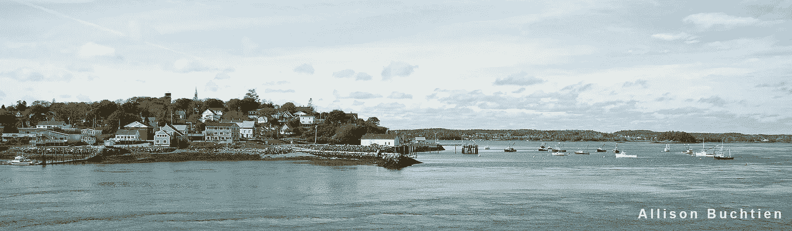
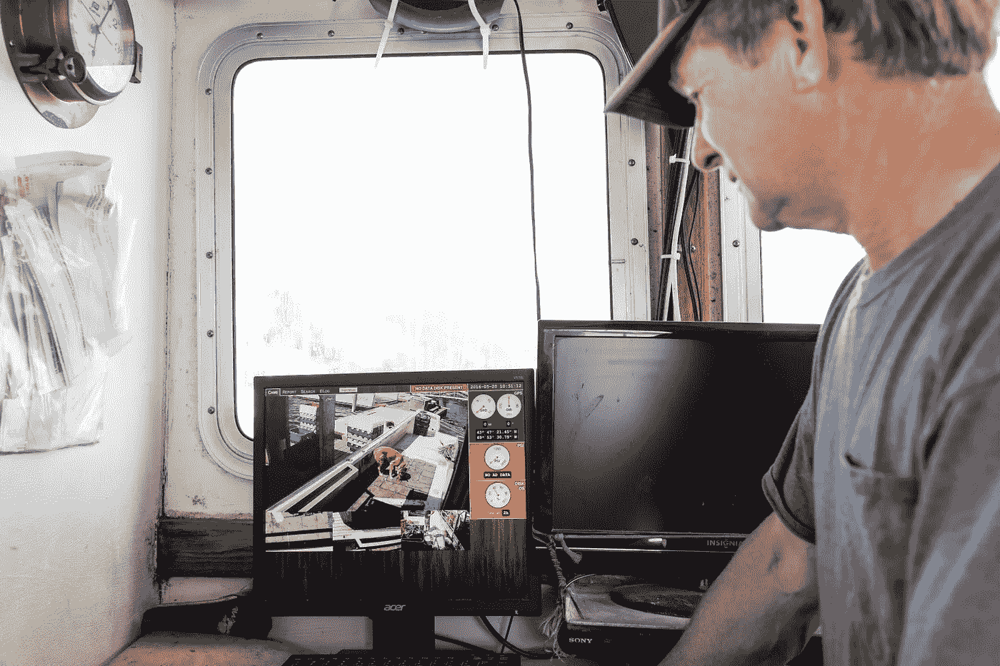

# 机器学习，遇见海洋

> 原文：<https://towardsdatascience.com/machine-learning-meet-the-ocean-e1b957e4dc61?source=collection_archive---------1----------------------->

Lubec, ME — the easternmost town in the US. This photo was a winner of [NOAA’s 2015 World Ocean Day contest](https://www.flickr.com/photos/usoceangov/albums/72157653831502969).

马萨诸塞州的梅德福德今天气温 20 度，当我过河时，昨天的雪正刮过马路。我飞过整个国家，和一小群工程师、渔业科学家以及以晚餐和能量饮料的承诺招募的朋友们聚集在一个小小的地下室办公室里。在接下来的五个小时里，我们将观看新英格兰的渔民从亮橙色的塑料袋子里捞出鱼，把它们放在一个测量条上，然后迅速把手拿开，让它们越过船的一侧。当我们扫描数字镜头时，我们标记鱼出现的时间，记录鱼的种类，并在屏幕上通过从嘴到尾巴画一条线来测量。这就像一个缓慢，细致的水果忍者游戏。

所有这些工作和小吃都是为了准备我们计划在今年夏天举办的训练计算机识别鱼类的比赛。我们正在努力实现这样一个未来，即可以实时监控渔民捕获的东西和他们释放的东西，让渔民和管理者以及任何想要跟踪海洋捕捞量的人更容易、更实惠地做到这一点。这是高科技、复杂的计算机科学和世界上最古老的职业之一的结合。

Today’s wheelhouse has multiple screens to let you track your catch. Or your dog. Photo ©Heather Perry

这是即将到来的保护革命，是认识和理解我们周围世界的革命。自然界充满了不可思议且往往难以观察到的现象。研究雨林的科学家过去常常在野外露营几天，希望观察到罕见的美洲豹，但现在他们可以设置相机不断记录，并在世界任何地方从他们的笔记本电脑上查看这些镜头。保护技术的进步正在产生比以往更多的数据，关于什么生活在哪里，谁吃谁，什么正在消失以及消失的速度，但仍然需要人类时间来观看视频片段。我们需要将新的传感器系统与分析工具结合起来，让我们能够将数据转化为信息和知识。

这是大型盈利性公司擅长解决的问题，人们也乐于为之开发工具，因为解决一个大公司的问题可以让你获得一大笔公司薪水。如果你能成为一名亿万富翁，编写一个算法来处理银行数据，你会花部分时间调整同样的算法来模拟鱼类种群吗？数据竞赛的世界表明，对一些人来说，答案是[是](http://www.conserveca.org/campaign/transforming-the-last-tuna-stronghold)。我们的地下室小组给了我希望，越来越多的工程师、数据科学家、UX 设计师和其他好奇的创新者被不寻常的挑战性问题所吸引，他们的解决方案以超越利润的影响来衡量。

这里涉及到利润。在许多沿海小社区，捕鱼是最大的生意。在美国，咸水捕鱼——包括商业捕鱼和体育捕鱼——是一项价值 3000 亿美元的产业，提供了 180 万个工作岗位。越来越多的人想知道他们的海鲜来自哪里，他们不是在吃海里的最后一条鱼。这意味着准确计算鱼的数量变得更加重要，一些渔民急切地[采用新技术](https://www.google.com/url?sa=t&rct=j&q=&esrc=s&source=web&cd=1&cad=rja&uact=8&ved=0ahUKEwiF0aLwkP_SAhXCrlQKHW10CysQFggcMAA&url=http%3A%2F%2Fwww.gulfwild.com%2F&usg=AFQjCNE0KVLPORSJpAChPY3Dhj6gBOT5ug)来证明他们的生意是多么可持续。他们的目标是最大限度地增加渔业收入，同时在海洋中留下足够的鱼来繁殖新的鱼供明年捕捞。有了更有效的电子工具，渔民就可以更容易地跟踪渔获，管理人员也可以更容易地监控对鱼类种群的整体影响。我们的项目得到了国家鱼类和野生动物基金会的[资助，但是我们 20 万美元的预算仅仅相当于一个硅谷软件工程师的年薪。因此，我们的团队包括那些愿意以很低的折扣工作的人，为了解决复杂问题的刺激，为了一些美味的猪肉。](http://www.nfwf.org/fisheriesfund/Documents/emr_2016grants.pdf)

人们似乎对为鱼创建算法感到兴奋的一个原因是，捕鱼给计算机带来了一系列新的挑战。船甲板或水下的光线不足会扭曲颜色，模糊鱼的边缘。在明亮的阳光下，闪闪发光的鱼的眩光对数码相机来说是没有数据的。如果鱼在网里或滑槽里游来游去，你必须很聪明，确保你能区分不同的鱼，而不是重复计算。即使在最好的条件下，有些鱼也很难区分。本周六早上，一个我们称之为“鱼老板”的人加入了我们，他是一名渔业科学家，也是一名多年的观察员，在渔民将鱼拖上船时，他骑着马一起去捕鱼，数着鱼的数量。我们弓着腰在屏幕上一帧一帧地移动，给视频中的鱼做注解，偶尔会叫鱼老板过来，以确保我们没有把一条比目鱼和另一条弄混。

Matching verified Fish IDs to footage.

如果我们成功了，不仅在新英格兰，而且在整个美国和全世界，渔民和管理人员都可以更容易地计算鱼的数量。我们将我们的产品设计成开源的，以使其他渔场更有可能采用和实施我们帮助开发的产品。其中一些工具，如视频注释软件，非常简单，任何人都可以使用，为日益发展的公民科学运动做出了贡献。是时候将物联网带到外面，利用我们不断增长的技术能力来支持我们周围的自然世界，以及它所支持的商业和生活质量。