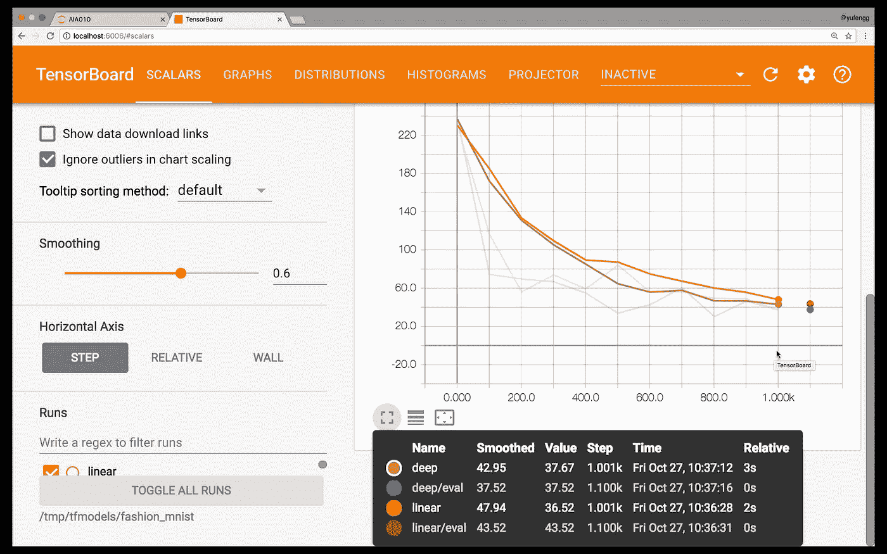
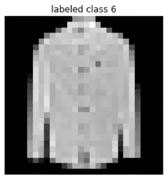
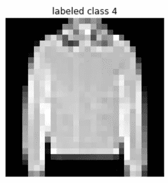
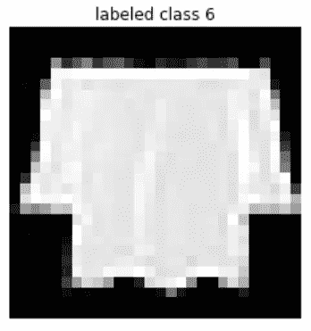
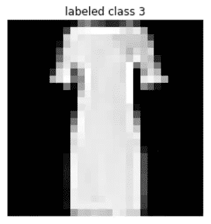
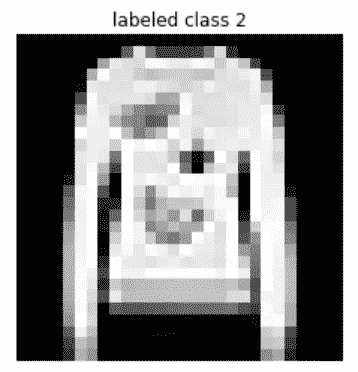

# 机器学习遇上时尚

> 原文：<https://towardsdatascience.com/machine-learning-meets-fashion-48ee8f6541ad?source=collection_archive---------3----------------------->

在《人工智能历险记》的这一集中，我们将尝试把整个机器学习工作流程整合成一个流程，从我们之前的剧集中汲取最佳实践。这是一个很大的材料，但我认为我们可以做到这一点！

用 [MNIST 数据集](http://yann.lecun.com/exdb/mnist/)训练一个模型通常被认为是机器学习的“Hello world”。这已经做过很多次了，但不幸的是，仅仅因为一个模型在 MNIST 上表现良好，并不一定意味着它在其他数据集上的高性能预测，尤其是因为我们今天拥有的大多数图像数据都比手写数字复杂得多。

# 时髦的机器学习

Zalando 决定是时候让 [MNIST 再次流行起来](https://github.com/zalandoresearch/fashion-mnist)，最近发布了一个名为`fashion-mnist`的数据集。这是与“常规”MNIST 完全相同的格式，除了数据是以各种服装类型、鞋子和包包的图片的形式。它仍然跨越 10 个类别，图像仍然是 28×28 像素。

让我们训练一个模型来检测正在展示哪种类型的服装！

# 线性分类器

我们将从构建一个线性分类器开始，看看我们是如何做的。像往常一样，我们将使用 [TensorFlow 的评估框架](https://www.tensorflow.org/extend/estimators)来使我们的代码易于编写和维护。提醒一下，我们将加载数据，创建分类器，然后运行训练和评估。我们也将直接从本地模型中做出一些预测。

让我们从创建模型开始。我们将把数据集从 28x28 像素展平到 1x784 像素，并创建一个名为`pixels`的特征列。这类似于我们第三集的`flower_features`，[简单明了的评估者](https://medium.com/towards-data-science/plain-and-simple-estimators-d8d3f4c185c1)。

接下来，让我们创建我们的线性分类器。我们有 10 个不同的可能的类别来标记，而不是我们之前使用的鸢尾花的 3 个类别。

为了运行我们的训练，我们需要设置数据集和输入函数。TensorFlow 有一个内置的实用程序来接受一个`numpy`数组来生成一个输入函数，所以我们将利用它。

我们将使用`input_data`模块加载我们的数据集。将函数指向下载数据集的文件夹。

现在我们可以调用`classifier.train()`来集合我们的分类器、输入函数和数据集。

最后，我们运行一个评估步骤，看看我们的模型做得如何。当我们使用经典的 MNIST 数据集时，这个模型通常可以达到 91%的准确率。然而，fashion-mnist 是一个相当复杂的数据集，我们只能达到 80%左右的精度，有时甚至更低。

我们怎样才能做得更好？正如我们在第六集看到的，[让我们深入](https://medium.com/towards-data-science/estimators-revisited-deep-neural-networks-311f38fe1986)！

# 深入

换入 DNNClassifier 只是一行的变化，我们现在可以重新运行我们的训练和评估，看看深度神经网络是否能比线性神经网络表现得更好。

正如我们在[第 5 集](https://medium.com/towards-data-science/visualizing-your-model-using-tensorboard-796ebb73e98d)中所讨论的，我们现在应该打开 [TensorBoard](https://www.tensorflow.org/get_started/summaries_and_tensorboard) 来并排看看这两个模型！

`$ tensorboard --logdir=models/fashion_mnist/`

(浏览至 [http://localhost:6006](http://localhost:6006) )

## 张量板

看看 tensorboard，看起来我的深度模型并不比我的线性模型表现得更好！这也许是一个调整我的一些超参数的机会，就像在[第 2 集](https://medium.com/towards-data-science/the-7-steps-of-machine-learning-2877d7e5548e)中讨论的那样。

Looks like a race to the bottom…

也许我的模型需要更大，以适应这个数据集中的复杂性？或者也许我的学习速度需要降低？让我们试试看。稍微试验一下这些参数，我们就可以突破，获得比线性模型更高的精度。

The deep model (in blue/red) achieves a consistently lower loss

要达到这种精度需要更多的训练步骤，但最终对于更高精度的数字来说，这是值得的。

还要注意，线性模型比深度网络更早达到稳定状态。因为深度模型通常比线性模型更复杂，所以它们需要更长的训练时间。

在这个阶段，假设我们对我们的模型很满意。我们将能够导出它并产生一个可伸缩的时尚分类器 API。你可以看[第 4 集](https://medium.com/@yufengg/serverless-predictions-at-scale-28ab77203a42)了解更多关于如何做的细节。

# 做预测

让我们快速浏览一下如何使用估计器进行预测。在很大程度上，它看起来就像我们如何调用培训和评估；这是评估者的伟大之处之一——一致的界面。

注意，这一次我们指定了 1 的`batch_size`、1 的`num_epochs`和假的`shuffle`。这是因为我们希望预测一个接一个地进行，一次对所有数据进行预测，保持顺序。我从评估数据集的中间提取了 5 幅图像，供我们尝试预测。

我选择这 5 个不仅仅是因为它们在中间，而是因为模型得到了其中的 2 个错误。这两个例子都应该是衬衫，但是模型认为第三个例子是一个包，第五个例子是一件外套。你可以看到这些例子比手写数字更具挑战性，如果没有其他原因，只是图像的颗粒感。

# 后续步骤

你可以在这里找到我用来训练这个模型并生成图像的全部代码[。你的模特表现如何？你最终使用了什么参数来达到这个精度？请在评论中告诉我！](https://gist.github.com/yufengg/2b2fd4b81b72f0f9c7b710fa87077145)

我们的下一集将关注机器学习生态系统的一些工具，以帮助您构建工作流和工具链，并展示更多可以用来解决机器学习问题的架构。我期待在那里见到你！在那之前，继续机器学习！

感谢阅读本集[云 AI 冒险](https://goo.gl/UC5usG)。如果你喜欢这个系列，请为这篇文章鼓掌让我知道。如果你想要更多的机器学习动作，一定要关注 Medium 上的 [me 或者订阅 YouTube 频道](https://medium.com/@yufengg)来观看未来的剧集。更多剧集即将推出！