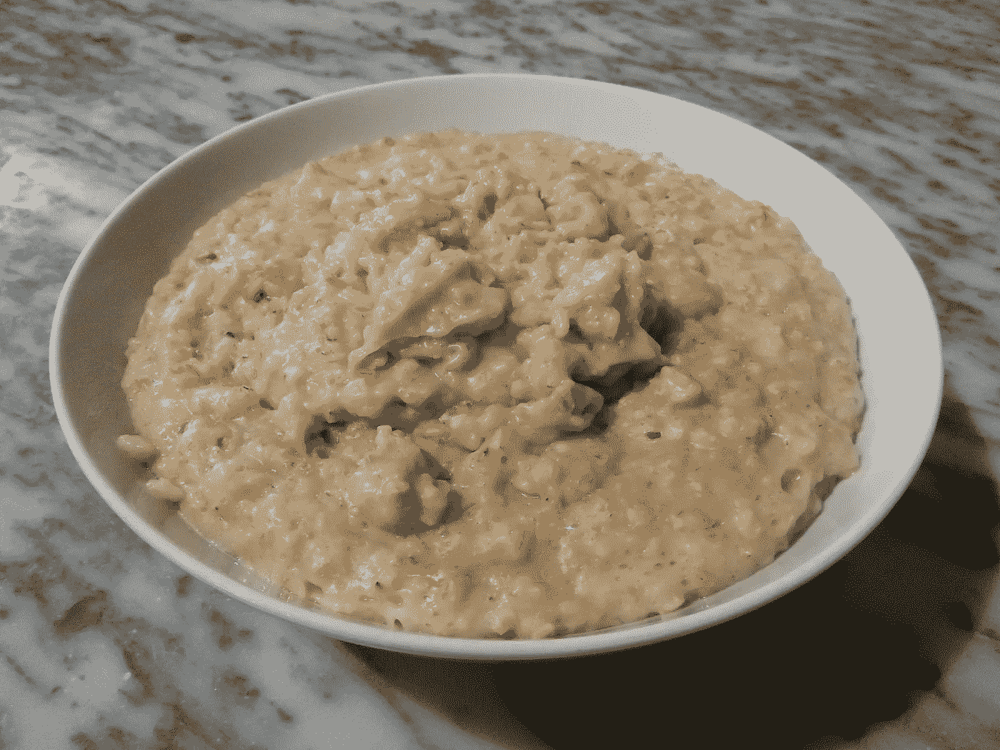
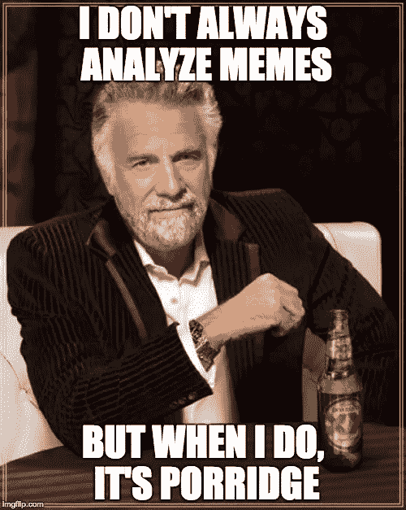
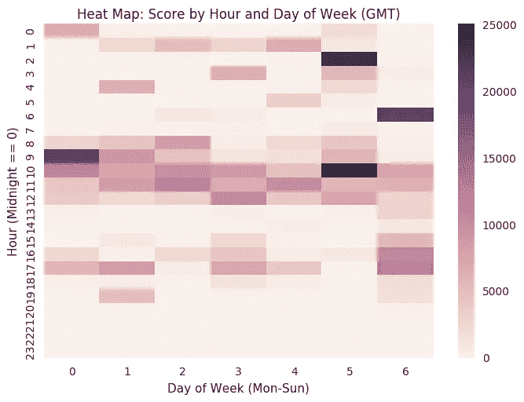
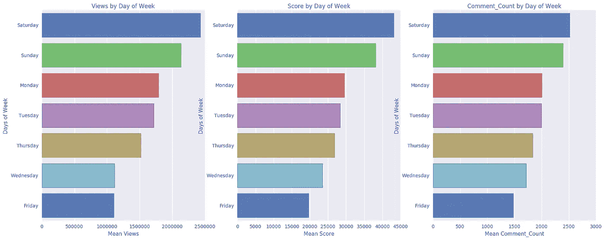
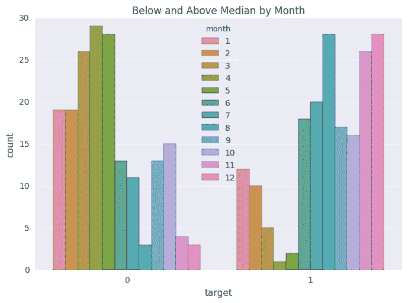

# 机器学习模因:粥分析

> 原文：<https://towardsdatascience.com/machine-learning-memes-a-porridge-analysis-208d30bce57e?source=collection_archive---------0----------------------->

在本帖中，我来看看一个 [2016 Imgur 现象:366 天的粥](http://imgur.com/user/onlyporridge/submitted)。单个 Imgur 用户 only wheagle 在 2016 年每天都发布了不同的粥图。我在圣诞假期开始做这个分析，当时我以为粥会在 12/31/16 停止。值得庆幸的是，这位英雄在 2017 年继续发布他们每天吃粥的照片。

Porridge. Source: [http://imgur.com/gallery/kZXXCto](http://imgur.com/gallery/kZXXCto)

我会在一年中随机看到这些帖子，通常我会一笑置之，但一年后我决定深入挖掘。我登录了 only wheage 的账户，发现尽管每天的图片基本上都是一样的，但每篇帖子的上传票数/浏览量/评论量却大相径庭。

作为一个数据迷，这引起了我的兴趣。如果我们比较一周中的几天，一天中的几个小时，一年中的几个月等等，会怎么样呢？看看什么时候在 Imgur 上发布一个湿漉漉的迷因最合适。

# 结果

直截了当地说，没有细节或解释，这里有一个热图，显示了 2016 年基于图像发布时间的得分总和，其中粥帖子的得分越高，颜色越深:

Data Viz created with Seaborn in Python (Notebook link at the end)

看着这张热图，你可以清楚地看到一个更暗的光带在一天的中间，以及一些围绕着早晨和晚上的暗点。第 5 天(星期六)显然在格林威治标准时间凌晨 2 点和 10 点得分最高。把这些时间转换成你的时区，然后贴一张你早餐吃的任何东西的照片到 Imgur 的首页！(编辑:这应该重做-我每次都为帖子添加分数，而不是获得每个日期/时间的平均分数)

我所有的代码和输出都可以从我的 [IBM 数据科学体验笔记本](https://apsportal.ibm.com/analytics/notebooks/9fbcc07b-f34b-47dc-9241-adcb3afbeb0e/view?access_token=27b074070d3d1b09b1675bbaa65d966c0b1d93a0f6de187d3ae1f69f8dee3969)上查看或下载。

# 我的分析

所以我展示了 1 个可视化，但我还为这些数据创建了许多其他的和一个预测模型。在这一部分，我将详细介绍我在这个项目中的工作。我不会进入技术细节，因为 Jupyter 笔记本的链接在文章的末尾(如果你不喜欢阅读，向下滚动)。

数据收集:

没有 Imgur 出色的 [API，这篇文章是不可能发表的。除了这个 API，他们还提供了一个非常容易使用的](https://api.imgur.com/) [Python 模块](https://github.com/Imgur/imgurpython)。我利用这个模块收集我的数据。更具体地说，`get_account_submissions()`方法让我可以轻松地获取 only 粥帖子的所有数据。

数据清理:

这部分很简单。API 返回一些非常适合熊猫数据帧的 JSON。我收集了 only 粥的所有帖子但只是可视化，并为 2016 的帖子建立了一个模型。我决定将 2017 年作为我的模型的测试集。令人惊讶的是，当检查 2016 年数据的形状时，它有 366 个条目:只有麦片粥没有休息一天。大多数元数据对分析没有太大帮助。我确实为每个帖子设想了不同的指标，比如分数、投票数、评论数和浏览量。我把剩下的都拿走了。

探索性可视化:

当我处理这些数据时，我正在试验 Python 中不同的数据可视化库。我发现 Seaborn 是我最喜欢的开箱即用的美学。

这是一个 Seaborn 图，显示周六是观看、评分和评论的最佳时间:

我真的很喜欢这个可视化，但它并没有告诉我们太多。这是我最喜欢的来自 Seaborn 的情节:

对于这个可视化，我已经创建了一个二进制目标变量，其中如果一篇文章高于中值，则为 1，如果低于中值，则为 0。我真的很喜欢这个可视化，因为它显示只有麦片粥在今年的前 6 个月没有得到太多的爱，但在年底，有更多的帖子超过了中值分数阈值。

Seaborn 很美，但不互动。对于交互性，Plotly 是我的最爱。

下面是一个时间序列图，显示了 2016 年全年评论、评分和浏览量之间的关系。(我猜 Medium 不喜欢 Plotly iframes？如果您知道如何修复这种嵌入，请进行评论)

 [## comment_count，score，views |由 Gfilla 制作的散点图| plotly

### Gfilla 的“评论 _ 计数，得分，浏览量”的交互图和数据是散点图，显示评论 _ 计数，得分…

plot.ly](https://plot.ly/~gfilla/62.embed) 

在 Jupyter 笔记本中，还有其他有趣的可视化效果，我只想在这里分享几个我最喜欢的。

模型构建:

好了，viz 的东西说够了，该上数学课了。统计学家可以在这里停止阅读，这样他们就不会感到不安:)。

由于我们在样本和特征方面非常有限，统计建模对于这个数据集来说有点牵强。但这有什么理由阻止我们呢？

如前一节所述，我为这个数据集创建了一个二元目标特征，基于帖子的分数是高于还是低于中位数。我知道为原始分数创建预测会非常困难，因为所有有用的元数据只有在图像发布后才知道(例如评论计数)。我只知道邮件发出的时间。所以我把帖子的时间戳分成了尽可能多的特征(甚至分钟)。我进一步将这些特性扩展为虚拟变量，因为我将每个日期/时间视为一个分类值。这给我留下了一个包含 132 个特征的数据集。

我决定用一个基本的决策树作为我的模型。我保留了 10%进行测试，结果是低于中位数的帖子精度为 0.74，高于中位数的帖子精度为 0.56。该模型的 F1 平均得分为 0.65。这个模型没有什么真正令人印象深刻的，请随意构建一个理解粥的复杂性的深度 NN；)

预测 2017 年粥:

2016 年后的粥帖子需要遵循与我训练模型的数据相同的数据准备管道。这一开始看起来很简单，但是如果不仔细考虑的话会变得有点复杂。在单个数据集上训练和测试模型与在新数据出现时对其进行评分相比，具有不同的测试要求。

这是一个有趣的挑战，在我可视化地探索数据并创建不同版本的数据框架时，我没有想到这一点。归根结底，我对数据进行的任何操作都是为了进入模型的原始训练数据，需要与对测试数据进行的转换保持一致。列的顺序。虚拟变量。删除功能。等等。

因为这不是我工作的初衷，所以如果人们感兴趣的话，我会把这篇文章作为后续文章。如果我继续这部分的工作，我将会致力于构建一个好的分类器(如果可能的话),而不是数据可视化。你可以在这里查看和下载我的笔记本。