# 预测酒店在线排名点击量的机器学习模型

> 原文：<https://towardsdatascience.com/machine-learning-model-for-predicting-click-through-in-hotel-online-ranking-d55fc18c8516?source=collection_archive---------10----------------------->


Photo credit: pexels

## 如何应用机器学习技术来最大化呈现选项的点击率

酒店个性化和排名的核心是将一组酒店与一组品味各异、有时难以察觉的游客相匹配。匹配的准确性取决于在线旅行社(OTA)如何利用他们的可用信息，如给定的酒店特征、酒店的位置吸引力、用户的总购买历史和竞争对手的信息等，来推断旅行者对酒店的偏好。例如，[Hotels.com 通过编辑客户的搜索标准，当他们进行旅游查询时，在结果列表的顶部呈现最具竞争力的产品来满足他们的需求](https://www.computerworlduk.com/data/how-hotelscom-uses-data-science-personalise-customer-experience-3662447/)。

这是我们今天的目标:应用机器学习技术来最大化所呈现选择的点击率，其中点击表明访问者的兴趣，并可能决定预订。

最终，这就是我们想要实现的:当用户将他(或她)的搜索标准输入到酒店搜索引擎中时，会根据上述排名算法向他(或她)显示一个经过筛选的个性化排序的可用酒店列表，从而使列表顶部的酒店成为用户点击概率最高的酒店。我们一步一步来。

# 数据描述

数据集包含以下信息，可以从 [Kaggle](https://www.kaggle.com/c/expedia-personalized-sort/data) 下载，我们将使用 train.csv

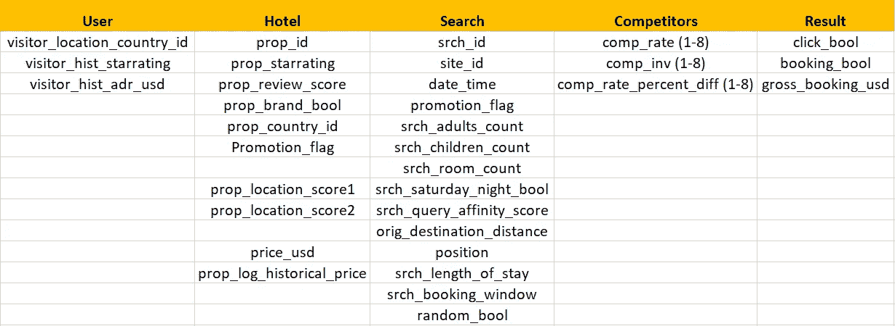

Figure 1

让我们试着让列名更直观。


Figure 2

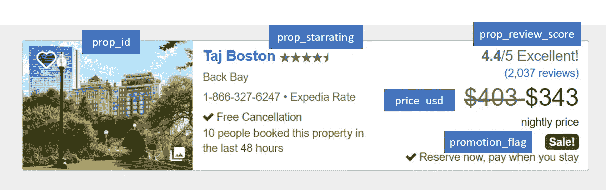

Figure 3

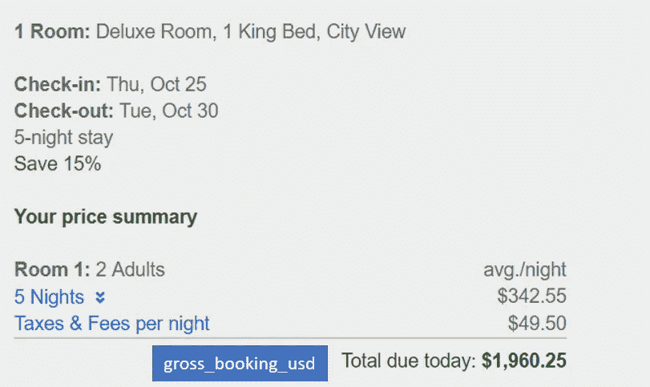

Figure 4

# 数据预处理

```
import pandas as pddf = pd.read_csv('train.csv')
df.shape
```

***(9917530，54)***

这是一个包含近 1000 万个观测值和 54 个特征的大型数据集。因此，我正在寻找一种方法使它更易于管理。

```
import matplotlib.pyplot as plt
n, bins, patches = plt.hist(df.prop_country_id, 100, density = 1, facecolor='blue', alpha=0.75)
plt.xlabel('Property country Id')
plt.title('Histogram of prop_country_id')
plt.show();
```

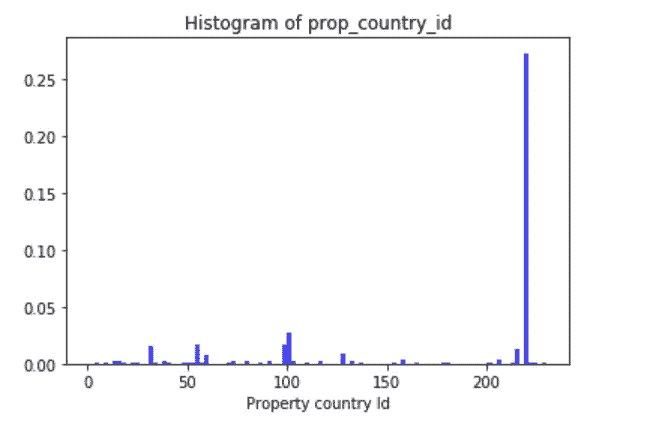

Figure 5

```
df.groupby('prop_country_id').size().nlargest(5)
```

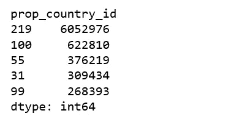

Figure 6

```
n, bins, patches = plt.hist(df.visitor_location_country_id, 100, density = 1, facecolor='blue', alpha=0.75)
plt.xlabel('Visitor location country Id')
plt.title('Histogram of visitor_location_country_id')
plt.show();
```

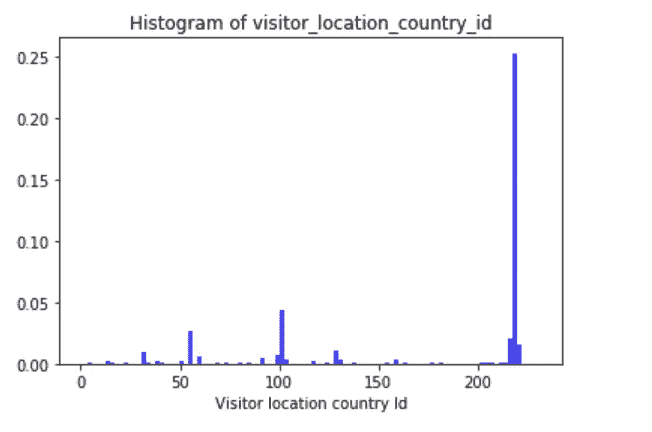

Figure 7

```
df.groupby('visitor_location_country_id').size().nlargest(5)
```

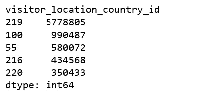

Figure 8

这些数据是匿名的，因此无法确定消费者计划前往的确切国家或城市。然而，很明显，最大的国家(标为 219)是美国。最大的国家有 61%的观测值。其中，58%的搜索是由也在这个国家的消费者进行的，这表明该国幅员辽阔，国内旅游占很大一部分。价格货币也表明最大的国家是美国。

因此，为了提高计算效率，我们将在美国游客身上训练独立模型。这种方法大大减少了训练时间。

```
us = df.loc[df['visitor_location_country_id'] == 219]
us = us.sample(frac=0.6, random_state=99)
del us['visitor_location_country_id']
```

受限于计算能力，我们随机取美国数据集的 60%。然后删除“访问者 _ 位置 _ 国家 _id”列。

```
us.isnull().sum()
```

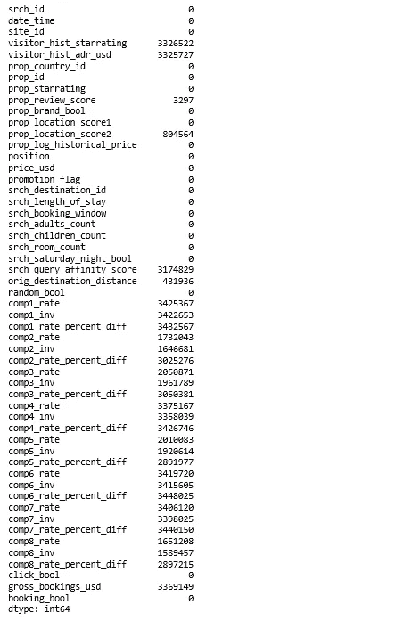

Figure 9

如您所见，我们在许多功能中有许多缺失的数据。我们将删除 NaN 值超过 90%的特征，还将删除“日期时间”、“位置标识”和“属性标识”，并估算包含 NaN 值不到 30%的三个特征，它们是:“属性查看得分”、“属性位置得分 2”和“原始目的地距离”。

```
cols_to_drop = ['date_time', 'visitor_hist_starrating', 'visitor_hist_adr_usd', 'srch_query_affinity_score', 'comp1_rate', 'comp1_inv', 'comp1_rate_percent_diff', 'comp2_rate_percent_diff', 'comp3_rate_percent_diff', 'comp4_rate_percent_diff', 'comp5_rate_percent_diff', 'comp6_rate_percent_diff', 'comp7_rate_percent_diff', 'comp8_rate_percent_diff', 'comp2_rate', 'comp3_rate', 'comp4_rate', 'comp5_rate', 'comp6_rate', 'comp7_rate', 'comp8_rate', 'comp2_inv', 'comp3_inv', 'comp4_inv', 'comp5_inv', 'comp6_inv', 'comp7_inv', 'comp8_inv', 'gross_bookings_usd', 'srch_id', 'prop_id']
us.drop(cols_to_drop, axis=1, inplace=True)
```

**随机估算“prop _ review _ score”**

random_impute

这种方法消除了平均数或总数估计量的插补方差，同时保持了项目值的分布。

**用平均值**估算“道具位置得分 2”

```
us['prop_location_score2'].fillna((us['prop_location_score2'].mean()), inplace=True)
```

**用中间值**估算“起点 _ 终点 _ 距离”

```
us['orig_destination_distance'].fillna((us['orig_destination_distance'].median()), inplace=True)
```

我们受够了指责！

# 电子设计自动化(Electronic Design Automation)

```
us.shape
```

***(3467283，22)***

经过基本的数据清理后，我们的美国数据集包含超过 340 万个观测值和 22 个特征。让我们来探索这些特性。

**点击并预订**

我们的目标变量是“click_bool”，而不是“booking_bool”。因为哪里有预订，哪里就一定有点击，我们要优化点击。

```
import matplotlib.pyplot as plt
import seaborn as sns
sns.countplot(x='booking_bool',data=us, palette='hls')
plt.show();us['booking_bool'].value_counts()
```

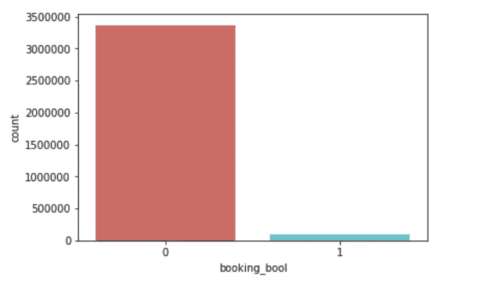

Figure 10

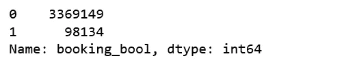

Figure 11

```
sns.countplot(x='click_bool',data=us, palette='hls')
plt.show();us['click_bool'].value_counts()
```

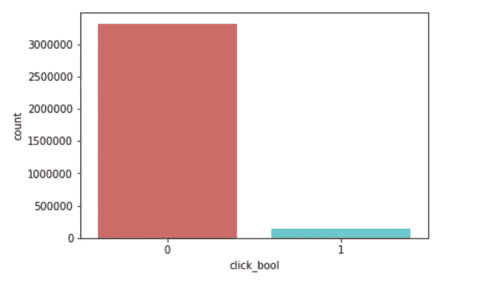

Figure 12


Figure 13

由于在线旅游业务的性质，预订率(2.8%)和点击率(4.3%)都非常低，非点击印象非常严重，类别非常不平衡。

**搜索停留时间**

```
n, bins, patches = plt.hist(us.srch_length_of_stay, 50, density = 1, facecolor='blue', alpha=0.75)
plt.xlabel('Search length of stay')
plt.title('Histogram of search_length_of_stay')
plt.axis([0, 30, 0, 0.65])
plt.show();
```

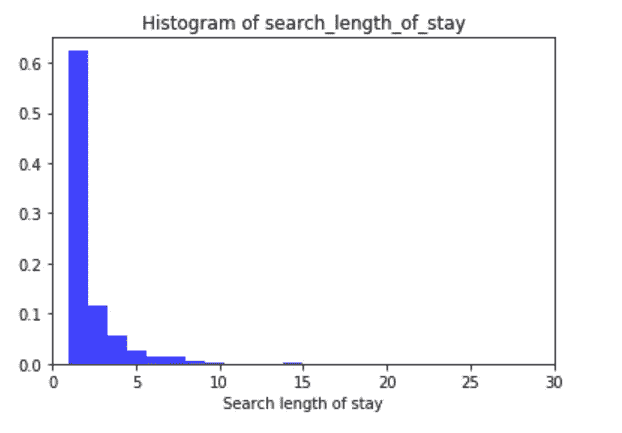

Figure 14

```
us.groupby('srch_length_of_stay').size().nlargest(5)
```

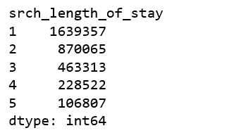

Figure 15

搜索最多的停留时间是 1 天，然后是 2 天、3 天……没有异常值。

**搜索成年人数量**

```
n, bins, patches = plt.hist(us.srch_adults_count, 20, density = 1, facecolor='blue', alpha=0.75)
plt.xlabel('Search adults count')
plt.title('Histogram of search_adults_count')
plt.show();
```

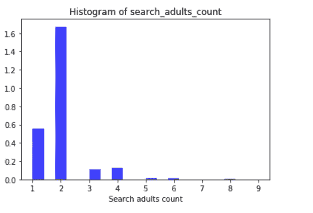

Figure 16

```
df.groupby('srch_adults_count').size().nlargest(5)
```

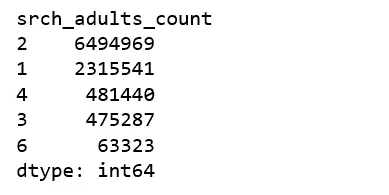

Figure 17

最常见的搜索成人计数是 2-成人，然后 1-成人，有意义。

**房产星级评定**

```
n, bins, patches = plt.hist(us.prop_starrating, 20, density = 1, facecolor='blue', alpha=0.75)
plt.xlabel('Property star rating')
plt.title('Histogram of prop_star_rating')
plt.show();
```

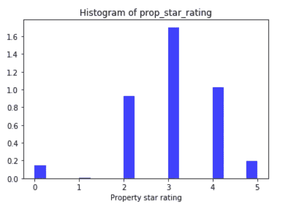

Figure 18

最常见的搜索属性星级是 3 星。很高兴知道，我会想得更高。

**物业是不是品牌**

```
us.groupby('prop_brand_bool').size()
```

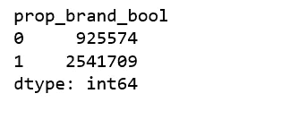

Figure 19

73%以上的物业是品牌物业。这很有意义，因为我们谈论的是美国酒店和美国游客。

周六是否留下

```
us.groupby('srch_saturday_night_bool').size()
```


Figure 20

**价格美元**

```
sns.set(style="ticks", palette="pastel")ax = sns.boxplot(x="click_bool", y="price_usd", hue="click_bool", data=us)
ax.set_ylim([0, 200]);
```

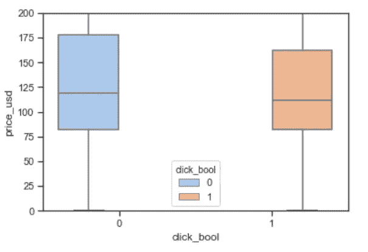

Figure 21

```
us.groupby('click_bool')['price_usd'].describe()
```

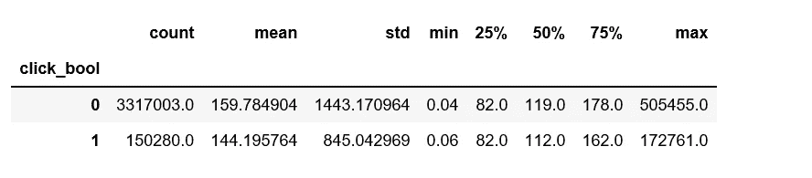

Figure 22

平均而言，获得点击的 price_usd 总是低于没有获得点击的 price _ USD。

# 平衡等级

对于快速学习，我们的平衡策略是向下采样负面实例。

down_sampling

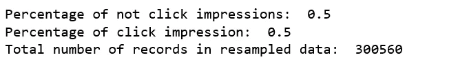

Figure 23

# 模型训练和评估

**用集成模型进行点进预测**

ensemble_models

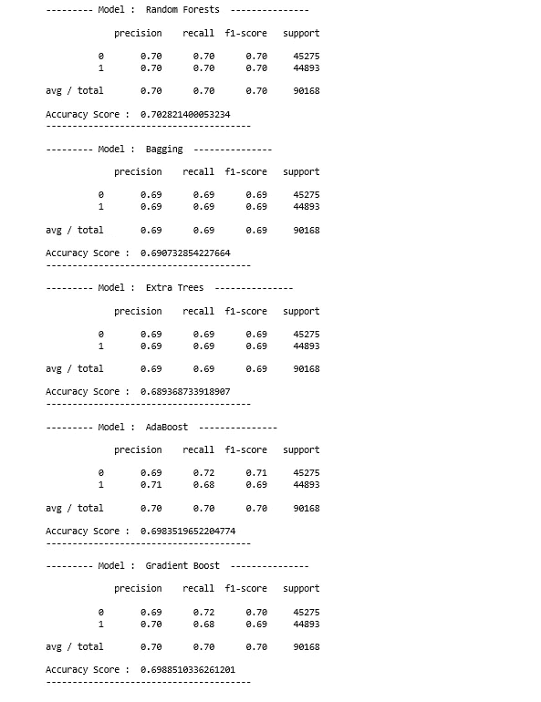

Figure 24

**用朴素贝叶斯模型进行点进预测**

naive_bayes_models

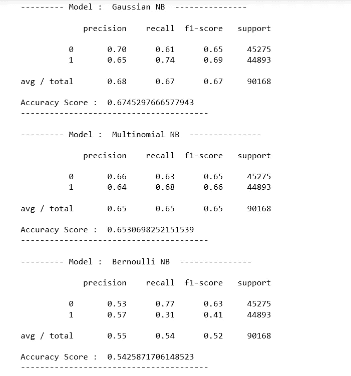

Figure 25

**用神经网络进行点进预测**

neural_network

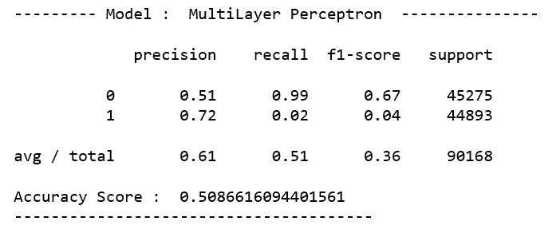

Figure 26

基于这种基线方法，在未来的帖子中，我们将构建一个[学习排名](https://en.wikipedia.org/wiki/Learning_to_rank)模型，为每个印象个性化酒店排名。但在那之前，享受点击吧！

Jupyter 笔记本可以在 [Github](https://github.com/susanli2016/Machine-Learning-with-Python/blob/master/Hotel%20Optimize%20Click-through.ipynb) 上找到。周末愉快！