# 机器学习——不平衡数据集下的多类分类

> 原文：<https://towardsdatascience.com/machine-learning-multiclass-classification-with-imbalanced-data-set-29f6a177c1a?source=collection_archive---------0----------------------->

## 分类和提高性能的技术方面的挑战

source [[Unsplash](https://unsplash.com/photos/1CsaVdwfIew)]

具有不平衡数据集的多个类的分类问题比二元分类问题提出了不同的挑战。偏斜分布使得许多传统的机器学习算法效率较低，尤其是在预测少数类示例时。为了做到这一点，让我们首先理解手头的问题，然后讨论克服这些问题的方法。

1.  **多类分类:**两个以上类的分类任务；例如对一组水果图像进行分类，这些水果可以是橙子、苹果或梨。多类分类假设每个样本被赋予一个且仅一个标签:水果可以是苹果或梨，但不能同时是两者。
2.  **不平衡数据集:**不平衡数据通常指的是分类问题，其中类没有被平等地表示。例如，您可能有一个 3 类分类问题，将一组水果分类为总共有 100 个实例的橙子、苹果或梨。共有 80 个实例被标记为 1 类(橙子)，10 个实例被标记为 2 类(苹果)，其余 10 个实例被标记为 3 类(梨)。这是一个不平衡的数据集，比例为 8:1:1。大多数分类数据集在每个类中的实例数量并不完全相等，但是微小的差异通常并不重要。在一些问题中，阶层失衡不仅是普遍现象，也是意料之中的。例如，在描述欺诈交易的数据集中，数据是不平衡的。绝大多数交易属于“非欺诈”类，极少数属于“欺诈”类。

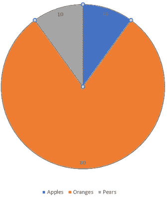

# 资料组

我们将在这个例子中使用的数据集是著名的[“20 个新闻组”](http://qwone.com/~jason/20Newsgroups/)数据集。20 个新闻组数据集是大约 20，000 个新闻组文档的集合，平均分布在 20 个不同的新闻组中。20 个新闻组集合已经成为机器学习技术的文本应用实验的流行数据集，例如文本分类和文本聚类。

**scikit-learn** 提供了预处理数据集的工具，更多详情请参考[此处的](https://scikit-learn.org/0.19/datasets/twenty_newsgroups.html)。下面给出的每个新闻组的文章数量大致相同。

从一些组中删除一些新闻文章，以使整个数据集不平衡，如下所示。

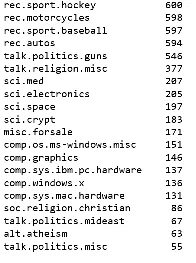

现在，我们有 20 个类的不平衡数据集可以做进一步的分析了。

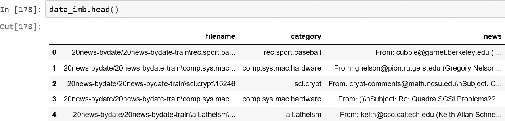

# **建立模型**

由于这是一个分类问题，我们将使用我之前的[文章](/machine-learning-word-embedding-sentiment-classification-using-keras-b83c28087456)中描述的相似方法进行情感分析。唯一的区别是这里我们处理的是多类分类问题。

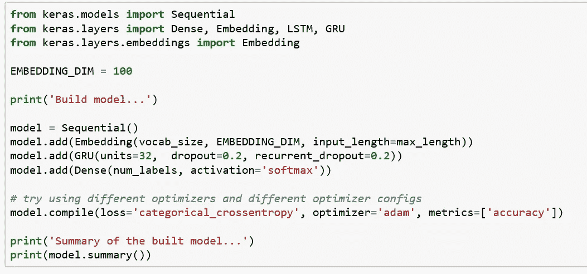

*模型中最后一层是* `*Dense(num_labels, activation =’softmax')*` *，用* `*num_labels=20*` *类，用‘soft max’代替‘sigmoid’。模型中的另一个变化是将损失函数改为适用于多类问题的* `*loss = ‘categorical_crossentropy’,*` *。*

# **列车型号**

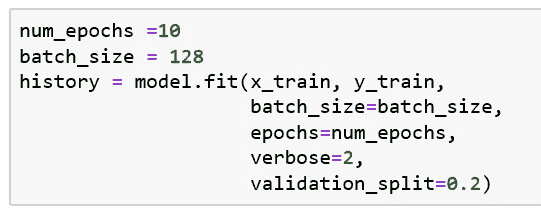

使用 20%验证集`validation_split=20`训练模型，并使用`verbose=2,`，我们可以看到每个时期后的验证准确性。仅仅在 10 个时期之后，我们就达到了 90%的验证准确度。

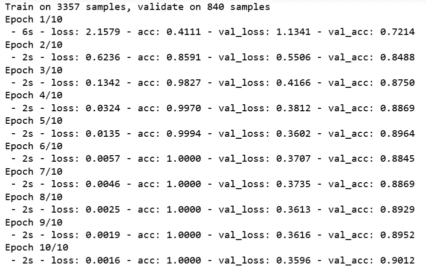

# **评估模型**

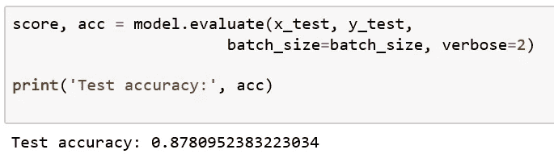

这看起来是一个非常好的精确度，但是这个模型真的做得很好吗？

> **如何衡量模型表现？**让我们考虑一下，我们在水果的早期示例的不平衡数据上训练我们的模型，由于数据严重偏向 1 类(橙子)，模型过度拟合 1 类标签，并在大多数情况下预测它，我们实现了 80%的准确度，乍一看似乎非常好，但仔细观察，它可能永远无法正确分类苹果或梨。现在的问题是，在这种情况下，如果准确性不是选择的正确指标，那么使用什么指标来衡量模型的性能呢？

# 混淆矩阵

对于不平衡的类，很容易获得高精度，而实际上没有做出有用的预测。所以，**精度**作为一个评价指标只有在类标签均匀分布的情况下才有意义。在不平衡类别的情况下，混淆矩阵是总结分类算法性能的好技术。

> 混淆矩阵是分类算法的性能度量，其中输出可以是两个或多个类别。

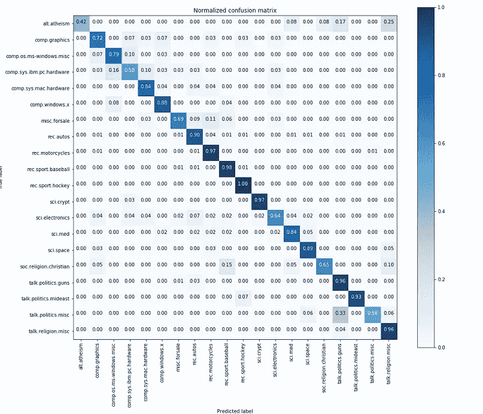

x-axis=Predicted label, y-axis, True label

当我们仔细观察混淆矩阵时，我们会发现，与样本数量较多的类别[*rec . sport . hockey、rec.motorcycles* ]相比，样本数量较少的类别[*alt . athiesm、talk.politics.misc、soc.religion.christian* ]的得分[0.42、0.56、0.65]确实很低。因此，查看混淆矩阵，可以清楚地看到模型如何对各种类别进行分类。

# 如何提高性能？

有各种各样的技术可以提高不平衡数据集的性能。

## 重采样数据集

要使我们的数据集平衡，有两种方法:

1.  **欠采样:**从过度表示的类中移除样本；如果您有大量数据集，请使用此选项
2.  **过采样:**从代表性不足的类别中添加更多样本；如果数据集很小，请使用此选项

## 合成少数过采样技术

SMOTE 是一种过采样方法。它创造了少数民族的合成样本。我们使用[***imb learn***](https://imbalanced-learn.readthedocs.io/en/stable/generated/imblearn.over_sampling.SMOTE.html)python 包对少数类进行过采样。

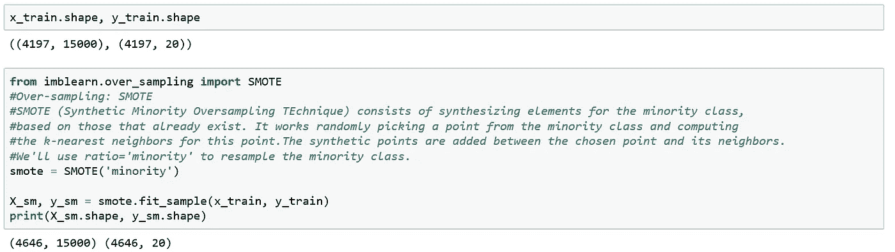

我们在应用 SMOTE 之前有 4197 个样本，在应用 SMOTE 之后有 4646 个样本，看起来 SMOTE 增加了少数类的样本。我们将使用新数据集检查模型的性能。

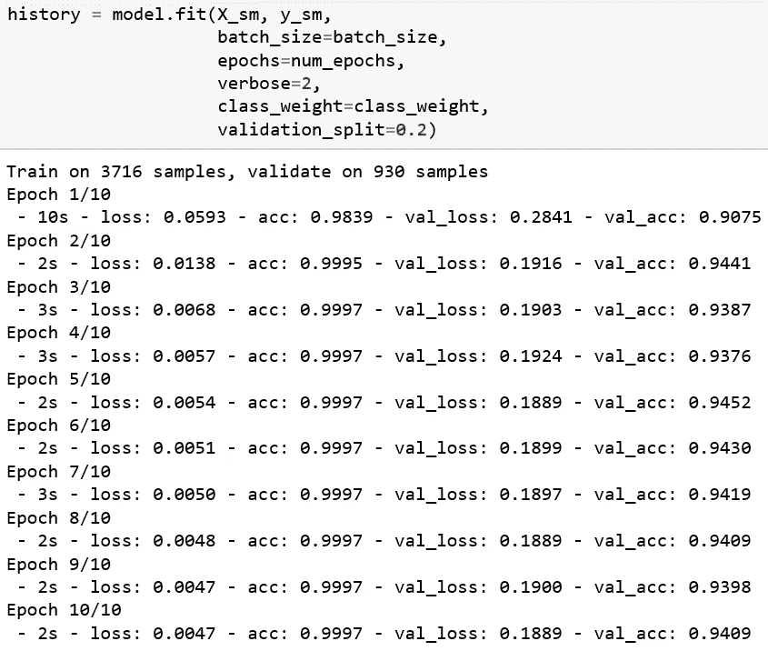

验证准确性从 90%提高到 94%。让我们测试一下这个模型:

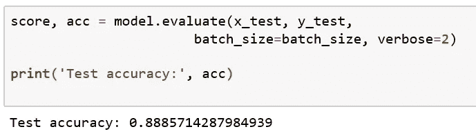

测试准确率比以前提高很少(从 87%提高到 88%)。现在让我们来看看混淆矩阵。

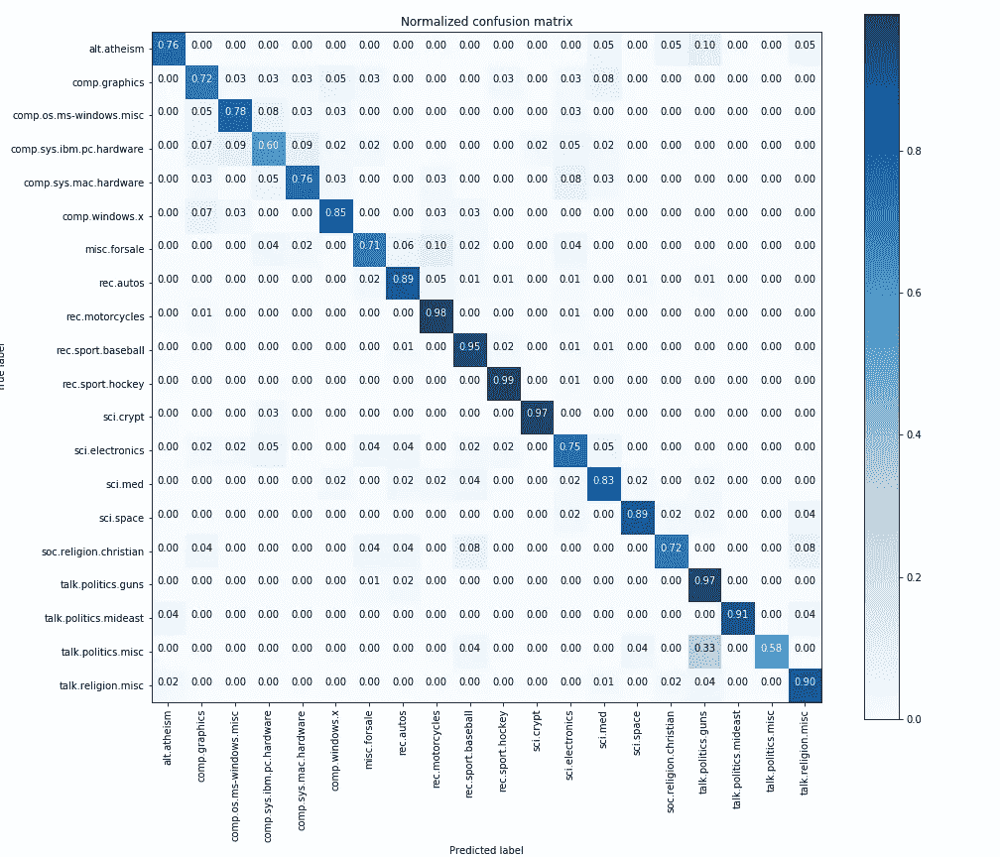

我们看到[ *alt.athiesm* ， *talk.politics.misc* ， *sci.electronics* ，*SOC . religion . Christian*]这几门课比之前提高了分数【0.76，0.58，0.75，0.72】。因此，在对类别进行分类时，即使精确度相似，该模型的性能也比以前更好。

## **另一招:**

既然阶层不均衡，那给少数阶层提供一些偏向怎么样？在训练模型时，我们可以通过使用`compute_class_weight`和使用参数`‘class_weight’`来估计 [scikit_learn](https://scikit-learn.org/stable/modules/generated/sklearn.utils.class_weight.compute_class_weight.html) 中的类权重。这有助于在训练模型时提供对少数类的一些偏向，从而有助于在对各种类进行分类时提高模型的性能。

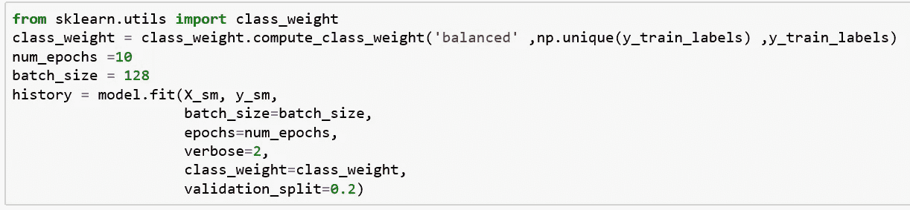

# 精确召回曲线

当类别非常不平衡时，精确召回是预测成功的有用度量。**精度**是对分类模型仅识别相关数据点的*能力的度量，*而 ***回忆*** *i* s 是对模型在数据集内找到所有相关案例的*能力的度量。*

精确度-召回率曲线显示了不同阈值的精确度和召回率之间的折衷。曲线下的高区域表示高召回率和高精度，其中高精度与低假阳性率相关，高召回率与低假阴性率相关。

> ****精度*** *和* ***召回*** *的高分表明分类器正在返回准确的结果(精度)，以及返回所有肯定结果(召回)的大部分。一个高精度、高召回率的理想系统会返回很多结果，所有结果都标注正确。**

*下面是使用 [scikit-learn](https://scikit-learn.org/stable/auto_examples/model_selection/plot_precision_recall.html) 的 [20 个新闻组](http://qwone.com/~jason/20Newsgroups/)数据集的精确召回图。*

*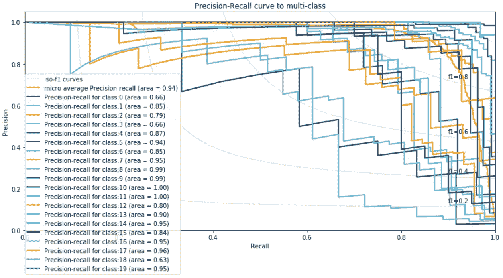*

*Precision-Recall Curve*

*我们希望每一类的 P-R 曲线面积接近 1。除了 0 级、3 级和 18 级，其余级别的面积都在 0.75 以上。您可以尝试使用不同的分类模型和超参数调整技术来进一步改善结果。*

# *结论*

*我们讨论了与不平衡数据集中的多类分类相关的问题。我们还展示了使用正确的工具和技术如何帮助我们开发更好的分类模型。*

**感谢阅读。代码可以在 [Github](https://github.com/javaidnabi31/Multi-class-with-imbalanced-dataset-classification/blob/master/20-news-group-classification.ipynb) 上找到。**

# ***参考文献***

* [## 应对机器学习数据集中不平衡类别的 8 种策略

### 你遇到过这种情况吗？您正在处理数据集。您创建了一个分类模型，并获得了 90%的准确率…

machinelearningmastery.com](https://machinelearningmastery.com/tactics-to-combat-imbalanced-classes-in-your-machine-learning-dataset/)  [## 如何处理机器学习中的不平衡分类问题？

### 如果你在机器学习和数据科学上花了一些时间，你肯定会遇到…

www.analyticsvidhya.com](https://www.analyticsvidhya.com/blog/2017/03/imbalanced-classification-problem/)  [## 利用不平衡数据集提高机器学习模型性能的三种技术

### 这个项目是我最近“机器学习工程师”职位面试技能测试的一部分。我不得不…

towardsdatascience.com](/working-with-highly-imbalanced-datasets-in-machine-learning-projects-c70c5f2a7b16)  [## 理解混淆矩阵

### 当我们得到数据，经过数据清洗，预处理和争论，我们做的第一步是把它提供给一个…

towardsdatascience.com](/understanding-confusion-matrix-a9ad42dcfd62)  [## 使用 Keras 深度学习 Python 库 opencodez 进行简单的文本分类

### 深度学习无处不在。所有组织，无论大小，都试图利用技术，发明一些很酷的…

www.opencodez.com](https://www.opencodez.com/python/text-classification-using-keras.htm)*