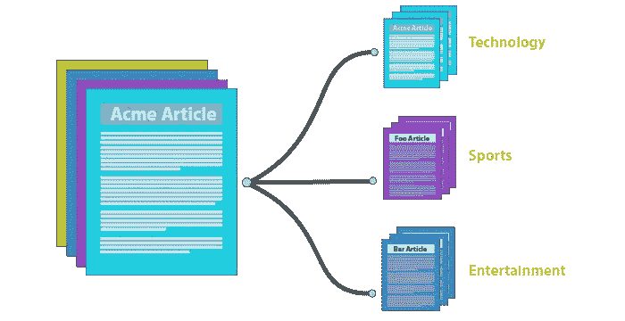
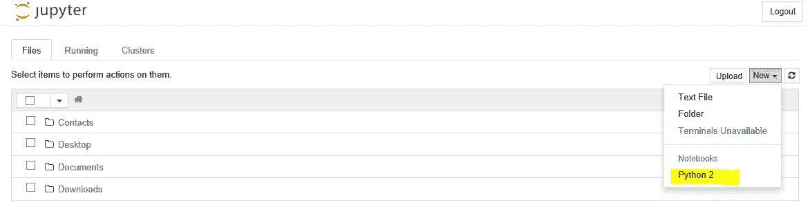

# 机器学习，NLP:使用 scikit-learn，python 和 NLTK 的文本分类。

> 原文：<https://towardsdatascience.com/machine-learning-nlp-text-classification-using-scikit-learn-python-and-nltk-c52b92a7c73a?source=collection_archive---------0----------------------->



Text Classification

**最新更新:**
我已经把完整的代码(Python 和 Jupyter 笔记本)上传到 GitHub 上:[https://github.com/javedsha/text-classification](https://github.com/javedsha/text-classification)

**文档/文本分类**是*监督的*机器学习(ML)中重要而典型的任务之一。为文档分配类别，文档可以是网页、图书馆书籍、媒体文章、图库等。有许多应用，例如垃圾邮件过滤、电子邮件路由、情感分析等。在这篇文章中，我想演示我们如何使用 python、scikit-learn 和一点 NLTK 来进行文本分类。

***免责声明* :** *我是机器学习新手，也是博客新手(第一次)。因此，如果有任何错误，请让我知道。感谢所有反馈。*

让我们将分类问题分成以下步骤:

1.  先决条件和设置环境。
2.  在 jupyter 中加载数据集。
3.  从文本文件中提取特征。
4.  运行 ML 算法。
5.  参数调整的网格搜索。
6.  有用的提示和一点 NLTK。

## **步骤 1:先决条件和设置环境**

遵循这个例子的先决条件是 python 版本 **2.7.3** 和 jupyter notebook。你可以安装[**anaconda**](https://www.continuum.io/downloads)**它会为你得到一切。此外，还需要一点 python 和 ML 基础知识，包括文本分类。在我们的例子中，我们将使用 scikit-learn (python)库。**

## **第二步:**在 jupyter 中加载数据集。

本例中使用的数据集是著名的“20 新闻组”数据集。关于来自原[网站](http://qwone.com/~jason/20Newsgroups/)的数据:

> 20 个新闻组数据集是大约 20，000 个新闻组文档的集合，平均分布在 20 个不同的新闻组中。据我所知，它最初是由 Ken Lang 收集的，可能是为了他的[news weaver:Learning to filter net news](http://qwone.com/~jason/20Newsgroups/lang95.bib)paper，尽管他没有明确提到这个收集。20 个新闻组集合已经成为机器学习技术的文本应用实验的流行数据集，例如文本分类和文本聚类。

这个数据集内置在 scikit 中，所以我们不需要显式下载它。

I .在 windows 中打开命令提示符，键入“jupyter notebook”。这将在浏览器中打开笔记本，并为您启动一个会话。

二。选择新建> Python 2。你可以给笔记本起个名字- *文本分类演示 1*



三。加载数据集:(这可能需要几分钟，请耐心等待)

```
from sklearn.datasets import fetch_20newsgroups
twenty_train = fetch_20newsgroups(subset='train', shuffle=True)
```

*注:以上，我们只是加载了* ***训练*** *数据。我们将在后面的例子中单独加载测试数据。*

四。您可以通过以下命令检查目标名称(类别)和一些数据文件。

```
twenty_train.target_names #prints all the categories
print("\n".join(twenty_train.data[0].split("\n")[:3])) #prints first line of the first data file
```

## **第三步:从文本文件中提取特征。**

文本文件实际上是一系列单词(有序的)。为了运行机器学习算法，我们需要将文本文件转换成数字特征向量。我们将以使用 [**袋字**](https://en.wikipedia.org/wiki/Bag-of-words_model) 模型为例。简而言之，我们将每个文本文件分割成单词(英文按空格分割)，并计算每个单词在每个文档中出现的次数，最后给每个单词分配一个整数 id。**我们字典中的每个唯一的单词都会对应一个特征(描述性特征)。**

Scikit-learn 有一个高级组件，它将为用户“计数矢量器”创建特征矢量。更多关于它的[这里](http://scikit-learn.org/stable/modules/generated/sklearn.feature_extraction.text.CountVectorizer.html)。

```
from sklearn.feature_extraction.text import CountVectorizer
count_vect = CountVectorizer()
X_train_counts = count_vect.fit_transform(twenty_train.data)
X_train_counts.shape
```

这里通过做'*count _ vect . fit _ transform(twenty _ train . data)*'，我们正在学习词汇词典，它返回一个文档-术语矩阵。[n 个样本，n 个特征]。

仅仅统计每个文档的字数有一个问题:它会给较长的文档比较短的文档更多的权重。为了避免这种情况，我们可以在每个文档中使用频率(**TF-Term frequency**)，即#count(word) / #Total words。

**TF-IDF:** 最后，我们甚至可以降低更常见单词的权重，如(the，is，an 等。)出现在所有文档中。这被称为 **TF-IDF，即术语频率乘以逆文档频率。**

我们可以使用下面一行代码实现这两个目标:

```
from sklearn.feature_extraction.text import TfidfTransformer
tfidf_transformer = TfidfTransformer()
X_train_tfidf = tfidf_transformer.fit_transform(X_train_counts)
X_train_tfidf.shape
```

最后一行将输出文档-术语矩阵的维度-> (11314，130107)。

## **步骤四。运行 ML 算法。**

有各种算法可用于文本分类。我们就从最简单的一个'[朴素贝叶斯](http://scikit-learn.org/stable/modules/naive_bayes.html#naive-bayes) (NB)' ( *不要觉得太幼稚！*😃)

您可以使用下面两行代码在 scikit 中轻松构建一个 NBclassifier:(注意——NB 有许多变体，但关于它们的讨论超出了范围)

```
from sklearn.naive_bayes import MultinomialNB
clf = MultinomialNB().fit(X_train_tfidf, twenty_train.target)
```

这将在我们提供的训练数据上训练 NB 分类器。

**构建管道:**我们可以编写更少的代码，通过如下方式构建管道来完成上述所有工作:

```
**>>> from** **sklearn.pipeline** **import** Pipeline
**>>>** text_clf = Pipeline([('vect', CountVectorizer()),
**... **                     ('tfidf', TfidfTransformer()),
**... **                     ('clf', MultinomialNB()),
**...** ])text_clf = text_clf.fit(twenty_train.data, twenty_train.target)
```

*‘vect’、‘tfi df’和‘clf’这几个名字是随意取的，但以后会用到。*

**NB 分类器的性能:**现在我们将在**测试集**上测试 NB 分类器的性能。

```
import numpy as np
twenty_test = fetch_20newsgroups(subset='test', shuffle=True)
predicted = text_clf.predict(twenty_test.data)
np.mean(predicted == twenty_test.target)
```

我们得到的准确率是 **~77.38%** ，对于 start 和一个幼稚的分类器来说已经不错了。还有，恭喜你！！！您现在已经成功地编写了一个文本分类算法👍

**支持向量机(SVM):** 让我们尝试使用不同的算法 SVM，看看我们是否能获得更好的性能。更多关于它的[在这里](http://scikit-learn.org/stable/modules/svm.html)。

```
>>> from sklearn.linear_model import SGDClassifier>>> text_clf_svm = Pipeline([('vect', CountVectorizer()),
...                      ('tfidf', TfidfTransformer()),
...                      ('clf-svm', SGDClassifier(loss='hinge', penalty='l2',
...                                            alpha=1e-3, n_iter=5, random_state=42)),
... ])>>> _ = text_clf_svm.fit(twenty_train.data, twenty_train.target)>>> predicted_svm = text_clf_svm.predict(twenty_test.data)
>>> np.mean(predicted_svm == twenty_test.target)
```

我们得到的准确率是 **~82.38%。**咦，好一点了👌

## **第五步。网格搜索**

几乎所有的分类器都有各种参数，可以调整这些参数以获得最佳性能。Scikit 提供了一个非常有用的工具‘GridSearchCV’。

```
>>> from sklearn.model_selection import GridSearchCV
>>> parameters = {'vect__ngram_range': [(1, 1), (1, 2)],
...               'tfidf__use_idf': (True, False),
...               'clf__alpha': (1e-2, 1e-3),
... }
```

这里，我们创建了一个参数列表，我们希望对这些参数进行性能调优。所有参数名称都以分类器名称开始(记住我们给出的任意名称)。如 vect _ _ ngram _ range 在这里，我们告诉使用一元和二元，并选择一个是最佳的。

接下来，我们通过传递分类器、参数和 n_jobs=-1 来创建网格搜索的实例，n _ jobs =-1 告诉使用来自用户机器的多个内核。

```
gs_clf = GridSearchCV(text_clf, parameters, n_jobs=-1)
gs_clf = gs_clf.fit(twenty_train.data, twenty_train.target)
```

这可能需要几分钟的时间，具体取决于机器配置。

最后，要查看最佳平均分数和参数，请运行以下代码:

```
gs_clf.best_score_
gs_clf.best_params_
```

NB 分类器的准确率现在已经提高到 **~90.6%** **(不再那么幼稚了！😄)和对应的参数是{'clf__alpha': 0.01，' tfidf__use_idf': True，' vect__ngram_range': (1，2)}。**

类似地，对于 SVM 分类器，我们使用下面的代码获得了提高的准确率 **~89.79%** 。*注意:您可以通过调整其他参数来进一步优化 SVM 分类器。这是留给你去探索更多。*

```
>>> from sklearn.model_selection import GridSearchCV
>>> parameters_svm = {'vect__ngram_range': [(1, 1), (1, 2)],
...               'tfidf__use_idf': (True, False),
...               'clf-svm__alpha': (1e-2, 1e-3),
... }
gs_clf_svm = GridSearchCV(text_clf_svm, parameters_svm, n_jobs=-1)
gs_clf_svm = gs_clf_svm.fit(twenty_train.data, twenty_train.target)
gs_clf_svm.best_score_
gs_clf_svm.best_params_
```

## **第六步:**有用的小技巧和一点 NLTK。

1.  **从数据中删除** [**停止字**](https://en.wikipedia.org/wiki/Stop_words) **:** (the，then etc)。只有当停用词对潜在问题没有用时，才应该这样做。在大多数的文本分类问题中，这确实是没有用的。让我们看看删除停用词是否会提高准确性。按如下方式更新用于创建 CountVectorizer 对象的代码:

```
>>> from sklearn.pipeline import Pipeline
>>> text_clf = Pipeline([('vect', CountVectorizer(**stop_words='english**')),
...                      ('tfidf', TfidfTransformer()),
...                      ('clf', MultinomialNB()),
... ])
```

这是我们为 NB 分类器构建的管道。像以前一样运行剩余的步骤。这就把准确率从 **77.38%提高到了 81.69%** (那太好了)。*你可以对 SVM 做同样的尝试，同时进行网格搜索。*

2. **FitPrior=False:** 当[多项式 B](http://scikit-learn.org/stable/modules/generated/sklearn.naive_bayes.MultinomialNB.html) 设置为 False 时，将使用统一的先验。这并没有多大帮助，但将准确率从 81.69%提高到了 82.14%(没有太大的提高)。试着看看这是否适用于你的数据集。

**3。词干化:词干化是将词形变化(有时是派生的)的单词简化为词干、词根或词根形式的过程。例如，词干算法将单词“fishing”、“fished”和“fisher”简化为词根单词“fish”。**

我们需要 NLTK，它可以从[安装到这里](http://www.nltk.org/)。NLTK 附带了各种词干分析器(*关于词干分析器如何工作的细节超出了本文的范围*)，它们可以帮助将单词简化为它们的根形式。再次使用这个，如果它对你问题有意义的话。

下面我用了雪球词干分析器，它对英语非常有效。

```
import nltk
nltk.download()from nltk.stem.snowball import SnowballStemmer
stemmer = SnowballStemmer("english", ignore_stopwords=True)class StemmedCountVectorizer(CountVectorizer):
    def build_analyzer(self):
        analyzer = super(StemmedCountVectorizer, self).build_analyzer()
        return lambda doc: ([stemmer.stem(w) for w in analyzer(doc)])stemmed_count_vect = StemmedCountVectorizer(stop_words='english')text_mnb_stemmed = Pipeline([('vect', stemmed_count_vect),
...                      ('tfidf', TfidfTransformer()),
...                      ('mnb', MultinomialNB(fit_prior=False)),
... ])text_mnb_stemmed = text_mnb_stemmed.fit(twenty_train.data, twenty_train.target)predicted_mnb_stemmed = text_mnb_stemmed.predict(twenty_test.data)np.mean(predicted_mnb_stemmed == twenty_test.target)
```

我们得到的词干准确率约为 81.67%。在我们使用 NB 分类器的情况下，边际改进。你也可以尝试 SVM 和其他算法。

**结论:**我们已经学习了 NLP 中的经典问题，文本分类。我们学习了一些重要的概念，如单词袋、TF-IDF 和两个重要的算法 NB 和 SVM。我们看到，对于我们的数据集，两种算法在优化时几乎相等。有时，如果我们有足够的数据集，算法的选择几乎不会有什么不同。我们还了解了如何执行网格搜索以进行性能调优，并使用了 NLTK 词干法。您可以在数据集上使用这些代码，看看哪些算法最适合您。

**更新:**如果有人尝试了不同的算法，请在评论区分享结果，对大家都会有用。

请让我知道是否有任何错误和反馈是受欢迎的✌️

推荐，评论，分享如果你喜欢这篇文章。

## **参考文献:**

http://scikit-learn.org/(代码

【http://qwone.com/~jason/20Newsgroups/ (数据集)