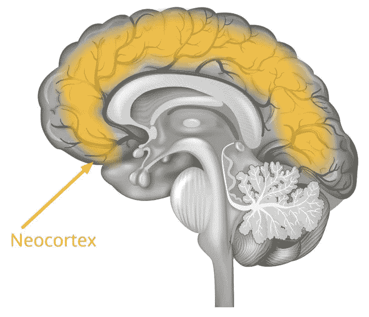
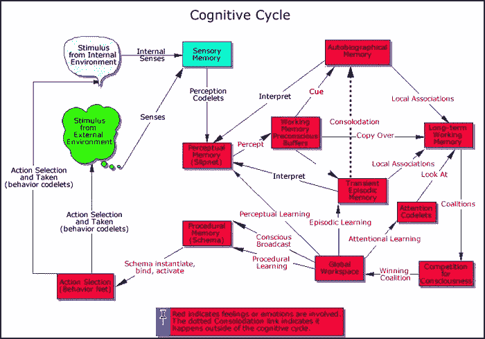
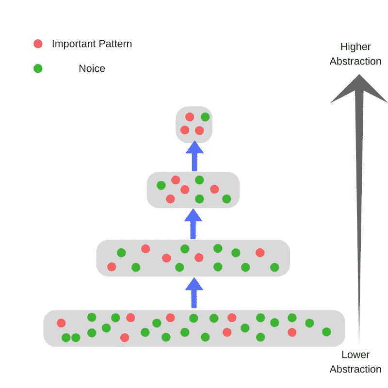
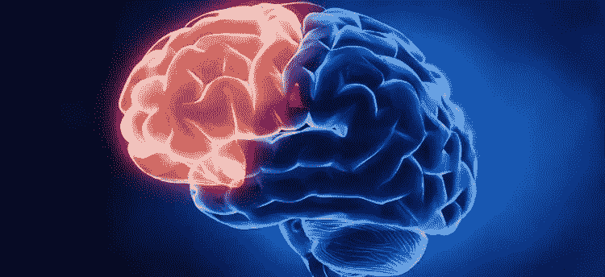

# 人脑的机器学习

> 原文：<https://towardsdatascience.com/machine-learning-of-human-brain-739ab0419612?source=collection_archive---------11----------------------->

## 最高层次的学习

**问)为什么算法飞跃可以比硬件飞跃更好？**

**Ans)** 随着小尺度(纳米及更小)的物理不确定性开始发挥作用(*电子开始四处跳跃*)，硬件限制造成了难以解决的瓶颈。

在这一点上，想法(算法)可以用来释放可行硬件的全部潜力。

**问)为什么这些改进对机器学习如此有益？**

**Ans)** 机器学习(ML)程序可以轻松涉及:

*   *十亿次计算*
*   *类似方程*与*的百至百万次幂*
*   大多数*计算是相互独立的*(可以并行或分布式)

因此，即使是一个小的优化也能产生非常明显的效果，为您节省几个小时到几个月的时间！

**问)为什么要参考大脑来进行优化？**

**Ans)** 简而言之，如果没有下面提到的人类大脑的进化，我们可能会变成这样:

## 记忆预测框架

**问)什么是新大脑皮层？**

***Ans)新皮层*** *是大脑皮层*最大的部分，是大脑**的外层**。

**问)为什么新大脑皮层很重要？**

**Ans)新皮层**，也叫**等皮层**，是哺乳动物大脑中参与*高级脑功能*的部分，如*感觉感知*、*认知*、*产生运动指令*、*空间推理*和*语言* ( *部分*)。

> 额外:新皮层进一步细分为**真皮层**和**前皮层**。更多关于大脑皮层工作的信息可以在[这里](https://www.quora.com/How-do-the-layers-of-the-neocortex-work-What-is-the-neurological-difference-between-them-Are-they-concerned-in-different-operations/answer/Jens-Mowatt?srid=JEbN)，这里[这里](http://www.nibb.ac.jp/brish/Gallery/cortexE.html)和[这里](http://wondergressive.com/neocortex-how-human-memory-works/) ( *好奇心可能会让你打开链接*)。

**问)新大脑皮层与机器学习有什么关系？**

**Ans)分层时间记忆** ( **HTM** )是基于人脑新皮层中锥体 [**神经元**](https://en.wikipedia.org/wiki/Neuron) **的**相互作用。****

*HTM 的核心:*

*   ***能够存储、学习、推断和回忆高阶序列的学习算法***
*   ***连续学习未标记数据中基于时间的模式*** *。*
*   ***对噪声的鲁棒性和高容量，意味着它可以同时学习多个模式***

当应用于计算机时， *HTM 非常适合于预测、异常检测、分类以及最终的感觉运动应用。*

由于在一些自然发生的神经网络中观察到的层级，例如在大脑中观察到的，HTM 具有层级拓扑。

人类的记忆层次真的非常非常复杂！

示例:

或者以简化的形式:

随着层级的上升，代表也增加了:

*   *范围:例如更大面积的视野，或者更广泛的触觉区域。*
*   时间稳定性:较低层次的实体变化很快，而较高层次的感知(心理概念)往往更稳定。
*   *抽象:通过连续提取不变特征的过程，越来越抽象的实体被识别。*
*   资源密集度更低:需要更少的资源，尤其是内存。

> *人脑的算法效率几乎高到石化！*

# 哲学的宝藏，内省

**问:什么是内省？**

**Asn)内省**或**元认知**，是关于一个人思维的自我意识或‘思考思维的能力’。一个高层次的心智过程(非常高)。

准确的内省能够区分正确的决定和错误的决定。

基本上，一个学习者正在发展一种意识。在培训期间，能够自我拒绝或鼓励模式。 ***因此，成为一个自我优化的学习者，是普通学习的必要条件。***

> 示例:
> 
> **双稳态刺激**(双目视觉中的两张图片，每只眼睛一张)是研究有意识视觉感知的神经机制的最流行的方法之一。
> 
> 这种刺激包含相互矛盾的信息，视觉系统无法将其整合成一个统一的感知。
> 
> 这导致观察者的感知(解释能力)状态每隔几秒钟就发生变化，试图找出正确的解释。所有这些都是在物理刺激保持不变的情况下发生的。
> 
> 在这种情况下，大脑的额叶作出自我意识(内省)的决定，拒绝任何信息或修改每个信息以消除冲突。
> 
> 这方面的细节可以在 Natalia Zaretskaya 和 Marine Narinyan 的论文中找到

**问:什么是灰质？**

**Ans)** 中枢神经系统[内部](https://en.wikipedia.org/wiki/Central_nervous_system)被组织成*灰质和白质*。

*灰质*由嵌入 [*神经胶质*](https://en.wikipedia.org/wiki/Neuroglia) *(由大量神经细胞组成的神经组织)*；它是灰色的。

**问)为什么灰质很重要？**

对人类来说，灰质体积可能有助于阐明一个人对其自省能力的信心在多大程度上得到了支持。他的自省能力有多准确。

更多的灰质通常意味着更多的智力。

正如爱因斯坦曾经说过的“灰质婊子！”…..不，他实际上没有。

**问)那我们为什么不直接实现灰质的工作呢？**

仅仅是因为灰质的工作非常非常复杂。我们不知道“*对*的信心”和“自我反省能力的准确性”之间的确切关系。

那么我们知道些什么呢？

自省(经过数百万年的进化)仍然是一种罕见的能力，即使对于复杂的生物来说也是如此，大多数生物完全缺乏这种能力。这是进化的最新发展之一。

**问)大脑的哪一部分负责内省？**

**Ans)** **大脑中的前额皮质**。

**前额叶皮层** ( **PFC** )是覆盖额叶前部的大脑皮层。

该区域的两个部分非常有趣:

*   *前额叶前皮质*
*   *内侧前额叶皮质*

**问)前额叶前皮层有什么特别之处？**

**前前额叶皮层**与顶级处理能力有关，这种能力被认为是人类区别于其他动物的标志。

*大部分起内省作用的灰质存在于这个区域*(准确的说是右前前额叶皮层)。邻近白质的结构在自省能力中也扮演了一些(不清楚的)角色。

这个大脑区域与计划**复杂的认知行为**、**个性表达**、**决策**和**调节社会行为**有关。这个大脑区域的基本活动被认为是**根据内部目标**协调思想和行动。

**问)这对机器学习来说意味着什么？**

我会简短地回答这个问题

*   知道自己的决定的学习者
*   学习*适应它的环境*
*   能够*随时设定目标的学习者*
*   能够用几种模式概括大量信息的学习者

**问)而内侧前额叶皮层有什么特别之处？**

**Ans)内侧前额叶皮层** **(mPFC)** 被认为是**大脑的奖赏系统**的一部分。

mPFC 是*中皮质边缘多巴胺能*系统的一部分( ***基本上它产生多巴胺，即‘快乐酶’***)。

mPFC 参与奖励相关机制的证据主要来自三类研究:

*   **条件位置偏好(CPP)** :测量物体或经历的动机效果
*   **颅内自我刺激(ICSS)** :什么条件触发大脑奖赏系统
*   **自我给药**:大脑需要哪种外部药物(如治疗糖尿病的胰岛素)

这个奖励系统的有趣之处在于:

*   *mPFC 的不同分区似乎不同地参与了不同药物的“奖励作用”*。这表明**多重奖励系统**的存在。
*   *有些药物可以在 mPFC 内直接产生奖赏效应，而有些药物即使在 mPFC 内没有直接的奖赏效应，也依赖 mPFC 的功能来介导其奖赏效应。*可以表示为**多级奖励流程**。

从机器学习的角度来看，这意味着什么？

**Ans)** 更简短的回答:

*   *整体强化学习*

**问:什么是强化学习？**

**Ans)** 一种机器学习的类型，涉及:

*   *无监督*(基于奖励的试错)
*   *好与坏是在几步之后决定的，而不是瞬间决定的*
*   *动态系统所以时间很重要，步骤顺序也很重要*
*   *代理采取行动并改变/影响其环境*
*   对于*每一个行动，代理人都会得到一个奖励*而它的*工作就是最大化它*

它是这样工作的:

**问)迷茫？**

**Ans)***’*奖励是能够让一个决定优先于其他决定的东西。

这是一个标量反馈，量化代理如何适应环境/与环境互动。

就像你给你的狗零食，如果它先坐下，否则就不给它零食(为什么你不坐下？！).

强化学习者只是简单地遵循最大化累积回报的步骤。

*多重奖励系统*本质上意味着大脑内置了**多重** [**优评**](https://papers.nips.cc/paper/1786-actor-critic-algorithms.pdf) 强化学习机制。

简而言之，演员-评论家学习包括**演员采取行动**和**评论家在该行动**中发现利弊(批评)。

**问)奖励系统的作用听起来很像自省？？**

嗯，那是因为奖励系统确实在一个人的自省能力中扮演了重要的角色。然而，这种关系真的很复杂。

> “强化学习是简单的决策科学。这就是它如此普遍的原因。”—大卫·西尔弗

***所以前额叶是普通智力领域的前沿！***

