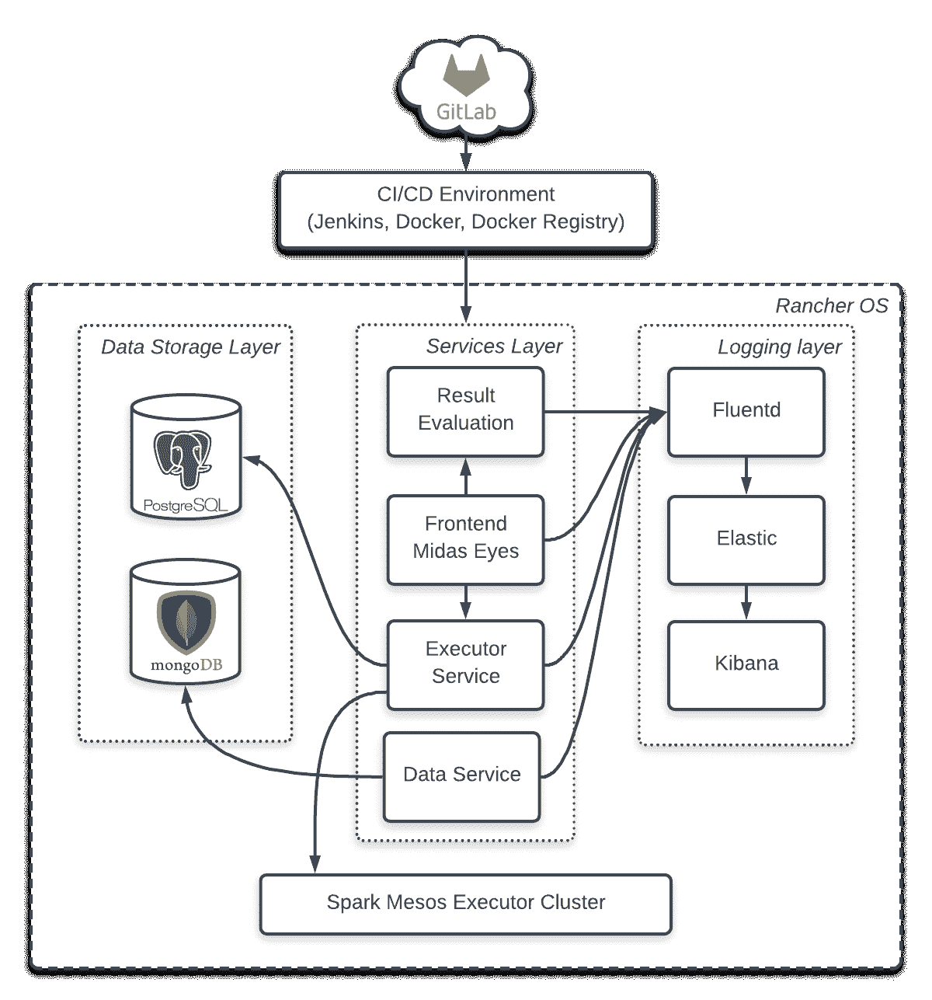
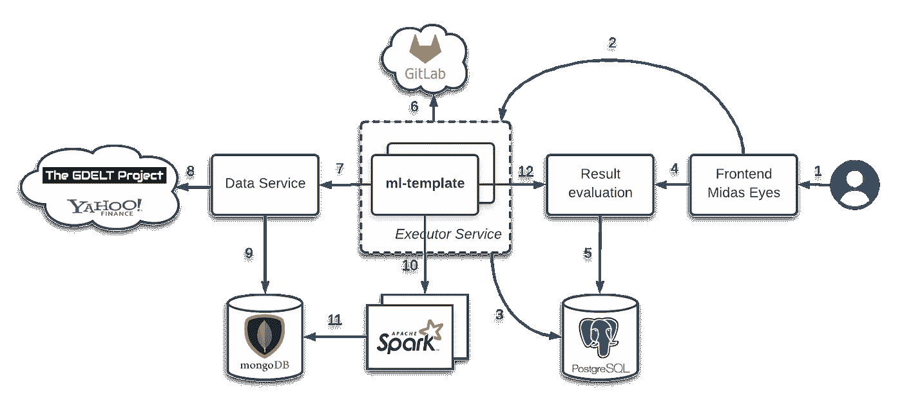
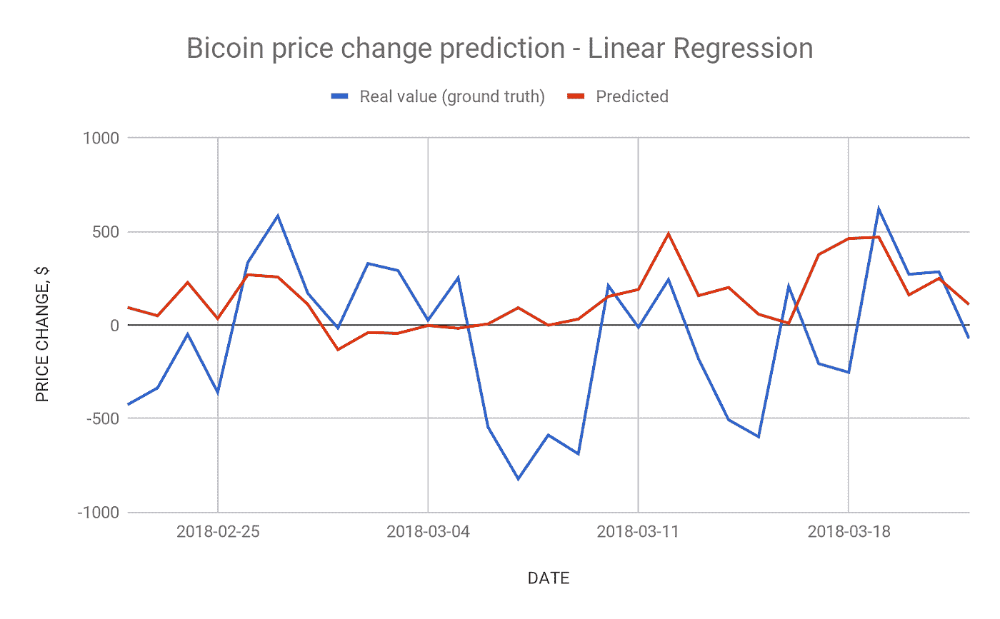
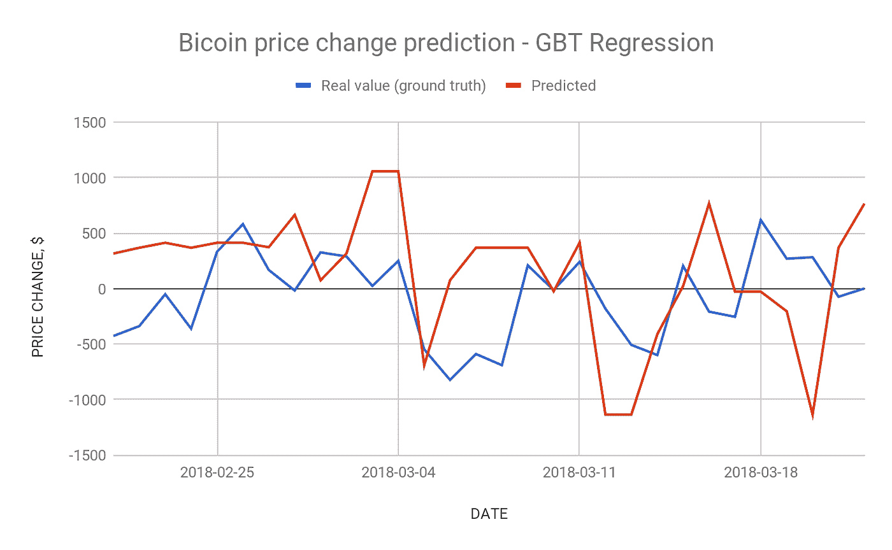

# 用于数据分析的机器学习平台

> 原文：<https://towardsdatascience.com/machine-learning-platform-for-data-analysis-b7603dc3049?source=collection_archive---------3----------------------->

## Akvelon 的机器学习项目

# 问题陈述

如今，快速发展的机器学习技术让我们能够解决越来越多的现实生活问题。在这种情况下，可以通过创建一个系统来减少例行操作，该系统允许算法开发人员专注于他们的任务，而不是提供执行环境。我们创建了这样一个平台，并在一个最有趣的问题——市场价值预测上进行测试。为了让事情变得更有趣，我们使用比特币价格变化作为数据源。

> 如果你在 2012 年 12 月购买了一枚比特币作为圣诞礼物，那么你的 13 美元今天将价值 8000 美元左右。

你可以从世界各地的人们那里听到许多类似的故事。没有人确切知道比特币或任何其他加密货币在未来一小时、一天、一周、一月等的价格会是多少。，但有可能根据新闻进行预测。

新闻通常是市场的**驱动力，它们的缺乏或低水平的重要性可能导致市场可以简单地静止不动。**

这篇文章旨在展示如何使用**大数据**技术建立一个**机器学习平台**，该平台可以帮助**根据来自世界各地的新闻预测特定市场的价值。**

# 数据源

为了使我们能够进行任何分析，我们必须获得这项任务所需的数据集。我们至少需要两个数据源:一个是比特币的市场价值，另一个是与比特币相关的大众媒体提及的信息。

寻找比特币市场价值的数据源是一件相对简单的事情。周围有各种各样的选择，我们只需要选择其中之一。我们的选择在这里并不重要，所以我们不要太关注这个。我们使用了 [**雅虎财经**](https://finance.yahoo.com/) ，因为它是免费的，可靠的，并且有多个程序库可以使用。

处理来自大众媒体的信息要复杂得多。为了获得客观的信息，我们应该从各种渠道收集信息。在把这样的新闻来源罗列出来之后，我们肯定会面临一系列的困难，比如不同的语言，数据源的稳定性，信息的存储。但事实上，与主要挑战相比，所有这些问题都不是什么大问题——通过一组参数估计新闻效果。这个挑战是计算机科学和人工智能的一部分，称为自然语言处理。如今，它是一个快速发展的领域，重点是机器学习。

幸运的是， [**GDELT 项目**](https://www.gdeltproject.org/) 可以帮助我们获得新闻数据来源。GDELT 是一个事件、语言和语调的全球数据库；由谷歌拼图支持。引用自官方网站:*“GDELT 项目以 100 多种语言监测来自每个国家几乎每个角落的广播、印刷和网络新闻，并识别每天每一秒推动我们全球社会的人、地点、组织、主题、来源、情感、计数、引用、图像和事件”*。这正是我们正在寻找的。现在我们已经有了开始工作所需的一切。

# 解决方案设计

使用上面列出的数据源，我们可以讨论我们的解决方案设计。首先，让我们创建一个我们希望在解决方案中看到的功能列表，并解释我们如何支持这些功能:

1.  ***易于运行的算法执行*。**在寻找最佳算法的过程中，开发人员应该能够通过多次迭代轻松访问数据、源代码和以前的尝试，而无需关心除算法本身之外的任何事情。这由应用程序模板支持，该模板封装了数据访问和执行的所有逻辑。叫做 *ml-template* 。
2.  ***有效数据处理*。**为了高效地处理大量数据，我们将使用 Apache Spark，它通过 Spark ML 提供了强大的机器学习算法实现工具。
3.  ***添加新数据源的能力*** 可以通过单独的微服务进行数据管理来实现。*数据服务*将负责下载带有相关股市数据(雅虎财经)的新闻(GDELT 数据)并保存到数据库中。
4.  ***使用不同编程语言进行算法开发*** 的能力由 *Executor Service* 提供——一种用于下载和编译算法源、模型训练、在 Spark 集群上运行算法的微服务。它不依赖于特定的技术，可以运行任何可以从命令行执行的东西。
5.  ***结果比较*。**还有另一个名为*结果评估服务*的微服务，用于接收来自 ml 模板的结果，并为每个算法执行结果计算分数。
6.  ***执行管理的网络界面。*** 用户界面将使用 WebSocket 与我们的微服务进行通信。

点睛之笔——这个项目选择了名称 **Midas** 。神话中的迈达斯国王把东西变成了金子，我们的系统就是为了把数据变成“金子”而设计的。

# 解决方案的基础设施

为了获得完整且可用的产品，我们应该确定要使用的基础设施。由于我们需要在解决方案中使用多个节点(微服务、数据存储、Spark 节点)，因此合理的做法是为每个节点使用[映像，而不是真实或虚拟机。](https://www.docker.com/)

作为容器管理平台，我们将使用[牧场主](https://rancher.com/)。这个平台包括[RancherOS](https://rancher.com/rancher-os/)——专门为容器管理准备的简化 Linux 发行版。出于容器编排的目的，它默认使用[牛](https://github.com/rancher/cattle)，但也允许使用其他工具，如 Docker Swarm 或 Kubernetes。

对于 Apache Spark 集群管理，我们将使用 [Apache Mesos](http://mesos.apache.org/) 。这是一个强大的资源共享工具，专为 Spark 等基于集群的程序解决方案而设计。你可以在加州大学的这篇文章中了解更多关于我们选择的福利的信息。

此外，我们将需要一些日志处理的程序解决方案。为此，管道将由 3 个工具组成:[fluent 和](https://www.fluentd.org/)用于日志收集；[弹性搜索](https://www.elastic.co/)用于存储和搜索；[基巴纳](https://www.elastic.co/products/kibana)用于可视化。

我们基础架构的最后一个组件是持续交付工具。为此，我们使用了最流行的工具之一——詹金斯。

Infrastructure diagram

# 工作流程

Workflow diagram

标准工作流程如上图所示。图表上的数字具有以下含义:

1.  用户访问前端(web 应用程序，又名 *Midas Eyes* )以获取关于现有模型和先前执行的信息。此外，用户可以创建和训练新模型，或者通过 UI 应用现有模型作为新的输入数据。
2.  前端通过 WebSocket 从 Executor 服务请求有关执行和模型的信息。
3.  模型和执行的元数据存储在 PostgreSQL 数据库中。
4.  前端通过 WebSocket 向结果评估服务请求结果及其评估。
5.  结果和估计值存储在 PostgreSQL 数据库中。
6.  当“train”执行开始时，Executor 服务从 GitLab 下载源代码。对于“应用”执行，它们已经被存储并可以立即运行。然后，Executor 服务使用某种算法运行开发人员扩展的 ml 模板。
7.  在 Spark 集群上启动一个作业之前，ml-template 通过 REST API 检查数据服务中是否存在用户指定的输入数据。
8.  如果执行所需的数据丢失，数据服务将从外部资源下载数据——在我们的例子中，是 GDELT 和 Yahoo。
9.  数据服务将下载的数据存储在 Mongo 数据库中。
10.  当数据准备好时，ml-template 将任务提交给 Spark 集群。
11.  在执行过程中，Spark 从 Mongo 数据库中请求必要的数据。
12.  当执行完成时，结果被提交给结果评估服务。该服务进行必要的评估，包括与地面实况的比较(火花术语的“标签”)。

另外，关于微服务的技术堆栈说几句话。数据、执行和结果评估服务由 Java、Spring Boot、Hibernate 和 Gradle 提供支持。ml-template 是使用 Scala 编写的，但也可以在 Python、R 或 Java 上创建。前端基于 React.js 和 Bootstrap。

# 算法应用示例

作为热身，让我们试试线性回归算法。我们最初的假设是，从新闻的平均基调来看，比特币价格和衍生品之间的相关性。平均语气是事件被提及次数的衡量标准。它的范围在-100 到+100 之间，其中 0 是中间值。这个参数是一个很大的值数组，通常大约有几千个数字。但是根据数量和正/负值的分布，它可以变成几个权重。经过简单的计算，我们得到平均色调和总量。

关于新闻和市场数据之间的线性相关性的假设非常天真，但这是一个很好的起点。使用它，我们可以检查一切都按计划进行。正如所料，在这一点上的结果并不令人鼓舞，如下图所示。

这只是许多尝试中的一个，没有一个能产生好于数百美元的平均偏差。更相关的算法，如梯度推进树回归，也显示出不可靠的结果。

这意味着我们需要使用诸如[交叉验证](https://en.wikipedia.org/wiki/Cross-validation_(statistics))之类的技术来改进当前的算法，或者尝试新的算法。例如，将深度学习(尤其是深度神经网络)与 Apache Spark 结合使用是一种有趣的方法。此外，我们可能需要更改我们的输入参数集。这样，我们就有了广泛的可能改进方向。

# 结论

我们在这个项目上的工作仍在进行中。开发人员正在开发他们的算法版本，试图获得更好的结果。在开发这个系统的过程中，许多想法出现在我们的脑海中，我们也在努力让它们活跃起来。

货币预测不是唯一可能的应用领域。例如，让它在市场股票上工作也很容易。这类股票有更多的新闻参数可以操作，因为它们与特定的国家或公司相关，并取决于与这些国家和公司相关的事件。

我们在这个项目中使用的技术都是开源的。在本文中，我们向您展示了如何轻松构建复杂的机器学习解决方案，而不是使用市场上现有的解决方案。我们希望我们的经验能激励你去做自己感兴趣的项目。

# 关于我们

我们在[**Akvelon Inc .**](http://akvelon.com/)**爱等前沿技术，如区块链、大数据、机器学习、人工智能、计算机视觉等等。这是我们在 **Office 战略实验室**开发的众多项目之一。**

****

**Akvelon company official logo**

**如果你有兴趣为一个项目做贡献，或者有一个有趣的想法——[**联系我们**](http://akvelon.com/company/contact-us/) 。或者如果你想和我们**强大的 Akvelon 团队**——请 [**查看我们的空缺职位**](http://akvelon.com/careers/) 。**

***与* [*阿图尔*](https://medium.com/u/befa2014b260?source=post_page-----b7603dc3049--------------------------------) 合著**